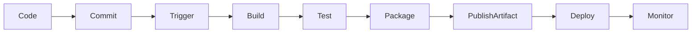
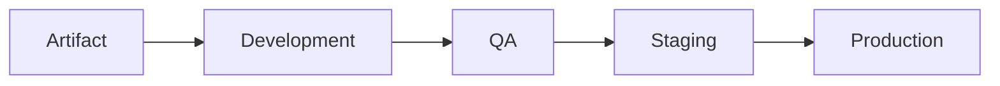

# Azure Pipelines Fundamentals

## Overview

Azure Pipelines is Azure DevOps' Continuous Integration (CI) and Continuous Delivery/Deployment (CD) service. It automates the process of building, testing, and deploying applications.

Azure Pipelines supports:

- Continuous Integration (CI)
- Continuous Delivery (CD)
- Continuous Deployment
- Multi-stage pipelines
- Infrastructure as Code (IaC)
- Multiple programming languages
- Multiple operating systems
- Multi-cloud deployments

Supported deployment targets include:

- Azure
- AWS
- Google Cloud
- Kubernetes
- Docker
- Virtual Machines
- On-Premises Servers

> **Interview Point**
>
> Azure Pipelines is cloud-agnostic. It is **not limited to Azure** and can deploy applications to almost any environment.

---

## Why It Is Used

Azure Pipelines helps automate software delivery by:

- Eliminating manual builds
- Automating testing
- Automating deployments
- Improving software quality
- Delivering software faster
- Reducing deployment errors
- Supporting DevOps best practices

---

## Architecture / Working


---

## Key Components

| Component | Purpose |
|------------|----------|
| Repository | Stores source code |
| Pipeline | Executes automation workflow |
| Agent | Runs pipeline jobs |
| Stage | Logical deployment phase |
| Job | Collection of steps |
| Step | Individual task or script |
| Task | Built-in Azure DevOps action |
| Artifact | Build output |
| Trigger | Starts pipeline automatically |
| Variable | Stores configurable values |

---

## Lifecycle / Workflow



Pipeline Flow:

1. Developer commits code.
2. Repository trigger starts pipeline.
3. Build process compiles application.
4. Automated tests execute.
5. Build artifacts are generated.
6. Artifacts are published.
7. Application is deployed.
8. Monitoring begins.

---

## Configuration / Syntax

Simple YAML Pipeline

```yaml
trigger:
- main

pool:
  vmImage: ubuntu-latest

steps:
- script: echo "Hello Azure Pipeline"
```

---

## Important Commands

Pipeline commands are generally executed through scripts.

Example:

```bash
dotnet build

dotnet test

mvn clean install

npm install

terraform init

terraform apply
```

---

## Important Files

| File | Purpose |
|------|---------|
| azure-pipelines.yml | YAML pipeline definition |
| Dockerfile | Docker build |
| pom.xml | Maven build |
| package.json | Node.js project |
| build.gradle | Gradle project |
| requirements.txt | Python dependencies |

---

## Real-World Use Cases

- CI/CD automation
- Kubernetes deployments
- Docker image builds
- Infrastructure deployment
- Web application deployment
- API deployment

---

## Advantages

- Fully automated
- Multi-cloud support
- YAML as Code
- Secure
- Scalable
- Easy integration with Azure Repos and GitHub

---

## Limitations

- Learning curve
- Complex pipelines become difficult to manage
- Self-hosted agents require maintenance

---

## Common Interview Questions (Concept Only)

- What is Azure Pipelines?
- What are the components of a pipeline?
- Explain the pipeline execution flow.
- Can Azure Pipelines deploy to AWS?
- What is an Azure Pipeline Agent?

---

## Common Mistakes

- Hardcoding secrets in YAML.
- Running everything in one stage.
- Ignoring failed tests.
- Not publishing build artifacts.

---

## Troubleshooting

| Problem | Solution |
|----------|----------|
| Pipeline failed | Check logs |
| Build not starting | Verify trigger |
| Agent unavailable | Check agent status |
| Deployment failed | Verify service connection |

---

## Summary

Azure Pipelines automates software build, test, and deployment processes, enabling faster, reliable, and repeatable application delivery.

---

# CI/CD Concepts

## Overview

CI/CD is a DevOps practice that automates software integration, testing, and deployment.

CI/CD consists of:

- Continuous Integration (CI)
- Continuous Delivery (CD)
- Continuous Deployment (optional)

---

## Why It Is Used

CI/CD helps teams:

- Detect bugs early
- Automate builds
- Improve deployment frequency
- Reduce manual effort
- Increase software quality
- Deliver features faster

---

## Architecture / Working


---

## Key Components

| Component | Purpose |
|------------|----------|
| Source Code | Application code |
| Build | Compile application |
| Test | Validate application |
| Artifact | Packaged output |
| Deployment | Release application |
| Monitoring | Verify health |

---

## Types

### Continuous Integration (CI)

Automatically:

- Build
- Test
- Validate code

after every commit.

---

### Continuous Delivery (CD)

Automatically prepares applications for deployment.

Production deployment requires manual approval.

---

### Continuous Deployment

Automatically deploys every successful build directly to production without manual intervention.

---

## Lifecycle / Workflow


---

## Real-World Use Cases

- Microservices deployment
- Web application releases
- Mobile application deployment
- Infrastructure automation

---

## Advantages

- Faster releases
- Early bug detection
- Reliable deployments
- Reduced downtime

---

## Limitations

- Initial setup effort
- Requires automated testing
- Pipeline maintenance

---

## Common Interview Questions (Concept Only)

- What is CI?
- What is CD?
- Difference between Continuous Delivery and Continuous Deployment?
- Why is CI important?

---

## Common Mistakes

- Skipping automated tests.
- Deploying without approvals.
- Long-running builds.

---

## Troubleshooting

| Problem | Solution |
|----------|----------|
| Build fails | Review compilation errors |
| Tests fail | Fix code or test cases |
| Deployment blocked | Verify approvals |

---

## Summary

CI/CD automates the software delivery lifecycle, improving speed, quality, and deployment reliability.

---

# Pipeline Architecture

## Overview

Pipeline Architecture defines how source code moves from development to production using automated stages.

---

## Why It Is Used

It provides:

- Standardized deployments
- Automated testing
- Repeatable releases
- Better quality control

---

## Architecture / Working


---

## Key Components

| Component | Purpose |
|------------|----------|
| Source Repository | Stores code |
| Trigger | Starts pipeline |
| Build Stage | Compile application |
| Test Stage | Validate code |
| Artifact Stage | Package output |
| Deploy Stage | Deploy application |
| Agent | Executes pipeline |

---

## Lifecycle / Workflow


---

## Real-World Use Cases

- Enterprise CI/CD
- Kubernetes deployments
- Azure App Service deployment
- Docker image publishing

---

## Advantages

- Repeatable deployments
- Faster releases
- Automated quality checks

---

## Limitations

- Pipeline complexity increases over time

---

## Common Interview Questions (Concept Only)

- Explain pipeline architecture.
- What is a pipeline stage?
- Difference between Job and Stage?
- What is an Artifact?

---

## Common Mistakes

- Mixing build and deployment logic.
- Skipping testing stage.

---

## Troubleshooting

| Problem | Solution |
|----------|----------|
| Stage skipped | Verify conditions |
| Artifact missing | Publish artifact before deployment |

---

## Summary

Pipeline architecture defines the automated flow from source code to production deployment using multiple stages.

---

# Build Pipeline

## Overview

A Build Pipeline automates the process of compiling source code, running tests, and producing deployable artifacts.

It is the core of Continuous Integration.

---

## Why It Is Used

Build pipelines:

- Compile code
- Execute tests
- Generate artifacts
- Detect issues early
- Prepare applications for deployment

---

## Architecture / Working


---

## Key Components

| Component | Purpose |
|------------|----------|
| Source Code | Input |
| Build Task | Compile code |
| Test Task | Execute tests |
| Artifact | Output |
| Agent | Executes pipeline |

---

## Lifecycle / Workflow


---

## Configuration / Syntax

Example:

```yaml
trigger:
- main

pool:
  vmImage: ubuntu-latest

steps:

- script: dotnet build

- script: dotnet test

- task: PublishBuildArtifacts@1
```

---

## Important Commands

```bash
dotnet build

mvn package

npm install

npm run build

go build
```

---

## Real-World Use Cases

- Java builds
- .NET builds
- Node.js builds
- Python packaging
- Docker image creation

---

## Advantages

- Automatic builds
- Faster feedback
- Artifact generation

---

## Limitations

- Large builds take time
- Dependency management

---

## Common Interview Questions (Concept Only)

- What is a Build Pipeline?
- What happens during a build?
- What is a Build Artifact?

---

## Common Mistakes

- Skipping tests.
- Publishing incorrect artifacts.

---

## Troubleshooting

| Problem | Solution |
|----------|----------|
| Build failed | Review logs |
| Missing dependency | Install dependency |

---

## Summary

A Build Pipeline automates compilation, testing, and artifact generation for Continuous Integration.

---

# Release Pipeline

## Overview

A Release Pipeline deploys previously built artifacts to one or more environments.

It is responsible for Continuous Delivery and deployment.

> **Interview Point**
>
> Modern Azure DevOps encourages **Multi-stage YAML Pipelines** instead of the older Classic Release Pipelines for new projects.

---

## Why It Is Used

Release pipelines:

- Automate deployments
- Support multiple environments
- Manage approvals
- Reduce deployment errors

---

## Architecture / Working



---

## Key Components

| Component | Purpose |
|------------|----------|
| Artifact | Deployable package |
| Environment | Deployment target |
| Approval | Manual validation |
| Deployment Task | Executes deployment |

---

## Lifecycle / Workflow


---

## Real-World Use Cases

- Azure App Service deployment
- AKS deployment
- IIS deployment
- Virtual Machine deployment

---

## Advantages

- Consistent deployments
- Multi-environment support
- Rollback capability

---

## Limitations

- Classic Release Pipelines are legacy.
- Complex approval workflows require planning.

---

## Common Interview Questions (Concept Only)

- What is a Release Pipeline?
- Difference between Build and Release Pipeline?
- What is an Environment?

---

## Common Mistakes

- Deploying directly to production.
- No rollback strategy.

---

## Troubleshooting

| Problem | Solution |
|----------|----------|
| Deployment failed | Review deployment logs |
| Artifact unavailable | Verify build completed successfully |

---

## Summary

Release Pipelines automate application deployments across environments, enabling controlled and reliable software delivery.

---

# YAML vs Classic Pipelines

## Overview

Azure DevOps supports two pipeline creation methods:

- YAML Pipelines
- Classic Pipelines

Today, **YAML Pipelines are the recommended approach** for almost all new projects.

---

## Why It Is Used

Both methods automate CI/CD, but they differ in how pipeline configurations are managed.

---

## Types

### YAML Pipeline

Pipeline configuration is stored as code in the repository.

Example:

```yaml
trigger:
- main

pool:
  vmImage: ubuntu-latest

steps:
- script: echo "Build"
```

---

### Classic Pipeline

Pipeline is configured using the Azure DevOps web interface.

No YAML file is stored in the repository.

---

## Comparison

| Feature | YAML | Classic |
|----------|------|----------|
| Pipeline as Code | ✅ | ❌ |
| Version Control | ✅ | ❌ |
| Stored in Repository | ✅ | ❌ |
| Code Review | ✅ | ❌ |
| Reusable Templates | ✅ | Limited |
| Recommended for New Projects | ✅ | ❌ |
| Visual Editor | ❌ | ✅ |

> **Interview Point**
>
> YAML Pipelines align with Infrastructure as Code (IaC) and GitOps practices, making them the preferred choice in modern DevOps environments.

---

## Real-World Use Cases

- YAML: Enterprise DevOps, automation, GitOps
- Classic: Legacy projects or quick proof-of-concepts

---

## Advantages

### YAML

- Version controlled
- Repeatable
- Reusable
- Easy collaboration

### Classic

- Easy for beginners
- No YAML knowledge required

---

## Limitations

### YAML

- Requires learning YAML syntax

### Classic

- Difficult to version
- Limited automation capabilities

---

## Common Interview Questions (Concept Only)

- YAML vs Classic Pipelines?
- Which pipeline type is recommended?
- Why are YAML pipelines preferred?

---

## Common Mistakes

- Editing production pipelines directly without version control.
- Not storing pipeline definitions with the application code.

---

## Troubleshooting

| Problem | Solution |
|----------|----------|
| YAML syntax error | Validate YAML indentation and syntax |
| Classic pipeline misconfiguration | Review tasks and settings |

---

## Summary

YAML Pipelines provide version-controlled, reusable, and scalable CI/CD configurations and are the preferred choice for modern DevOps practices.

---

# Pipeline Triggers

## Overview

Pipeline Triggers define **when** an Azure Pipeline should start automatically.

Triggers eliminate the need to run pipelines manually after every code change.

---

## Why It Is Used

Triggers help:

- Automate builds
- Start deployments
- Validate pull requests
- Reduce manual effort
- Enable Continuous Integration

---

## Architecture / Working


---

## Types

### CI Trigger

Runs when code is pushed to a branch.

```yaml
trigger:
- main
```

---

### Pull Request (PR) Trigger

Runs when a Pull Request is created or updated.

```yaml
pr:
- main
```

---

### Scheduled Trigger

Runs at predefined times.

```yaml
schedules:
- cron: "0 2 * * *"
```

---

### Manual Trigger

Started manually by a user from the Azure DevOps portal or CLI.

---

### Pipeline Completion Trigger

Starts one pipeline after another pipeline completes successfully.

---

## Lifecycle / Workflow


---

## Configuration / Syntax

CI Trigger

```yaml
trigger:
- main
```

Exclude branches

```yaml
trigger:
  branches:
    include:
      - main
    exclude:
      - experimental/*
```

PR Trigger

```yaml
pr:
- main
```

---

## Real-World Use Cases

- Build after every commit
- Validate Pull Requests
- Nightly builds
- Trigger deployment after a successful build
- Run security scans on code changes

---

## Advantages

- Fully automated workflows
- Faster developer feedback
- Reduced manual intervention
- Improved code quality

---

## Limitations

- Poorly configured triggers can cause unnecessary pipeline executions.
- Frequent builds may increase agent usage.

---

## Common Interview Questions (Concept Only)

- What are pipeline triggers?
- What is the difference between a CI trigger and a PR trigger?
- When would you use a scheduled trigger?
- What is a pipeline completion trigger?

---

## Common Mistakes

- Triggering pipelines for every branch unnecessarily.
- Not excluding experimental or temporary branches.
- Forgetting to configure PR validation for protected branches.

---

## Troubleshooting

| Problem | Solution |
|----------|----------|
| Pipeline not starting | Verify trigger configuration and branch name |
| Trigger runs unexpectedly | Review include/exclude branch filters |
| PR validation not running | Confirm `pr` trigger and branch policies are configured |
| Scheduled pipeline not executing | Verify cron expression and pipeline status |

---

## Summary

Pipeline Triggers automate the execution of Azure Pipelines based on events such as code commits, pull requests, schedules, manual actions, or completion of other pipelines. Proper trigger configuration is essential for efficient and reliable CI/CD workflows.
