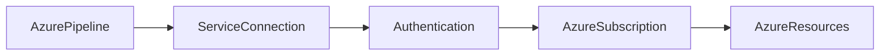
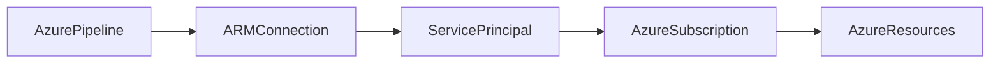
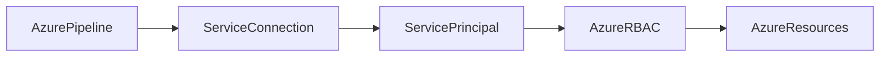

# Service Connections

## Overview

A **Service Connection** is a secure authentication mechanism that allows Azure DevOps to connect to external services and deploy resources without storing credentials directly in the pipeline.

Instead of embedding usernames, passwords, or access keys in YAML files, Azure DevOps uses Service Connections to securely authenticate with target platforms.

Supported platforms include:

- Microsoft Azure
- AWS
- Google Cloud Platform (GCP)
- Kubernetes
- Docker Registry
- GitHub
- Azure Container Registry (ACR)
- Azure Key Vault
- Terraform Cloud
- SonarQube

> **Interview Point**
>
> A Service Connection acts as the **identity** that Azure Pipelines use to access external resources securely.

---

## Why It Is Used

Service Connections help organizations:

- Secure deployments
- Eliminate hardcoded credentials
- Enable CI/CD automation
- Centralize authentication
- Support Role-Based Access Control (RBAC)
- Improve security and compliance

---

## Architecture / Working



---

## Key Components

| Component | Purpose |
|------------|----------|
| Azure DevOps Pipeline | Executes deployment |
| Service Connection | Stores authentication configuration |
| Identity | Service Principal, Managed Identity, or other credentials |
| Target Platform | Azure, AWS, Kubernetes, etc. |
| RBAC | Controls resource access |

---

## Types

| Service Connection | Purpose |
|--------------------|---------|
| Azure Resource Manager | Connect to Azure subscriptions |
| Kubernetes | Connect to Kubernetes clusters |
| Docker Registry | Push and pull container images |
| Azure Container Registry | Manage container images |
| GitHub | Access GitHub repositories |
| SSH | Connect to Linux servers |
| Generic | Connect to third-party services |

---

## Lifecycle / Workflow


---

## Configuration / Syntax

Using a Service Connection in Azure CLI Task

```yaml
steps:

- task: AzureCLI@2

  inputs:

    azureSubscription: 'Azure-Production'

    scriptType: bash

    scriptLocation: inlineScript

    inlineScript: |

      az group list
```

> **Interview Point**
>
> The value of `azureSubscription` refers to the **Service Connection name**, not the Azure Subscription name.

---

## Important Commands

Verify Azure login

```bash
az account show
```

List subscriptions

```bash
az account list
```

Show current account

```bash
az account show --output table
```

---

## Important Files

| File | Purpose |
|------|---------|
| azure-pipelines.yml | Uses Service Connection |
| ARM templates | Infrastructure deployment |
| Terraform files | Azure infrastructure provisioning |

---

## Real-World Use Cases

- Deploy Azure Web Apps
- Deploy AKS workloads
- Create Resource Groups
- Deploy ARM templates
- Execute Terraform
- Deploy Virtual Machines

---

## Advantages

- Secure authentication
- Centralized credential management
- Supports RBAC
- Easy integration with Azure Pipelines
- Supports multiple cloud providers

---

## Limitations

- Requires initial configuration
- Incorrect RBAC assignments can block deployments
- Service Principal secrets require rotation if used

---

## Common Interview Questions (Concept Only)

- What is a Service Connection?
- Why do we need Service Connections?
- Can Azure Pipelines deploy without a Service Connection?
- Which Azure DevOps tasks use Service Connections?

---

## Common Mistakes

- Hardcoding Azure credentials in YAML
- Granting excessive permissions
- Using one Service Connection for all environments
- Not rotating credentials

---

## Troubleshooting

| Problem | Solution |
|----------|----------|
| Authentication failed | Verify Service Connection credentials |
| Access denied | Check Azure RBAC assignments |
| Connection unavailable | Verify Service Connection exists and is authorized |
| Pipeline cannot access Azure | Confirm correct Service Connection name is referenced |

---

## Summary

Service Connections provide secure, centralized authentication between Azure DevOps and external platforms, enabling automated and secure deployments without exposing credentials.

---

# Azure Resource Manager (ARM) Connection

## Overview

An **Azure Resource Manager (ARM) Service Connection** is the most commonly used Service Connection in Azure DevOps.

It enables Azure Pipelines to authenticate with an Azure subscription and deploy Azure resources.

Most Azure deployment tasks use ARM Service Connections.

---

## Why It Is Used

ARM Connections allow Azure DevOps to:

- Deploy Azure resources
- Manage Azure subscriptions
- Execute Azure CLI commands
- Deploy ARM/Bicep templates
- Run Terraform against Azure

---

## Architecture / Working



---

## Key Components

| Component | Purpose |
|------------|----------|
| Azure DevOps | Executes pipeline |
| ARM Connection | Azure authentication |
| Service Principal | Identity |
| Azure Subscription | Deployment target |
| Azure Resource | Target infrastructure |

---

## Types

### Automatic Service Principal

Azure DevOps creates and manages the Service Principal automatically.

Recommended for most scenarios.

---

### Manual Service Principal

Administrator creates the Service Principal and provides credentials manually.

Common in enterprise environments with strict governance.

---

## Lifecycle / Workflow


---

## Configuration / Syntax

Azure CLI Task

```yaml
- task: AzureCLI@2

  inputs:

    azureSubscription: 'Azure-Production'

    scriptType: bash

    scriptLocation: inlineScript

    inlineScript: |

      az group list
```

---

## Important Commands

Verify subscription

```bash
az account show
```

List Resource Groups

```bash
az group list
```

List Virtual Machines

```bash
az vm list
```

---

## Real-World Use Cases

- Deploy App Services
- Deploy Azure Kubernetes Service (AKS)
- Create Virtual Machines
- Deploy ARM/Bicep templates
- Deploy Terraform infrastructure

---

## Advantages

- Native Azure integration
- Secure authentication
- Supports RBAC
- Works with Azure CLI, PowerShell, and deployment tasks

---

## Limitations

- Azure-only
- Requires appropriate subscription permissions

---

## Common Interview Questions (Concept Only)

- What is an ARM Service Connection?
- Why is ARM Connection commonly used?
- What authentication method does ARM use?

---

## Common Mistakes

- Selecting the wrong Azure subscription
- Assigning Owner permissions unnecessarily
- Forgetting to authorize the Service Connection for pipelines

---

## Troubleshooting

| Problem | Solution |
|----------|----------|
| Subscription not visible | Verify Azure account permissions |
| Deployment failed | Check Service Principal role assignments |
| Authentication error | Reauthorize the Service Connection |

---

## Summary

An ARM Service Connection securely authenticates Azure DevOps with an Azure subscription, enabling automated infrastructure and application deployments.

---

# Service Principal Authentication

## Overview

A **Service Principal** is a non-human identity created in Microsoft Entra ID (formerly Azure Active Directory) that applications and automation tools use to access Azure resources.

Azure DevOps commonly uses a Service Principal behind an ARM Service Connection.

> **Interview Point**
>
> Think of a Service Principal as a **user account for applications**, not for people.

---

## Why It Is Used

Service Principals provide:

- Secure authentication
- Automation
- Least privilege access
- RBAC integration
- Auditable access

---

## Architecture / Working



---

## Key Components

| Component | Purpose |
|------------|----------|
| Application Registration | Identity definition |
| Service Principal | Security identity |
| Client ID | Application identifier |
| Client Secret or Certificate | Authentication credential |
| Tenant ID | Microsoft Entra tenant |
| Subscription | Azure target |

---

## Types

### Client Secret Authentication

Uses a secret (password).

Most common.

---

### Certificate Authentication

Uses certificates instead of passwords.

More secure than client secrets.

---

### Workload Identity Federation (OIDC)

Uses short-lived tokens instead of stored secrets.

Recommended for modern Azure DevOps and GitHub Actions integrations because it eliminates long-lived credentials.

> **Interview Point**
>
> Many organizations are moving from **Client Secrets** to **Workload Identity Federation (OIDC)** to improve security.

---

## Lifecycle / Workflow


---

## Configuration / Syntax

Azure CLI Login

```bash
az login --service-principal \
  --username <CLIENT_ID> \
  --password <CLIENT_SECRET> \
  --tenant <TENANT_ID>
```

---

## Important Commands

Create Service Principal

```bash
az ad sp create-for-rbac
```

Show current account

```bash
az account show
```

List role assignments

```bash
az role assignment list
```

---

## Important Files

Service Principal credentials should be stored securely in:

- Azure DevOps Service Connections
- Azure Key Vault
- Secret Variables
- Variable Groups (secret values)

---

## Real-World Use Cases

- Azure deployments
- Terraform
- ARM templates
- Azure CLI automation
- Kubernetes deployment

---

## Advantages

- Secure automation
- RBAC support
- Non-human identity
- Auditable

---

## Limitations

- Client secrets expire
- Requires permission management
- Secret rotation required unless using OIDC or certificates

---

## Common Interview Questions (Concept Only)

- What is a Service Principal?
- Why use a Service Principal instead of a user account?
- Difference between Service Principal and Managed Identity?
- What information is required for Service Principal authentication?
- Why is Workload Identity Federation becoming popular?

---

## Common Mistakes

- Using Owner role unnecessarily
- Exposing client secrets in repositories
- Forgetting secret expiration
- Not following least privilege

---

## Troubleshooting

| Problem | Solution |
|----------|----------|
| Authentication failed | Verify Client ID, Secret/Certificate, and Tenant ID |
| Authorization failed | Check Azure RBAC assignments |
| Secret expired | Generate a new secret or use OIDC/certificate authentication |
| Invalid tenant | Verify Microsoft Entra Tenant ID |

---

## Summary

Service Principal Authentication enables Azure DevOps to securely authenticate and automate Azure operations using a dedicated application identity.

---

# Connection Permissions

## Overview

Connection Permissions determine **who can use, modify, or manage** a Service Connection within Azure DevOps.

They help secure deployments by restricting access to authorized users and pipelines.

---

## Why It Is Used

Permissions help:

- Protect Azure resources
- Restrict deployment access
- Prevent unauthorized changes
- Support least privilege
- Improve governance

---

## Architecture / Working


---

## Key Components

| Component | Purpose |
|------------|----------|
| User | Requests access |
| Security Group | Defines permissions |
| Service Connection | Authentication |
| Azure RBAC | Resource authorization |

---

## Types

### User Permissions

Control which users can:

- Use
- Edit
- Delete
- Manage Service Connections

---

### Pipeline Permissions

Control which pipelines are allowed to use a Service Connection.

Options include:

- Authorize for all pipelines
- Authorize specific pipelines (recommended for production)

> **Interview Point**
>
> In production environments, avoid enabling **Grant access permission to all pipelines** unless there is a valid operational requirement.

---

## Lifecycle / Workflow


---

## Configuration / Syntax

Reference a Service Connection in YAML

```yaml
steps:

- task: AzureCLI@2

  inputs:

    azureSubscription: 'Production-ServiceConnection'

    scriptType: bash

    scriptLocation: inlineScript

    inlineScript: |

      az group list
```

---

## Important Commands

Check Azure role assignments

```bash
az role assignment list
```

View current account

```bash
az account show
```

---

## Real-World Use Cases

- Restrict Production deployments
- Separate Development and Production access
- Secure enterprise CI/CD
- Implement approval workflows

---

## Advantages

- Improved security
- Least privilege access
- Better governance
- Controlled deployments

---

## Limitations

- Incorrect permission assignments can block deployments
- Requires periodic access reviews

---

## Common Interview Questions (Concept Only)

- What permissions apply to a Service Connection?
- Difference between Azure RBAC and Service Connection permissions?
- Why should Production Service Connections be restricted?
- How do you authorize a pipeline to use a Service Connection?

---

## Common Mistakes

- Giving every developer access to Production connections
- Allowing all pipelines to use sensitive Service Connections
- Ignoring RBAC principles
- Not reviewing permissions periodically

---

## Troubleshooting

| Problem | Solution |
|----------|----------|
| Pipeline not authorized | Grant pipeline access to the Service Connection |
| Access denied | Verify Azure RBAC and Azure DevOps permissions |
| User cannot edit connection | Check Service Connection security settings |
| Deployment blocked | Confirm the correct Service Connection is referenced and authorized |

---

## Summary

Connection Permissions secure Service Connections by controlling which users and pipelines can access external resources, helping organizations enforce governance, least privilege, and secure CI/CD practices.
