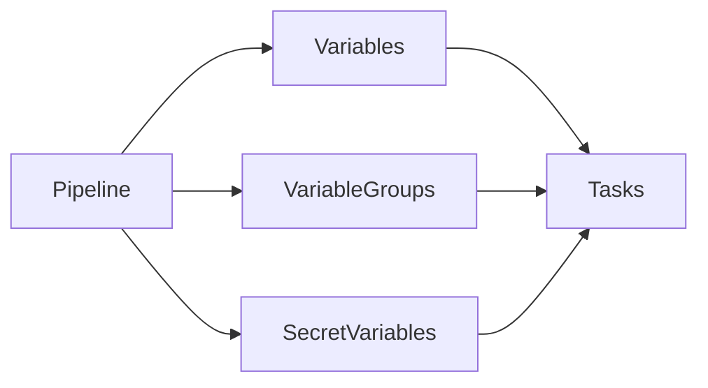
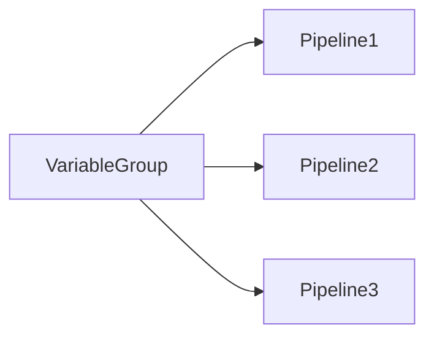

# Variable & Secret Management

## Overview

Variable & Secret Management in Azure DevOps provides a secure and flexible way to store configuration values and sensitive information that pipelines require during execution.

Instead of hardcoding values in YAML files or application code, Azure DevOps allows you to store them as variables, secret variables, or shared variable groups.

Examples include:

- Application names
- Environment names
- Resource Group names
- Docker image tags
- Connection strings
- API Keys
- Passwords
- Access Tokens

> **Interview Point**
>
> **Never hardcode secrets** such as passwords, API keys, or tokens in YAML files or source code. Store them as **Secret Variables**, **Variable Groups**, or in **Azure Key Vault**.

---

## Why It Is Used

Variable Management helps organizations:

- Centralize configuration
- Reuse values
- Improve security
- Support multiple environments
- Reduce duplication
- Simplify maintenance

---

## Architecture / Working



---

## Key Components

| Component | Purpose |
|------------|----------|
| Pipeline Variable | General configuration value |
| Variable Group | Shared variables |
| Secret Variable | Sensitive data |
| Runtime Variable | Generated during execution |
| Azure Key Vault | External secret storage |

---

## Types

| Type | Purpose |
|------|---------|
| Pipeline Variables | Pipeline-specific values |
| Variable Groups | Shared variables across pipelines |
| Secret Variables | Secure sensitive values |
| Runtime Variables | Values generated while running |

---

## Lifecycle / Workflow


---

## Configuration / Syntax

Define Variables

```yaml
variables:

  appName: DemoApp

  environment: Dev
```

Reference Variables

```yaml
steps:

- script: |

    echo $(appName)

    echo $(environment)
```

---

## Important Commands

Variables are primarily managed through YAML and the Azure DevOps UI.

Example using Azure CLI:

```bash
az pipelines variable list
```

---

## Important Files

| File | Purpose |
|------|---------|
| azure-pipelines.yml | Pipeline definition |
| Variable Group | Shared variables |
| Azure Key Vault | Secure secret storage |

---

## Real-World Use Cases

- Store Resource Group names
- Store Docker image tags
- Store deployment environment names
- Store API endpoints
- Store database connection strings
- Store authentication secrets

---

## Advantages

- Centralized configuration
- Improved security
- Reusable
- Easy maintenance
- Supports multiple environments

---

## Limitations

- Incorrect scope can cause variable conflicts
- Secrets require careful access control

---

## Common Interview Questions (Concept Only)

- What is Variable Management?
- Why should variables be used instead of hardcoded values?
- How are secrets stored securely?
- What is the difference between variables and secrets?

---

## Common Mistakes

- Hardcoding passwords
- Using plain-text secrets
- Duplicate variable names
- Incorrect variable scope

---

## Troubleshooting

| Problem | Solution |
|----------|----------|
| Variable empty | Verify spelling and scope |
| Secret unavailable | Check permissions |
| Wrong value | Review variable precedence |

---

## Summary

Variable & Secret Management centralizes configuration and protects sensitive data, making Azure DevOps pipelines secure, reusable, and easier to maintain.

---

# Pipeline Variables

## Overview

Pipeline Variables store reusable values used during pipeline execution.

They eliminate hardcoded configuration and make pipelines more flexible.

Examples:

- Environment names
- Build configuration
- Resource Groups
- Image tags
- Application names

---

## Why It Is Used

Pipeline Variables help:

- Reuse values
- Simplify updates
- Improve readability
- Support different environments

---

## Architecture / Working


---

## Key Components

| Component | Purpose |
|------------|----------|
| Name | Variable identifier |
| Value | Stored value |
| Scope | Where variable is available |

---

## Types

### User Variables

Created by developers.

Example:

```yaml
variables:

  appName: DemoApp
```

---

### System Variables

Automatically provided by Azure DevOps.

Examples:

| Variable | Description |
|-----------|-------------|
| `Build.BuildId` | Build ID |
| `Build.SourceBranch` | Source branch |
| `Build.BuildNumber` | Build number |
| `Agent.OS` | Agent operating system |
| `Build.Repository.Name` | Repository name |

---

## Lifecycle / Workflow


---

## Configuration / Syntax

Define variable

```yaml
variables:

  environment: Production
```

Use variable

```yaml
- script: echo $(environment)
```

---

## Important Commands

Variables are typically referenced in YAML.

Azure CLI:

```bash
az pipelines variable list
```

---

## Important Files

```text
azure-pipelines.yml
```

---

## Real-World Use Cases

- Deployment environments
- Docker image versions
- Azure subscription names
- Resource Group names

---

## Advantages

- Reusable
- Centralized
- Easy updates

---

## Limitations

- Incorrect scope causes unexpected behavior

---

## Common Interview Questions (Concept Only)

- What are Pipeline Variables?
- What are System Variables?
- How are variables referenced in YAML?

---

## Common Mistakes

- Misspelled variable names
- Hardcoding environment values
- Ignoring variable precedence

---

## Troubleshooting

| Problem | Solution |
|----------|----------|
| Variable not expanded | Verify syntax `$(variable)` |
| Wrong value | Review scope and precedence |

---

## Summary

Pipeline Variables store reusable configuration values that simplify and standardize CI/CD pipelines.

---

# Variable Groups

## Overview

Variable Groups allow multiple pipelines to share the same collection of variables.

Instead of defining identical variables in every pipeline, a Variable Group provides centralized management.

---

## Why It Is Used

Variable Groups help:

- Reduce duplication
- Standardize configuration
- Share variables
- Store secrets centrally

---

## Architecture / Working



---

## Key Components

| Component | Purpose |
|------------|----------|
| Variable Group | Shared variables |
| Pipeline | Uses variables |
| Secret Variables | Secure shared values |
| Azure Key Vault | External secret integration |

---

## Types

### Standard Variable Group

Variables managed directly in Azure DevOps.

---

### Azure Key Vault Linked Variable Group

Secrets are retrieved dynamically from Azure Key Vault instead of being stored in Azure DevOps.

> **Interview Point**
>
> For production environments, many organizations use **Azure Key Vault-linked Variable Groups** to avoid storing secrets directly in Azure DevOps.

---

## Lifecycle / Workflow


---

## Configuration / Syntax

Reference Variable Group

```yaml
variables:

- group: Production-Variables
```

---

## Important Files

```text
azure-pipelines.yml
```

---

## Real-World Use Cases

- Production settings
- Shared API endpoints
- Shared connection strings
- Shared image tags

---

## Advantages

- Central management
- Reusable
- Supports secrets
- Easy maintenance

---

## Limitations

- Changes affect every linked pipeline
- Requires access management

---

## Common Interview Questions (Concept Only)

- What is a Variable Group?
- Why use Variable Groups?
- Can Variable Groups store secrets?
- How do Variable Groups integrate with Azure Key Vault?

---

## Common Mistakes

- Using multiple groups with conflicting variable names
- Storing sensitive values as plain text
- Changing shared values without impact analysis

---

## Troubleshooting

| Problem | Solution |
|----------|----------|
| Variable missing | Verify Variable Group is linked |
| Permission denied | Authorize pipeline access |
| Secret unavailable | Verify Key Vault permissions if linked |

---

## Summary

Variable Groups provide centralized management of shared configuration values and secrets across multiple Azure DevOps pipelines.

---

# Secret Variables

## Overview

Secret Variables store sensitive information securely within Azure DevOps.

Their values are:

- Encrypted at rest
- Masked in pipeline logs
- Hidden from users after creation

Examples:

- Passwords
- API Keys
- Client Secrets
- Database credentials
- Personal Access Tokens (PATs)

> **Interview Point**
>
> Secret Variables are **masked in logs**, but they are **not automatically available as environment variables** in scripts. They must be explicitly mapped when needed.

---

## Why It Is Used

Secret Variables protect sensitive information from unauthorized access while allowing pipelines to use it securely.

---

## Architecture / Working


---

## Key Components

| Component | Purpose |
|------------|----------|
| Secret Variable | Encrypted value |
| Encryption | Protects data |
| Masking | Hides value in logs |
| Pipeline | Uses secret securely |

---

## Lifecycle / Workflow


---

## Configuration / Syntax

Reference Secret Variable

```yaml
steps:

- script: echo "Application started"

  env:

    PASSWORD: $(dbPassword)
```

> **Do not print secret values in scripts**, even though Azure DevOps attempts to mask them.

---

## Important Files

Secrets should not be stored in files.

Recommended storage:

- Secret Variables
- Variable Groups
- Azure Key Vault

---

## Real-World Use Cases

- Database passwords
- Service Principal secrets
- API tokens
- SSH private keys
- Access tokens

---

## Advantages

- Encrypted
- Log masking
- Secure storage
- Azure Key Vault integration

---

## Limitations

- Secret values cannot be viewed after creation
- Secrets still require rotation and proper access management

---

## Common Interview Questions (Concept Only)

- What is a Secret Variable?
- How are Secret Variables protected?
- Why shouldn't secrets be stored in YAML?
- How do Secret Variables differ from normal variables?

---

## Common Mistakes

- Printing secrets in scripts
- Storing passwords in repositories
- Using plain-text configuration files
- Sharing secrets unnecessarily

---

## Troubleshooting

| Problem | Solution |
|----------|----------|
| Secret empty | Verify variable name |
| Secret not available | Confirm permissions and mapping |
| Secret exposed | Rotate immediately and update all dependent services |

---

## Summary

Secret Variables securely store sensitive information required by pipelines while protecting it through encryption, masking, and controlled access.

---

# Runtime Variables

## Overview

Runtime Variables are variables whose values are determined or modified **while the pipeline is executing**.

Unlike parameters, which are resolved before execution begins, Runtime Variables can change during pipeline execution and can influence later jobs or steps.

---

## Why It Is Used

Runtime Variables help:

- Share values between tasks
- Store dynamically generated information
- Build flexible pipelines
- Control pipeline execution

Examples:

- Build version
- Git commit SHA
- Generated image tag
- Deployment URL
- Output from a previous task

---

## Architecture / Working


---

## Key Components

| Component | Purpose |
|------------|----------|
| Pipeline | Executes tasks |
| Task | Generates variable |
| Runtime Variable | Stores generated value |
| Output Variable | Shares value with later jobs or stages |

---

## Types

### Standard Runtime Variable

Available within the current job.

---

### Output Variable

Shared with subsequent jobs or stages using dependency syntax.

> **Interview Point**
>
> Output Variables are commonly used to pass dynamically generated values (such as image tags or resource IDs) between jobs or stages.

---

## Lifecycle / Workflow


---

## Configuration / Syntax

Set a Runtime Variable

```yaml
steps:

- script: |

    echo "##vso[task.setvariable variable=imageTag]v1.0.$(Build.BuildId)"
```

Use the variable later in the same job

```yaml
- script: echo $(imageTag)
```

Example of setting an output variable

```yaml
- script: |

    echo "##vso[task.setvariable variable=imageTag;isOutput=true]v1.0.$(Build.BuildId)"
  name: SetImageTag
```

---

## Important Commands

Runtime variables are created using Azure DevOps logging commands:

```text
##vso[task.setvariable]
```

---

## Important Files

```text
azure-pipelines.yml
```

---

## Real-World Use Cases

- Generate Docker image tags
- Store build numbers
- Pass resource IDs between jobs
- Save deployment endpoints
- Share output from infrastructure provisioning

---

## Advantages

- Dynamic pipeline behavior
- Reusable values
- Supports complex workflows
- Enables communication between tasks and jobs

---

## Limitations

- Scope must be configured correctly
- Output Variables require dependency syntax across jobs or stages

---

## Common Interview Questions (Concept Only)

- What are Runtime Variables?
- Difference between Variables and Runtime Variables?
- Difference between Parameters and Runtime Variables?
- What are Output Variables?
- How do you share a variable between jobs?

---

## Common Mistakes

- Expecting Runtime Variables to behave like Parameters
- Incorrect variable scope
- Forgetting to mark variables as output when sharing across jobs
- Referencing runtime values before they are created

---

## Troubleshooting

| Problem | Solution |
|----------|----------|
| Variable not available | Verify scope and creation order |
| Output variable missing | Ensure `isOutput=true` is configured and dependency syntax is correct |
| Incorrect value | Review the task that generated the variable |

---

## Summary

Runtime Variables allow Azure Pipelines to generate and use dynamic values during execution, making CI/CD workflows more flexible and enabling communication between tasks, jobs, and stages.
