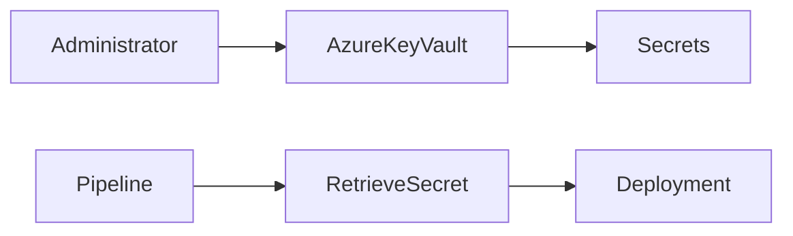

# Azure Key Vault Integration

## Overview

Azure Key Vault Integration enables Azure DevOps pipelines to securely retrieve secrets, certificates, and cryptographic keys directly from **Azure Key Vault** instead of storing them inside Azure DevOps.

Rather than maintaining passwords, API keys, or certificates in pipeline variables, Azure DevOps fetches them securely at runtime.

> **Interview Point**
>
> In production environments, **Azure Key Vault is the recommended place to store secrets**, not Azure DevOps Secret Variables.

---

## Why It Is Used

Azure Key Vault Integration helps organizations:

- Secure sensitive information
- Centralize secret management
- Eliminate hardcoded credentials
- Simplify secret rotation
- Improve compliance
- Reduce security risks

---

## Architecture / Working


---

## Key Components

| Component | Purpose |
|------------|----------|
| Azure Key Vault | Secure secret storage |
| Azure DevOps Pipeline | Uses secrets |
| Service Connection | Authentication |
| Secret | Password/API Key |
| Certificate | SSL/TLS certificates |
| Key | Cryptographic key |

---

## Types

Azure Key Vault stores three main object types:

| Type | Description |
|------|-------------|
| Secrets | Passwords, API keys, connection strings, tokens |
| Keys | Cryptographic keys used for encryption and signing |
| Certificates | SSL/TLS certificates and their private keys |

> **Interview Point**
>
> Azure DevOps pipelines most commonly retrieve **Secrets** from Azure Key Vault.

---

## Lifecycle / Workflow


---

## Configuration / Syntax

Example using Azure Key Vault task

```yaml
steps:

- task: AzureKeyVault@2

  inputs:

    azureSubscription: 'Azure-Production'

    KeyVaultName: 'Prod-KeyVault'

    SecretsFilter: '*'

    RunAsPreJob: true
```

Use retrieved secret

```yaml
steps:

- script: |

    echo "Deployment Started"

  env:

    PASSWORD: $(dbPassword)
```

---

## Important Commands

Login

```bash
az login
```

List Key Vaults

```bash
az keyvault list
```

Show Key Vault

```bash
az keyvault show --name MyKeyVault
```

List Secrets

```bash
az keyvault secret list --vault-name MyKeyVault
```

Retrieve Secret

```bash
az keyvault secret show \
  --vault-name MyKeyVault \
  --name dbPassword
```

---

## Important Files

| File | Purpose |
|------|---------|
| azure-pipelines.yml | Pipeline definition |
| Variable Group | Can link to Azure Key Vault |
| ARM/Bicep/Terraform files | Provision Key Vault infrastructure |

---

## Real-World Use Cases

- Store database passwords
- Store Azure Service Principal secrets
- Store API keys
- Store Storage Account keys
- Store SSH keys
- Store TLS certificates

---

## Advantages

- Centralized secret management
- Automatic secret rotation support
- Azure RBAC integration
- Improved security
- Secret versioning
- Audit logging

---

## Limitations

- Azure subscription required
- Service Connection required
- Additional network and permission configuration may be needed

---

## Common Interview Questions (Concept Only)

- What is Azure Key Vault Integration?
- Why use Azure Key Vault instead of Secret Variables?
- What can Azure Key Vault store?
- How do Azure Pipelines access Azure Key Vault?

---

## Common Mistakes

- Hardcoding secrets in YAML
- Granting excessive permissions
- Forgetting Service Connection authorization
- Not rotating secrets

---

## Troubleshooting

| Problem | Solution |
|----------|----------|
| Secret not found | Verify Key Vault name and secret name |
| Authentication failed | Verify Service Connection |
| Access denied | Check Azure RBAC or Key Vault access permissions |
| Pipeline cannot retrieve secret | Verify AzureKeyVault task configuration |

---

## Summary

Azure Key Vault Integration enables Azure DevOps pipelines to securely retrieve secrets, keys, and certificates during execution, improving security and reducing credential management overhead.

---

# Store Secrets

## Overview

Secrets are sensitive values required by applications and deployment pipelines.

Instead of storing secrets in source code or YAML files, they should be stored securely inside Azure Key Vault.

Examples include:

- Database passwords
- API Keys
- Client Secrets
- Storage Account Keys
- Personal Access Tokens (PAT)
- SSH Private Keys

---

## Why It Is Used

Storing secrets securely helps:

- Protect sensitive information
- Prevent credential leaks
- Meet compliance requirements
- Enable centralized management

---

## Architecture / Working



---

## Key Components

| Component | Purpose |
|------------|----------|
| Secret Name | Identifier |
| Secret Value | Sensitive information |
| Version | Secret versioning |
| Expiration | Secret lifetime |

---

## Types

Common Secrets

- Passwords
- API Keys
- Tokens
- Client Secrets
- Connection Strings
- SSH Keys

---

## Lifecycle / Workflow


---

## Configuration / Syntax

Create Secret

```bash
az keyvault secret set \
  --vault-name MyKeyVault \
  --name dbPassword \
  --value MyStrongPassword
```

Retrieve Secret

```bash
az keyvault secret show \
  --vault-name MyKeyVault \
  --name dbPassword
```

---

## Important Commands

```bash
az keyvault secret set

az keyvault secret show

az keyvault secret list

az keyvault secret delete
```

---

## Real-World Use Cases

- Database authentication
- Azure deployments
- Kubernetes secrets
- Application configuration

---

## Advantages

- Secure storage
- Secret versioning
- Encryption
- Audit logging

---

## Limitations

- Secrets require rotation
- Requires proper permissions

---

## Common Interview Questions (Concept Only)

- Why should secrets never be stored in Git?
- What types of secrets are stored in Azure Key Vault?
- How are secrets encrypted?

---

## Common Mistakes

- Storing passwords in repositories
- Using weak secret names
- Never rotating secrets
- Sharing secrets manually

---

## Troubleshooting

| Problem | Solution |
|----------|----------|
| Secret missing | Verify secret name |
| Secret expired | Update secret value |
| Access denied | Verify Key Vault permissions |

---

## Summary

Azure Key Vault securely stores sensitive information while providing encryption, auditing, versioning, and centralized management.

---

# Link Key Vault to Pipelines

## Overview

Azure DevOps Pipelines can retrieve secrets directly from Azure Key Vault by linking the Key Vault through:

- Azure Service Connection
- Azure Key Vault Task
- Azure Key Vault-linked Variable Group

This eliminates the need to store secrets within Azure DevOps.

---

## Why It Is Used

Linking Key Vault allows:

- Secure secret retrieval
- Automatic secret updates
- Centralized management
- Reduced maintenance

---

## Architecture / Working


---

## Key Components

| Component | Purpose |
|------------|----------|
| Azure Pipeline | Executes deployment |
| Service Connection | Authentication |
| Azure Key Vault | Secret storage |
| Variable Group | Optional secret mapping |

---

## Types

### Azure Key Vault Task

Retrieves secrets during pipeline execution.

---

### Azure Key Vault-linked Variable Group

Maps Key Vault secrets into Azure DevOps variables automatically.

> **Interview Point**
>
> Variable Groups linked to Azure Key Vault allow pipelines to reference secrets just like normal variables while the actual secret remains in Key Vault.

---

## Lifecycle / Workflow


---

## Configuration / Syntax

Azure Key Vault Task

```yaml
- task: AzureKeyVault@2

  inputs:

    azureSubscription: Azure-Production

    KeyVaultName: ProductionKV

    SecretsFilter: '*'

    RunAsPreJob: true
```

Variable Group

```yaml
variables:

- group: Production-KeyVault
```

---

## Important Commands

Verify Key Vault

```bash
az keyvault show
```

List Secrets

```bash
az keyvault secret list
```

---

## Real-World Use Cases

- Production deployments
- CI/CD authentication
- Terraform credentials
- Kubernetes deployments

---

## Advantages

- Secure
- Automatic secret retrieval
- Easy maintenance
- Centralized management

---

## Limitations

- Requires Service Connection
- Requires Azure permissions

---

## Common Interview Questions (Concept Only)

- How do you connect Azure Key Vault to Azure DevOps?
- Why use Variable Groups with Azure Key Vault?
- What authentication is required?

---

## Common Mistakes

- Incorrect Service Connection
- Missing Key Vault permissions
- Incorrect secret names

---

## Troubleshooting

| Problem | Solution |
|----------|----------|
| Secrets unavailable | Verify Service Connection and Key Vault permissions |
| Pipeline cannot access Key Vault | Check RBAC or access policy configuration |
| Secret name mismatch | Verify `SecretsFilter` and secret names |

---

## Summary

Linking Azure Key Vault to Azure DevOps enables secure, centralized secret management without exposing sensitive information in pipelines.

---

# Access Secrets in Pipelines

## Overview

After Azure Key Vault is integrated with Azure DevOps, pipelines can access secrets securely during execution.

Secrets are retrieved at runtime and can be consumed by tasks, scripts, or deployment tools.

> **Interview Point**
>
> Retrieved secrets are treated as **secret variables**. Azure DevOps masks their values in pipeline logs.

---

## Why It Is Used

Accessing secrets securely enables:

- Safe deployments
- Dynamic configuration
- Secret rotation without modifying pipelines
- Compliance with security best practices

---

## Architecture / Working


---

## Key Components

| Component | Purpose |
|------------|----------|
| Secret | Sensitive value |
| Pipeline | Retrieves secret |
| Task | Uses secret |
| Environment Variable | Temporary runtime access |

---

## Lifecycle / Workflow


---

## Configuration / Syntax

Retrieve secrets

```yaml
- task: AzureKeyVault@2

  inputs:

    azureSubscription: Azure-Production

    KeyVaultName: ProductionKV

    SecretsFilter: dbPassword
```

Use secret

```yaml
steps:

- script: |

    echo "Deploying Application"

  env:

    DB_PASSWORD: $(dbPassword)
```

---

## Important Commands

Retrieve secret manually

```bash
az keyvault secret show
```

---

## Important Files

```text
azure-pipelines.yml
```

---

## Real-World Use Cases

- Database authentication
- API authentication
- Service Principal credentials
- Container registry authentication
- Kubernetes deployments

---

## Advantages

- Secure runtime access
- No hardcoded credentials
- Supports secret rotation
- Log masking
- Centralized security

---

## Limitations

- Secrets are available only during pipeline execution
- Pipelines depend on Key Vault availability and permissions

---

## Common Interview Questions (Concept Only)

- How do pipelines access Azure Key Vault secrets?
- Can Azure DevOps display secret values in logs?
- How are secrets passed to scripts?
- What happens if a secret is rotated?

---

## Common Mistakes

- Printing secrets to logs
- Referencing incorrect secret names
- Assuming secrets are automatically available as environment variables
- Giving pipelines unnecessary access to all secrets

---

## Troubleshooting

| Problem | Solution |
|----------|----------|
| Secret not available | Verify AzureKeyVault task executed successfully |
| Variable empty | Check secret name and pipeline reference |
| Access denied | Verify Service Connection and Key Vault permissions |
| Secret masking issue | Ensure the value is stored as a secret and not echoed directly |

---

## Summary

Azure DevOps retrieves Azure Key Vault secrets securely at runtime, allowing pipelines to authenticate and configure applications without exposing sensitive information in source code or pipeline definitions.
