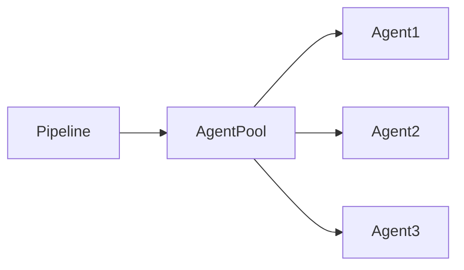

# Agents

## Overview

An **Agent** is a machine or compute resource that executes Azure DevOps pipeline jobs.

Whenever a pipeline starts, Azure DevOps assigns an available agent to execute the pipeline steps such as:

- Clone source code
- Restore dependencies
- Build applications
- Run tests
- Publish artifacts
- Deploy applications

Without an agent, a pipeline cannot execute.

> **Interview Point**
>
> Every Azure DevOps pipeline runs on an **Agent**. The agent performs the actual work; Azure DevOps only orchestrates the pipeline.

---

## Why It Is Used

Agents help organizations:

- Execute pipeline tasks
- Automate CI/CD
- Run builds and deployments
- Support multiple operating systems
- Provide isolated execution environments

---

## Architecture / Working


---

## Key Components

| Component | Purpose |
|------------|----------|
| Azure DevOps | Pipeline orchestration |
| Agent Pool | Collection of agents |
| Agent | Executes pipeline |
| Job | Assigned to an agent |
| Task | Individual pipeline operation |

---

## Types

| Agent Type | Description |
|------------|-------------|
| Microsoft-Hosted Agent | Managed by Microsoft |
| Self-Hosted Agent | Managed by the organization |

---

## Lifecycle / Workflow


---

## Configuration / Syntax

Select Microsoft-hosted agent

```yaml
pool:

  vmImage: ubuntu-latest
```

Select Self-hosted agent

```yaml
pool:

  name: Production-AgentPool
```

---

## Important Commands

Agent configuration (Linux)

```bash
./config.sh
```

Run agent

```bash
./run.sh
```

Install as service

```bash
sudo ./svc.sh install

sudo ./svc.sh start
```

---

## Important Files

| File | Purpose |
|------|---------|
| azure-pipelines.yml | Pipeline definition |
| .agent | Agent configuration |
| .credentials | Agent authentication |
| .service | Service configuration |

---

## Real-World Use Cases

- CI/CD execution
- Docker image builds
- Kubernetes deployment
- Terraform execution
- Infrastructure automation

---

## Advantages

- Automated execution
- Multi-platform support
- Parallel execution
- Scalable

---

## Limitations

- Microsoft-hosted agents have execution time and software limitations
- Self-hosted agents require maintenance

---

## Common Interview Questions (Concept Only)

- What is an Azure DevOps Agent?
- Why are Agents required?
- Can pipelines run without an Agent?
- What types of Agents are available?

---

## Common Mistakes

- Assuming Azure DevOps executes pipelines directly
- Installing unnecessary software on Microsoft-hosted agents
- Ignoring agent maintenance

---

## Troubleshooting

| Problem | Solution |
|----------|----------|
| Agent offline | Restart agent service |
| Job waiting | Verify available agents |
| Pipeline failed | Review agent logs |
| Agent not found | Verify Agent Pool |

---

## Summary

Agents are the execution engines of Azure DevOps that perform all pipeline operations including builds, testing, artifact publishing, and deployments.

---

# Microsoft-Hosted Agents

## Overview

Microsoft-Hosted Agents are virtual machines provided and managed by Microsoft.

Azure DevOps creates a **new virtual machine for every pipeline run**, executes the pipeline, and destroys the VM after completion.

> **Interview Point**
>
> Microsoft-hosted agents are **ephemeral**. Every pipeline run starts with a clean machine.

---

## Why It Is Used

Microsoft-hosted agents provide:

- No infrastructure management
- Automatic updates
- Pre-installed development tools
- Fast setup
- Secure isolated environments

---

## Architecture / Working


---

## Key Components

| Component | Purpose |
|------------|----------|
| Azure VM | Temporary execution machine |
| Hosted Image | Pre-configured OS |
| Pipeline Job | Executes on VM |

---

## Types

Common Images

| Image | Description |
|--------|-------------|
| ubuntu-latest | Ubuntu Linux |
| windows-latest | Windows Server |
| macOS-latest | macOS |

---

## Lifecycle / Workflow


---

## Configuration / Syntax

Ubuntu

```yaml
pool:

  vmImage: ubuntu-latest
```

Windows

```yaml
pool:

  vmImage: windows-latest
```

---

## Important Commands

Commands are executed inside the temporary VM.

Example:

```bash
dotnet build

npm install

docker build
```

---

## Real-World Use Cases

- CI builds
- Automated testing
- Open-source projects
- Short-running pipelines

---

## Advantages

- No maintenance
- Latest tools installed
- Secure
- Easy configuration

---

## Limitations

- Fresh machine every run
- Limited execution time
- Cannot install permanent software
- Limited customization

---

## Common Interview Questions (Concept Only)

- What is a Microsoft-hosted agent?
- Why is every build clean?
- When should Microsoft-hosted agents be used?

---

## Common Mistakes

- Expecting installed software to persist
- Storing build files between runs
- Relying on local cache without using pipeline caching

---

## Troubleshooting

| Problem | Solution |
|----------|----------|
| Missing software | Install during pipeline or use another image |
| Build timeout | Optimize pipeline or use Self-hosted Agent |

---

## Summary

Microsoft-hosted agents provide clean, temporary virtual machines for executing Azure DevOps pipelines without requiring infrastructure management.

---

# Self-Hosted Agents

## Overview

Self-Hosted Agents are machines owned and managed by the organization.

They can be installed on:

- Physical servers
- Virtual Machines
- Azure VMs
- On-premises servers
- Kubernetes nodes
- Cloud VMs

Unlike Microsoft-hosted agents, Self-hosted agents persist between pipeline runs.

---

## Why It Is Used

Organizations use Self-hosted Agents when they require:

- Custom software
- Private network access
- Large builds
- Faster execution
- Persistent cache
- Specialized hardware

---

## Architecture / Working


---

## Key Components

| Component | Purpose |
|------------|----------|
| Agent Machine | Executes jobs |
| Agent Service | Communicates with Azure DevOps |
| Agent Pool | Organizes agents |
| Pipeline | Assigns jobs |

---

## Lifecycle / Workflow


---

## Configuration / Syntax

Use Self-hosted Pool

```yaml
pool:

  name: Production-AgentPool
```

---

## Important Commands

Configure

```bash
./config.sh
```

Run

```bash
./run.sh
```

Install Service

```bash
sudo ./svc.sh install
```

Start Service

```bash
sudo ./svc.sh start
```

Stop Service

```bash
sudo ./svc.sh stop
```

---

## Important Files

| File | Purpose |
|------|---------|
| .agent | Agent configuration |
| .credentials | Authentication |
| .service | Service settings |

---

## Real-World Use Cases

- Private Kubernetes clusters
- Internal servers
- Air-gapped environments
- Large enterprise builds
- GPU workloads
- Specialized build tools

---

## Advantages

- Full customization
- Persistent cache
- Faster repeated builds
- Private network access
- No hosted-agent runtime limitations

---

## Limitations

- Requires maintenance
- OS patching
- Monitoring
- Security updates
- Hardware management

---

## Common Interview Questions (Concept Only)

- What is a Self-hosted Agent?
- When should Self-hosted Agents be used?
- Difference between Microsoft-hosted and Self-hosted Agents?

---

## Common Mistakes

- Running multiple heavy pipelines on an undersized machine
- Not updating the agent software
- Ignoring security patches

---

## Troubleshooting

| Problem | Solution |
|----------|----------|
| Agent offline | Restart service |
| Authentication failed | Reconfigure agent |
| Build slow | Upgrade machine resources |
| Agent disconnected | Check network connectivity to Azure DevOps |

---

## Summary

Self-hosted agents provide complete control over the execution environment and are ideal for enterprise, private, or specialized workloads.

---

# Agent Pools

## Overview

An Agent Pool is a logical collection of one or more Azure DevOps Agents.

When a pipeline starts, Azure DevOps selects an available agent from the specified pool.

> **Interview Point**
>
> Pipelines are assigned to **Agent Pools**, not directly to individual agents.

---

## Why It Is Used

Agent Pools help:

- Organize agents
- Share agents across projects
- Enable parallel execution
- Improve scalability

---

## Architecture / Working



---

## Key Components

| Component | Purpose |
|------------|----------|
| Agent Pool | Collection of agents |
| Agent | Executes pipeline |
| Queue | Holds pending jobs |

---

## Types

### Microsoft-hosted Pool

Managed by Microsoft.

---

### Self-hosted Pool

Managed by the organization.

---

## Lifecycle / Workflow


---

## Configuration / Syntax

```yaml
pool:

  name: Production-AgentPool
```

Microsoft-hosted

```yaml
pool:

  vmImage: ubuntu-latest
```

---

## Real-World Use Cases

- Linux build pool
- Windows build pool
- Production deployment pool
- Kubernetes deployment pool

---

## Advantages

- Better organization
- Parallel builds
- Resource sharing
- Load balancing

---

## Limitations

- Poor sizing can create queue delays
- Self-hosted pools require maintenance

---

## Common Interview Questions (Concept Only)

- What is an Agent Pool?
- Why use Agent Pools?
- How does Azure DevOps select an agent?

---

## Common Mistakes

- Creating too many small pools
- Mixing unrelated workloads in one pool
- Not monitoring queue times

---

## Troubleshooting

| Problem | Solution |
|----------|----------|
| Jobs queued | Add more agents or free existing ones |
| Wrong agent selected | Verify pool configuration and demands |

---

## Summary

Agent Pools organize agents into logical groups, allowing Azure DevOps to efficiently schedule and execute pipeline jobs.

---

# Agent Capabilities

## Overview

Agent Capabilities describe the software, tools, operating system, and environment available on an agent.

Azure DevOps uses capabilities to determine whether an agent is suitable for a specific pipeline.

Examples:

- Operating System
- Docker
- Java
- Maven
- .NET SDK
- Node.js
- PowerShell

> **Interview Point**
>
> If a pipeline specifies **demands**, Azure DevOps selects only agents whose capabilities satisfy those demands.

---

## Why It Is Used

Capabilities help:

- Match jobs to appropriate agents
- Prevent execution failures
- Support specialized workloads
- Improve scheduling accuracy

---

## Architecture / Working


---

## Key Components

| Component | Purpose |
|------------|----------|
| Capability | Installed software or property |
| Demand | Pipeline requirement |
| Agent | Executes matching jobs |

---

## Types

### System Capabilities

Automatically detected.

Examples:

- OS
- Java
- Node.js
- Docker
- PowerShell

---

### User Capabilities

Manually added by administrators.

Examples:

- Environment=Production
- GPU=True
- CustomTool=Installed

---

## Lifecycle / Workflow


---

## Configuration / Syntax

Specify demands

```yaml
pool:

  name: ProductionPool

  demands:

  - Agent.OS -equals Linux

  - docker
```

Require a user capability

```yaml
pool:
  name: ProductionPool
  demands:
    - Environment -equals Production
```

---

## Important Commands

Check installed software

```bash
docker --version

java -version

dotnet --version

node --version
```

---

## Important Files

Agent capabilities are detected from the agent machine and stored in the agent configuration maintained by Azure DevOps.

---

## Real-World Use Cases

- Docker builds
- Kubernetes deployments
- Java builds
- GPU workloads
- Linux-only deployments

---

## Advantages

- Intelligent agent selection
- Reduced pipeline failures
- Supports specialized environments
- Better resource utilization

---

## Limitations

- Incorrect capabilities cause scheduling failures
- Manual capabilities require ongoing maintenance

---

## Common Interview Questions (Concept Only)

- What are Agent Capabilities?
- Difference between Capabilities and Demands?
- What are System Capabilities?
- What are User Capabilities?
- How does Azure DevOps select an agent based on demands?

---

## Common Mistakes

- Defining demands that no agent satisfies
- Forgetting to update user capabilities after infrastructure changes
- Assuming all agents have identical software installed

---

## Troubleshooting

| Problem | Solution |
|----------|----------|
| No matching agent found | Verify pipeline demands and agent capabilities |
| Pipeline waiting indefinitely | Ensure an online agent satisfies all demands |
| Tool not found | Install the required software or update the agent capabilities |
| Wrong agent selected | Review pool configuration and demand expressions |

---

## Summary

Agent Capabilities describe the software and environment available on an agent, while pipeline demands use those capabilities to ensure jobs are scheduled on the correct execution machine.
