# Common Pipeline Tasks

## Overview

Pipeline Tasks are the individual operations executed during an Azure DevOps pipeline. They automate the complete software delivery process, including retrieving source code, restoring dependencies, building applications, running tests, publishing artifacts, and deploying applications.

Azure DevOps provides hundreds of built-in tasks, but a small set of tasks is used in almost every CI/CD pipeline.

Typical workflow:

- Checkout source code
- Install dependencies
- Build application
- Run tests
- Publish artifacts
- Download artifacts
- Deploy application

> **Interview Point**
>
> A **Task** is a predefined operation, while a **Step** is the execution unit that can contain either a built-in task or a custom script.

---

## Why It Is Used

Pipeline Tasks help:

- Automate CI/CD
- Reduce manual effort
- Standardize deployments
- Improve reliability
- Enable repeatable builds

---

## Architecture / Working

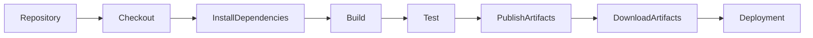

---

## Key Components

| Component | Purpose |
|------------|----------|
| Task | Built-in Azure DevOps operation |
| Step | Executes a task or script |
| Agent | Runs tasks |
| Pipeline | Orchestrates execution |

---

## Types

Frequently used tasks include:

- Checkout
- Script
- Azure CLI
- PowerShell
- Bash
- Publish Pipeline Artifact
- Download Pipeline Artifact

---

## Lifecycle / Workflow

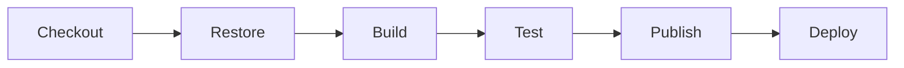

---

## Configuration / Syntax

Example Pipeline

```yaml
steps:

- checkout: self

- script: npm install

- script: npm run build

- script: npm test

- publish: $(Build.ArtifactStagingDirectory)

  artifact: drop
```

---

## Important Commands

Pipeline tasks execute platform-specific commands.

Example:

```bash
dotnet build

mvn package

npm install

terraform apply
```

---

## Important Files

| File | Purpose |
|------|---------|
| azure-pipelines.yml | Pipeline definition |
| Dockerfile | Container builds |
| package.json | Node.js |
| pom.xml | Maven |
| requirements.txt | Python |

---

## Real-World Use Cases

- Build applications
- Deploy Azure resources
- Execute Terraform
- Build Docker images
- Deploy Kubernetes workloads

---

## Advantages

- Automated execution
- Reusable
- Reliable
- Easy maintenance

---

## Limitations

- Complex pipelines require careful task organization

---

## Common Interview Questions (Concept Only)

- What are Pipeline Tasks?
- Difference between Task and Step?
- Which tasks are used most frequently?

---

## Common Mistakes

- Using scripts when built-in tasks exist
- Running tasks in incorrect order
- Hardcoding values

---

## Troubleshooting

| Problem | Solution |
|----------|----------|
| Task failed | Review pipeline logs |
| Task unavailable | Verify task version |
| Authentication failed | Verify Service Connection |

---

## Summary

Pipeline Tasks automate the software delivery process by executing predefined operations in a structured and repeatable manner.

---

# Checkout Source Code

## Overview

The **Checkout** task retrieves the source code from a repository and downloads it to the pipeline agent.

Every Build Pipeline begins by checking out the repository before executing any build or deployment tasks.

> **Interview Point**
>
> By default, Azure DevOps automatically checks out the repository using `checkout: self`.

---

## Why It Is Used

Checkout is required to:

- Download source code
- Access application files
- Start the build process
- Retrieve pipeline configuration

---

## Architecture / Working

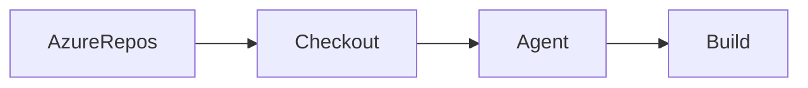

---

## Key Components

| Component | Purpose |
|------------|----------|
| Repository | Stores source code |
| Agent | Downloads repository |
| Working Directory | Local copy of source code |

---

## Lifecycle / Workflow

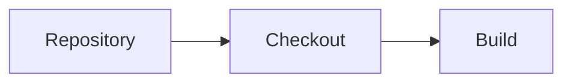

---

## Configuration / Syntax

Default checkout

```yaml
steps:

- checkout: self
```

Disable checkout

```yaml
steps:

- checkout: none
```

Checkout another repository

```yaml
steps:

- checkout: MyRepository
```

---

## Important Commands

Git commands executed internally:

```bash
git clone

git fetch

git checkout
```

---

## Important Files

Downloaded into:

```text
$(Build.SourcesDirectory)
```

---

## Real-World Use Cases

- Build applications
- Terraform execution
- Docker builds
- Kubernetes deployments

---

## Advantages

- Automatic source retrieval
- Supports multiple repositories
- Supports Git authentication

---

## Limitations

- Large repositories increase checkout time

---

## Common Interview Questions (Concept Only)

- What is `checkout: self`?
- Can checkout be disabled?
- Where is the repository downloaded?

---

## Common Mistakes

- Disabling checkout accidentally
- Using incorrect repository names

---

## Troubleshooting

| Problem | Solution |
|----------|----------|
| Checkout failed | Verify repository permissions |
| Repository missing | Verify repository name |

---

## Summary

Checkout retrieves the source code from the repository and prepares the pipeline agent for subsequent tasks.

---

# Install Dependencies

## Overview

Most applications rely on external libraries and packages.

The Install Dependencies task downloads all required packages before the build process begins.

---

## Why It Is Used

Installing dependencies ensures:

- Required libraries are available
- Builds are consistent
- Compilation succeeds
- Dependencies remain version-controlled

---

## Architecture / Working

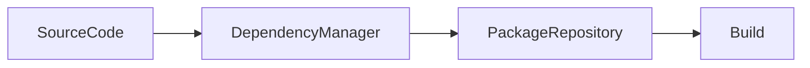

---

## Types

| Platform | Command |
|-----------|----------|
| .NET | `dotnet restore` |
| Node.js | `npm install` |
| Java | `mvn dependency:resolve` |
| Python | `pip install -r requirements.txt` |

---

## Lifecycle / Workflow

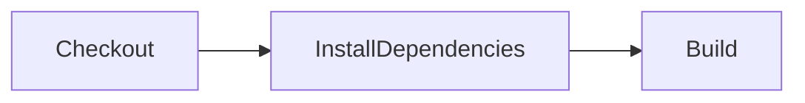

---

## Configuration / Syntax

```yaml
steps:

- script: npm install
```

---

## Important Commands

```bash
npm install

dotnet restore

mvn dependency:resolve

pip install -r requirements.txt
```

---

## Important Files

| File | Purpose |
|------|---------|
| package.json | Node.js dependencies |
| pom.xml | Maven dependencies |
| requirements.txt | Python dependencies |
| *.csproj | .NET dependencies |

---

## Real-World Use Cases

- Web applications
- APIs
- Infrastructure automation

---

## Advantages

- Consistent builds
- Automatic package management

---

## Limitations

- Depends on package repositories

---

## Common Interview Questions (Concept Only)

- Why restore dependencies?
- What happens if dependencies are missing?

---

## Common Mistakes

- Skipping dependency installation
- Using outdated package versions

---

## Troubleshooting

| Problem | Solution |
|----------|----------|
| Package not found | Verify package repository |
| Restore failed | Check internet access and feed permissions |

---

## Summary

Installing dependencies prepares the application for compilation by downloading all required external packages.

---

# Build

## Overview

The Build task compiles source code into executable binaries or deployment packages.

It validates application code before testing and deployment.

---

## Why It Is Used

Build tasks:

- Compile code
- Detect compilation errors
- Generate binaries
- Produce deployable packages

---

## Architecture / Working

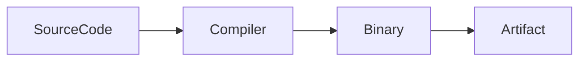

---

## Lifecycle / Workflow

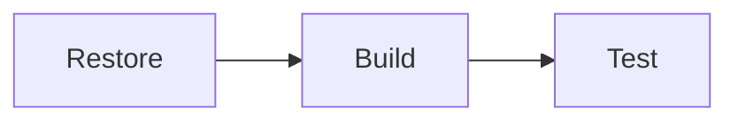

---

## Configuration / Syntax

```yaml
steps:

- script: dotnet build --configuration Release
```

---

## Important Commands

```bash
dotnet build

mvn package

npm run build

go build
```

---

## Important Files

| File | Purpose |
|------|---------|
| *.csproj | .NET project |
| pom.xml | Maven project |
| package.json | Node.js project |

---

## Real-World Use Cases

- Build web applications
- Build APIs
- Build containers

---

## Advantages

- Automated compilation
- Early validation
- Consistent builds

---

## Limitations

- Large projects require more build time

---

## Common Interview Questions (Concept Only)

- What happens during Build?
- Difference between Restore and Build?

---

## Common Mistakes

- Building without restoring dependencies
- Ignoring build warnings

---

## Troubleshooting

| Problem | Solution |
|----------|----------|
| Compilation failed | Review compiler errors |
| SDK missing | Install required SDK |

---

## Summary

The Build task compiles application source code into deployable binaries.

---

# Test

## Overview

The Test task executes automated tests after the application has been successfully built.

Testing validates application quality before deployment.

---

## Why It Is Used

Testing helps:

- Detect defects early
- Validate application behavior
- Prevent faulty deployments
- Improve software quality

---

## Architecture / Working

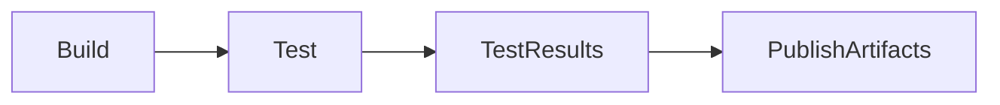

---

## Types

| Test | Purpose |
|------|---------|
| Unit Test | Validate individual components |
| Integration Test | Validate component interaction |
| Functional Test | Validate business functionality |
| Smoke Test | Basic deployment verification |

---

## Lifecycle / Workflow


---

## Configuration / Syntax

```yaml
steps:

- script: dotnet test
```

---

## Important Commands

```bash
dotnet test

mvn test

npm test

pytest
```

---

## Real-World Use Cases

- API validation
- Microservices testing
- Infrastructure testing

---

## Advantages

- Early bug detection
- Better software quality

---

## Limitations

- Poor test coverage reduces effectiveness

---

## Common Interview Questions (Concept Only)

- Why run tests during CI?
- Difference between Unit and Integration Tests?

---

## Common Mistakes

- Skipping automated tests
- Ignoring failed tests

---

## Troubleshooting

| Problem | Solution |
|----------|----------|
| Test failed | Review test results |
| Test framework missing | Install testing tools |

---

## Summary

The Test task validates application quality before artifacts are generated.

---

# Publish Artifacts

## Overview

The Publish Artifacts task stores the output of a successful build so it can be reused by deployment pipelines or downloaded manually.

> **Interview Point**
>
> For Azure Pipelines, **Pipeline Artifacts** are preferred over the legacy **Build Artifacts** because they provide better performance and efficiency.

---

## Why It Is Used

Publishing artifacts:

- Preserves build outputs
- Supports deployments
- Enables rollback
- Implements Build Once, Deploy Many

---

## Architecture / Working

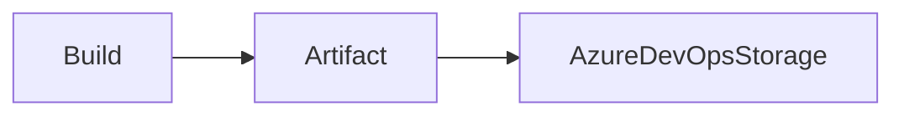

---

## Lifecycle / Workflow

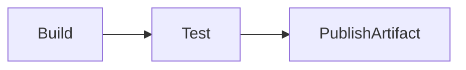

---

## Configuration / Syntax

Publish Pipeline Artifact

```yaml
steps:

- publish: $(Build.ArtifactStagingDirectory)

  artifact: drop
```

Legacy Build Artifact

```yaml
steps:

- task: PublishBuildArtifacts@1

  inputs:

    pathToPublish: '$(Build.ArtifactStagingDirectory)'

    artifactName: 'drop'
```

---

## Important Files

```text
$(Build.ArtifactStagingDirectory)
```

---

## Real-World Use Cases

- Publish web application
- Publish Terraform plan
- Publish Helm chart

---

## Advantages

- Reusable
- Version controlled
- Reliable deployments

---

## Limitations

- Storage management required

---

## Common Interview Questions (Concept Only)

- What is Publish Artifact?
- Why publish artifacts?
- Difference between Build Artifact and Pipeline Artifact?

---

## Common Mistakes

- Publishing temporary files
- Forgetting artifact versioning

---

## Troubleshooting

| Problem | Solution |
|----------|----------|
| Artifact missing | Verify publish task |
| Publish failed | Check staging directory |

---

## Summary

Publishing artifacts stores validated build outputs for later deployment or reuse.

---

# Download Artifacts

## Overview

The Download Artifacts task retrieves previously published artifacts for use in deployment or subsequent pipeline stages.

Deployment pipelines should always consume existing artifacts instead of rebuilding the application.

---

## Why It Is Used

Downloading artifacts:

- Supports Build Once, Deploy Many
- Ensures deployment consistency
- Reduces build time
- Enables rollback

---

## Architecture / Working

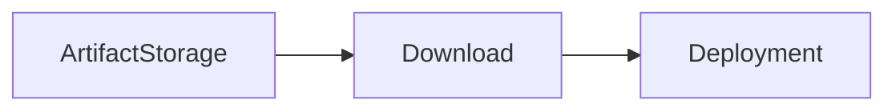

---

## Lifecycle / Workflow

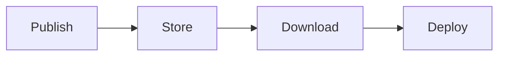

---

## Configuration / Syntax

Download Pipeline Artifact

```yaml
steps:

- download: current

  artifact: drop
```

Task version

```yaml
steps:

- task: DownloadPipelineArtifact@2

  inputs:

    artifact: drop

    path: $(Pipeline.Workspace)
```

---

## Important Files

```text
$(Pipeline.Workspace)
```

---

## Real-World Use Cases

- Production deployment
- Disaster recovery
- Multi-stage pipelines

---

## Advantages

- Faster deployments
- Reliable releases
- Artifact reuse

---

## Limitations

- Requires previously published artifacts

---

## Common Interview Questions (Concept Only)

- Why download artifacts instead of rebuilding?
- Where are downloaded artifacts stored?

---

## Common Mistakes

- Downloading incorrect artifact versions
- Forgetting to publish artifacts before downloading

---

## Troubleshooting

| Problem | Solution |
|----------|----------|
| Download failed | Verify artifact exists |
| Wrong artifact | Check artifact name and build version |

---

## Summary

Downloading artifacts enables deployment pipelines to reuse validated build outputs without recompiling the application.

---

# Azure CLI Task

## Overview

The Azure CLI Task executes Azure CLI commands inside an Azure DevOps pipeline.

It is commonly used for Azure resource management and infrastructure automation.

> **Interview Point**
>
> The Azure CLI Task requires an **Azure Resource Manager (ARM) Service Connection** for authentication.

---

## Why It Is Used

Azure CLI Task enables:

- Azure resource management
- Infrastructure deployment
- Automation
- Resource validation

---

## Architecture / Working

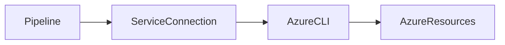

---

## Configuration / Syntax

```yaml
steps:

- task: AzureCLI@2

  inputs:

    azureSubscription: 'Azure-Production'

    scriptType: bash

    scriptLocation: inlineScript

    inlineScript: |

      az group list
```

---

## Important Commands

```bash
az login

az account show

az group list

az vm list
```

---

## Real-World Use Cases

- Create Resource Groups
- Deploy ARM/Bicep templates
- Deploy Terraform
- Manage AKS

---

## Advantages

- Native Azure integration
- Powerful automation
- Cross-platform

---

## Limitations

- Azure-specific
- Requires Azure CLI on self-hosted agents

---

## Common Interview Questions (Concept Only)

- What is Azure CLI Task?
- Why is a Service Connection required?
- When should Azure CLI Task be used?

---

## Common Mistakes

- Using incorrect Service Connection
- Hardcoding Azure credentials

---

## Troubleshooting

| Problem | Solution |
|----------|----------|
| Authentication failed | Verify Service Connection |
| Command failed | Review Azure CLI output |

---

## Summary

Azure CLI Task executes Azure CLI commands securely using a Service Connection for Azure automation.

---

# PowerShell Task

## Overview

The PowerShell Task executes PowerShell scripts during pipeline execution.

It is widely used for Windows administration, Azure automation, deployment scripting, and infrastructure management.

PowerShell can run on:

- Windows
- Linux (PowerShell Core)
- macOS (PowerShell Core)

---

## Why It Is Used

PowerShell Tasks help:

- Automate Windows administration
- Manage Azure resources
- Execute deployment scripts
- Configure infrastructure

---

## Architecture / Working

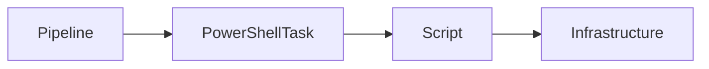

---

## Types

### Inline Script

Script written directly inside YAML.

### File Script

Executes an existing `.ps1` file from the repository.

---

## Configuration / Syntax

Inline

```yaml
steps:

- task: PowerShell@2

  inputs:

    targetType: inline

    script: |

      Write-Host "Hello Azure DevOps"
```

Script File

```yaml
steps:

- task: PowerShell@2

  inputs:

    targetType: filePath

    filePath: scripts/deploy.ps1
```

---

## Important Commands

```powershell
Get-Process

Get-Service

Write-Host

Test-Path
```

---

## Important Files

| File | Purpose |
|------|---------|
| *.ps1 | PowerShell scripts |
| azure-pipelines.yml | Pipeline definition |

---

## Real-World Use Cases

- Windows Server administration
- Azure automation
- IIS deployment
- Infrastructure configuration

---

## Advantages

- Powerful automation
- Excellent Windows integration
- Cross-platform with PowerShell Core

---

## Limitations

- Requires PowerShell availability on the agent

---

## Common Interview Questions (Concept Only)

- What is the PowerShell Task?
- Difference between Inline and File scripts?
- When should PowerShell be preferred over Bash?

---

## Common Mistakes

- Hardcoding credentials
- Using Windows-specific commands on Linux agents

---

## Troubleshooting

| Problem | Solution |
|----------|----------|
| Script failed | Review PowerShell error output |
| File not found | Verify script path |

---

## Summary

The PowerShell Task executes PowerShell scripts for administration, automation, and deployment across supported operating systems.

---

# Bash Task

## Overview

The Bash Task executes Bash shell scripts during pipeline execution.

It is commonly used for Linux administration, Docker, Kubernetes, Terraform, and cloud automation.

---

## Why It Is Used

Bash Tasks help:

- Automate Linux operations
- Execute shell scripts
- Manage containers
- Deploy Kubernetes applications
- Automate cloud infrastructure

---

## Architecture / Working

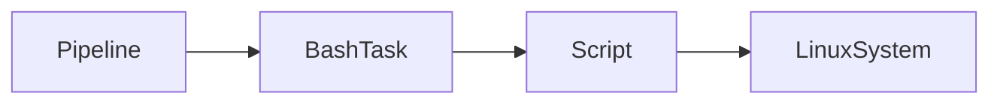

---

## Types

### Inline Script

Commands written directly in YAML.

### Script File

Executes an existing `.sh` file.

---

## Configuration / Syntax

Inline

```yaml
steps:

- task: Bash@3

  inputs:

    targetType: inline

    script: |

      echo "Hello Azure DevOps"
```

Script File

```yaml
steps:

- task: Bash@3

  inputs:

    targetType: filePath

    filePath: scripts/deploy.sh
```

---

## Important Commands

```bash
ls

pwd

chmod

docker build

kubectl apply

terraform apply
```

---

## Important Files

| File | Purpose |
|------|---------|
| *.sh | Bash scripts |
| azure-pipelines.yml | Pipeline definition |

---

## Real-World Use Cases

- Linux automation
- Docker builds
- Kubernetes deployments
- Terraform execution
- CI/CD scripting

---

## Advantages

- Lightweight
- Fast execution
- Excellent Linux support
- Widely used in DevOps

---

## Limitations

- Requires Bash on the agent
- Platform-specific commands may not work on Windows without an appropriate shell

---

## Common Interview Questions (Concept Only)

- What is the Bash Task?
- Difference between Bash and PowerShell Tasks?
- When should Bash be preferred?

---

## Common Mistakes

- Using Windows commands in Bash scripts
- Missing execute permissions on `.sh` files
- Hardcoding secrets in scripts

---

## Troubleshooting

| Problem | Solution |
|----------|----------|
| Permission denied | Run `chmod +x` on the script or configure execute permissions |
| Command not found | Verify required tools are installed on the agent |
| Script failed | Review Bash logs and exit codes |

---

## Summary

The Bash Task executes shell scripts for Linux and cloud automation, making it one of the most commonly used tasks in Azure DevOps pipelines for containerization, infrastructure, and deployment workflows.
