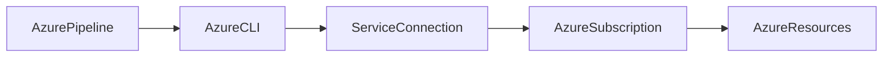

# Infrastructure Deployment

## Overview

Infrastructure Deployment is the process of provisioning, configuring, and managing cloud infrastructure automatically using **Infrastructure as Code (IaC)**.

Instead of manually creating Azure resources through the Azure Portal, IaC allows infrastructure to be defined in code and deployed repeatedly through Azure DevOps pipelines.

Infrastructure Deployment commonly provisions:

- Resource Groups
- Virtual Networks
- Virtual Machines
- Azure App Services
- Azure Kubernetes Service (AKS)
- Azure SQL Database
- Storage Accounts
- Azure Container Registry (ACR)
- Azure Key Vault
- Load Balancers

> **Interview Point**
>
> Modern DevOps follows the principle of **Infrastructure as Code (IaC)**, where infrastructure is version-controlled, automated, repeatable, and consistent.

---

## Why It Is Used

Infrastructure Deployment helps organizations:

- Automate infrastructure provisioning
- Eliminate manual configuration errors
- Ensure consistency across environments
- Enable version control for infrastructure
- Support disaster recovery
- Improve scalability

---

## Architecture / Working


---

## Key Components

| Component | Purpose |
|------------|----------|
| Azure DevOps Pipeline | Executes deployment |
| Service Connection | Authentication |
| IaC Template | Infrastructure definition |
| Azure Subscription | Deployment target |
| Azure Resources | Infrastructure created |

---

## Types

| Deployment Type | Tool |
|-----------------|------|
| ARM Templates | Native Azure JSON |
| Bicep | Azure DSL |
| Terraform | Multi-cloud IaC |
| Azure CLI | Script-based deployment |

---

## Lifecycle / Workflow


---

## Configuration / Syntax

Example deployment stage

```yaml
stages:

- stage: DeployInfrastructure

  jobs:

  - job: Deploy

    steps:

    - task: AzureCLI@2
```

---

## Important Commands

```bash
az deployment group create

az deployment sub create

terraform init

terraform plan

terraform apply
```

---

## Important Files

| File | Purpose |
|------|---------|
| azure-pipelines.yml | Pipeline definition |
| main.bicep | Bicep template |
| template.json | ARM template |
| main.tf | Terraform configuration |

---

## Real-World Use Cases

- Provision Azure infrastructure
- Disaster recovery
- Environment provisioning
- CI/CD infrastructure automation
- Multi-environment deployments

---

## Advantages

- Automated deployments
- Repeatable infrastructure
- Version controlled
- Reduced manual effort
- Faster provisioning

---

## Limitations

- Requires IaC knowledge
- Incorrect templates can affect multiple resources
- State management required for Terraform

---

## Common Interview Questions (Concept Only)

- What is Infrastructure as Code (IaC)?
- Why automate infrastructure deployment?
- What tools are commonly used?
- Why is IaC important in DevOps?

---

## Common Mistakes

- Manual infrastructure changes causing configuration drift
- Hardcoding resource names
- Not validating templates before deployment
- Deploying directly to Production without testing

---

## Troubleshooting

| Problem | Solution |
|----------|----------|
| Deployment failed | Review deployment logs |
| Authentication failed | Verify Service Connection |
| Resource already exists | Verify resource names and deployment mode |
| Permission denied | Check Azure RBAC assignments |

---

## Summary

Infrastructure Deployment automates Azure resource provisioning using Infrastructure as Code, enabling repeatable, secure, and consistent cloud environments.

---

# ARM Template Deployment

## Overview

**Azure Resource Manager (ARM) Templates** are JSON-based Infrastructure as Code (IaC) files used to define and deploy Azure resources declaratively.

An ARM template describes the desired infrastructure state, and Azure Resource Manager provisions the resources accordingly.

> **Interview Point**
>
> ARM Templates are **declarative**, meaning you specify **what** infrastructure you want, not **how** to create it.

---

## Why It Is Used

ARM Templates help:

- Automate Azure deployments
- Standardize infrastructure
- Enable repeatable deployments
- Support version control
- Reduce manual configuration

---

## Architecture / Working


---

## Key Components

| Component | Purpose |
|------------|----------|
| Template | Infrastructure definition |
| Parameters | User inputs |
| Variables | Reusable values |
| Resources | Azure resources |
| Outputs | Deployment results |

---

## Lifecycle / Workflow


---

## Configuration / Syntax

```json
{
  "$schema": "https://schema.management.azure.com/schemas/2019-04-01/deploymentTemplate.json#",
  "resources": []
}
```

Pipeline task

```yaml
- task: AzureResourceManagerTemplateDeployment@3
```

---

## Important Commands

Validate

```bash
az deployment group validate
```

Deploy

```bash
az deployment group create
```

---

## Important Files

| File | Purpose |
|------|---------|
| template.json | ARM template |
| parameters.json | Input values |
| azure-pipelines.yml | Pipeline |

---

## Real-World Use Cases

- Virtual Machines
- Storage Accounts
- Virtual Networks
- Azure App Service
- AKS

---

## Advantages

- Native Azure support
- Declarative syntax
- Idempotent deployments
- Azure integration

---

## Limitations

- JSON syntax is verbose
- Difficult to maintain large templates
- Azure-specific

---

## Common Interview Questions (Concept Only)

- What is an ARM Template?
- What is declarative deployment?
- Difference between Parameters and Variables?
- Difference between Incremental and Complete deployment modes?

---

## Common Mistakes

- Hardcoding values
- Not parameterizing templates
- Deploying in Complete mode unintentionally

---

## Troubleshooting

| Problem | Solution |
|----------|----------|
| Validation failed | Check JSON syntax |
| Deployment failed | Review ARM deployment logs |
| Missing parameters | Verify parameter file |

---

## Summary

ARM Templates provide a native Azure Infrastructure as Code solution for consistent and automated resource deployments.

---

# Bicep Deployment

## Overview

Bicep is Microsoft's modern Infrastructure as Code language for Azure.

It simplifies ARM template development by replacing complex JSON with a concise, readable syntax.

Bicep compiles into ARM Templates before deployment.

> **Interview Point**
>
> Bicep is **not a replacement for ARM**. It is a higher-level language that transpiles into ARM Templates.

---

## Why It Is Used

Bicep provides:

- Simpler syntax
- Better readability
- Easier maintenance
- Native Azure integration
- Modular templates

---

## Architecture / Working


---

## Key Components

| Component | Purpose |
|------------|----------|
| Resource | Azure resource |
| Parameter | User input |
| Variable | Reusable value |
| Module | Reusable template |

---

## Lifecycle / Workflow


---

## Configuration / Syntax

```bicep
resource storage 'Microsoft.Storage/storageAccounts@2023-01-01' = {
  name: 'demostorage'
  location: resourceGroup().location
  sku: {
    name: 'Standard_LRS'
  }
}
```

Deploy

```bash
az deployment group create \
  --resource-group DemoRG \
  --template-file main.bicep
```

---

## Important Commands

Compile

```bash
bicep build
```

Deploy

```bash
az deployment group create
```

Validate

```bash
az deployment group validate
```

---

## Important Files

| File | Purpose |
|------|---------|
| main.bicep | Infrastructure definition |
| parameters.json | Parameter values |
| azure-pipelines.yml | Pipeline |

---

## Real-World Use Cases

- Azure infrastructure
- AKS deployment
- Networking
- Azure SQL
- Storage

---

## Advantages

- Cleaner syntax
- Easier to read
- Native Azure support
- Modular design
- Generates ARM automatically

---

## Limitations

- Azure-only
- Requires Bicep CLI or Azure CLI with Bicep support

---

## Common Interview Questions (Concept Only)

- What is Bicep?
- Difference between ARM and Bicep?
- Why is Bicep preferred?
- Does Azure deploy Bicep directly?

---

## Common Mistakes

- Assuming Bicep is multi-cloud
- Hardcoding values instead of parameters
- Not organizing reusable modules

---

## Troubleshooting

| Problem | Solution |
|----------|----------|
| Compilation failed | Check Bicep syntax |
| Deployment failed | Validate template |
| Module error | Verify module paths |

---

## Summary

Bicep simplifies Azure Infrastructure as Code by providing a modern language that compiles into ARM Templates.

---

# Terraform Integration

## Overview

Terraform is an open-source Infrastructure as Code tool developed by HashiCorp.

Unlike ARM and Bicep, Terraform supports multiple cloud providers, including:

- Azure
- AWS
- Google Cloud
- Oracle Cloud
- VMware

Azure DevOps integrates with Terraform to provision and manage Azure infrastructure automatically.

> **Interview Point**
>
> Terraform is **cloud-agnostic**, while ARM and Bicep are **Azure-specific**.

---

## Why It Is Used

Terraform helps:

- Provision infrastructure
- Manage infrastructure lifecycle
- Support multiple cloud providers
- Maintain infrastructure state
- Enable reusable modules

---

## Architecture / Working


---

## Key Components

| Component | Purpose |
|------------|----------|
| Provider | Cloud integration |
| Resource | Infrastructure object |
| Module | Reusable configuration |
| State File | Tracks infrastructure |
| Backend | Stores state remotely |

---

## Lifecycle / Workflow


---

## Configuration / Syntax

```hcl
provider "azurerm" {
  features {}
}

resource "azurerm_resource_group" "demo" {
  name     = "DemoRG"
  location = "East US"
}
```

Pipeline example

```yaml
steps:

- script: terraform init

- script: terraform plan

- script: terraform apply -auto-approve
```

---

## Important Commands

```bash
terraform init

terraform validate

terraform fmt

terraform plan

terraform apply

terraform destroy
```

---

## Important Files

| File | Purpose |
|------|---------|
| main.tf | Infrastructure |
| variables.tf | Variables |
| outputs.tf | Outputs |
| terraform.tfvars | Variable values |
| terraform.tfstate | Infrastructure state |

---

## Real-World Use Cases

- Multi-cloud deployments
- Azure infrastructure
- Kubernetes
- Networking
- Disaster recovery

---

## Advantages

- Multi-cloud
- Modular
- Large community
- State management
- Reusable infrastructure

---

## Limitations

- State file management
- Additional tooling
- Provider version compatibility

---

## Common Interview Questions (Concept Only)

- What is Terraform?
- Difference between Terraform and Bicep?
- What is the Terraform State File?
- Why is remote state recommended?

---

## Common Mistakes

- Storing state locally in team environments
- Not securing state files
- Running `terraform apply` without reviewing the plan
- Manual infrastructure changes causing state drift

---

## Troubleshooting

| Problem | Solution |
|----------|----------|
| State lock | Release lock or investigate active operations |
| Provider error | Update provider version |
| Authentication failed | Verify Service Connection or Azure credentials |

---

## Summary

Terraform is a cloud-agnostic Infrastructure as Code tool that integrates with Azure DevOps to automate and manage infrastructure deployments consistently across multiple cloud platforms.

---

# Azure CLI Deployment

## Overview

Azure CLI Deployment uses Azure CLI commands within Azure DevOps pipelines to provision, configure, and manage Azure resources.

It is commonly used for:

- Infrastructure deployment
- Resource management
- Automation
- Operational tasks

Unlike ARM, Bicep, or Terraform, Azure CLI is **imperative**, meaning you specify the sequence of commands to execute.

> **Interview Point**
>
> Azure CLI is **imperative**, whereas ARM, Bicep, and Terraform are primarily **declarative**.

---

## Why It Is Used

Azure CLI Deployment enables:

- Quick automation
- Resource management
- Script-based deployments
- Operational tasks
- Integration with existing shell scripts

---

## Architecture / Working



---

## Key Components

| Component | Purpose |
|------------|----------|
| Azure CLI Task | Executes CLI commands |
| Service Connection | Authentication |
| Azure CLI | Resource management |
| Azure Subscription | Deployment target |

---

## Lifecycle / Workflow


---

## Configuration / Syntax

```yaml
steps:

- task: AzureCLI@2

  inputs:

    azureSubscription: Azure-Production

    scriptType: bash

    scriptLocation: inlineScript

    inlineScript: |

      az group create \
        --name DemoRG \
        --location eastus
```

---

## Important Commands

Login

```bash
az login
```

Resource Group

```bash
az group create
```

Virtual Machine

```bash
az vm create
```

Storage Account

```bash
az storage account create
```

Deploy Bicep

```bash
az deployment group create \
  --template-file main.bicep
```

Deploy ARM Template

```bash
az deployment group create \
  --template-file template.json
```

---

## Important Files

| File | Purpose |
|------|---------|
| azure-pipelines.yml | Pipeline definition |
| *.sh | Bash scripts |
| *.ps1 | PowerShell scripts |

---

## Real-World Use Cases

- Provision Azure resources
- Deploy Bicep templates
- Deploy ARM templates
- Manage AKS
- Configure Azure networking
- Perform operational automation

---

## Advantages

- Simple scripting
- Native Azure support
- Extensive command coverage
- Cross-platform

---

## Limitations

- Imperative approach can become difficult to maintain for large infrastructures
- Scripts require careful error handling and idempotency considerations

---

## Common Interview Questions (Concept Only)

- What is Azure CLI Deployment?
- Difference between Azure CLI and ARM deployment?
- When should Azure CLI be used instead of Terraform or Bicep?
- Why does Azure CLI Task require a Service Connection?

---

## Common Mistakes

- Hardcoding credentials in scripts
- Ignoring command exit codes
- Using CLI scripts for large, repeatable infrastructure instead of IaC templates
- Not validating Azure CLI version compatibility

---

## Troubleshooting

| Problem | Solution |
|----------|----------|
| Authentication failed | Verify Azure Resource Manager Service Connection |
| Command failed | Review Azure CLI output and error messages |
| Resource already exists | Check resource names or use idempotent deployment patterns |
| Permission denied | Verify Azure RBAC assignments |

---

## Summary

Azure CLI Deployment automates Azure resource provisioning and management through script-based commands, making it well suited for operational automation, lightweight deployments, and integration with Azure DevOps pipelines. For large-scale, repeatable infrastructure provisioning, ARM, Bicep, or Terraform are generally preferred.
