# Azure Boards

## Overview

Azure Boards is the **work management and project planning service** in Azure DevOps. It helps teams plan, track, prioritize, and manage software development work using Agile, Scrum, or Kanban methodologies.

Azure Boards integrates seamlessly with:

- Azure Repos
- Azure Pipelines
- Azure Test Plans
- GitHub
- Microsoft Teams

It enables teams to:

- Track requirements
- Manage work items
- Plan sprints
- Monitor progress
- Link code changes to work items
- Improve collaboration

> **Interview Point**
>
> Azure Boards is **not a project management tool like Microsoft Project**. It is an Agile work tracking tool tightly integrated with the DevOps lifecycle.

---

## Why It Is Used

Azure Boards helps organizations:

- Plan software development
- Track project progress
- Prioritize work
- Improve team collaboration
- Manage Agile workflows
- Link development work with code deployments

---

## Architecture / Working

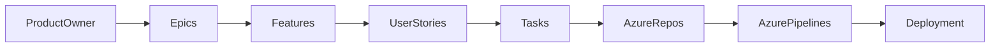

---

## Key Components

| Component | Purpose |
|------------|----------|
| Work Item | Unit of work |
| Epic | Large business objective |
| Feature | Functional capability |
| User Story | User requirement |
| Task | Development activity |
| Sprint | Time-boxed iteration |
| Board | Visual workflow |
| Backlog | Prioritized work list |

---

## Types

Azure Boards supports:

- Agile
- Scrum
- Basic
- CMMI

Each process uses different work item types.

---

## Lifecycle / Workflow

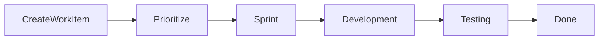

---

## Configuration / Syntax

Azure Boards is primarily configured through the Azure DevOps web portal.

Common integrations include:

- Commit messages referencing work items:

```text
Fixes AB#123
```

- Pull Request linking:

```text
Implements AB#456
```

---

## Important Commands

Azure CLI examples

List work items

```bash
az boards work-item list
```

Show work item

```bash
az boards work-item show --id 101
```

Create work item

```bash
az boards work-item create
```

---

## Important Files

Azure Boards does not require configuration files.

Common integration files:

| File | Purpose |
|------|---------|
| azure-pipelines.yml | Pipeline integration |
| README.md | Project documentation |

---

## Real-World Use Cases

- Sprint planning
- Agile project management
- Release planning
- Requirement tracking
- Bug tracking

---

## Advantages

- Agile planning
- Excellent Azure DevOps integration
- Easy work tracking
- Custom workflows
- End-to-end traceability

---

## Limitations

- Requires Agile understanding
- Customization can become complex
- Less suitable for non-Agile project management

---

## Common Interview Questions (Concept Only)

- What is Azure Boards?
- Why use Azure Boards?
- Which Agile methodologies are supported?
- How does Azure Boards integrate with Azure Repos?

---

## Common Mistakes

- Creating work items without priorities
- Not linking commits to work items
- Ignoring sprint planning
- Overcomplicating workflows

---

## Troubleshooting

| Problem | Solution |
|----------|----------|
| Work item missing | Verify permissions |
| Sprint not visible | Check team configuration |
| Commit not linked | Verify AB# syntax |
| Board not updating | Refresh queries and board filters |

---

## Summary

Azure Boards is Azure DevOps' Agile planning solution that manages requirements, development work, sprint planning, and project tracking while integrating with the complete DevOps lifecycle.

---

# Work Items

## Overview

A Work Item is the fundamental unit of work in Azure Boards.

Everything tracked within Azure Boards is represented as a Work Item.

Examples:

- Epic
- Feature
- User Story
- Task
- Bug
- Issue

Each Work Item contains information such as:

- Title
- Description
- Assigned user
- State
- Priority
- Tags
- Comments
- Links

> **Interview Point**
>
> Every activity in Azure Boards starts with a Work Item.

---

## Why It Is Used

Work Items help:

- Track requirements
- Assign responsibilities
- Monitor progress
- Maintain project history
- Enable reporting

---

## Architecture / Working

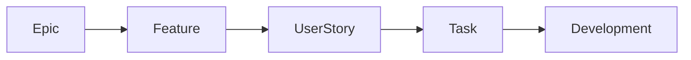

---

## Key Components

| Component | Purpose |
|------------|----------|
| Title | Name |
| Description | Details |
| State | Workflow status |
| Assigned To | Owner |
| Priority | Importance |
| Tags | Classification |

---

## Types

Common Work Item types:

- Epic
- Feature
- User Story
- Task
- Bug

---

## Lifecycle / Workflow

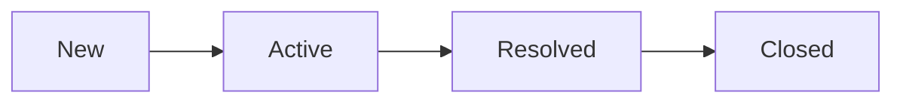

---

## Configuration / Syntax

Reference work item

```text
AB#123
```

---

## Important Commands

```bash
az boards work-item create

az boards work-item show

az boards work-item update
```

---

## Important Files

No configuration files required.

---

## Real-World Use Cases

- Requirement tracking
- Bug tracking
- Sprint planning
- Project reporting

---

## Advantages

- Organized work management
- Easy collaboration
- Complete traceability

---

## Limitations

- Poorly maintained work items reduce project visibility

---

## Common Interview Questions (Concept Only)

- What is a Work Item?
- What information does a Work Item contain?
- Can Work Items be linked?

---

## Common Mistakes

- Missing descriptions
- Incorrect priorities
- Not assigning owners

---

## Troubleshooting

| Problem | Solution |
|----------|----------|
| Work item missing | Check permissions |
| Incorrect status | Review workflow |

---

## Summary

Work Items are the foundation of Azure Boards and represent every requirement, task, or issue tracked during software development.

---

# Epics

## Overview

An Epic is the highest-level work item in Azure Boards.

It represents a large business objective that typically spans multiple releases or sprints.

An Epic is broken down into multiple Features.

Example:

Epic:

> Build an E-Commerce Platform

Features:

- User Authentication
- Shopping Cart
- Payment System

---

## Why It Is Used

Epics help:

- Define long-term business goals
- Organize major initiatives
- Group related Features
- Track large projects

---

## Architecture / Working

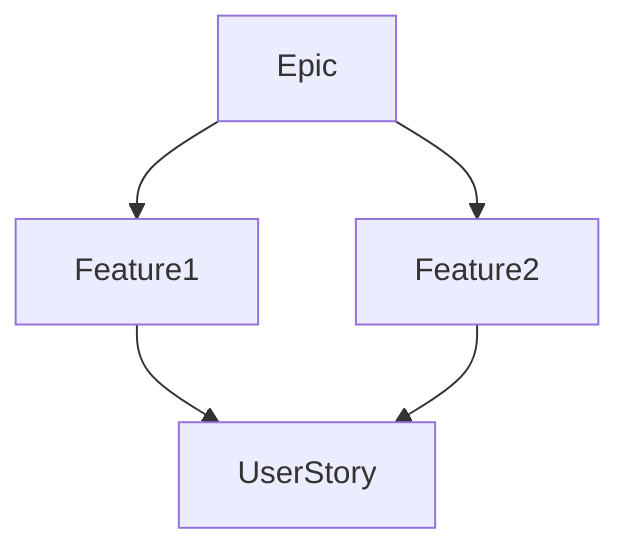

---

## Key Components

| Component | Purpose |
|------------|----------|
| Business Goal | Large objective |
| Feature Collection | Related functionality |

---

## Lifecycle / Workflow

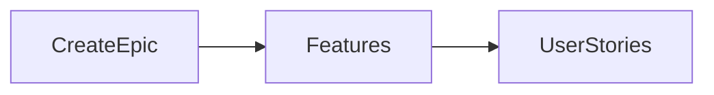

---

## Real-World Use Cases

- ERP implementation
- Banking platform
- Cloud migration
- DevOps transformation

---

## Advantages

- High-level planning
- Better organization
- Business visibility

---

## Limitations

- Not suitable for daily work tracking

---

## Common Interview Questions (Concept Only)

- What is an Epic?
- Difference between Epic and Feature?
- Can an Epic contain multiple Features?

---

## Common Mistakes

- Making Epics too small
- Tracking development tasks directly under an Epic

---

## Troubleshooting

| Problem | Solution |
|----------|----------|
| Epic difficult to manage | Break it into smaller Features |

---

## Summary

Epics represent large business initiatives that are decomposed into Features for implementation.

---

# Features

## Overview

A Feature represents a major functional capability required to achieve an Epic.

Features group related User Stories.

Example:

Epic:

Online Banking

Features:

- Login
- Fund Transfer
- Bill Payment

---

## Why It Is Used

Features help:

- Organize functionality
- Improve planning
- Track implementation progress

---

## Architecture / Working

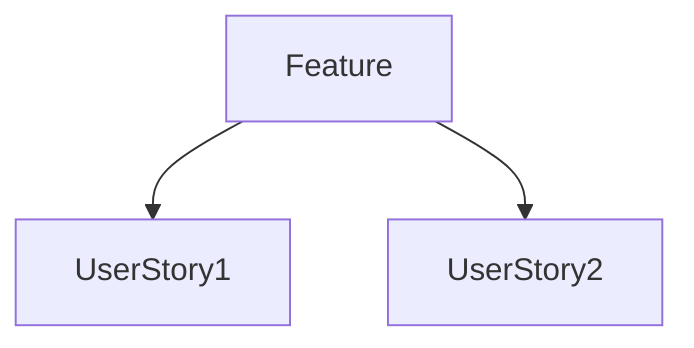

---

## Key Components

| Component | Purpose |
|------------|----------|
| Functionality | Business capability |
| User Stories | Implementation details |

---

## Lifecycle / Workflow

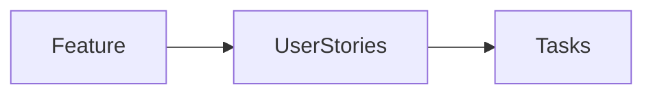

---

## Real-World Use Cases

- Authentication
- Reporting
- Payment Gateway
- Notification System

---

## Advantages

- Functional organization
- Better planning

---

## Limitations

- Should not become too large

---

## Common Interview Questions (Concept Only)

- What is a Feature?
- Difference between Feature and User Story?

---

## Common Mistakes

- Making Features equivalent to Epics
- Mixing unrelated User Stories

---

## Troubleshooting

| Problem | Solution |
|----------|----------|
| Feature too large | Split into smaller Features |

---

## Summary

Features organize related User Stories into meaningful functional capabilities.

---

# User Stories

## Overview

A User Story represents a requirement from the end user's perspective.

Typical format:

> **As a** Customer  
> **I want** to reset my password  
> **So that** I can regain access to my account.

User Stories are implemented through one or more Tasks.

---

## Why It Is Used

User Stories help:

- Capture customer requirements
- Improve communication
- Focus on business value

---

## Architecture / Working

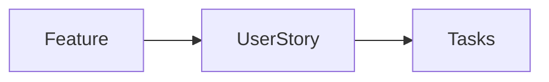

---

## Key Components

| Component | Purpose |
|------------|----------|
| User | Who |
| Requirement | What |
| Business Value | Why |

---

## Lifecycle / Workflow

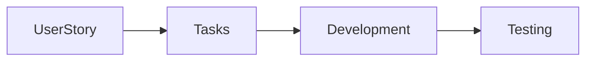

---

## Real-World Use Cases

- Login functionality
- Search functionality
- Shopping cart

---

## Advantages

- User-focused
- Easy prioritization
- Agile-friendly

---

## Limitations

- Requires good acceptance criteria

---

## Common Interview Questions (Concept Only)

- What is a User Story?
- Difference between Feature and User Story?
- How are User Stories written?

---

## Common Mistakes

- Writing technical tasks as User Stories
- Missing acceptance criteria

---

## Troubleshooting

| Problem | Solution |
|----------|----------|
| Story unclear | Improve description and acceptance criteria |

---

## Summary

User Stories describe user requirements and form the basis of Agile development.

---

# Tasks

## Overview

Tasks are the smallest work items in Azure Boards.

They represent the technical work required to complete a User Story.

Example:

User Story:

Implement Login

Tasks:

- Create Login API
- Create Database Table
- Write Unit Tests
- Deploy to QA

---

## Why It Is Used

Tasks help:

- Divide work
- Assign developers
- Track implementation progress

---

## Architecture / Working

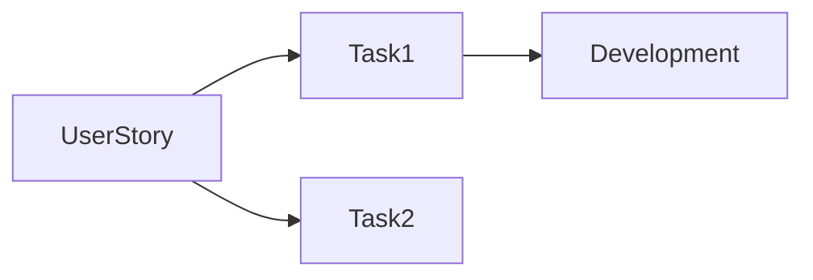

---

## Key Components

| Component | Purpose |
|------------|----------|
| Assigned User | Developer |
| Remaining Work | Time estimate |
| Status | Progress |

---

## Lifecycle / Workflow


---

## Real-World Use Cases

- Coding
- Testing
- Documentation
- Deployment

---

## Advantages

- Detailed tracking
- Better estimation

---

## Limitations

- Too many tasks increase management overhead

---

## Common Interview Questions (Concept Only)

- What is a Task?
- Difference between Task and User Story?

---

## Common Mistakes

- Creating overly large tasks
- Missing time estimates

---

## Troubleshooting

| Problem | Solution |
|----------|----------|
| Task overdue | Re-estimate or split the task |

---

## Summary

Tasks represent the technical implementation work required to complete User Stories.

---

# Backlogs

## Overview

A Backlog is a prioritized list of pending work items that have not yet been completed.

The Product Owner continuously updates and prioritizes the backlog based on business value.

Backlogs typically contain:

- Epics
- Features
- User Stories
- Bugs

---

## Why It Is Used

Backlogs help:

- Prioritize work
- Plan future sprints
- Manage project scope

---

## Architecture / Working

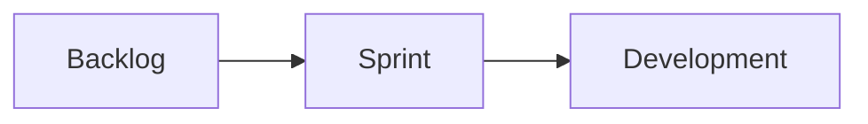

---

## Key Components

| Component | Purpose |
|------------|----------|
| Priority | Order |
| Work Items | Planned work |

---

## Lifecycle / Workflow

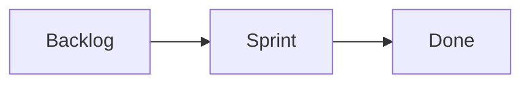

---

## Real-World Use Cases

- Sprint planning
- Product roadmap
- Requirement prioritization

---

## Advantages

- Better planning
- Flexible prioritization

---

## Limitations

- Requires continuous refinement

---

## Common Interview Questions (Concept Only)

- What is a Backlog?
- Who manages the Backlog?
- Difference between Product Backlog and Sprint Backlog?

---

## Common Mistakes

- Keeping outdated backlog items
- Ignoring prioritization

---

## Troubleshooting

| Problem | Solution |
|----------|----------|
| Backlog too large | Groom and reprioritize regularly |

---

## Summary

The Backlog is the prioritized queue of work items waiting to be implemented.

---

# Boards

## Overview

Boards provide a visual Kanban view of work items as they move through the development workflow.

Typical columns:

- New
- Active
- Resolved
- Closed

---

## Why It Is Used

Boards help:

- Visualize workflow
- Track progress
- Identify bottlenecks

---

## Architecture / Working


---

## Key Components

| Component | Purpose |
|------------|----------|
| Columns | Workflow stages |
| Cards | Work Items |
| Swimlanes | Priority grouping |

---

## Lifecycle / Workflow


---

## Real-World Use Cases

- Daily stand-ups
- Kanban workflow
- Sprint tracking

---

## Advantages

- Visual tracking
- Easy collaboration

---

## Limitations

- Requires regular updates

---

## Common Interview Questions (Concept Only)

- What is an Azure Board?
- Difference between Board and Backlog?
- What is Kanban?

---

## Common Mistakes

- Not updating work item status
- Too many workflow columns

---

## Troubleshooting

| Problem | Solution |
|----------|----------|
| Cards missing | Check filters and board queries |

---

## Summary

Boards provide a visual workflow that helps teams monitor and manage work efficiently.

---

# Sprints

## Overview

A Sprint is a fixed time-boxed iteration during which a team completes a selected set of work items from the backlog.

Typical Sprint duration:

- 1 week
- 2 weeks (most common)
- 3 weeks
- 4 weeks

During Sprint Planning, the team selects work items from the Product Backlog to form the Sprint Backlog.

---

## Why It Is Used

Sprints help:

- Deliver software regularly
- Improve planning
- Measure velocity
- Reduce project risk

---

## Architecture / Working

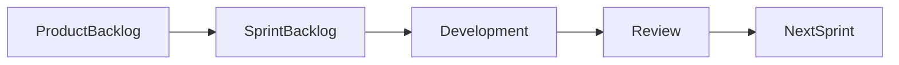

---

## Key Components

| Component | Purpose |
|------------|----------|
| Sprint Goal | Objective |
| Sprint Backlog | Selected work |
| Capacity | Team workload |
| Velocity | Completed work |

---

## Lifecycle / Workflow

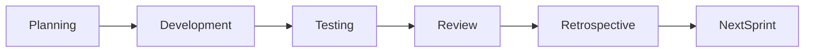

---

## Real-World Use Cases

- Agile development
- Scrum teams
- Continuous delivery

---

## Advantages

- Predictable delivery
- Better planning
- Continuous improvement

---

## Limitations

- Requires disciplined planning
- Scope changes should be minimized during an active sprint

---

## Common Interview Questions (Concept Only)

- What is a Sprint?
- Difference between Product Backlog and Sprint Backlog?
- What happens during Sprint Planning?
- What is Sprint Velocity?
- What is the typical Sprint duration?

---

## Common Mistakes

- Overcommitting work
- Adding new work during the Sprint without proper planning
- Ignoring Sprint Reviews and Retrospectives

---

## Troubleshooting

| Problem | Solution |
|----------|----------|
| Sprint goals not achieved | Review estimates, team capacity, and blockers |
| Velocity inconsistent | Improve estimation and backlog refinement |

---

## Summary

Sprints are short, fixed-duration iterations that help Agile teams deliver software incrementally while continuously planning, reviewing, and improving their development process.
