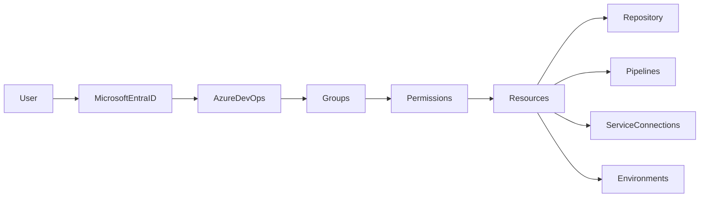

# Security & Access Control

## Overview

Security & Access Control in Azure DevOps is the process of controlling **who can access Azure DevOps resources and what actions they are allowed to perform**.

Azure DevOps uses **Azure Active Directory (Microsoft Entra ID)** and **Role-Based Access Control (RBAC)** to secure resources such as:

- Organizations
- Projects
- Repositories
- Pipelines
- Service Connections
- Environments
- Agent Pools
- Artifacts

The primary security principle is **Least Privilege**, meaning users should receive only the permissions necessary to perform their job.

> **Interview Point**
>
> Authentication verifies **who the user is**, while Authorization determines **what the user is allowed to do**.

---

## Why It Is Used

Security & Access Control helps organizations:

- Protect source code
- Secure deployment pipelines
- Prevent unauthorized access
- Protect production infrastructure
- Meet compliance requirements
- Enable auditability

---

## Architecture / Working



---

## Key Components

| Component | Purpose |
|------------|----------|
| Microsoft Entra ID | User authentication |
| Users | Individual identities |
| Groups | Collection of users |
| Roles | Permission sets |
| Permissions | Allowed actions |
| Service Connections | Secure external authentication |
| Repository Security | Source code protection |
| Pipeline Security | CI/CD protection |

---

## Types

Security is commonly applied at:

| Level | Purpose |
|--------|----------|
| Organization | Global administration |
| Project | Team-level access |
| Repository | Source code access |
| Pipeline | Build and deployment access |
| Service Connection | Azure authentication |
| Environment | Deployment protection |

---

## Lifecycle / Workflow


---

## Configuration / Syntax

Security is primarily configured through the Azure DevOps portal.

Azure CLI example

```bash
az devops configure
```

---

## Important Commands

```bash
az devops login

az devops configure

az repos policy list

az repos permission
```

---

## Important Files

Azure DevOps security is managed through the portal and Microsoft Entra ID. No configuration files are required.

---

## Real-World Use Cases

- Restrict Production deployments
- Limit repository access
- Secure Service Connections
- Protect build pipelines
- Enforce least privilege

---

## Advantages

- Granular permissions
- Secure deployments
- Better compliance
- Complete audit trail
- Integration with Microsoft Entra ID

---

## Limitations

- Permission inheritance can become difficult to troubleshoot
- Complex environments require careful permission planning

---

## Common Interview Questions (Concept Only)

- What is Azure DevOps Security?
- Difference between Authentication and Authorization?
- What is Least Privilege?
- How does Azure DevOps integrate with Microsoft Entra ID?
- Where are permissions assigned?

---

## Common Mistakes

- Granting Project Administrator rights unnecessarily
- Giving Contributor access to production pipelines
- Sharing personal accounts
- Not reviewing permissions regularly

---

## Troubleshooting

| Problem | Solution |
|----------|----------|
| User cannot access project | Verify group membership and project permissions |
| Pipeline access denied | Review pipeline security settings |
| Repository access denied | Check repository permissions |
| Service Connection unavailable | Verify authorization and user permissions |

---

## Summary

Azure DevOps Security & Access Control protects development resources by combining Microsoft Entra ID authentication, RBAC, and granular permissions to secure repositories, pipelines, environments, and service connections.

---

# Users & Groups

## Overview

Azure DevOps manages access through **Users** and **Groups**.

Instead of assigning permissions individually, organizations typically grant permissions to groups, and users inherit those permissions through group membership.

This approach simplifies administration and supports consistent security.

> **Interview Point**
>
> In production environments, permissions should be assigned to **Groups**, not directly to individual users.

---

## Why It Is Used

Users & Groups help:

- Simplify permission management
- Improve scalability
- Reduce administrative effort
- Standardize access control

---

## Architecture / Working


---

## Key Components

| Component | Purpose |
|------------|----------|
| User | Individual identity |
| Group | Collection of users |
| Membership | Assigns users to groups |
| Permission | Determines allowed actions |

---

## Types

### Built-in Groups

- Project Administrators
- Contributors
- Readers
- Build Administrators
- Release Administrators

### Custom Groups

Organizations can create custom groups with specific permissions.

---

## Lifecycle / Workflow


---

## Configuration / Syntax

Managed through:

- Organization Settings
- Project Settings
- Microsoft Entra ID

---

## Important Commands

```bash
az devops user add

az devops user list
```

---

## Real-World Use Cases

- Developers
- QA teams
- DevOps Engineers
- Security teams
- External contractors

---

## Advantages

- Easier administration
- Consistent permissions
- Better scalability

---

## Limitations

- Nested group structures can become difficult to manage
- Incorrect group membership affects multiple users

---

## Common Interview Questions (Concept Only)

- Why use Groups instead of assigning permissions directly?
- What built-in groups exist?
- Can users belong to multiple groups?

---

## Common Mistakes

- Assigning permissions directly to users
- Creating too many custom groups
- Forgetting to remove inactive users

---

## Troubleshooting

| Problem | Solution |
|----------|----------|
| User missing permissions | Verify group membership |
| Duplicate permissions | Review inherited permissions |

---

## Summary

Users and Groups simplify Azure DevOps security by managing permissions collectively rather than individually.

---

# Roles

## Overview

Roles define what users or groups are allowed to do within Azure DevOps.

Roles bundle related permissions together, making permission management simpler and more consistent.

> **Interview Point**
>
> Roles are collections of permissions, while permissions are the individual actions that can be allowed or denied.

---

## Why It Is Used

Roles help:

- Standardize access
- Reduce administrative effort
- Improve security
- Support RBAC

---

## Architecture / Working


---

## Key Components

| Role | Purpose |
|------|----------|
| Project Administrator | Full project control |
| Contributor | Develop and modify resources |
| Reader | Read-only access |
| Build Administrator | Manage pipelines |
| Release Administrator | Manage releases |

---

## Types

Common roles:

| Role | Typical Permissions |
|------|---------------------|
| Project Administrator | Full project management |
| Contributor | Code, pipelines, boards |
| Reader | View resources only |
| Build Administrator | Manage build pipelines |
| Release Administrator | Manage release pipelines |

---

## Lifecycle / Workflow


---

## Real-World Use Cases

- Developers as Contributors
- Managers as Readers
- DevOps Engineers as Build Administrators
- Platform teams as Project Administrators

---

## Advantages

- Consistent permission management
- Easy onboarding
- Improved governance

---

## Limitations

- Broad roles may grant more permissions than necessary
- Custom permission combinations may still be required

---

## Common Interview Questions (Concept Only)

- What is RBAC?
- Difference between Role and Permission?
- What does the Contributor role allow?

---

## Common Mistakes

- Giving everyone Project Administrator access
- Ignoring least privilege
- Misunderstanding inherited permissions

---

## Troubleshooting

| Problem | Solution |
|----------|----------|
| User cannot perform action | Verify assigned role and permissions |
| Too much access | Review role assignments |

---

## Summary

Roles simplify permission management by grouping related permissions according to job responsibilities.

---

# Repository Permissions

## Overview

Repository Permissions determine who can access and modify source code stored in Azure Repos.

Permissions can be configured at:

- Repository level
- Branch level
- Folder level (through branch policies and Git permissions where applicable)

Repository security protects the most valuable asset in DevOps—the source code.

---

## Why It Is Used

Repository Permissions help:

- Protect source code
- Prevent unauthorized changes
- Secure production branches
- Enforce code review

---

## Architecture / Working


---

## Key Components

| Permission | Purpose |
|------------|----------|
| Read | View repository |
| Contribute | Commit code |
| Create Branch | Create branches |
| Create Tag | Create Git tags |
| Force Push | Rewrite history |
| Manage Permissions | Administer repository security |

---

## Types

Common permission levels:

- Read
- Contribute
- Force Push
- Create Branch
- Delete Repository
- Manage Permissions

---

## Lifecycle / Workflow


---

## Configuration / Syntax

Managed through:

Project Settings → Repositories → Security

---

## Real-World Use Cases

- Protect `main` branch
- Restrict force pushes
- Secure release branches
- Read-only access for auditors

---

## Advantages

- Protects source code
- Supports branch policies
- Enables secure collaboration

---

## Limitations

- Misconfigured permissions can block legitimate development work
- Requires regular permission reviews

---

## Common Interview Questions (Concept Only)

- How do Repository Permissions work?
- What is Force Push permission?
- Why protect the main branch?
- Difference between Repository Permissions and Branch Policies?

---

## Common Mistakes

- Allowing direct commits to `main`
- Granting Force Push unnecessarily
- Disabling Pull Request requirements

---

## Troubleshooting

| Problem | Solution |
|----------|----------|
| Push rejected | Check repository permissions and branch policies |
| Cannot create branch | Verify Create Branch permission |
| Access denied | Review repository security settings |

---

## Summary

Repository Permissions secure source code by controlling who can read, modify, and manage repositories.

---

# Pipeline Permissions

## Overview

Pipeline Permissions determine who can:

- Create pipelines
- Edit pipelines
- Run pipelines
- Queue builds
- Approve deployments
- Manage pipeline security

Pipeline security protects the CI/CD process from unauthorized changes.

> **Interview Point**
>
> Production deployment pipelines should be editable only by authorized DevOps or Platform Engineering teams.

---

## Why It Is Used

Pipeline Permissions help:

- Protect deployments
- Prevent unauthorized pipeline changes
- Secure production releases
- Improve compliance

---

## Architecture / Working


---

## Key Components

| Permission | Purpose |
|------------|----------|
| View | Read pipeline |
| Edit | Modify pipeline |
| Queue | Run pipeline |
| Delete | Remove pipeline |
| Manage Security | Change permissions |

---

## Types

Pipeline permissions apply to:

- Build Pipelines
- YAML Pipelines
- Release Pipelines

---

## Lifecycle / Workflow


---

## Configuration / Syntax

Managed through:

Pipeline → Security

---

## Real-World Use Cases

- Restrict production deployments
- Allow developers to run pipelines but not edit them
- Separate development and operations responsibilities

---

## Advantages

- Secure CI/CD
- Controlled deployments
- Better governance

---

## Limitations

- Complex permission inheritance
- Incorrect permissions can delay deployments

---

## Common Interview Questions (Concept Only)

- What are Pipeline Permissions?
- Who should edit production pipelines?
- Difference between Queue and Edit permissions?

---

## Common Mistakes

- Allowing everyone to edit production pipelines
- Not protecting deployment approvals
- Ignoring audit logs

---

## Troubleshooting

| Problem | Solution |
|----------|----------|
| Pipeline cannot be run | Verify Queue Build permission |
| Cannot edit pipeline | Review Edit permission |
| Deployment blocked | Check approvals and environment permissions |

---

## Summary

Pipeline Permissions secure Azure DevOps CI/CD workflows by controlling who can view, modify, execute, and administer pipelines.

---

# Service Connection Permissions

## Overview

A Service Connection is a secure authentication mechanism that allows Azure DevOps to connect to external services such as Azure subscriptions, Kubernetes clusters, Docker registries, GitHub, or Terraform Cloud.

Service Connection Permissions determine:

- Who can use a Service Connection
- Which pipelines are authorized
- Who can modify the connection

> **Interview Point**
>
> Service Connections contain credentials to external systems and are among the most sensitive resources in Azure DevOps. They should be protected with strict access controls.

---

## Why It Is Used

Service Connection Permissions help:

- Secure cloud credentials
- Restrict infrastructure access
- Prevent unauthorized deployments
- Enforce least privilege

---

## Architecture / Working


---

## Key Components

| Component | Purpose |
|------------|----------|
| Service Connection | Authentication object |
| Service Principal | Azure identity commonly used for authentication |
| Pipeline Authorization | Allows specific pipelines to use the connection |
| Security Permissions | Controls user access |

---

## Types

Common Service Connections:

| Type | Purpose |
|------|----------|
| Azure Resource Manager | Azure authentication |
| Kubernetes | AKS authentication |
| Docker Registry | Container registry authentication |
| GitHub | GitHub integration |
| Generic | Third-party services |

---

## Lifecycle / Workflow


---

## Configuration / Syntax

Pipeline example

```yaml
- task: AzureCLI@2

  inputs:

    azureSubscription: Production-ServiceConnection
```

---

## Important Commands

Azure CLI examples

```bash
az ad sp create-for-rbac

az role assignment list
```

---

## Important Files

| File | Purpose |
|------|---------|
| azure-pipelines.yml | References the Service Connection |

---

## Real-World Use Cases

- Deploy Azure resources
- Deploy AKS applications
- Push Docker images to Azure Container Registry
- Execute Terraform deployments
- Access Azure Key Vault

---

## Advantages

- Secure authentication
- Credential centralization
- Supports multiple external services
- Eliminates hardcoded credentials

---

## Limitations

- Misconfigured permissions can expose production infrastructure
- Service Principal credential rotation must be managed

---

## Common Interview Questions (Concept Only)

- What is a Service Connection?
- Why are Service Connections required?
- How are Service Connections authenticated?
- Why authorize specific pipelines instead of all pipelines?
- What is the relationship between a Service Connection and a Service Principal?

---

## Common Mistakes

- Granting "Grant access permission to all pipelines" unnecessarily
- Giving Service Principals excessive Azure RBAC permissions
- Storing credentials directly in pipeline YAML
- Forgetting to rotate expired credentials or certificates

---

## Troubleshooting

| Problem | Solution |
|----------|----------|
| Pipeline cannot use Service Connection | Verify pipeline authorization |
| Authentication failed | Check Service Principal credentials or managed identity configuration |
| Access denied | Review Azure RBAC assignments |
| Service Connection expired | Renew credentials or recreate the connection |

---

## Summary

Service Connection Permissions secure Azure DevOps integrations with external platforms by controlling authentication, authorization, and pipeline access to critical infrastructure resources. They are essential for protecting production deployments and implementing secure DevOps practices.
