# Azure DevOps CLI Basics

## Overview

The Azure DevOps CLI is an extension for the Azure CLI that allows administrators and DevOps engineers to manage Azure DevOps resources from the command line.

Instead of performing operations through the Azure DevOps portal, the CLI enables automation of:

- Projects
- Repositories
- Pipelines
- Boards
- Users
- Pull Requests
- Service Endpoints
- Work Items

The Azure DevOps CLI is commonly used in:

- Automation scripts
- CI/CD pipelines
- Administrative tasks
- DevOps tooling

> **Interview Point**
>
> Azure DevOps CLI is an **extension** to the Azure CLI. It is installed using:

```bash
az extension add --name azure-devops
```

---

## Why It Is Used

Azure DevOps CLI helps organizations:

- Automate administration
- Reduce manual work
- Manage DevOps resources through scripts
- Improve repeatability
- Integrate Azure DevOps with automation tools

---

## Architecture / Working

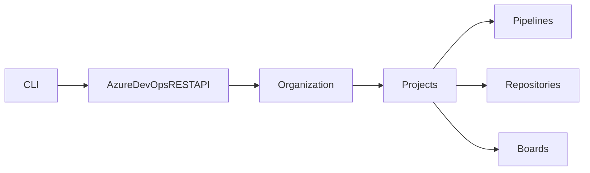

---

## Key Components

| Component | Purpose |
|------------|----------|
| Azure CLI | Base command-line tool |
| Azure DevOps Extension | Adds DevOps commands |
| Organization | Top-level container |
| Project | Logical workspace |
| Authentication | User or PAT-based access |

---

## Types

Authentication methods:

- Interactive Login
- Personal Access Token (PAT)

---

## Lifecycle / Workflow


---

## Configuration / Syntax

Install extension

```bash
az extension add --name azure-devops
```

Login

```bash
az login
```

Configure defaults

```bash
az devops configure \
  --defaults organization=https://dev.azure.com/Company \
  project=DemoProject
```

---

## Important Commands

Install Extension

```bash
az extension add --name azure-devops
```

Login

```bash
az login
```

Configure Defaults

```bash
az devops configure
```

List Projects

```bash
az devops project list
```

List Repositories

```bash
az repos list
```

List Pipelines

```bash
az pipelines list
```

Queue Pipeline

```bash
az pipelines run
```

List Work Items

```bash
az boards work-item list
```

---

## Important Files

No configuration files required.

---

## Real-World Use Cases

- Create projects automatically
- Trigger pipelines
- Create repositories
- Manage Boards
- Automate administrative tasks

---

## Advantages

- Scriptable
- Cross-platform
- Easy automation
- Supports CI/CD

---

## Limitations

- Requires Azure DevOps extension
- Some features are portal-only

---

## Common Interview Questions (Concept Only)

- What is Azure DevOps CLI?
- How do you install it?
- How is authentication performed?
- What resources can be managed?

---

## Common Mistakes

- Forgetting to install the extension
- Not configuring organization defaults
- Using expired PATs

---

## Troubleshooting

| Problem | Solution |
|----------|----------|
| Command not found | Install Azure DevOps extension |
| Authentication failed | Verify login or PAT |
| Organization not found | Configure correct organization URL |

---

## Summary

Azure DevOps CLI enables command-line management and automation of Azure DevOps resources, making it an essential tool for DevOps engineers.

---

# Pipeline Variables

## Overview

Pipeline Variables store values that can be referenced throughout a pipeline.

Variables make pipelines reusable and eliminate hardcoded values.

Common uses include:

- Resource names
- Environment names
- Image tags
- Build numbers
- Connection strings
- File paths

> **Interview Point**
>
> Variables can be defined in YAML, Variable Groups, Azure Key Vault, or during pipeline execution.

---

## Why It Is Used

Variables help:

- Simplify configuration
- Promote reusability
- Separate configuration from code
- Support multiple environments

---

## Architecture / Working

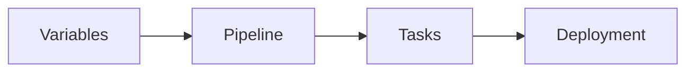

---

## Key Components

| Component | Purpose |
|------------|----------|
| Variable | Stores value |
| Variable Group | Shared variables |
| Secret Variable | Sensitive data |
| Runtime Variable | Generated during execution |

---

## Types

- User Variables
- System Variables
- Secret Variables
- Runtime Variables
- Variable Groups

---

## Lifecycle / Workflow

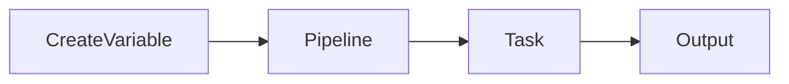

---

## Configuration / Syntax

```yaml
variables:

  environment: Production

steps:

- script: echo $(environment)
```

---

## Important Commands

Runtime variable

```text
##vso[task.setvariable variable=version]1.0
```

---

## Important Files

```text
azure-pipelines.yml
```

---

## Real-World Use Cases

- Environment names
- Docker image tags
- Azure subscription names
- Build numbers

---

## Advantages

- Reusable
- Easy maintenance
- Centralized configuration

---

## Limitations

- Variable precedence can be confusing
- Secrets should never be echoed to logs

---

## Common Interview Questions (Concept Only)

- What are Pipeline Variables?
- Difference between Variables and Variable Groups?
- What are System Variables?
- How are Secret Variables protected?

---

## Common Mistakes

- Hardcoding values
- Printing secret variables
- Using incorrect variable syntax

---

## Troubleshooting

| Problem | Solution |
|----------|----------|
| Variable empty | Verify scope and spelling |
| Secret missing | Check Variable Group or Key Vault linkage |

---

## Summary

Pipeline Variables improve pipeline flexibility by storing reusable configuration values outside the pipeline logic.

---

# Runtime Parameters

## Overview

Runtime Parameters allow users to provide input values when manually starting a pipeline.

Unlike variables, runtime parameters are evaluated **before** the pipeline begins execution.

Typical uses include:

- Select environment
- Choose agent image
- Enable or disable stages
- Select deployment region

> **Interview Point**
>
> Parameters are evaluated at **template compilation time**, while variables are generally resolved during **pipeline execution**.

---

## Why It Is Used

Runtime Parameters help:

- Make pipelines reusable
- Reduce duplicate pipelines
- Support conditional execution

---

## Architecture / Working

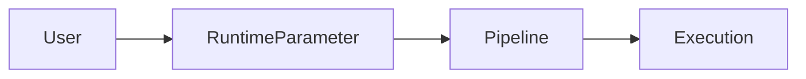

---

## Key Components

| Component | Purpose |
|------------|----------|
| Parameter | User input |
| Default Value | Used if no input provided |
| Allowed Values | Restricts selections |

---

## Types

- String
- Boolean
- Number
- Object

---

## Lifecycle / Workflow

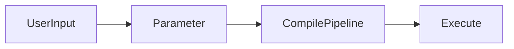

---

## Configuration / Syntax

```yaml
parameters:

- name: environment

  type: string

  default: dev

  values:

  - dev

  - qa

  - prod
```

---

## Important Files

```text
azure-pipelines.yml
```

---

## Real-World Use Cases

- Environment selection
- Deployment region
- Agent selection

---

## Advantages

- Reusable pipelines
- Flexible deployments
- Better pipeline design

---

## Limitations

- Cannot be modified after pipeline starts
- Not intended for secret values

---

## Common Interview Questions (Concept Only)

- What are Runtime Parameters?
- Difference between Variables and Parameters?
- When are Parameters evaluated?

---

## Common Mistakes

- Using parameters for secrets
- Expecting parameters to change during execution

---

## Troubleshooting

| Problem | Solution |
|----------|----------|
| Parameter missing | Verify YAML syntax |
| Wrong value | Check allowed values |

---

## Summary

Runtime Parameters provide user-defined input before pipeline execution, enabling dynamic and reusable pipeline configurations.

---

# Build Artifacts

## Overview

Build Artifacts are the output produced by a successful Build Pipeline.

Examples:

- Application binaries
- ZIP packages
- Dockerfiles
- ARM templates
- Bicep files
- Terraform plans

Artifacts are published after the build completes and are consumed by deployment pipelines.

> **Interview Point**
>
> Build Artifacts are produced by the **Build Pipeline**, not the Release Pipeline.

---

## Why It Is Used

Build Artifacts:

- Preserve build outputs
- Support deployment
- Enable rollback
- Promote Build Once, Deploy Many

---

## Architecture / Working

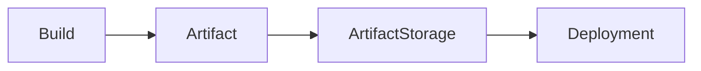

---

## Key Components

| Component | Purpose |
|------------|----------|
| Artifact | Build output |
| Storage | Azure DevOps |
| Version | Build identifier |

---

## Lifecycle / Workflow

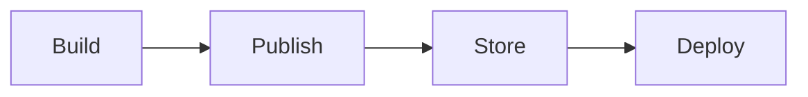

---

## Configuration / Syntax

```yaml
steps:

- publish: $(Build.ArtifactStagingDirectory)

  artifact: drop
```

---

## Important Commands

```yaml
PublishPipelineArtifact@1

PublishBuildArtifacts@1
```

---

## Important Files

```text
$(Build.ArtifactStagingDirectory)
```

---

## Real-World Use Cases

- Web applications
- APIs
- ARM templates
- Terraform plans

---

## Advantages

- Versioned
- Reusable
- Reliable

---

## Limitations

- Storage consumption
- Legacy Build Artifacts are slower than Pipeline Artifacts

---

## Common Interview Questions (Concept Only)

- What are Build Artifacts?
- Why publish artifacts?
- Difference between Build and Pipeline Artifacts?

---

## Common Mistakes

- Publishing temporary files
- Rebuilding instead of reusing artifacts

---

## Troubleshooting

| Problem | Solution |
|----------|----------|
| Artifact missing | Verify publish task |
| Wrong artifact | Verify artifact name and build version |

---

## Summary

Build Artifacts store validated build outputs for later deployment or distribution.

---

# Release Artifacts

## Overview

Release Artifacts are the artifacts consumed by Release Pipelines or multi-stage YAML pipelines for deployment.

These artifacts are typically generated by the Build Pipeline and then retrieved during deployment.

Examples include:

- Build Artifacts
- Pipeline Artifacts
- Docker Images
- Helm Charts
- Universal Packages

> **Interview Point**
>
> A Release Pipeline does **not compile code**. It consumes artifacts generated by a Build Pipeline.

---

## Why It Is Used

Release Artifacts help:

- Separate build and deployment
- Ensure deployment consistency
- Enable Build Once, Deploy Many
- Support rollback

---

## Architecture / Working

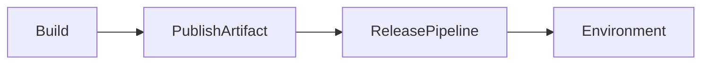

---

## Key Components

| Component | Purpose |
|------------|----------|
| Artifact Source | Build output |
| Release Pipeline | Deployment |
| Environment | Deployment target |

---

## Types

- Build Artifact
- Pipeline Artifact
- Container Image
- Package Feed

---

## Lifecycle / Workflow

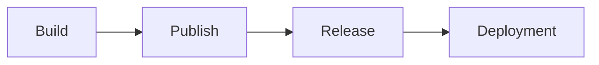

---

## Configuration / Syntax

Download Pipeline Artifact

```yaml
steps:

- download: current

  artifact: drop
```

---

## Important Commands

```yaml
DownloadPipelineArtifact@2
```

---

## Important Files

```text
$(Pipeline.Workspace)
```

---

## Real-World Use Cases

- Production deployment
- Staging deployment
- Rollback deployment

---

## Advantages

- Reliable deployments
- Artifact reuse
- Version control

---

## Limitations

- Depends on successful artifact publishing

---

## Common Interview Questions (Concept Only)

- What are Release Artifacts?
- Difference between Build and Release Artifacts?
- Why should releases use artifacts instead of rebuilding?

---

## Common Mistakes

- Deploying directly from source code
- Using different build outputs for different environments

---

## Troubleshooting

| Problem | Solution |
|----------|----------|
| Artifact not found | Verify build completed and artifact was published |
| Wrong version | Select the correct artifact version |

---

## Summary

Release Artifacts are the deployment-ready outputs consumed by Release or multi-stage pipelines, ensuring consistent deployments across environments.

---

# Manual Approval

## Overview

Manual Approval is a deployment control mechanism that requires one or more users to approve a deployment before it proceeds to the next environment.

Approvals are commonly used for:

- Production
- UAT
- Staging

They are configured on **Environments** or Release stages.

> **Interview Point**
>
> In modern YAML pipelines, production approvals are configured on **Environments**, not directly in the pipeline code.

---

## Why It Is Used

Manual Approval helps:

- Prevent accidental deployments
- Meet compliance requirements
- Support change management
- Improve production safety

---

## Architecture / Working

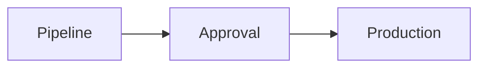

---

## Key Components

| Component | Purpose |
|------------|----------|
| Approver | Reviews deployment |
| Environment | Protected resource |
| Deployment | Waits for approval |

---

## Lifecycle / Workflow

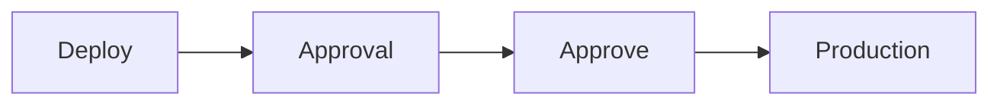

---

## Real-World Use Cases

- CAB approvals
- Production releases
- Security reviews

---

## Advantages

- Improved governance
- Safer deployments
- Compliance support

---

## Limitations

- Manual intervention slows automation
- Delayed approvals can impact release timelines

---

## Common Interview Questions (Concept Only)

- What is Manual Approval?
- Where are approvals configured?
- Why are approvals important?

---

## Common Mistakes

- Allowing developers to approve their own production deployments
- Configuring approvals in pipeline logic instead of protected environments

---

## Troubleshooting

| Problem | Solution |
|----------|----------|
| Deployment waiting | Verify approver availability |
| Approval missing | Check Environment configuration |

---

## Summary

Manual Approval protects critical environments by requiring human validation before deployment.

---

# Continuous Integration (CI)

## Overview

Continuous Integration (CI) is the practice of automatically building and testing code whenever developers commit changes to a shared repository.

Every code change triggers an automated pipeline that:

- Retrieves source code
- Restores dependencies
- Builds the application
- Runs automated tests
- Publishes artifacts

> **Interview Point**
>
> CI ends after producing a validated build artifact.

---

## Why It Is Used

CI helps:

- Detect bugs early
- Improve code quality
- Reduce integration problems
- Accelerate development

---

## Architecture / Working

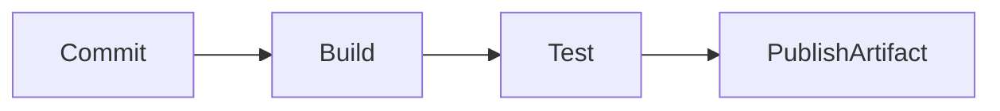

---

## Key Components

| Component | Purpose |
|------------|----------|
| Repository | Source code |
| Build Pipeline | Automated build |
| Tests | Validation |
| Artifact | Deployable output |

---

## Lifecycle / Workflow


---

## Configuration / Syntax

```yaml
trigger:

- main
```

---

## Real-World Use Cases

- Web applications
- APIs
- Microservices

---

## Advantages

- Faster feedback
- Improved quality
- Automated validation

---

## Limitations

- Requires reliable automated tests
- Frequent failures can reduce developer confidence if not addressed promptly

---

## Common Interview Questions (Concept Only)

- What is Continuous Integration?
- What happens during CI?
- Why is CI important?

---

## Common Mistakes

- Skipping automated tests
- Long-running builds
- Merging unreviewed code

---

## Troubleshooting

| Problem | Solution |
|----------|----------|
| Build failed | Review build logs |
| Tests failed | Review test reports |

---

## Summary

Continuous Integration automatically builds and validates every code change to ensure high software quality and fast developer feedback.

---

# Continuous Delivery (CD)

## Overview

Continuous Delivery extends Continuous Integration by automatically preparing applications for deployment after a successful build.

The application is deployed automatically to non-production environments and is always in a deployable state.

Deployment to Production typically requires **Manual Approval**.

> **Interview Point**
>
> Continuous Delivery **requires human approval** before production deployment.

---

## Why It Is Used

Continuous Delivery helps:

- Deliver software faster
- Improve release quality
- Reduce deployment risk
- Maintain production readiness

---

## Architecture / Working

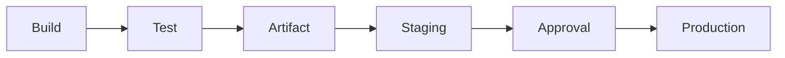

---

## Key Components

| Component | Purpose |
|------------|----------|
| Build | Application |
| Artifact | Deployable package |
| Environment | Deployment target |
| Approval | Production validation |

---

## Lifecycle / Workflow

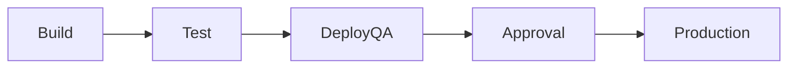

---

## Real-World Use Cases

- Enterprise applications
- Banking
- Healthcare
- Government systems

---

## Advantages

- Safer deployments
- Better governance
- Faster releases

---

## Limitations

- Manual approvals reduce deployment speed
- Requires disciplined release management

---

## Common Interview Questions (Concept Only)

- What is Continuous Delivery?
- Difference between CI and CD?
- Why are approvals used?

---

## Common Mistakes

- Confusing Continuous Delivery with Continuous Deployment
- Skipping deployment testing before production approval

---

## Troubleshooting

| Problem | Solution |
|----------|----------|
| Deployment blocked | Verify approval configuration |
| Artifact missing | Review Build Pipeline |

---

## Summary

Continuous Delivery automates software release preparation while keeping production deployment under controlled human approval.

---

# Continuous Deployment

## Overview

Continuous Deployment extends Continuous Delivery by automatically deploying every successful build directly to Production without manual approval.

The deployment proceeds automatically if all pipeline validations, automated tests, and checks succeed.

> **Interview Point**
>
> Continuous Deployment has **no manual approval before Production**, whereas Continuous Delivery does.

---

## Why It Is Used

Continuous Deployment helps:

- Deliver software rapidly
- Eliminate manual deployment steps
- Improve deployment frequency
- Accelerate customer feedback

---

## Architecture / Working

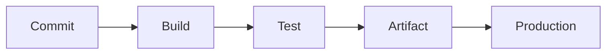

---

## Key Components

| Component | Purpose |
|------------|----------|
| CI Pipeline | Builds application |
| Automated Tests | Validate quality |
| Deployment Pipeline | Releases automatically |
| Production | Live environment |

---

## Lifecycle / Workflow


---

## Real-World Use Cases

- SaaS platforms
- Microservices
- Internal tools
- High-frequency release environments

---

## Advantages

- Very fast releases
- Fully automated deployment
- Faster customer feedback
- Reduced manual effort

---

## Limitations

- Requires comprehensive automated testing
- Increased risk if quality gates are weak
- Not suitable for all regulated industries

---

## Common Interview Questions (Concept Only)

- What is Continuous Deployment?
- Difference between Continuous Delivery and Continuous Deployment?
- When is Continuous Deployment appropriate?

---

## Common Mistakes

- Deploying to Production without adequate automated testing
- Confusing Continuous Deployment with Continuous Delivery
- Ignoring monitoring after automatic deployments

---

## Troubleshooting

| Problem | Solution |
|----------|----------|
| Automatic deployment failed | Review deployment logs and quality gates |
| Production issue after deployment | Roll back using the previous artifact or deployment strategy |

---

## Summary

Continuous Deployment automatically releases every validated build to Production without manual intervention, enabling rapid and frequent software delivery when supported by robust testing, monitoring, and rollback strategies.
