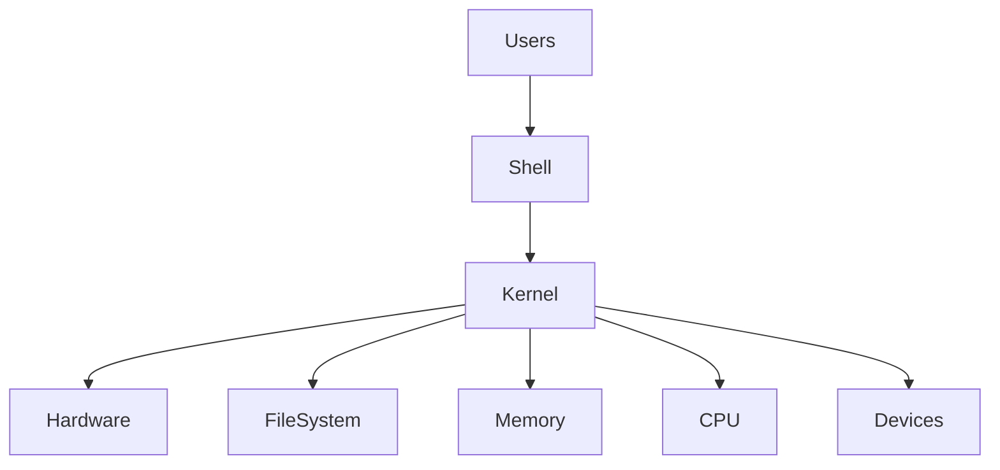
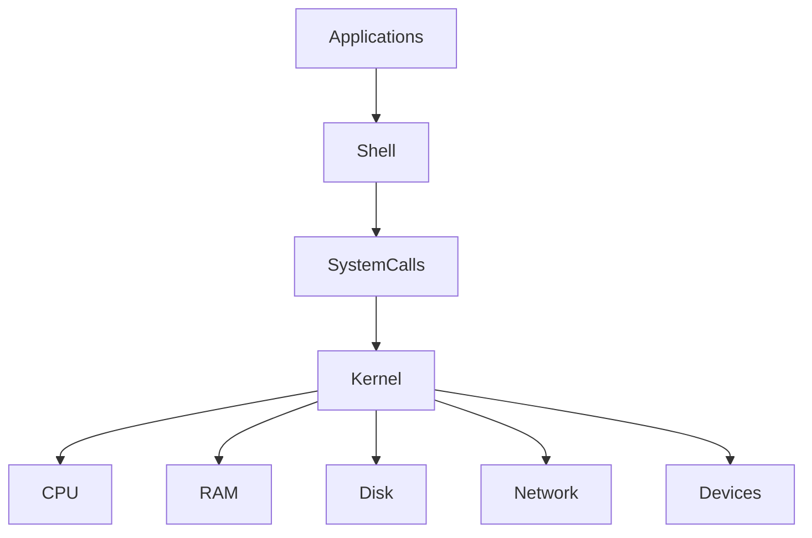
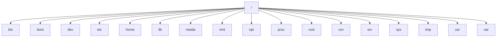
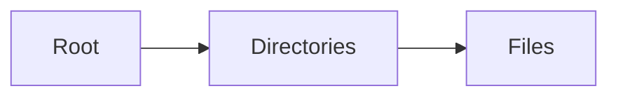
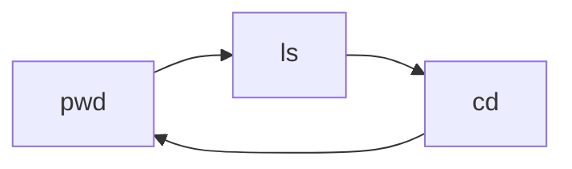

# Linux Fundamentals

## Overview

Linux is a free, open-source, Unix-like operating system widely used in servers, cloud platforms, DevOps, containers, networking, and embedded systems.

Most cloud services and DevOps tools run on Linux, including:

- Azure Virtual Machines
- AWS EC2
- Google Compute Engine
- Kubernetes
- Docker
- Jenkins
- Ansible
- Terraform

As a DevOps Engineer, Linux is one of the most important skills because almost every CI/CD pipeline, automation script, and cloud server runs on Linux.

> **Interview Point**
>
> Linux is a **kernel**, while Linux distributions (Ubuntu, CentOS, RHEL, Debian, Rocky Linux, etc.) combine the Linux kernel with system utilities and software.

---

## Why It Is Used

Linux is used because it provides:

- Stability
- High performance
- Security
- Open-source flexibility
- Excellent scripting capabilities
- Strong networking support
- Low resource usage
- Wide cloud support

---

## Architecture / Working



---

## Key Components

| Component | Purpose |
|------------|----------|
| Kernel | Core of Linux |
| Shell | Command interpreter |
| File System | Organizes files |
| System Libraries | APIs used by applications |
| Utilities | Linux commands |
| Applications | User programs |

---

## Types

Common Linux Distributions

| Distribution | Common Use |
|--------------|------------|
| Ubuntu | Cloud, Development |
| Debian | Stable Servers |
| Red Hat Enterprise Linux (RHEL) | Enterprise |
| Rocky Linux | RHEL Alternative |
| AlmaLinux | Enterprise |
| CentOS Stream | Development |
| SUSE Linux | Enterprise |
| Amazon Linux | AWS |
| Azure Linux (CBL-Mariner) | Microsoft Services |

---

## Lifecycle / Workflow


---

## Configuration / Syntax

General command syntax

```bash
command [options] [arguments]
```

Example

```bash
ls -l /home
```

---

## Important Commands

```bash
pwd

ls

cd

mkdir

rm

cp

mv

touch

cat

clear

whoami

hostname

uname
```

---

## Important Files

| File | Purpose |
|------|---------|
| /etc/passwd | User information |
| /etc/group | Groups |
| /etc/hostname | Hostname |
| /etc/os-release | OS information |
| /etc/fstab | Mount configuration |

---

## Real-World Use Cases

- Cloud Servers
- Kubernetes Nodes
- CI/CD Agents
- Docker Hosts
- Web Servers
- Database Servers

---

## Advantages

- Free and open source
- Highly secure
- Stable
- Excellent automation support
- Powerful CLI
- Multi-user

---

## Limitations

- Steeper learning curve for beginners
- Some commercial desktop software has limited Linux support

---

## Common Interview Questions (Concept Only)

- What is Linux?
- What is the Linux Kernel?
- Why is Linux preferred for servers?
- What are Linux distributions?
- Why is Linux important in DevOps?

---

## Common Mistakes

- Confusing Linux with Ubuntu
- Performing administrative tasks without understanding permissions
- Using GUI instead of learning CLI

---

## Troubleshooting

| Problem | Solution |
|----------|----------|
| Command not found | Verify installation or PATH |
| Permission denied | Check file permissions or use appropriate privileges |
| System information needed | Use `uname -a` or `/etc/os-release` |

---

## Summary

Linux is the dominant operating system for cloud computing, DevOps, containers, and enterprise infrastructure. A strong understanding of Linux fundamentals is essential for every DevOps Engineer.

---

# Linux Architecture

## Overview

Linux Architecture describes how Linux components interact to provide operating system functionality.

Linux follows a layered architecture where user applications communicate with hardware through the kernel.

> **Interview Point**
>
> The **Kernel** is the core of Linux and manages all hardware resources.

---

## Why It Is Used

The layered architecture provides:

- Hardware abstraction
- Security
- Process management
- Memory management
- Device management

---

## Architecture / Working



---

## Key Components

| Component | Purpose |
|------------|----------|
| Hardware | Physical resources |
| Kernel | Resource management |
| System Calls | Interface between apps and kernel |
| Shell | Command interpreter |
| Applications | User programs |

---

## Types

Kernel responsibilities include:

- Process Management
- Memory Management
- Device Management
- File System Management
- Networking

---

## Lifecycle / Workflow


---

## Configuration / Syntax

View kernel version

```bash
uname -r
```

System information

```bash
uname -a
```

---

## Important Commands

```bash
uname

hostnamectl

lscpu

free

lsblk

df
```

---

## Important Files

| File | Purpose |
|------|---------|
| /proc | Kernel information |
| /sys | Hardware information |
| /boot | Kernel files |

---

## Real-World Use Cases

- Server management
- Performance tuning
- Troubleshooting
- Kernel upgrades

---

## Advantages

- Efficient resource management
- Hardware abstraction
- Secure process isolation

---

## Limitations

- Kernel upgrades require careful planning
- Hardware driver issues may affect compatibility

---

## Common Interview Questions (Concept Only)

- What is the Linux Kernel?
- What are System Calls?
- How do applications communicate with hardware?
- What are Kernel responsibilities?

---

## Common Mistakes

- Assuming the Shell is part of the Kernel
- Confusing Kernel and Operating System

---

## Troubleshooting

| Problem | Solution |
|----------|----------|
| Kernel version unknown | `uname -r` |
| Hardware issue | Review `dmesg` and `/var/log` logs |

---

## Summary

Linux Architecture is built around the Kernel, which manages hardware resources while providing secure interfaces for applications and users.

---

# Linux File System Hierarchy (FHS)

## Overview

The Linux File System Hierarchy (FHS) defines the standard directory structure used across Linux distributions.

Unlike Windows, Linux organizes everything under a single root directory (`/`).

> **Interview Point**
>
> Everything in Linux is organized under the **root (`/`) directory**, including disks, devices, and files.

---

## Why It Is Used

FHS provides:

- Standard directory layout
- Consistency across distributions
- Easier administration
- Better portability

---

## Architecture / Working



---

## Key Components

| Directory | Purpose |
|-----------|----------|
| / | Root directory |
| /bin | Essential commands |
| /boot | Boot files |
| /dev | Device files |
| /etc | Configuration files |
| /home | User home directories |
| /lib | Shared libraries |
| /media | Removable media |
| /mnt | Temporary mounts |
| /opt | Optional software |
| /proc | Process information |
| /root | Root user's home |
| /run | Runtime data |
| /srv | Service data |
| /sys | Kernel/device information |
| /tmp | Temporary files |
| /usr | User applications |
| /var | Variable data and logs |

---

## Lifecycle / Workflow



---

## Configuration / Syntax

List root directories

```bash
ls /
```

---

## Important Commands

```bash
pwd

ls

tree

cd
```

---

## Important Files

| File | Purpose |
|------|---------|
| /etc/passwd | User accounts |
| /etc/fstab | Mount configuration |
| /etc/hosts | Local hostname resolution |
| /var/log | System logs |

---

## Real-World Use Cases

- Log analysis
- Configuration management
- Server administration

---

## Advantages

- Standardized structure
- Easy navigation
- Consistent across Linux distributions

---

## Limitations

- Large hierarchy can be confusing for beginners

---

## Common Interview Questions (Concept Only)

- What is the Linux File System Hierarchy?
- What is stored in `/etc`?
- Difference between `/bin` and `/usr/bin`?
- What is `/var` used for?
- Why is `/proc` considered a virtual filesystem?

---

## Common Mistakes

- Editing files under `/proc`
- Storing application data in `/tmp`
- Confusing `/root` with `/`

---

## Troubleshooting

| Problem | Solution |
|----------|----------|
| Cannot locate configuration | Check `/etc` |
| Logs missing | Review `/var/log` |

---

## Summary

The Linux File System Hierarchy organizes all files and directories under a standardized structure rooted at `/`, simplifying system administration and application compatibility.

---

# Absolute vs Relative Paths

## Overview

A **path** specifies the location of a file or directory in the Linux filesystem.

There are two types:

- Absolute Path
- Relative Path

> **Interview Point**
>
> An **Absolute Path** always starts with `/`, while a **Relative Path** starts from the current working directory.

---

## Why It Is Used

Paths help locate files and directories accurately.

---

## Key Components

| Path Type | Starts From | Example |
|------------|------------|---------|
| Absolute | Root (`/`) | `/home/azureuser/file.txt` |
| Relative | Current directory | `Documents/file.txt` |

---

## Configuration / Syntax

Absolute path

```bash
cd /home/azureuser/Documents
```

Relative path

```bash
cd Documents
```

Parent directory

```bash
cd ..
```

Current directory

```bash
cd .
```

---

## Important Commands

```bash
pwd

cd

ls
```

---

## Real-World Use Cases

- Shell scripting
- Automation
- Cron jobs
- CI/CD pipelines

---

## Advantages

| Absolute | Relative |
|-----------|----------|
| Always correct | Shorter |
| Easy for scripts | Easier typing |

---

## Limitations

| Absolute | Relative |
|-----------|----------|
| Longer | Depends on current location |

---

## Common Interview Questions (Concept Only)

- Difference between Absolute and Relative paths?
- Which path is preferred in scripts?
- What does `..` represent?
- What does `.` represent?

---

## Common Mistakes

- Using relative paths in automation scripts
- Forgetting current working directory

---

## Troubleshooting

| Problem | Solution |
|----------|----------|
| File not found | Verify path using `pwd` |

---

## Summary

Absolute paths provide fixed locations from the root directory, while relative paths depend on the current working directory.

---

# Files vs Directories

## Overview

Linux stores data using **Files** and **Directories**.

- Files store data.
- Directories organize files.

Everything in Linux is represented as a file, including devices and processes.

> **Interview Point**
>
> Directories are special files that contain references to other files and directories.

---

## Why It Is Used

This structure enables efficient organization and management of data.

---

## Key Components

| Item | Purpose |
|------|----------|
| File | Stores data |
| Directory | Organizes files |

---

## Configuration / Syntax

Create file

```bash
touch file.txt
```

Create directory

```bash
mkdir demo
```

List

```bash
ls
```

---

## Important Commands

```bash
touch

mkdir

rm

rmdir

cp

mv
```

---

## Real-World Use Cases

- Organizing application files
- Configuration management
- Log storage

---

## Advantages

- Organized filesystem
- Easy management

---

## Limitations

- Poor organization can make administration difficult

---

## Common Interview Questions (Concept Only)

- Difference between a file and a directory?
- Can a directory contain another directory?

---

## Common Mistakes

- Deleting directories with file commands
- Mixing files and directories in scripts

---

## Troubleshooting

| Problem | Solution |
|----------|----------|
| Not a directory | Verify path type using `ls -l` |

---

## Summary

Files store information, while directories organize and manage files within the Linux filesystem.

---

# Hidden Files

## Overview

Hidden files are files or directories whose names begin with a **dot (`.`)**.

Examples:

```text
.bashrc

.profile

.gitignore

.ssh
```

These files usually contain:

- Configuration
- User preferences
- Application settings

> **Interview Point**
>
> Hidden files are **not encrypted or protected**. They are simply hidden from normal directory listings.

---

## Why It Is Used

Hidden files help keep configuration files separate from regular user data.

---

## Configuration / Syntax

Show hidden files

```bash
ls -a
```

Show detailed hidden files

```bash
ls -la
```

---

## Important Commands

```bash
ls -a

ls -la
```

---

## Real-World Use Cases

- Git configuration
- SSH keys
- Bash configuration

---

## Advantages

- Cleaner directories
- Organized configuration

---

## Limitations

- Easy to forget they exist
- Accidental modification can affect user environments

---

## Common Interview Questions (Concept Only)

- What are hidden files?
- How do you display hidden files?
- Why are configuration files hidden?

---

## Common Mistakes

- Deleting hidden configuration files
- Assuming hidden means secure

---

## Troubleshooting

| Problem | Solution |
|----------|----------|
| Missing file | Use `ls -a` |

---

## Summary

Hidden files store configuration and user-specific settings while remaining excluded from normal directory listings.

---

# File Types

## Overview

Linux supports multiple file types beyond regular files.

Everything in Linux is treated as a file, including hardware devices and communication mechanisms.

> **Interview Point**
>
> The first character in `ls -l` output indicates the file type.

---

## Why It Is Used

Different file types enable Linux to manage data, devices, networking, and processes uniformly.

---

## Key Components

| Symbol | File Type |
|---------|-----------|
| - | Regular File |
| d | Directory |
| l | Symbolic Link |
| c | Character Device |
| b | Block Device |
| p | Named Pipe |
| s | Socket |

---

## Configuration / Syntax

Display file types

```bash
ls -l
```

---

## Important Commands

```bash
ls -l

file

stat
```

---

## Real-World Use Cases

- Device management
- IPC
- Storage
- Networking

---

## Advantages

- Uniform resource handling
- Simplified system design

---

## Limitations

- Device files can confuse beginners

---

## Common Interview Questions (Concept Only)

- What are Linux file types?
- What does `d` mean?
- What does `l` represent?
- What is a symbolic link?

---

## Common Mistakes

- Confusing symbolic links with regular files
- Deleting device files

---

## Troubleshooting

| Problem | Solution |
|----------|----------|
| Unknown file type | Use `file filename` |

---

## Summary

Linux supports several file types, allowing it to represent data, directories, devices, and communication channels in a consistent manner.

---

# Basic Terminal Navigation

## Overview

Terminal Navigation refers to moving through the Linux filesystem using command-line commands.

This is one of the first skills required for Linux administration and DevOps.

> **Interview Point**
>
> Most DevOps tools operate from the command line, making terminal navigation an essential daily skill.

---

## Why It Is Used

Terminal navigation enables users to:

- Locate files
- Manage directories
- Execute scripts
- Configure systems
- Troubleshoot servers

---

## Architecture / Working


---

## Key Components

| Command | Purpose |
|----------|----------|
| pwd | Print current directory |
| ls | List files |
| cd | Change directory |
| clear | Clear terminal |
| tree | Display directory tree (if installed) |

---

## Lifecycle / Workflow



---

## Configuration / Syntax

Current directory

```bash
pwd
```

List files

```bash
ls
```

Change directory

```bash
cd /home/user
```

Go to parent

```bash
cd ..
```

Go to home

```bash
cd ~
```

Go to previous directory

```bash
cd -
```

---

## Important Commands

```bash
pwd

ls

ls -l

ls -a

cd

cd ..

cd ~

cd -

clear

tree
```

---

## Important Files

No specific configuration files.

---

## Real-World Use Cases

- Server administration
- Log analysis
- Script execution
- Deployment automation
- CI/CD troubleshooting

---

## Advantages

- Fast navigation
- Efficient administration
- Essential for remote server management

---

## Limitations

- Requires familiarity with directory structure
- Incorrect navigation can lead to unintended file operations

---

## Common Interview Questions (Concept Only)

- What does `pwd` do?
- Difference between `cd ..` and `cd ~`?
- What does `cd -` do?
- How do you display hidden files?
- How do you determine your current working directory?

---

## Common Mistakes

- Running commands from the wrong directory
- Forgetting the current working directory before executing scripts
- Using relative paths incorrectly in automation

---

## Troubleshooting

| Problem | Solution |
|----------|----------|
| No such file or directory | Verify the path using `pwd` and `ls` |
| Permission denied | Check directory permissions |
| Lost in the filesystem | Return to the home directory using `cd ~` |

---

## Summary

Basic terminal navigation is a foundational Linux skill that enables efficient movement through the filesystem and is used daily by DevOps engineers, cloud engineers, system administrators, and SREs.
