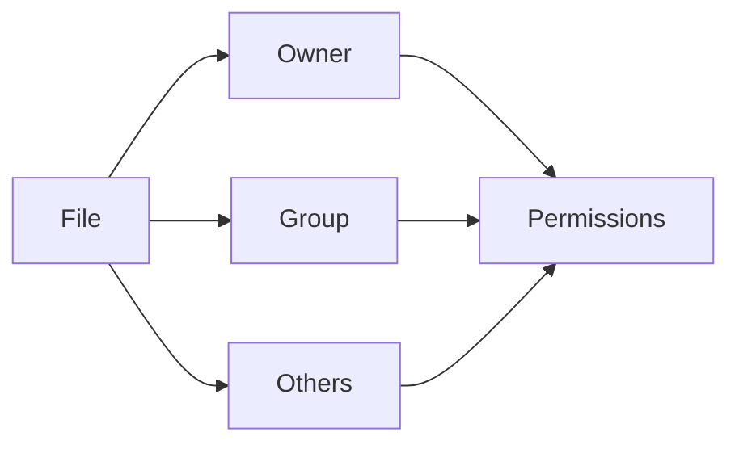
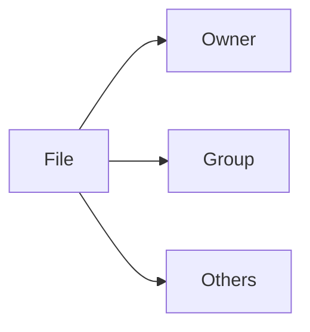
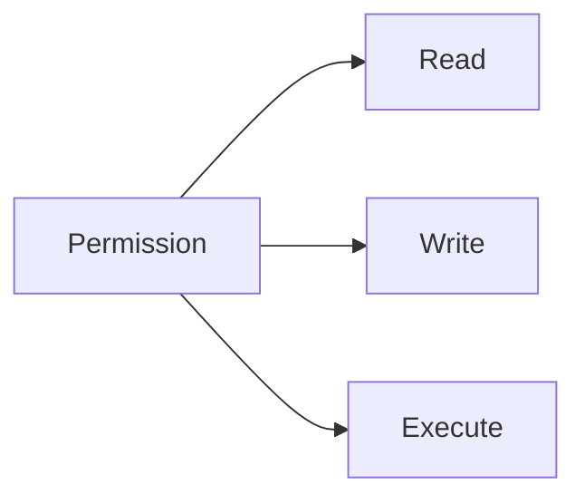
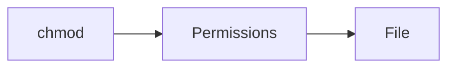
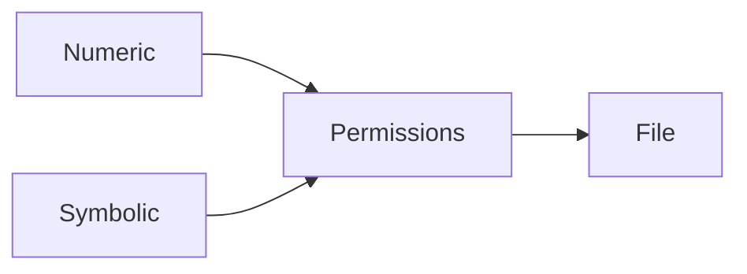

# File Permissions & Ownership

## Overview

Linux File Permissions & Ownership control **who can access files and directories and what actions they are allowed to perform**.

Every file and directory in Linux has:

- An Owner (User)
- A Group
- Permissions

This security model protects the operating system, user data, and applications from unauthorized access.

> **Interview Point**
>
> Linux permissions are based on **User (Owner), Group, and Others**, each having **Read (r), Write (w), and Execute (x)** permissions.

---

## Why It Is Used

Permissions help:

- Protect sensitive files
- Restrict unauthorized access
- Secure applications
- Enable multi-user environments
- Prevent accidental modifications

---

## Architecture / Working



---

## Key Components

| Component | Purpose |
|------------|----------|
| Owner | User who owns the file |
| Group | Collection of users |
| Others | Everyone else |
| Permissions | Allowed actions (r, w, x) |

---

## Types

Permission Categories

| Category | Symbol |
|----------|--------|
| Owner | u |
| Group | g |
| Others | o |
| All Users | a |

Permission Types

| Permission | Symbol | Value |
|------------|--------|------:|
| Read | r | 4 |
| Write | w | 2 |
| Execute | x | 1 |

---

## Lifecycle / Workflow


---

## Configuration / Syntax

View permissions

```bash
ls -l
```

Example output

```text
-rwxr-xr--
```

Permission breakdown

```text
-

rwx

r-x

r--
```

- `-` → Regular file
- `rwx` → Owner permissions
- `r-x` → Group permissions
- `r--` → Others permissions

---

## Important Commands

```bash
ls -l

chmod

chown

chgrp

umask

id

groups
```

---

## Important Files

| File | Purpose |
|------|---------|
| /etc/passwd | User information |
| /etc/group | Group information |
| /etc/shadow | Encrypted passwords |
| /etc/login.defs | Login defaults |

---

## Real-World Use Cases

- Protect SSH keys
- Secure configuration files
- Restrict application access
- Protect web server files
- Secure deployment scripts

---

## Advantages

- Strong security
- Multi-user support
- Granular access control
- Easy administration

---

## Limitations

- Incorrect permissions can break applications
- Requires careful permission management

---

## Common Interview Questions (Concept Only)

- What are Linux file permissions?
- Who are Owner, Group, and Others?
- How are permissions displayed?
- Why are file permissions important?

---

## Common Mistakes

- Granting unnecessary permissions (e.g., `777`)
- Running applications with excessive privileges
- Ignoring ownership settings
- Misunderstanding directory permissions

---

## Troubleshooting

| Problem | Solution |
|----------|----------|
| Permission denied | Verify ownership and permissions |
| User cannot access file | Check user/group membership |
| Application cannot read configuration | Review file permissions |

---

## Summary

Linux File Permissions and Ownership provide the foundation for system security by controlling access to files and directories based on users, groups, and permission levels.

---

# Users, Groups, Others

## Overview

Linux assigns permissions based on three security categories:

- User (Owner)
- Group
- Others

Every file belongs to one Owner and one Group.

> **Interview Point**
>
> Permission evaluation follows this order:
>
> 1. Owner
> 2. Group
> 3. Others

---

## Why It Is Used

This model allows:

- Multi-user collaboration
- Secure file sharing
- Controlled access
- Role separation

---

## Architecture / Working



---

## Key Components

| Category | Description |
|----------|-------------|
| User (u) | File owner |
| Group (g) | Members of assigned group |
| Others (o) | Everyone else |

---

## Lifecycle / Workflow


---

## Configuration / Syntax

Display owner

```bash
ls -l
```

Example

```text
-rw-r--r--

akshay developers
```

Owner

```text
akshay
```

Group

```text
developers
```

---

## Important Commands

```bash
id

groups

whoami
```

---

## Real-World Use Cases

- Developer access
- Shared project directories
- Team collaboration

---

## Advantages

- Simple security model
- Easy user management

---

## Limitations

- Limited granularity without Access Control Lists (ACLs)

---

## Common Interview Questions (Concept Only)

- Difference between User, Group, and Others?
- How does Linux determine permissions?

---

## Common Mistakes

- Assigning incorrect groups
- Ignoring inherited group permissions

---

## Troubleshooting

| Problem | Solution |
|----------|----------|
| User cannot access file | Verify ownership and group membership |

---

## Summary

Linux evaluates file permissions using the User, Group, and Others security model, providing controlled access in multi-user environments.

---

# Read, Write, Execute Permissions

## Overview

Linux provides three permission types:

- Read (r)
- Write (w)
- Execute (x)

These permissions behave differently for files and directories.

> **Interview Point**
>
> Execute permission on a **directory** allows entering the directory, while execute permission on a **file** allows running it as a program or script.

---

## Why It Is Used

Permissions determine:

- Who can view files
- Who can modify files
- Who can execute programs

---

## Key Components

### File Permissions

| Permission | Meaning |
|------------|----------|
| Read | View contents |
| Write | Modify contents |
| Execute | Run file |

### Directory Permissions

| Permission | Meaning |
|------------|----------|
| Read | List directory contents |
| Write | Create/delete entries (subject to directory rules) |
| Execute | Enter/access the directory |

---

## Architecture / Working



---

## Configuration / Syntax

Display permissions

```bash
ls -l
```

---

## Important Commands

```bash
chmod

ls -l
```

---

## Real-World Use Cases

- Script execution
- Configuration protection
- Directory access control

---

## Advantages

- Flexible access control
- Strong security

---

## Limitations

- Incorrect settings may expose sensitive files or block legitimate access

---

## Common Interview Questions (Concept Only)

- What does Execute mean for a directory?
- Difference between Read permission on files and directories?
- Why can't a script execute without Execute permission?

---

## Common Mistakes

- Forgetting Execute permission on scripts
- Misunderstanding directory permissions

---

## Troubleshooting

| Problem | Solution |
|----------|----------|
| Script won't run | Verify Execute permission |
| Cannot enter directory | Check Execute permission on the directory |

---

## Summary

Read, Write, and Execute permissions define how users interact with files and directories and are fundamental to Linux security.

---

# chmod

## Overview

`chmod` changes file and directory permissions.

It supports:

- Numeric (Octal) mode
- Symbolic mode

> **Interview Point**
>
> `chmod` modifies permissions only; it does **not** change file ownership.

---

## Why It Is Used

- Secure files
- Grant access
- Restrict access
- Enable script execution

---

## Architecture / Working



---

## Configuration / Syntax

Numeric

```bash
chmod 755 script.sh
```

Symbolic

```bash
chmod u+x script.sh
```

Remove Write

```bash
chmod g-w file.txt
```

---

## Important Commands

```bash
chmod

chmod -R
```

---

## Real-World Use Cases

- Deploy scripts
- Secure SSH keys
- Configure web applications

---

## Advantages

- Flexible
- Supports recursive changes

---

## Limitations

- Incorrect permissions can expose sensitive data

---

## Common Interview Questions (Concept Only)

- What does `chmod 755` mean?
- Difference between Numeric and Symbolic permissions?
- What does `chmod -R` do?

---

## Common Mistakes

- Using `777` unnecessarily
- Applying recursive permission changes without verification

---

## Troubleshooting

| Problem | Solution |
|----------|----------|
| Permission unchanged | Verify ownership or use appropriate privileges |
| Script not executable | Add Execute permission |

---

## Summary

`chmod` modifies file and directory permissions, allowing administrators to control access securely.

---

# chown

## Overview

`chown` changes the owner of files and directories.

It can also change both owner and group simultaneously.

> **Interview Point**
>
> Only privileged users (typically `root`) can change file ownership.

---

## Why It Is Used

- Transfer ownership
- Configure applications
- Secure deployments

---

## Configuration / Syntax

Change owner

```bash
chown akshay file.txt
```

Change owner and group

```bash
chown akshay:developers file.txt
```

Recursive

```bash
chown -R akshay:developers project/
```

---

## Important Commands

```bash
chown

chown -R
```

---

## Real-World Use Cases

- Web server ownership
- Application deployments
- Shared directories

---

## Advantages

- Simple ownership management

---

## Limitations

- Requires elevated privileges

---

## Common Interview Questions (Concept Only)

- What does `chown` do?
- Difference between `chmod` and `chown`?

---

## Common Mistakes

- Confusing ownership with permissions
- Forgetting recursive updates for project directories

---

## Troubleshooting

| Problem | Solution |
|----------|----------|
| Operation not permitted | Use appropriate privileges or verify ownership |

---

## Summary

`chown` changes file ownership, ensuring resources belong to the correct user and group.

---

# chgrp

## Overview

`chgrp` changes the group ownership of files and directories.

---

## Why It Is Used

- Team collaboration
- Shared access
- Project organization

---

## Configuration / Syntax

```bash
chgrp developers file.txt

chgrp -R developers project/
```

---

## Important Commands

```bash
chgrp

chgrp -R
```

---

## Real-World Use Cases

- Shared development projects
- Web applications

---

## Advantages

- Simplifies group-based access

---

## Limitations

- User must have permission to change the group or use appropriate privileges

---

## Common Interview Questions (Concept Only)

- What does `chgrp` do?
- Difference between `chown` and `chgrp`?

---

## Common Mistakes

- Assigning incorrect group

---

## Troubleshooting

| Problem | Solution |
|----------|----------|
| Invalid group | Verify group exists with `getent group` or `/etc/group` |

---

## Summary

`chgrp` changes group ownership, enabling secure collaboration between multiple users.

---

# Numeric vs Symbolic Permissions

## Overview

Linux permissions can be assigned using:

- Numeric (Octal)
- Symbolic

Both methods ultimately modify the same permission bits.

> **Interview Point**
>
> Numeric permissions use the values:
>
> - Read = 4
> - Write = 2
> - Execute = 1

---

## Why It Is Used

Numeric mode is ideal for scripts and automation, while symbolic mode is useful for modifying specific permissions without affecting others.

---

## Key Components

### Numeric Values

| Permission | Value |
|------------|------:|
| Read | 4 |
| Write | 2 |
| Execute | 1 |

### Common Numeric Permissions

| Numeric | Symbolic | Meaning |
|----------|----------|---------|
| 777 | rwxrwxrwx | Full access for everyone |
| 755 | rwxr-xr-x | Owner full access; Group/Others read and execute |
| 700 | rwx------ | Owner only |
| 644 | rw-r--r-- | Owner read/write; Group/Others read |
| 600 | rw------- | Owner read/write only |

---

## Architecture / Working



---

## Configuration / Syntax

Numeric

```bash
chmod 755 script.sh
```

Symbolic

```bash
chmod u+x script.sh

chmod g-w file.txt

chmod o-r file.txt
```

---

## Real-World Use Cases

- Deploy scripts (`755`)
- SSH private keys (`600`)
- Public configuration files (`644`)

---

## Advantages

| Numeric | Symbolic |
|----------|-----------|
| Easy for automation | Easy for incremental changes |
| Compact | More readable |

---

## Limitations

| Numeric | Symbolic |
|----------|-----------|
| Harder to remember | More verbose |

---

## Common Interview Questions (Concept Only)

- Difference between Numeric and Symbolic permissions?
- What does `755` mean?
- What does `644` mean?
- Why should SSH private keys use `600`?

---

## Common Mistakes

- Using `777` for convenience
- Miscalculating numeric values

---

## Troubleshooting

| Problem | Solution |
|----------|----------|
| Incorrect permissions | Review with `ls -l` and reapply using `chmod` |

---

## Summary

Numeric permissions provide concise permission assignment, while symbolic permissions allow fine-grained modifications to existing permissions.

---

# umask

## Overview

`umask` (User File Creation Mask) defines the **default permissions** assigned to newly created files and directories.

It does **not** directly set permissions. Instead, it removes permission bits from the default values.

Default permissions before applying `umask`:

- Files → `666` (`rw-rw-rw-`)
- Directories → `777` (`rwxrwxrwx`)

> **Interview Point**
>
> Files are **not created with Execute (`x`) permission by default**, even though directories start from `777` before the mask is applied.

---

## Why It Is Used

`umask` helps:

- Improve security
- Enforce organizational standards
- Prevent overly permissive file creation

---

## Architecture / Working


---

## Key Components

| Component | Purpose |
|------------|----------|
| Default File Permission | 666 |
| Default Directory Permission | 777 |
| umask | Removes permission bits |

---

## Lifecycle / Workflow


---

## Configuration / Syntax

Display current umask

```bash
umask
```

Set umask

```bash
umask 022
```

Examples

| umask | File Permission | Directory Permission |
|--------|----------------:|----------------------:|
| 022 | 644 | 755 |
| 027 | 640 | 750 |
| 077 | 600 | 700 |

---

## Important Commands

```bash
umask

umask 022

umask 077
```

---

## Important Files

| File | Purpose |
|------|---------|
| ~/.bashrc | User shell configuration |
| ~/.profile | User login settings |
| /etc/profile | System-wide profile |
| /etc/bash.bashrc (distribution-dependent) | Global Bash configuration |

---

## Real-World Use Cases

- Secure user home directories
- Protect application configuration files
- Enterprise security hardening
- Multi-user servers

---

## Advantages

- Improves default security
- Prevents overly permissive files
- Easy to configure

---

## Limitations

- Incorrect `umask` values may block application access
- Different environments may require different defaults

---

## Common Interview Questions (Concept Only)

- What is `umask`?
- How is file permission calculated using `umask`?
- Why are file defaults `666` instead of `777`?
- What permissions result from `umask 022` and `umask 077`?

---

## Common Mistakes

- Assuming `umask` adds permissions instead of removing them
- Setting an overly restrictive `umask` that breaks shared workflows
- Forgetting that files and directories have different default permission values

---

## Troubleshooting

| Problem | Solution |
|----------|----------|
| Newly created files have unexpected permissions | Check the current `umask` value |
| Applications cannot access created files | Review `umask` and required permission levels |

---

## Summary

`umask` defines the default permission mask applied to newly created files and directories, making it a key security mechanism for controlling access in Linux systems. Understanding how `umask` interacts with default file (`666`) and directory (`777`) permissions is a common Linux interview topic.
