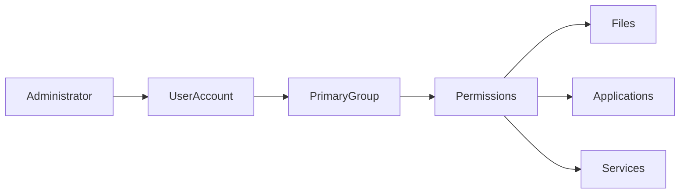
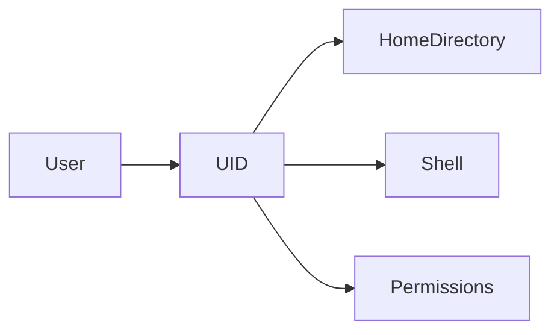
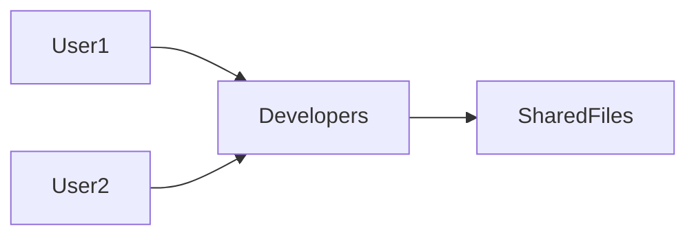
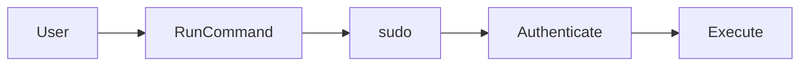

# User & Group Management

## Overview

Linux is a **multi-user operating system**, meaning multiple users can access the same system simultaneously.

User & Group Management is the process of:

- Creating users
- Managing user accounts
- Organizing users into groups
- Controlling access to system resources
- Granting administrative privileges

Every Linux user has:

- Username
- User ID (UID)
- Primary Group (GID)
- Home Directory
- Login Shell

> **Interview Point**
>
> Authentication verifies **who the user is**, while permissions determine **what the user can access**.

---

## Why It Is Used

User management helps:

- Secure Linux systems
- Separate responsibilities
- Control access
- Support multiple users
- Improve auditing
- Follow the Principle of Least Privilege

---

## Architecture / Working



---

## Key Components

| Component | Purpose |
|------------|----------|
| User | Individual account |
| Group | Collection of users |
| UID | User Identifier |
| GID | Group Identifier |
| Home Directory | User workspace |
| Login Shell | User command interpreter |
| sudo | Temporary administrative privileges |

---

## Types

### User Types

| User Type | Description |
|-----------|-------------|
| Root User | Full administrative privileges |
| Regular User | Normal user account |
| System User | Used by services and applications |

Example:

```text
root
ubuntu
www-data
mysql
nginx
```

---

## Lifecycle / Workflow


---

## Configuration / Syntax

Common user management workflow

```bash
useradd username

passwd username

usermod -aG group username
```

---

## Important Commands

```bash
useradd

usermod

userdel

passwd

groupadd

groupdel

id

groups

whoami

sudo
```

---

## Important Files

| File | Purpose |
|------|---------|
| /etc/passwd | User information |
| /etc/shadow | Encrypted passwords |
| /etc/group | Group information |
| /etc/gshadow | Secure group information |
| /etc/sudoers | sudo configuration |

---

## Real-World Use Cases

- Create developer accounts
- Grant DevOps permissions
- Configure service accounts
- Restrict production access
- Manage server administrators

---

## Advantages

- Multi-user support
- Strong access control
- Better security
- Easy administration

---

## Limitations

- Poor user management increases security risks
- Incorrect group assignments may expose sensitive data

---

## Common Interview Questions (Concept Only)

- What is a Linux user?
- What is UID?
- What is GID?
- Difference between Root and Regular User?
- What files store user information?

---

## Common Mistakes

- Logging in as root for routine tasks
- Giving unnecessary sudo access
- Forgetting to assign a password
- Ignoring least privilege

---

## Troubleshooting

| Problem | Solution |
|----------|----------|
| User cannot log in | Verify password and shell |
| Permission denied | Check group membership |
| sudo not working | Verify sudo configuration |
| User missing | Check `/etc/passwd` |

---

## Summary

User & Group Management is a core Linux administration task that controls authentication, authorization, and access to system resources.

---

# User Accounts

## Overview

A User Account represents an identity used to access a Linux system.

Each user has:

- Username
- UID
- Primary Group
- Home Directory
- Login Shell
- Password

Example

```text
akshay:x:1001:1001:Akshay:/home/akshay:/bin/bash
```

Stored in:

```text
/etc/passwd
```

> **Interview Point**
>
> User passwords are **not stored in `/etc/passwd`**. They are stored securely in `/etc/shadow`.

---

## Why It Is Used

User Accounts provide:

- Authentication
- Personal workspace
- Ownership
- Security
- Accountability

---

## Architecture / Working



---

## Key Components

| Component | Description |
|------------|-------------|
| Username | Login name |
| UID | Unique User ID |
| Home Directory | User files |
| Shell | Login shell |
| Password | Authentication |

---

## Types

| User | UID |
|------|-----|
| Root | 0 |
| Regular Users | Usually 1000+ |
| System Users | Usually below 1000 (distribution-dependent) |

---

## Lifecycle / Workflow


---

## Configuration / Syntax

View current user

```bash
whoami
```

View account

```bash
cat /etc/passwd
```

---

## Important Commands

```bash
whoami

id

passwd

finger
```

---

## Important Files

| File | Purpose |
|------|---------|
| /etc/passwd | User information |
| /etc/shadow | Password information |

---

## Real-World Use Cases

- Developer accounts
- CI/CD service accounts
- Database users

---

## Advantages

- Individual identities
- Secure authentication

---

## Limitations

- Weak passwords reduce security
- Shared accounts reduce accountability

---

## Common Interview Questions (Concept Only)

- What information is stored in `/etc/passwd`?
- Where are passwords stored?
- What is UID?

---

## Common Mistakes

- Sharing user accounts
- Using predictable passwords

---

## Troubleshooting

| Problem | Solution |
|----------|----------|
| User missing | Check `/etc/passwd` |
| Cannot log in | Verify shell and password |

---

## Summary

User Accounts uniquely identify individuals and services, providing secure access to Linux systems.

---

# Group Management

## Overview

Groups allow multiple users to share permissions and resources.

Instead of assigning permissions individually, Linux assigns permissions to groups.

> **Interview Point**
>
> Every user has **one Primary Group** but can belong to **multiple Supplementary Groups**.

---

## Why It Is Used

Groups simplify:

- Permission management
- Collaboration
- Security
- Administration

---

## Architecture / Working



---

## Key Components

| Component | Purpose |
|------------|----------|
| Primary Group | Default group |
| Supplementary Group | Additional permissions |

---

## Types

| Group Type | Purpose |
|------------|----------|
| Primary | Default ownership |
| Secondary | Additional permissions |

---

## Lifecycle / Workflow


---

## Configuration / Syntax

Create group

```bash
groupadd developers
```

View groups

```bash
groups username
```

---

## Important Commands

```bash
groupadd

groupdel

groupmod

groups
```

---

## Important Files

| File | Purpose |
|------|---------|
| /etc/group | Group information |

---

## Real-World Use Cases

- DevOps Team
- Developers
- Database Administrators
- Web Server Users

---

## Advantages

- Easier administration
- Shared permissions
- Better scalability

---

## Limitations

- Incorrect group assignments increase security risks

---

## Common Interview Questions (Concept Only)

- What is a Linux Group?
- Difference between Primary and Secondary Groups?
- Where are groups stored?

---

## Common Mistakes

- Forgetting supplementary groups
- Using incorrect primary groups

---

## Troubleshooting

| Problem | Solution |
|----------|----------|
| User lacks access | Verify group membership |

---

## Summary

Groups simplify permission management by allowing multiple users to share common access rights.

---

# useradd

## Overview

`useradd` creates new user accounts.

> **Interview Point**
>
> `useradd` creates the account, but the user **cannot log in until a password is set**.

---

## Why It Is Used

- Create administrators
- Create developer accounts
- Create service users

---

## Configuration / Syntax

Create user

```bash
sudo useradd akshay
```

Create home directory

```bash
sudo useradd -m akshay
```

Specify shell

```bash
sudo useradd -m -s /bin/bash akshay
```

---

## Important Commands

```bash
useradd

useradd -m

useradd -s
```

---

## Real-World Use Cases

- Create cloud VM users
- Create CI/CD users

---

## Advantages

- Fast user creation

---

## Limitations

- Password must be configured separately

---

## Common Interview Questions (Concept Only)

- What does `useradd` do?
- Why use `-m`?

---

## Common Mistakes

- Forgetting to create the home directory
- Forgetting to set a password

---

## Troubleshooting

| Problem | Solution |
|----------|----------|
| Login fails | Set password using `passwd` |

---

## Summary

`useradd` creates user accounts with configurable home directories, shells, and account properties.

---

# usermod

## Overview

`usermod` modifies existing user accounts.

Common uses include:

- Change username
- Change home directory
- Change shell
- Add to groups

> **Interview Point**
>
> Use `-aG` to add a user to a supplementary group **without removing existing group memberships**.

---

## Why It Is Used

- Update user configuration
- Grant additional permissions
- Change login shell

---

## Configuration / Syntax

Add user to group

```bash
sudo usermod -aG docker akshay
```

Change shell

```bash
sudo usermod -s /bin/bash akshay
```

---

## Important Commands

```bash
usermod

usermod -aG

usermod -s
```

---

## Real-World Use Cases

- Docker permissions
- Kubernetes administration
- DevOps access

---

## Advantages

- Flexible account management

---

## Limitations

- Incorrect usage may remove existing group memberships (e.g., omitting `-a` with `-G`)

---

## Common Interview Questions (Concept Only)

- What does `usermod -aG` do?
- Difference between `-G` and `-aG`?

---

## Common Mistakes

- Using `-G` without `-a`
- Changing shells to invalid paths

---

## Troubleshooting

| Problem | Solution |
|----------|----------|
| User removed from groups | Re-add required groups with `-aG` |

---

## Summary

`usermod` updates existing user accounts and is commonly used to manage group memberships and account settings.

---

# passwd

## Overview

`passwd` sets or changes user passwords.

Passwords are stored securely in:

```text
/etc/shadow
```

> **Interview Point**
>
> Only privileged users can change another user's password.

---

## Why It Is Used

- Set passwords
- Change passwords
- Improve security

---

## Configuration / Syntax

Current user

```bash
passwd
```

Another user

```bash
sudo passwd akshay
```

---

## Important Commands

```bash
passwd
```

---

## Important Files

| File | Purpose |
|------|---------|
| /etc/shadow | Password hashes |

---

## Real-World Use Cases

- Initial account setup
- Password rotation

---

## Advantages

- Secure authentication

---

## Limitations

- Weak passwords reduce security

---

## Common Interview Questions (Concept Only)

- Where are Linux passwords stored?
- Can users change their own passwords?

---

## Common Mistakes

- Weak passwords
- Sharing passwords

---

## Troubleshooting

| Problem | Solution |
|----------|----------|
| Password rejected | Verify password policy |

---

## Summary

`passwd` manages user passwords and is essential for Linux authentication.

---

# groupadd

## Overview

`groupadd` creates new groups.

---

## Why It Is Used

- Team collaboration
- Shared permissions
- Application groups

---

## Configuration / Syntax

```bash
sudo groupadd developers
```

---

## Important Commands

```bash
groupadd
```

---

## Real-World Use Cases

- Development teams
- Shared project directories

---

## Advantages

- Simplifies permission management

---

## Limitations

- Duplicate group names are not allowed

---

## Common Interview Questions (Concept Only)

- What does `groupadd` do?

---

## Common Mistakes

- Creating unnecessary groups

---

## Troubleshooting

| Problem | Solution |
|----------|----------|
| Group exists | Choose another name or verify existing groups |

---

## Summary

`groupadd` creates groups used for collaborative access control.

---

# id

## Overview

`id` displays user identity information.

It shows:

- UID
- GID
- Group memberships

> **Interview Point**
>
> `id` is commonly used to verify whether a user belongs to a required group before troubleshooting permission issues.

---

## Why It Is Used

- Verify user identity
- Troubleshoot permissions
- Check group memberships

---

## Configuration / Syntax

```bash
id

id username
```

---

## Important Commands

```bash
id
```

---

## Real-World Use Cases

- Docker group verification
- Kubernetes permissions
- Shared directory troubleshooting

---

## Advantages

- Quick identity verification

---

## Limitations

- Read-only command

---

## Common Interview Questions (Concept Only)

- What information does `id` display?

---

## Common Mistakes

- Confusing UID with GID

---

## Troubleshooting

| Problem | Solution |
|----------|----------|
| Missing group | Verify supplementary group membership |

---

## Summary

`id` displays user and group identity information, making it an essential troubleshooting tool.

---

# whoami

## Overview

`whoami` displays the username of the currently logged-in user.

> **Interview Point**
>
> `whoami` displays the **effective user**, which is especially useful after using `sudo` or `su`.

---

## Why It Is Used

- Verify current user
- Confirm privilege changes

---

## Configuration / Syntax

```bash
whoami
```

---

## Important Commands

```bash
whoami
```

---

## Real-World Use Cases

- Verify SSH sessions
- Confirm script execution identity
- Validate administrative access

---

## Advantages

- Simple
- Fast

---

## Limitations

- Displays only the effective username

---

## Common Interview Questions (Concept Only)

- What does `whoami` display?
- Difference between `whoami` and `id`?

---

## Common Mistakes

- Assuming the login user and effective user are always the same

---

## Troubleshooting

| Problem | Solution |
|----------|----------|
| Unexpected username | Check whether `sudo` or `su` changed the effective user |

---

## Summary

`whoami` quickly identifies the effective user currently executing commands.

---

# sudo

## Overview

`sudo` (Superuser Do) allows an authorized user to execute commands with elevated privileges without logging in as the root user.

Instead of using the root account directly, Linux systems encourage administrators to use `sudo` for better security and auditing.

> **Interview Point**
>
> Best practice is to use `sudo` instead of logging in as the `root` user for day-to-day administration.

---

## Why It Is Used

`sudo` helps:

- Perform administrative tasks
- Limit root access
- Improve accountability through command logging
- Follow the Principle of Least Privilege

---

## Architecture / Working


---

## Key Components

| Component | Purpose |
|------------|----------|
| sudo | Executes commands with elevated privileges |
| sudoers | Configuration file controlling access |
| Root User | Executes privileged operations |

---

## Lifecycle / Workflow



---

## Configuration / Syntax

Run a command as administrator

```bash
sudo apt update
```

Open a root shell

```bash
sudo -i
```

Edit the sudo configuration safely

```bash
sudo visudo
```

---

## Important Commands

```bash
sudo

sudo -i

sudo -l

visudo
```

---

## Important Files

| File | Purpose |
|------|---------|
| /etc/sudoers | sudo configuration |
| /etc/sudoers.d/ | Additional sudo configuration files |

---

## Real-World Use Cases

- Install software
- Restart services
- Modify system configuration
- Create users and groups
- Manage packages
- Deploy applications

---

## Advantages

- Safer than direct root login
- Provides auditing and accountability
- Supports granular privilege delegation

---

## Limitations

- Excessive sudo access increases security risks
- Misconfigured sudoers entries can expose the system

---

## Common Interview Questions (Concept Only)

- What is `sudo`?
- Why is `sudo` preferred over logging in as `root`?
- What is the purpose of the `sudoers` file?
- How do you safely edit `sudoers`?

---

## Common Mistakes

- Granting unrestricted sudo access to all users
- Editing `/etc/sudoers` directly instead of using `visudo`
- Performing routine work as the root user

---

## Troubleshooting

| Problem | Solution |
|----------|----------|
| User is not in the sudoers file | Add the user to an appropriate administrative group or update `sudoers` using `visudo` |
| sudo command not found | Ensure the `sudo` package is installed |
| Permission denied | Verify group membership and sudo configuration |

---

## Summary

`sudo` provides temporary administrative privileges while maintaining security, accountability, and adherence to the Principle of Least Privilege. It is one of the most important commands for Linux administrators and DevOps engineers.
