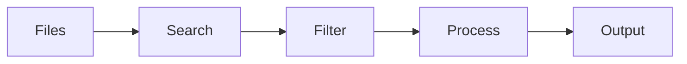
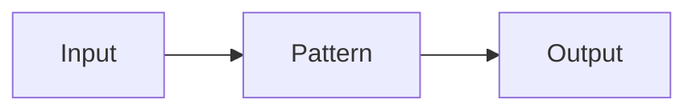
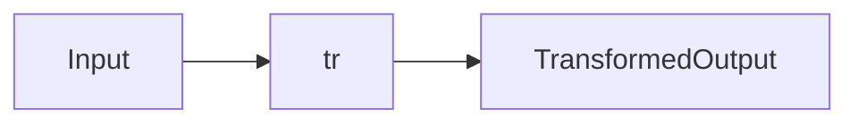

# File Searching & Text Processing

## Overview

File Searching & Text Processing are fundamental Linux skills used to:

- Find files and directories
- Search inside files
- Filter text
- Count lines and words
- Sort data
- Remove duplicates
- Extract specific columns
- Transform text

These commands are heavily used in:

- DevOps
- System Administration
- Log Analysis
- Monitoring
- Automation
- CI/CD Pipelines

> **Interview Point**
>
> Linux follows the philosophy:
>
> **"Everything is a file, and commands can be combined using pipes (`|`)."**

---

## Why It Is Used

These commands help to:

- Analyze logs
- Search configuration files
- Filter application output
- Process reports
- Troubleshoot servers
- Automate administrative tasks

---

## Architecture / Working



---

## Key Components

| Category | Commands |
|-----------|-----------|
| File Search | find, locate, which, whereis |
| Text Search | grep |
| Statistics | wc |
| Sorting | sort |
| Duplicate Removal | uniq |
| Field Extraction | cut |
| Character Translation | tr |

---

## Types

### File Search

- find
- locate
- which
- whereis

### Text Processing

- grep
- wc
- sort
- uniq
- cut
- tr

---

## Lifecycle / Workflow


---

## Configuration / Syntax

General syntax

```bash
command [options] file
```

---

## Important Commands

```bash
find

locate

which

whereis

grep

wc

sort

uniq

cut

tr
```

---

## Important Files

| File | Purpose |
|------|---------|
| /etc/passwd | User information |
| /etc/group | Group information |
| /var/log/* | System logs |
| /etc/* | Configuration files |

---

## Real-World Use Cases

- Search log files
- Find configuration files
- Analyze application logs
- Monitor servers
- Extract report data
- Process CSV files

---

## Advantages

- Fast
- Lightweight
- Script-friendly
- Excellent for automation

---

## Limitations

- Large datasets may require optimized commands
- Incorrect regular expressions can produce unexpected results

---

## Common Interview Questions (Concept Only)

- Difference between `find` and `locate`?
- Difference between `which` and `whereis`?
- How does `grep` work?
- Why use `sort` before `uniq`?
- What is the purpose of `cut`?

---

## Common Mistakes

- Using `locate` without an updated database
- Forgetting recursive search options
- Using `uniq` on unsorted data
- Using the wrong delimiter with `cut`

---

## Troubleshooting

| Problem | Solution |
|----------|----------|
| File not found | Verify path and permissions |
| locate returns no results | Update the locate database (`updatedb`) |
| grep finds nothing | Check case sensitivity or use appropriate options |
| uniq does not remove duplicates | Sort the input before using `uniq` |

---

## Summary

Linux file searching and text processing commands are essential for system administration, DevOps automation, log analysis, and troubleshooting. Mastering these tools greatly improves productivity and scripting capabilities.

---

# find

## Overview

`find` searches for files and directories in a specified location based on criteria such as:

- Name
- Type
- Size
- Owner
- Permissions
- Modification time

Unlike `locate`, `find` performs a real-time search of the filesystem.

> **Interview Point**
>
> `find` performs a **live filesystem search**, making it accurate but slower than `locate`.

---

## Why It Is Used

- Search files
- Find log files
- Locate configuration files
- Find old files
- Search by permissions

---

## Architecture / Working


---

## Key Components

| Option | Purpose |
|---------|----------|
| -name | Search by name |
| -type | File or directory |
| -size | Search by size |
| -user | Search by owner |
| -mtime | Modification time |

---

## Types

Common searches

```bash
find /home -name "*.txt"

find /var/log -type f

find /tmp -mtime -7

find / -size +100M
```

---

## Lifecycle / Workflow


---

## Configuration / Syntax

```bash
find PATH OPTIONS
```

Examples

```bash
find . -name "*.log"

find /etc -type f

find /home -user akshay
```

---

## Important Commands

```bash
find

find -name

find -type

find -mtime

find -size

find -exec
```

---

## Real-World Use Cases

- Locate configuration files
- Delete old logs
- Find large files
- Security auditing

---

## Advantages

- Powerful
- Real-time
- Flexible search criteria

---

## Limitations

- Slower than `locate`
- Can take time on large filesystems

---

## Common Interview Questions (Concept Only)

- Difference between `find` and `locate`?
- What does `find -type f` do?
- What is `find -exec`?

---

## Common Mistakes

- Searching from `/` unnecessarily
- Forgetting quotes around wildcards

---

## Troubleshooting

| Problem | Solution |
|----------|----------|
| Permission denied | Use appropriate privileges or restrict search scope |
| Search too slow | Search from a specific directory |

---

## Summary

`find` performs real-time filesystem searches using powerful filtering options and is one of the most important Linux administration commands.

---

# locate

## Overview

`locate` searches for files using a pre-built database instead of scanning the filesystem.

Because it uses an indexed database, it is significantly faster than `find`.

> **Interview Point**
>
> `locate` uses the **mlocate/plocate database**, so newly created files may not appear until the database is updated.

---

## Why It Is Used

- Fast file searching
- Locate installed software
- Find configuration files

---

## Architecture / Working


---

## Lifecycle / Workflow


---

## Configuration / Syntax

```bash
locate filename
```

Update database

```bash
sudo updatedb
```

---

## Important Commands

```bash
locate

updatedb
```

---

## Real-World Use Cases

- Quickly locate files
- Search documentation

---

## Advantages

- Very fast
- Lightweight

---

## Limitations

- Database may be outdated
- Requires periodic updates

---

## Common Interview Questions (Concept Only)

- Why is `locate` faster than `find`?
- Why might `locate` not find a recently created file?

---

## Common Mistakes

- Forgetting to update the database

---

## Troubleshooting

| Problem | Solution |
|----------|----------|
| Missing file | Run `updatedb` |

---

## Summary

`locate` performs extremely fast file searches using an indexed database.

---

# which

## Overview

`which` displays the path of an executable command found in the user's `PATH` environment variable.

> **Interview Point**
>
> `which` searches **only the directories listed in the `PATH` variable**.

---

## Why It Is Used

- Find executable location
- Verify installed commands
- Debug PATH issues

---

## Configuration / Syntax

```bash
which python

which docker
```

---

## Important Commands

```bash
which
```

---

## Real-World Use Cases

- Verify CLI installations
- Locate executables in scripts

---

## Advantages

- Fast
- Simple

---

## Limitations

- Finds executables only
- Depends on `PATH`

---

## Common Interview Questions (Concept Only)

- What does `which` search?
- Why might `which` return no output?

---

## Common Mistakes

- Expecting `which` to locate non-executable files

---

## Troubleshooting

| Problem | Solution |
|----------|----------|
| Command not found | Verify installation and `PATH` |

---

## Summary

`which` identifies the executable path of commands available in the current environment.

---

# whereis

## Overview

`whereis` locates executable files, source code, and manual pages associated with a command.

Unlike `which`, it searches standard system locations rather than only the `PATH`.

> **Interview Point**
>
> `whereis` can display the binary, source, and man page locations for a command.

---

## Why It Is Used

- Locate binaries
- Find documentation
- Troubleshoot installations

---

## Configuration / Syntax

```bash
whereis bash

whereis docker
```

---

## Important Commands

```bash
whereis
```

---

## Real-World Use Cases

- Verify software installation
- Find manual pages

---

## Advantages

- Finds multiple related files

---

## Limitations

- Searches predefined system locations only

---

## Common Interview Questions (Concept Only)

- Difference between `which` and `whereis`?

---

## Common Mistakes

- Assuming it searches the entire filesystem

---

## Troubleshooting

| Problem | Solution |
|----------|----------|
| Missing result | Verify package installation |

---

## Summary

`whereis` locates binaries, source files, and manual pages for installed commands.

---

# grep

## Overview

`grep` searches text for patterns using plain text or regular expressions.

It is one of the most frequently used Linux commands for log analysis and troubleshooting.

> **Interview Point**
>
> `grep` supports **regular expressions**, making it one of the most powerful Linux text-processing commands.

---

## Why It Is Used

- Search logs
- Find configuration settings
- Filter command output
- Analyze application output

---

## Architecture / Working


---

## Key Components

| Option | Purpose |
|---------|----------|
| -i | Ignore case |
| -n | Show line numbers |
| -r | Recursive search |
| -v | Invert match |
| -c | Count matches |

---

## Lifecycle / Workflow



---

## Configuration / Syntax

```bash
grep "error" app.log

grep -i "failed" app.log

grep -rn "password" /etc
```

---

## Important Commands

```bash
grep

grep -i

grep -r

grep -v

grep -n

grep -c
```

---

## Real-World Use Cases

- Search logs for errors
- Verify configuration
- Monitor applications

---

## Advantages

- Fast
- Powerful
- Supports regex

---

## Limitations

- Complex regular expressions require practice

---

## Common Interview Questions (Concept Only)

- What is `grep`?
- Difference between `grep` and `find`?
- What does `grep -r` do?
- What does `grep -v` do?

---

## Common Mistakes

- Forgetting quotes around patterns
- Using case-sensitive searches unintentionally

---

## Troubleshooting

| Problem | Solution |
|----------|----------|
| No matches | Verify pattern or use `-i` |

---

## Summary

`grep` searches text using patterns and is an essential tool for Linux administration, DevOps, and troubleshooting.

---

# wc

## Overview

`wc` (Word Count) counts:

- Lines
- Words
- Characters
- Bytes

It is commonly used for reporting and log analysis.

---

## Why It Is Used

- Count log entries
- Measure file size
- Validate data

---

## Configuration / Syntax

```bash
wc file.txt

wc -l file.txt

wc -w file.txt

wc -c file.txt
```

---

## Important Commands

```bash
wc

wc -l

wc -w

wc -c
```

---

## Real-World Use Cases

- Count log entries
- Count users
- Count files

---

## Advantages

- Simple
- Fast

---

## Limitations

- Provides counts only

---

## Common Interview Questions (Concept Only)

- What does `wc -l` do?
- Difference between `-c` and `-w`?

---

## Common Mistakes

- Confusing bytes and characters

---

## Troubleshooting

| Problem | Solution |
|----------|----------|
| Unexpected count | Verify input file |

---

## Summary

`wc` provides statistics such as line, word, and byte counts for files or command output.

---

# sort

## Overview

`sort` arranges text lines alphabetically or numerically.

---

## Why It Is Used

- Organize reports
- Prepare data
- Remove duplicates with `uniq`

---

## Configuration / Syntax

```bash
sort file.txt

sort -n numbers.txt

sort -r file.txt
```

---

## Important Commands

```bash
sort

sort -n

sort -r
```

---

## Real-World Use Cases

- Sort logs
- Process CSV data

---

## Advantages

- Efficient
- Flexible sorting options

---

## Limitations

- Large files may require additional memory or temporary disk space

---

## Common Interview Questions (Concept Only)

- What does `sort -n` do?
- Why use `sort` before `uniq`?

---

## Common Mistakes

- Sorting numbers alphabetically instead of numerically

---

## Troubleshooting

| Problem | Solution |
|----------|----------|
| Incorrect order | Use the correct sort option (`-n`, `-r`, etc.) |

---

## Summary

`sort` organizes text data and is commonly combined with other Linux commands in pipelines.

---

# uniq

## Overview

`uniq` removes or reports **adjacent duplicate** lines.

> **Interview Point**
>
> `uniq` removes **only consecutive duplicate lines**, so the input is often sorted first.

---

## Why It Is Used

- Remove duplicates
- Count repeated values
- Generate unique reports

---

## Configuration / Syntax

```bash
uniq file.txt

sort file.txt | uniq

sort file.txt | uniq -c
```

---

## Important Commands

```bash
uniq

uniq -c

uniq -d
```

---

## Real-World Use Cases

- Remove duplicate log entries
- Count repeated values

---

## Advantages

- Fast
- Lightweight

---

## Limitations

- Works on adjacent duplicates only

---

## Common Interview Questions (Concept Only)

- Why should `sort` often be used before `uniq`?
- What does `uniq -c` display?

---

## Common Mistakes

- Running `uniq` on unsorted data

---

## Troubleshooting

| Problem | Solution |
|----------|----------|
| Duplicates remain | Sort the input before using `uniq` |

---

## Summary

`uniq` removes adjacent duplicate lines and is commonly used with `sort` for data processing.

---

# cut

## Overview

`cut` extracts selected columns or fields from text.

It is commonly used with delimited data such as CSV files or `/etc/passwd`.

---

## Why It Is Used

- Extract fields
- Parse configuration files
- Process reports

---

## Configuration / Syntax

Extract first field from `/etc/passwd`

```bash
cut -d ":" -f1 /etc/passwd
```

Extract characters

```bash
cut -c1-10 file.txt
```

---

## Important Commands

```bash
cut

cut -d

cut -f

cut -c
```

---

## Real-World Use Cases

- Extract usernames
- Parse CSV files
- Generate reports

---

## Advantages

- Simple
- Fast

---

## Limitations

- Works best with consistently delimited text

---

## Common Interview Questions (Concept Only)

- What does `cut -d ":" -f1` do?
- Difference between `-f` and `-c`?

---

## Common Mistakes

- Using the wrong delimiter

---

## Troubleshooting

| Problem | Solution |
|----------|----------|
| Incorrect output | Verify delimiter and field number |

---

## Summary

`cut` extracts specific fields or character ranges from structured text.

---

# tr

## Overview

`tr` (translate) replaces, deletes, or squeezes characters from standard input.

It is commonly used in shell pipelines for text transformation.

> **Interview Point**
>
> `tr` reads from **standard input**, so it is typically used with a pipe (`|`) or input redirection.

---

## Why It Is Used

- Convert uppercase to lowercase
- Replace characters
- Remove unwanted characters
- Normalize text

---

## Architecture / Working



---

## Configuration / Syntax

Convert to uppercase

```bash
echo "linux" | tr 'a-z' 'A-Z'
```

Convert to lowercase

```bash
echo "LINUX" | tr 'A-Z' 'a-z'
```

Delete digits

```bash
echo "abc123" | tr -d '0-9'
```

Squeeze repeated spaces

```bash
echo "a    b" | tr -s ' '
```

---

## Important Commands

```bash
tr

tr -d

tr -s
```

---

## Real-World Use Cases

- Normalize log data
- Convert user input
- Clean text before processing

---

## Advantages

- Fast
- Lightweight
- Excellent for pipelines

---

## Limitations

- Operates on characters rather than structured fields

---

## Common Interview Questions (Concept Only)

- What does `tr` do?
- Why is `tr` usually used with pipes?
- What is the purpose of `tr -d` and `tr -s`?

---

## Common Mistakes

- Expecting `tr` to edit files directly
- Using incorrect character ranges

---

## Troubleshooting

| Problem | Solution |
|----------|----------|
| No output | Ensure input is provided through a pipe or redirection |
| Unexpected transformation | Verify character sets and options |

---

## Summary

`tr` is a lightweight text transformation utility used to translate, delete, or compress characters, making it an important tool in Linux scripting and DevOps automation.
