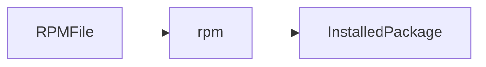
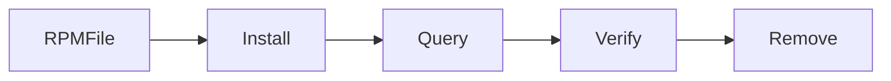

# Package Management

## Overview

Package Management is the process of installing, updating, upgrading, configuring, and removing software on a Linux system.

A **package** is a compressed archive that contains:

- Application binaries
- Libraries
- Configuration files
- Documentation
- Metadata (version, dependencies, etc.)

Linux distributions use different package managers depending on the distribution family.

> **Interview Point**
>
> - **Ubuntu/Debian** → `apt`
> - **RHEL/CentOS 7** → `yum`
> - **RHEL/CentOS 8+, Fedora** → `dnf`
> - **rpm** is the low-level package manager for RPM-based distributions.

---

## Why It Is Used

Package managers help administrators to:

- Install software
- Upgrade applications
- Update security patches
- Resolve dependencies
- Remove unused software
- Manage repositories

---

## Architecture / Working


---

## Key Components

| Component | Purpose |
|------------|----------|
| Package | Software archive |
| Repository | Collection of packages |
| Package Manager | Installs and manages packages |
| Dependencies | Required libraries/software |
| Metadata | Version, checksum, dependencies |

---

## Types

### Debian Family

- Ubuntu
- Debian

Package Manager

```text
APT
```

Package Format

```text
.deb
```

---

### Red Hat Family

- RHEL
- CentOS
- Rocky Linux
- AlmaLinux
- Fedora

Package Manager

```text
YUM / DNF
```

Package Format

```text
.rpm
```

---

## Lifecycle / Workflow


---

## Configuration / Syntax

General workflow

```bash
Search

Install

Update

Upgrade

Remove
```

---

## Important Commands

Ubuntu

```bash
apt
```

RHEL

```bash
yum

dnf

rpm
```

---

## Important Files

| File | Purpose |
|------|---------|
| /etc/apt/sources.list | Ubuntu repositories |
| /etc/apt/sources.list.d/ | Additional APT repositories |
| /etc/yum.repos.d/ | YUM/DNF repositories |
| /var/lib/dpkg/ | Debian package database |
| /var/lib/rpm/ | RPM package database |

---

## Real-World Use Cases

- Install Docker
- Install Git
- Install Kubernetes tools
- Upgrade production servers
- Apply security patches
- Install monitoring agents

---

## Advantages

- Automatic dependency handling
- Easy software installation
- Secure repositories
- Simplified updates

---

## Limitations

- Repository availability required
- Incorrect repositories may install incompatible packages
- Version conflicts can occur

---

## Common Interview Questions (Concept Only)

- What is a package manager?
- Difference between `apt` and `rpm`?
- Difference between `yum` and `dnf`?
- What is dependency resolution?
- What is a repository?

---

## Common Mistakes

- Forgetting to update repository metadata before installing packages
- Installing software from untrusted repositories
- Removing packages without understanding dependency impacts

---

## Troubleshooting

| Problem | Solution |
|----------|----------|
| Package not found | Update package metadata or verify repositories |
| Dependency errors | Resolve missing dependencies or repair package database |
| Repository unavailable | Verify network connectivity and repository configuration |
| Installation failed | Check permissions and available disk space |

---

## Summary

Package Management simplifies software installation, updates, dependency resolution, and maintenance, making it one of the most important Linux administration skills.

---

# apt

## Overview

`apt` (Advanced Package Tool) is the default package manager for Debian-based Linux distributions.

It manages:

- Installation
- Updates
- Upgrades
- Removal
- Dependency resolution

> **Interview Point**
>
> `apt` automatically installs required dependencies, unlike low-level package managers.

---

## Why It Is Used

- Install software
- Update repositories
- Upgrade packages
- Remove applications

---

## Architecture / Working


---

## Key Components

| Component | Purpose |
|------------|----------|
| Repository | Software source |
| Package Cache | Local package metadata |
| Dependency Resolver | Installs required packages |

---

## Lifecycle / Workflow


---

## Configuration / Syntax

Update repository metadata

```bash
sudo apt update
```

Upgrade packages

```bash
sudo apt upgrade
```

Install package

```bash
sudo apt install nginx
```

Remove package

```bash
sudo apt remove nginx
```

Search package

```bash
apt search docker
```

Show package information

```bash
apt show nginx
```

---

## Important Commands

```bash
apt update

apt upgrade

apt install

apt remove

apt purge

apt search

apt show

apt autoremove
```

---

## Important Files

| File | Purpose |
|------|---------|
| /etc/apt/sources.list | Repository list |
| /etc/apt/sources.list.d/ | Additional repositories |

---

## Real-World Use Cases

- Install Docker
- Install Azure CLI
- Install Git
- Install Kubernetes tools
- Apply security updates

---

## Advantages

- Automatic dependency resolution
- Easy updates
- Reliable package management

---

## Limitations

- Available only on Debian-based systems

---

## Common Interview Questions (Concept Only)

- Difference between `apt update` and `apt upgrade`?
- What does `apt autoremove` do?
- Difference between `remove` and `purge`?

---

## Common Mistakes

- Running `apt install` without updating package metadata
- Confusing `remove` with `purge`
- Interrupting package operations

---

## Troubleshooting

| Problem | Solution |
|----------|----------|
| Package not found | Run `apt update` |
| Dependency issues | Run `apt --fix-broken install` |
| Repository errors | Verify `/etc/apt/sources.list` |

---

## Summary

`apt` is the standard package manager for Debian-based systems and provides automatic dependency management and software maintenance.

---

# yum

## Overview

`yum` (Yellowdog Updater Modified) is the traditional package manager for RHEL and CentOS systems.

It manages RPM packages while automatically resolving dependencies.

> **Interview Point**
>
> `yum` is commonly used on **RHEL 7** and **CentOS 7**, while newer distributions use `dnf`.

---

## Why It Is Used

- Install software
- Update packages
- Remove packages
- Manage repositories

---

## Architecture / Working


---

## Key Components

| Component | Purpose |
|------------|----------|
| RPM Package | Software package |
| Repository | Software source |
| Dependency Resolver | Resolves required packages |

---

## Lifecycle / Workflow


---

## Configuration / Syntax

Install package

```bash
sudo yum install httpd
```

Update packages

```bash
sudo yum update
```

Remove package

```bash
sudo yum remove httpd
```

Search package

```bash
yum search docker
```

---

## Important Commands

```bash
yum install

yum update

yum remove

yum search

yum info

yum list
```

---

## Important Files

| File | Purpose |
|------|---------|
| /etc/yum.repos.d/ | Repository configuration |

---

## Real-World Use Cases

- Install Apache
- Install Docker
- Patch RHEL servers

---

## Advantages

- Automatic dependency resolution
- Stable enterprise package management

---

## Limitations

- Slower than `dnf`
- Largely replaced by `dnf` on newer systems

---

## Common Interview Questions (Concept Only)

- Difference between `yum` and `rpm`?
- Why was `dnf` introduced?

---

## Common Mistakes

- Using outdated repositories
- Ignoring dependency conflicts

---

## Troubleshooting

| Problem | Solution |
|----------|----------|
| Repository unavailable | Verify repository configuration |
| Package conflicts | Resolve dependencies or clean metadata |

---

## Summary

`yum` is the traditional package manager for RPM-based systems and provides dependency-aware software management.

---

# dnf

## Overview

`dnf` (Dandified YUM) is the modern replacement for `yum`.

It offers:

- Faster dependency resolution
- Better performance
- Lower memory usage
- Improved package management

> **Interview Point**
>
> `dnf` is the default package manager on **RHEL 8+, Rocky Linux, AlmaLinux, and Fedora**.

---

## Why It Is Used

- Install packages
- Upgrade software
- Apply security updates
- Manage repositories

---

## Architecture / Working


---

## Key Components

| Component | Purpose |
|------------|----------|
| RPM Package | Software package |
| Repository | Package source |
| Dependency Solver | Resolves dependencies |

---

## Lifecycle / Workflow


---

## Configuration / Syntax

Install package

```bash
sudo dnf install nginx
```

Update system

```bash
sudo dnf update
```

Remove package

```bash
sudo dnf remove nginx
```

Search package

```bash
dnf search docker
```

---

## Important Commands

```bash
dnf install

dnf update

dnf remove

dnf search

dnf info

dnf list
```

---

## Important Files

| File | Purpose |
|------|---------|
| /etc/yum.repos.d/ | Repository configuration |

---

## Real-World Use Cases

- Enterprise Linux administration
- Cloud VM management
- Security patching

---

## Advantages

- Faster dependency resolution
- Improved performance
- Better package handling

---

## Limitations

- Available only on newer RPM-based distributions

---

## Common Interview Questions (Concept Only)

- Difference between `yum` and `dnf`?
- Why was `dnf` introduced?

---

## Common Mistakes

- Assuming all legacy `yum` plugins are available in `dnf`
- Mixing repositories from different distribution versions

---

## Troubleshooting

| Problem | Solution |
|----------|----------|
| Repository issue | Verify repository configuration |
| Metadata errors | Run `dnf clean all` followed by `dnf makecache` if needed |

---

## Summary

`dnf` is the modern package manager for RPM-based Linux systems, providing faster dependency resolution and improved package management.

---

# rpm

## Overview

`rpm` (RPM Package Manager) is the low-level package management tool for RPM-based Linux distributions.

Unlike `yum` and `dnf`, it **does not automatically resolve dependencies**.

> **Interview Point**
>
> `rpm` installs individual RPM packages but does **not** download required dependencies automatically.

---

## Why It Is Used

- Install local RPM packages
- Query installed software
- Verify packages
- Remove RPM packages

---

## Architecture / Working



---

## Key Components

| Component | Purpose |
|------------|----------|
| RPM Package | Software archive |
| RPM Database | Installed package information |

---

## Lifecycle / Workflow



---

## Configuration / Syntax

Install package

```bash
sudo rpm -ivh package.rpm
```

Upgrade package

```bash
sudo rpm -Uvh package.rpm
```

Remove package

```bash
sudo rpm -e package-name
```

Query installed package

```bash
rpm -q nginx
```

List installed packages

```bash
rpm -qa
```

Verify package

```bash
rpm -V package-name
```

---

## Important Commands

```bash
rpm -ivh

rpm -Uvh

rpm -e

rpm -q

rpm -qa

rpm -V
```

---

## Important Files

| File | Purpose |
|------|---------|
| /var/lib/rpm/ | RPM database |

---

## Real-World Use Cases

- Install vendor-provided RPM packages
- Verify installed software
- Audit package installations
- Offline software installation

---

## Advantages

- Direct RPM package installation
- Useful for local package management
- Supports package verification

---

## Limitations

- Does not resolve dependencies automatically
- Less convenient than `dnf` or `yum` for repository-based installations

---

## Common Interview Questions (Concept Only)

- Difference between `rpm` and `yum`?
- Why is `rpm` considered a low-level package manager?
- What does `rpm -q` do?
- What is the purpose of `rpm -V`?

---

## Common Mistakes

- Installing RPM packages without checking dependencies
- Using `rpm` when `dnf` or `yum` would handle dependencies automatically
- Forgetting to verify package integrity

---

## Troubleshooting

| Problem | Solution |
|----------|----------|
| Dependency failed | Install missing dependencies manually or use `dnf`/`yum` instead |
| Package already installed | Use `rpm -Uvh` to upgrade |
| Corrupted package | Verify the RPM file and download it again if necessary |

---

## Summary

`rpm` is the foundational package management tool for RPM-based Linux systems. It is commonly used for local package installation, querying, and verification, while `yum` and `dnf` build on top of it to provide automatic dependency management.
