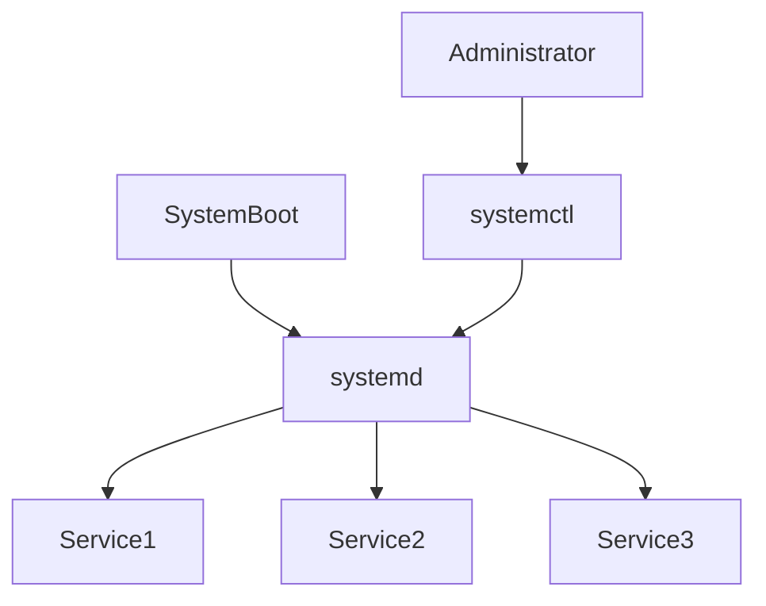
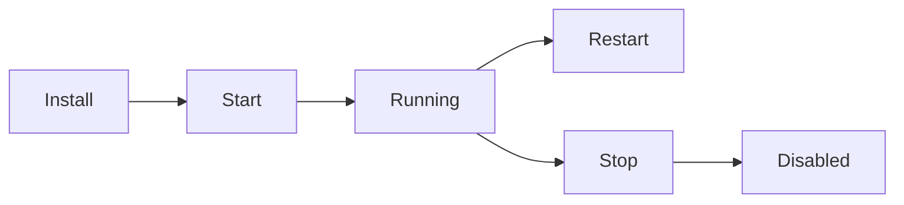
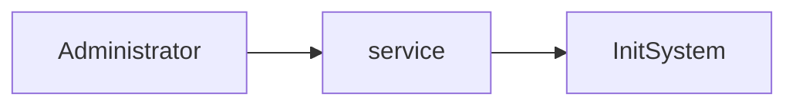
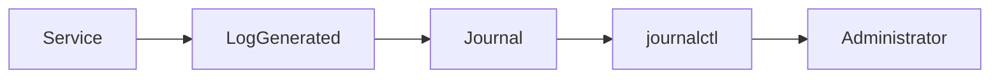

# Service Management

## Overview

Service Management in Linux refers to controlling and monitoring background processes called **services (daemons)**.

Examples of services include:

- Nginx
- Apache
- Docker
- SSH
- MySQL
- Jenkins
- Kubernetes Kubelet

Modern Linux distributions use **systemd** as the init system and **systemctl** as the primary command-line tool for service management.

> **Interview Point**
>
> Most modern Linux distributions (Ubuntu, Debian, RHEL, CentOS, Rocky, AlmaLinux, Fedora) use **systemd** instead of older SysV init systems.

---

## Why It Is Used

Service management is used to:

- Start and stop services
- Enable services at boot
- Monitor service health
- Troubleshoot failures
- Restart applications after configuration changes
- Manage production servers

---

## Architecture / Working



---

## Key Components

| Component | Purpose |
|------------|----------|
| systemd | Init system and service manager |
| systemctl | Manage services |
| journalctl | View service logs |
| Unit File | Configuration file for a service |
| Daemon | Background service |

---

## Types

### Service States

| State | Description |
|--------|-------------|
| active | Service is running |
| inactive | Service is stopped |
| failed | Service failed to start or crashed |
| enabled | Starts automatically during boot |
| disabled | Does not start automatically |
| masked | Cannot be started until unmasked |

---

## Lifecycle / Workflow



---

## Configuration / Syntax

General workflow

```bash
systemctl

journalctl
```

---

## Important Commands

```bash
systemctl

service

journalctl
```

---

## Important Files

| File | Purpose |
|------|---------|
| /etc/systemd/system/ | Custom systemd unit files |
| /usr/lib/systemd/system/ | Default unit files (may be `/lib/systemd/system/` depending on the distribution) |
| /etc/init.d/ | Legacy SysV service scripts |
| /var/log/ | Traditional log directory (where applicable) |

---

## Real-World Use Cases

- Start Docker service
- Restart Nginx after configuration changes
- Enable Jenkins after installation
- Troubleshoot failed Kubernetes services
- Check SSH service status
- Analyze production service failures

---

## Advantages

- Easy service management
- Automatic boot handling
- Dependency management
- Centralized logging
- Fast startup

---

## Limitations

- Requires familiarity with `systemd`
- Older Linux distributions may still use SysV init

---

## Common Interview Questions (Concept Only)

- What is systemd?
- Difference between `systemctl` and `service`?
- What is a daemon?
- Difference between enable and start?
- What is a unit file?

---

## Common Mistakes

- Forgetting to enable a service after installation
- Restarting services without checking logs
- Editing the wrong unit file
- Confusing service status with boot configuration

---

## Troubleshooting

| Problem | Solution |
|----------|----------|
| Service failed | Check `systemctl status` and `journalctl` logs |
| Service not starting at boot | Verify it is enabled |
| Configuration changes not applied | Restart or reload the service as appropriate |
| Service repeatedly crashes | Review logs, dependencies, and configuration |

---

## Summary

Service Management allows Linux administrators to control system services, monitor application health, and troubleshoot production environments using `systemctl`, `service`, and `journalctl`.

---

# systemctl

## Overview

`systemctl` is the primary command used to manage **systemd services**.

It controls:

- Starting services
- Stopping services
- Restarting services
- Viewing status
- Enabling boot startup
- Reloading configuration
- Managing systemd units

> **Interview Point**
>
> `systemctl` manages **systemd units**, not just services. Units include services, sockets, timers, mounts, targets, and more.

---

## Why It Is Used

- Manage services
- Configure startup behavior
- Restart applications
- Troubleshoot production systems

---

## Architecture / Working


---

## Key Components

| Command | Purpose |
|----------|----------|
| start | Start service |
| stop | Stop service |
| restart | Restart service |
| reload | Reload configuration without full restart (if supported) |
| status | Show service status |
| enable | Start service at boot |
| disable | Disable automatic startup |

---

## Types

### Common Operations

- Start
- Stop
- Restart
- Reload
- Enable
- Disable
- Status

---

## Lifecycle / Workflow


---

## Configuration / Syntax

Start service

```bash
sudo systemctl start nginx
```

Stop service

```bash
sudo systemctl stop nginx
```

Restart service

```bash
sudo systemctl restart nginx
```

Reload configuration

```bash
sudo systemctl reload nginx
```

View status

```bash
systemctl status nginx
```

Enable at boot

```bash
sudo systemctl enable nginx
```

Disable at boot

```bash
sudo systemctl disable nginx
```

Reload systemd configuration after unit file changes

```bash
sudo systemctl daemon-reload
```

---

## Important Commands

```bash
systemctl start

systemctl stop

systemctl restart

systemctl reload

systemctl status

systemctl enable

systemctl disable

systemctl is-enabled

systemctl list-units

systemctl daemon-reload
```

---

## Important Files

| File | Purpose |
|------|---------|
| /etc/systemd/system/ | Custom unit files |
| /usr/lib/systemd/system/ | Default unit files (or `/lib/systemd/system/` on some distributions) |

---

## Real-World Use Cases

- Restart Docker
- Restart Jenkins
- Enable SSH
- Restart Kubernetes services
- Reload Nginx after configuration updates

---

## Advantages

- Unified management
- Boot integration
- Dependency handling
- Centralized control

---

## Limitations

- Works only on systemd-based distributions

---

## Common Interview Questions (Concept Only)

- Difference between restart and reload?
- Difference between enable and start?
- What does `daemon-reload` do?
- What is a systemd unit?

---

## Common Mistakes

- Forgetting `daemon-reload` after modifying a unit file
- Using `restart` when `reload` is sufficient
- Assuming `enable` starts a service immediately

---

## Troubleshooting

| Problem | Solution |
|----------|----------|
| Service failed | Check `systemctl status` and `journalctl` |
| Service not enabled | Use `systemctl enable` |
| Unit file changes ignored | Run `systemctl daemon-reload` |

---

## Summary

`systemctl` is the primary utility for managing services and other systemd units on modern Linux systems.

---

# service

## Overview

`service` is a legacy command used to manage services on Linux.

It provides a simplified interface and works with:

- SysV init scripts
- systemd (via compatibility layer on many distributions)

> **Interview Point**
>
> On modern Linux systems, `service` often forwards commands to `systemctl`, but `systemctl` is the preferred tool.

---

## Why It Is Used

- Manage services on older systems
- Maintain compatibility with legacy scripts

---

## Architecture / Working



---

## Key Components

| Command | Purpose |
|----------|----------|
| start | Start service |
| stop | Stop service |
| restart | Restart service |
| status | View service status |

---

## Lifecycle / Workflow


---

## Configuration / Syntax

Start service

```bash
sudo service nginx start
```

Stop service

```bash
sudo service nginx stop
```

Restart service

```bash
sudo service nginx restart
```

View status

```bash
service nginx status
```

---

## Important Commands

```bash
service start

service stop

service restart

service status
```

---

## Important Files

| File | Purpose |
|------|---------|
| /etc/init.d/ | Legacy service scripts |

---

## Real-World Use Cases

- Managing services on older Linux distributions
- Legacy automation scripts

---

## Advantages

- Simple syntax
- Backward compatibility

---

## Limitations

- Limited functionality compared to `systemctl`
- Not recommended for new automation on systemd-based systems

---

## Common Interview Questions (Concept Only)

- Difference between `service` and `systemctl`?
- Why is `systemctl` preferred?

---

## Common Mistakes

- Using `service` for advanced systemd operations such as enable/disable

---

## Troubleshooting

| Problem | Solution |
|----------|----------|
| Command not working | Use `systemctl` on systemd-based systems |

---

## Summary

`service` is a legacy service management utility maintained primarily for backward compatibility.

---

# journalctl

## Overview

`journalctl` displays logs collected by the **systemd journal**.

It is the primary tool for viewing:

- System logs
- Service logs
- Boot logs
- Kernel messages
- Authentication events (where available)

> **Interview Point**
>
> When a service fails, the first troubleshooting step is typically:
>
> 1. `systemctl status <service>`
> 2. `journalctl -u <service>`

---

## Why It Is Used

- Troubleshoot services
- Analyze boot failures
- Investigate production incidents
- Debug application startup problems

---

## Architecture / Working


---

## Key Components

| Command | Purpose |
|----------|----------|
| -u | View logs for a specific service |
| -b | Current boot logs |
| -f | Follow logs in real time |
| -n | Show last N log entries |
| --since | Display logs after a specified time |
| --until | Display logs before a specified time |

---

## Types

### Common Log Categories

- Service logs
- Boot logs
- Kernel logs
- User logs
- System logs

---

## Lifecycle / Workflow



---

## Configuration / Syntax

Show all logs

```bash
journalctl
```

View logs for a service

```bash
journalctl -u nginx
```

Follow logs in real time

```bash
journalctl -f
```

Show last 100 log entries

```bash
journalctl -n 100
```

View logs from the current boot

```bash
journalctl -b
```

View logs since a specific time

```bash
journalctl --since "1 hour ago"
```

---

## Important Commands

```bash
journalctl

journalctl -u

journalctl -f

journalctl -b

journalctl -n

journalctl --since
```

---

## Important Files

| File | Purpose |
|------|---------|
| /var/log/journal/ | Persistent systemd journal (if enabled) |
| /run/log/journal/ | Volatile journal stored in memory |

---

## Real-World Use Cases

- Debug failed Docker service
- Investigate Jenkins startup failures
- Analyze Kubernetes node issues
- Troubleshoot SSH login failures
- Review boot-time errors

---

## Advantages

- Centralized logging
- Powerful filtering
- Real-time monitoring
- Boot-specific log analysis

---

## Limitations

- Logs may be volatile if persistent journaling is not configured
- Output can be extensive without filters

---

## Common Interview Questions (Concept Only)

- What is `journalctl`?
- How do you view logs for a specific service?
- How do you follow logs in real time?
- Difference between `systemctl status` and `journalctl`?
- Where are systemd journal logs stored?

---

## Common Mistakes

- Searching the entire journal instead of filtering by service
- Forgetting that older logs may not be available if persistent journaling is disabled

---

## Troubleshooting

| Problem | Solution |
|----------|----------|
| No logs displayed | Verify the service exists and journaling is enabled |
| Too many logs | Filter using `-u`, `-b`, `-n`, or `--since` |
| Service failure | Check `systemctl status` first, then inspect `journalctl -u <service>` |

---

## Summary

`journalctl` is the primary logging tool for systemd-based Linux systems. It provides centralized, searchable logs that are essential for diagnosing service failures, startup issues, and production incidents.
