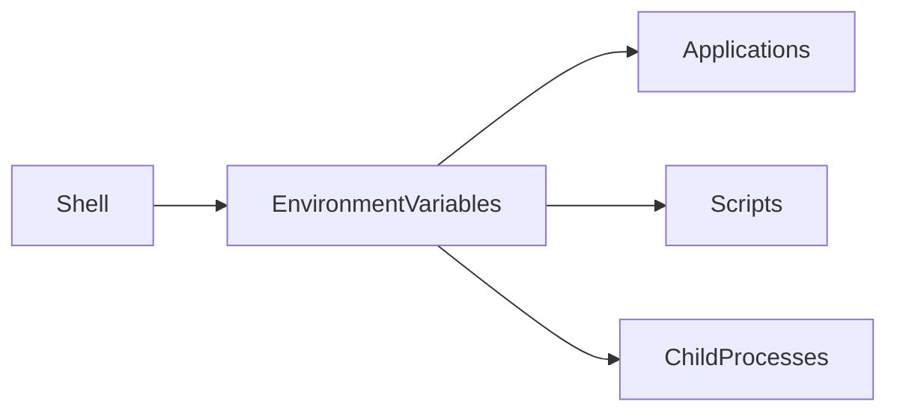

# Environment Variables

## Overview

Environment Variables are **key-value pairs** maintained by the Linux shell that store configuration and runtime information for the operating system, applications, and user sessions.

They allow programs and scripts to access important system information without hardcoding values.

Examples:

- User name
- Home directory
- Executable search path
- Hostname
- Default shell
- Language settings

Environment variables are heavily used in:

- Shell scripting
- DevOps automation
- CI/CD pipelines
- Docker
- Kubernetes
- Cloud deployments

> **Interview Point**
>
> Environment variables exist in the **current shell session** unless exported or permanently configured.

---

## Why It Is Used

Environment variables help to:

- Store configuration values
- Avoid hardcoding paths
- Configure applications
- Share variables between processes
- Customize user environments
- Securely reference configuration values

---

## Architecture / Working



---

## Key Components

| Component | Purpose |
|------------|----------|
| Variable Name | Identifier (e.g., PATH) |
| Value | Stored information |
| Shell | Stores variables |
| export | Makes variables available to child processes |

---

## Types

### Shell Variables

- Available only in the current shell
- Not inherited by child processes

Example

```bash
NAME=Akshay
```

---

### Environment Variables

- Exported variables
- Available to child processes

Example

```bash
export NAME=Akshay
```

---

## Lifecycle / Workflow


---

## Configuration / Syntax

Create variable

```bash
NAME=Akshay
```

Export variable

```bash
export NAME=Akshay
```

Access variable

```bash
echo $NAME
```

Delete variable

```bash
unset NAME
```

---

## Important Commands

```bash
export

env

printenv

echo

unset
```

---

## Important Files

| File | Purpose |
|------|---------|
| ~/.bashrc | User shell configuration |
| ~/.profile | User login environment |
| ~/.bash_profile | Login shell configuration (distribution-dependent) |
| /etc/profile | System-wide environment settings |
| /etc/environment | System-wide environment variables |

---

## Real-World Use Cases

- Store application configuration
- Configure Java Home
- Set PATH
- Store cloud credentials
- Configure Docker applications
- Configure Kubernetes applications
- Azure DevOps Pipeline variables

---

## Advantages

- Easy configuration management
- Avoids hardcoding
- Supports automation
- Easy customization

---

## Limitations

- Lost after logout unless configured permanently
- Sensitive values can be exposed if handled improperly
- Session-specific unless exported or persisted

---

## Common Interview Questions (Concept Only)

- What are environment variables?
- Difference between shell variables and environment variables?
- What does `export` do?
- Where are environment variables stored permanently?
- How do child processes access environment variables?

---

## Common Mistakes

- Forgetting to export variables
- Hardcoding configuration values
- Storing sensitive secrets in plain text
- Editing the wrong startup file

---

## Troubleshooting

| Problem | Solution |
|----------|----------|
| Variable not available | Verify it has been exported |
| Variable lost after reboot | Add it to `.bashrc`, `.profile`, or `/etc/environment` |
| Command not found | Check the `PATH` variable |
| Wrong variable value | Use `echo` or `printenv` to verify |

---

## Summary

Environment Variables provide a flexible mechanism for configuring Linux systems and applications. They are fundamental to shell scripting, DevOps automation, cloud platforms, and CI/CD pipelines.

---

# PATH

## Overview

`PATH` is one of the most important environment variables in Linux.

It contains a list of directories that the shell searches when executing commands.

Without `PATH`, users would need to type the full path of every executable.

> **Interview Point**
>
> When a command is executed, Linux searches directories in the `PATH` variable **from left to right**.

---

## Why It Is Used

- Locate executables
- Simplify command execution
- Support custom applications
- Configure development tools

---

## Architecture / Working


---

## Key Components

Example

```text
/usr/local/bin:/usr/bin:/bin
```

Each directory is separated using a colon (`:`).

---

## Lifecycle / Workflow


---

## Configuration / Syntax

Display PATH

```bash
echo $PATH
```

Temporarily add directory

```bash
export PATH=$PATH:/opt/scripts
```

---

## Important Commands

```bash
echo $PATH

export PATH

which
```

---

## Important Files

| File | Purpose |
|------|---------|
| ~/.bashrc | User PATH configuration |
| /etc/profile | System PATH |
| /etc/environment | Global PATH |

---

## Real-World Use Cases

- Add Terraform
- Add Azure CLI
- Add Kubernetes binaries
- Add custom scripts

---

## Advantages

- Simplifies command execution
- Supports custom tools

---

## Limitations

- Incorrect PATH values can prevent commands from being found

---

## Common Interview Questions (Concept Only)

- What is PATH?
- How does Linux locate commands?
- How do you permanently modify PATH?

---

## Common Mistakes

- Overwriting PATH instead of appending to it
- Adding invalid directories

---

## Troubleshooting

| Problem | Solution |
|----------|----------|
| Command not found | Verify PATH and executable location |
| Wrong executable used | Check the order of directories in PATH |

---

## Summary

`PATH` tells Linux where to search for executable programs and is one of the most critical environment variables.

---

# HOME

## Overview

`HOME` stores the path to the current user's home directory.

Example

```text
/home/akshay
```

---

## Why It Is Used

Applications use HOME to:

- Store configuration files
- Save user data
- Locate default directories

---

## Architecture / Working


---

## Configuration / Syntax

Display HOME

```bash
echo $HOME
```

---

## Important Commands

```bash
echo $HOME

cd
```

---

## Important Files

| File | Purpose |
|------|---------|
| /etc/passwd | Stores user home directories |

---

## Real-World Use Cases

- User configuration
- Shell initialization
- SSH configuration

---

## Advantages

- Standardized user location

---

## Limitations

- Incorrect values may affect user applications

---

## Common Interview Questions (Concept Only)

- What is HOME?
- Where is HOME configured?

---

## Common Mistakes

- Hardcoding user directories instead of using `$HOME`

---

## Troubleshooting

| Problem | Solution |
|----------|----------|
| Incorrect HOME | Verify `/etc/passwd` and login configuration |

---

## Summary

`HOME` identifies the current user's home directory and is widely used by applications and scripts.

---

# USER

## Overview

`USER` stores the username of the currently logged-in user.

Example

```text
akshay
```

---

## Why It Is Used

- Identify current user
- User-specific scripting
- Access control

---

## Architecture / Working


---

## Configuration / Syntax

```bash
echo $USER
```

---

## Important Commands

```bash
echo $USER

whoami

id
```

---

## Important Files

| File | Purpose |
|------|---------|
| /etc/passwd | User information |

---

## Real-World Use Cases

- Shell scripting
- Logging
- Automation

---

## Advantages

- Easy user identification

---

## Limitations

- Reflects only the current session

---

## Common Interview Questions (Concept Only)

- Difference between `USER` and `whoami`?

---

## Common Mistakes

- Assuming `USER` always reflects effective privileges after privilege escalation

---

## Troubleshooting

| Problem | Solution |
|----------|----------|
| Unexpected value | Verify the login session and effective user context |

---

## Summary

`USER` stores the current login username and is commonly used in scripts and automation.

---

# HOSTNAME

## Overview

`HOSTNAME` stores the system's hostname.

Example

```text
web-server-01
```

---

## Why It Is Used

- Server identification
- Logging
- Automation
- Cluster management

---

## Architecture / Working


---

## Configuration / Syntax

```bash
echo $HOSTNAME
```

---

## Important Commands

```bash
hostname

hostnamectl

echo $HOSTNAME
```

---

## Important Files

| File | Purpose |
|------|---------|
| /etc/hostname | System hostname |

---

## Real-World Use Cases

- Cloud VMs
- Kubernetes nodes
- Logging

---

## Advantages

- Easy server identification

---

## Limitations

- Changing the hostname does not automatically update DNS

---

## Common Interview Questions (Concept Only)

- Difference between hostname and IP address?

---

## Common Mistakes

- Expecting hostname changes to update DNS automatically

---

## Troubleshooting

| Problem | Solution |
|----------|----------|
| Incorrect hostname | Verify `/etc/hostname` and use `hostnamectl` if needed |

---

## Summary

`HOSTNAME` identifies the Linux system and is commonly referenced by applications and automation.

---

# export

## Overview

`export` converts a shell variable into an environment variable so that child processes can access it.

> **Interview Point**
>
> Without `export`, a variable remains local to the current shell.

---

## Why It Is Used

- Share variables with child processes
- Configure applications
- Set runtime variables

---

## Architecture / Working


---

## Configuration / Syntax

Export variable

```bash
export NAME=Akshay
```

Export existing variable

```bash
export PATH
```

---

## Important Commands

```bash
export
```

---

## Real-World Use Cases

- Java Home
- Terraform variables
- AWS credentials
- Azure credentials
- CI/CD variables

---

## Advantages

- Makes variables accessible to child processes
- Simple and widely supported

---

## Limitations

- Changes are temporary unless added to startup files

---

## Common Interview Questions (Concept Only)

- What does `export` do?
- Why is `export` needed?

---

## Common Mistakes

- Forgetting to export variables before running dependent applications

---

## Troubleshooting

| Problem | Solution |
|----------|----------|
| Variable unavailable in child process | Verify it was exported |

---

## Summary

`export` makes shell variables available to child processes and is essential for configuring applications and automation.

---

# env

## Overview

`env` displays the current environment variables and can also execute commands with modified environments.

---

## Why It Is Used

- View environment variables
- Run commands with temporary variables
- Debug application environments

---

## Architecture / Working


---

## Configuration / Syntax

Display all variables

```bash
env
```

Run a command with a temporary variable

```bash
env APP_ENV=production ./app
```

---

## Important Commands

```bash
env
```

---

## Real-World Use Cases

- Debug CI/CD environments
- Test temporary configuration
- Inspect runtime environments

---

## Advantages

- Quick environment inspection
- Temporary overrides without changing the current shell

---

## Limitations

- Output may include many variables, making it harder to locate specific values

---

## Common Interview Questions (Concept Only)

- Difference between `env` and `printenv`?

---

## Common Mistakes

- Expecting `env` to permanently change the environment

---

## Troubleshooting

| Problem | Solution |
|----------|----------|
| Variable missing | Verify it has been exported |

---

## Summary

`env` displays environment variables and allows temporary environment customization when launching commands.

---

# printenv

## Overview

`printenv` prints environment variables.

It can display:

- All environment variables
- A specific environment variable

Unlike `env`, it is primarily intended for displaying environment values.

---

## Why It Is Used

- Verify variables
- Debug scripts
- Inspect runtime environments

---

## Architecture / Working


---

## Configuration / Syntax

Display all variables

```bash
printenv
```

Display a specific variable

```bash
printenv PATH
```

---

## Important Commands

```bash
printenv

printenv PATH

printenv HOME
```

---

## Real-World Use Cases

- Debug CI/CD pipelines
- Verify Docker environment variables
- Check Kubernetes Pod environment variables

---

## Advantages

- Simple
- Fast
- Easy to use

---

## Limitations

- Displays only exported environment variables, not local shell variables

---

## Common Interview Questions (Concept Only)

- Difference between `env` and `printenv`?
- When should `printenv` be used?

---

## Common Mistakes

- Expecting `printenv` to display non-exported shell variables

---

## Troubleshooting

| Problem | Solution |
|----------|----------|
| Variable not shown | Ensure it has been exported to the environment |

---

## Summary

`printenv` is a simple utility for viewing exported environment variables and is commonly used for troubleshooting scripts, applications, and CI/CD pipelines.
