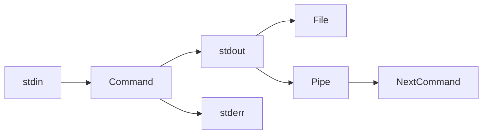
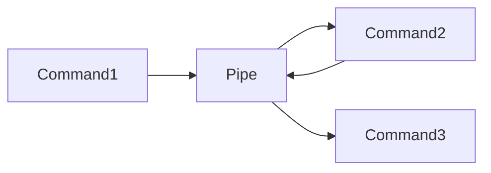
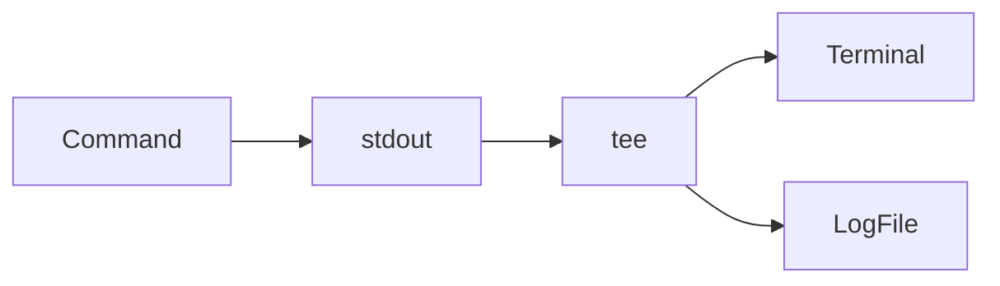
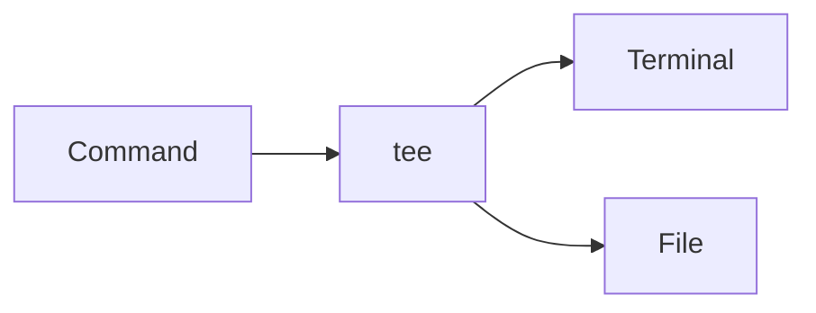

# Shell Redirection & Pipes

## Overview

Shell Redirection and Pipes are fundamental Linux features that control how commands receive input and produce output.

Every Linux process communicates through three standard data streams:

- **Standard Input (stdin)** – Receives input
- **Standard Output (stdout)** – Produces normal output
- **Standard Error (stderr)** – Produces error messages

Redirection operators (`>`, `>>`, `<`, `2>`, etc.) and pipes (`|`) allow administrators to connect commands, save output to files, and build powerful automation scripts.

These concepts are heavily used in:

- Bash scripting
- DevOps automation
- CI/CD pipelines
- Log analysis
- System administration

> **Interview Point**
>
> Understanding **stdin, stdout, stderr, redirection, and pipes** is one of the most frequently tested Linux interview topics.

---

## Why It Is Used

Shell redirection and pipes help to:

- Save command output
- Read input from files
- Chain multiple commands
- Redirect errors
- Process logs efficiently
- Build automation scripts

---

## Architecture / Working



---

## Key Components

| Stream | File Descriptor | Purpose |
|---------|----------------:|----------|
| stdin | 0 | Input |
| stdout | 1 | Normal output |
| stderr | 2 | Error output |

---

## Types

### Input Redirection

```text
<
```

### Output Redirection

```text
>
>>
```

### Error Redirection

```text
2>
2>>
```

### Pipe

```text
|
```

---

## Lifecycle / Workflow


---

## Configuration / Syntax

```bash
<

>

>>

|

tee
```

---

## Important Commands

```bash
cat

grep

sort

uniq

tee
```

---

## Important Files

Not applicable (shell feature).

---

## Real-World Use Cases

- Analyze logs
- Save command output
- Combine multiple commands
- Build CI/CD scripts
- Filter application logs
- Debug production issues

---

## Advantages

- Powerful automation
- Efficient command chaining
- Flexible input/output handling
- Easy log processing

---

## Limitations

- Complex pipelines can be difficult to debug
- Redirection may overwrite files if used incorrectly

---

## Common Interview Questions (Concept Only)

- What are stdin, stdout, and stderr?
- What is the difference between `>` and `>>`?
- What is a pipe?
- Why is `tee` used?
- What is file descriptor 2?
- Difference between redirection and pipes?

---

## Common Mistakes

- Accidentally overwriting files with `>`
- Ignoring stderr during troubleshooting
- Using a pipe where input redirection is more appropriate
- Forgetting to quote filenames containing spaces

---

## Troubleshooting

| Problem | Solution |
|----------|----------|
| Output missing | Verify redirection operators |
| Errors not captured | Redirect stderr separately or combine streams |
| Pipeline failed | Test each command individually |
| File overwritten | Use `>>` when appending is intended |

---

## Summary

Shell Redirection and Pipes enable Linux users to control command input/output, connect commands, automate workflows, and efficiently process data.

---

# Standard Input (stdin)

## Overview

**Standard Input (stdin)** is the default input stream used by a program.

File descriptor:

```text
0
```

By default, stdin comes from the keyboard.

> **Interview Point**
>
> stdin has **file descriptor 0**.

---

## Why It Is Used

- Read user input
- Read data from files
- Pass data to commands

---

## Architecture / Working


---

## Key Components

| Component | Description |
|------------|-------------|
| stdin | Standard Input |
| File Descriptor | 0 |

---

## Configuration / Syntax

Read input from a file

```bash
sort < file.txt
```

---

## Important Commands

```bash
<

cat

sort
```

---

## Real-World Use Cases

- Feed configuration files
- Read log files
- Automate scripts

---

## Advantages

- Flexible input source
- Easy automation

---

## Limitations

- Requires valid input

---

## Common Interview Questions (Concept Only)

- What is stdin?
- What is file descriptor 0?

---

## Common Mistakes

- Confusing input redirection with pipes

---

## Troubleshooting

| Problem | Solution |
|----------|----------|
| No input received | Verify the input file or source exists and is readable |

---

## Summary

stdin is the standard input stream used by commands and corresponds to file descriptor **0**.

---

# Standard Output (stdout)

## Overview

**Standard Output (stdout)** is the normal output stream produced by a command.

File descriptor:

```text
1
```

By default, stdout is displayed on the terminal.

> **Interview Point**
>
> stdout has **file descriptor 1**.

---

## Why It Is Used

- Display results
- Save output
- Pass output to another command

---

## Architecture / Working


---

## Key Components

| Component | Description |
|------------|-------------|
| stdout | Standard Output |
| File Descriptor | 1 |

---

## Configuration / Syntax

Overwrite output file

```bash
ls > files.txt
```

Append output

```bash
ls >> files.txt
```

---

## Important Commands

```bash
>

>>
```

---

## Real-World Use Cases

- Save logs
- Generate reports
- Capture script output

---

## Advantages

- Flexible output handling

---

## Limitations

- `>` overwrites existing files

---

## Common Interview Questions (Concept Only)

- What is stdout?
- Difference between `>` and `>>`?

---

## Common Mistakes

- Accidentally overwriting important files

---

## Troubleshooting

| Problem | Solution |
|----------|----------|
| Missing output | Verify output redirection and file permissions |

---

## Summary

stdout is the standard output stream used for normal command output and corresponds to file descriptor **1**.

---

# Standard Error (stderr)

## Overview

**Standard Error (stderr)** is the stream used for error messages.

File descriptor:

```text
2
```

stderr is separate from stdout, allowing errors to be redirected independently.

> **Interview Point**
>
> stderr has **file descriptor 2**.

---

## Why It Is Used

- Report errors
- Log failures
- Separate errors from normal output

---

## Architecture / Working


---

## Key Components

| Component | Description |
|------------|-------------|
| stderr | Error output |
| File Descriptor | 2 |

---

## Configuration / Syntax

Redirect errors

```bash
command 2> errors.log
```

Append errors

```bash
command 2>> errors.log
```

Redirect both stdout and stderr

```bash
command > output.log 2>&1
```

---

## Important Commands

```bash
2>

2>>

2>&1
```

---

## Real-World Use Cases

- Log failed deployments
- Capture application errors
- Debug CI/CD pipelines

---

## Advantages

- Separate error logging
- Easier troubleshooting

---

## Limitations

- Errors may be missed if not redirected or monitored

---

## Common Interview Questions (Concept Only)

- What is stderr?
- What is file descriptor 2?
- How do you redirect stderr?

---

## Common Mistakes

- Redirecting only stdout and forgetting stderr

---

## Troubleshooting

| Problem | Solution |
|----------|----------|
| Errors still displayed | Verify stderr is redirected correctly |

---

## Summary

stderr provides a dedicated stream for error messages and corresponds to file descriptor **2**.

---

# < (Input Redirection)

## Overview

The `<` operator redirects input from a file to a command instead of using keyboard input.

> **Interview Point**
>
> `<` changes the **input source**, not the output destination.

---

## Why It Is Used

- Automate commands
- Read configuration files
- Process data files

---

## Architecture / Working


---

## Configuration / Syntax

```bash
sort < names.txt
```

---

## Important Commands

```bash
<
```

---

## Real-World Use Cases

- Batch processing
- Automated testing
- Data analysis

---

## Advantages

- Simple
- Script-friendly

---

## Limitations

- Input file must exist and be readable

---

## Common Interview Questions (Concept Only)

- What does `<` do?

---

## Common Mistakes

- Confusing `<` with `|`

---

## Troubleshooting

| Problem | Solution |
|----------|----------|
| File not found | Verify file path and permissions |

---

## Summary

`<` redirects a file into a command's standard input.

---

# | (Pipe)

## Overview

The pipe operator (`|`) sends the **stdout** of one command directly to the **stdin** of another command.

It eliminates the need for temporary files and enables powerful command chaining.

> **Interview Point**
>
> A pipe transfers **stdout**, not stderr, unless stderr is redirected into stdout.

---

## Why It Is Used

- Combine commands
- Filter output
- Process logs
- Build automation workflows

---

## Architecture / Working


---

## Key Components

| Component | Purpose |
|------------|----------|
| Producer | Generates output |
| Pipe | Transfers output |
| Consumer | Receives input |

---

## Lifecycle / Workflow



---

## Configuration / Syntax

Search log entries

```bash
cat app.log | grep ERROR
```

Count matching lines

```bash
cat app.log | grep ERROR | wc -l
```

---

## Important Commands

```bash
|

grep

sort

uniq

wc
```

---

## Real-World Use Cases

- Analyze logs
- Count errors
- Filter processes
- CI/CD scripting

---

## Advantages

- Efficient
- No temporary files
- Highly composable

---

## Limitations

- Long pipelines can be difficult to debug

---

## Common Interview Questions (Concept Only)

- What is a pipe?
- Difference between `<` and `|`?
- Does a pipe transfer stderr?

---

## Common Mistakes

- Expecting stderr to flow through a pipe without redirection

---

## Troubleshooting

| Problem | Solution |
|----------|----------|
| Unexpected pipeline output | Test each command independently |

---

## Summary

Pipes connect commands by passing the stdout of one command to the stdin of another, enabling efficient data processing.

---

# tee

## Overview

`tee` reads input from **stdin**, writes it to **stdout**, and simultaneously saves it to one or more files.

Unlike normal output redirection, `tee` allows you to **view the output on the terminal while also saving it**.

> **Interview Point**
>
> `tee` is commonly used in shell scripts and CI/CD pipelines to log command output while keeping it visible in the console.

---

## Why It Is Used

- Save command output
- Monitor execution in real time
- Create logs during automation
- Debug scripts

---

## Architecture / Working



---

## Key Components

| Option | Purpose |
|---------|----------|
| tee | Write to file and terminal |
| -a | Append instead of overwrite |

---

## Lifecycle / Workflow



---

## Configuration / Syntax

Save output while displaying it

```bash
ls | tee files.txt
```

Append output

```bash
ls | tee -a files.txt
```

---

## Important Commands

```bash
tee

tee -a
```

---

## Real-World Use Cases

- CI/CD pipeline logging
- Deployment logs
- Script debugging
- Capturing installation output

---

## Advantages

- Displays and saves output simultaneously
- Useful for logging automation
- Eliminates the need to rerun commands for logging

---

## Limitations

- Overwrites the target file unless `-a` is used

---

## Common Interview Questions (Concept Only)

- What does `tee` do?
- Difference between `tee` and `>`?
- When should `tee -a` be used?

---

## Common Mistakes

- Forgetting `-a` when appending is intended
- Assuming `tee` captures stderr without explicit redirection

---

## Troubleshooting

| Problem | Solution |
|----------|----------|
| Output not saved | Verify file permissions and destination path |
| Errors not logged | Redirect stderr to stdout before piping to `tee` if needed |

---

## Summary

`tee` duplicates command output, sending it to both the terminal and one or more files. It is widely used for logging, debugging, and CI/CD automation.
