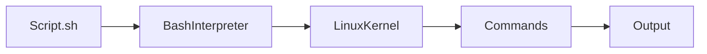
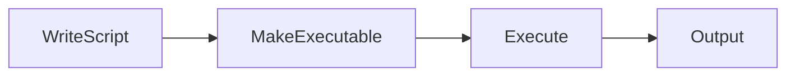
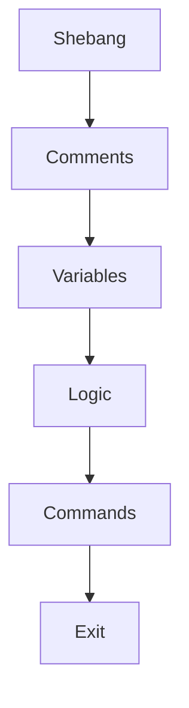
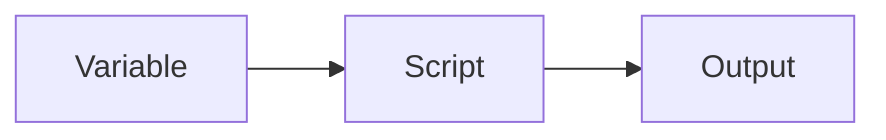
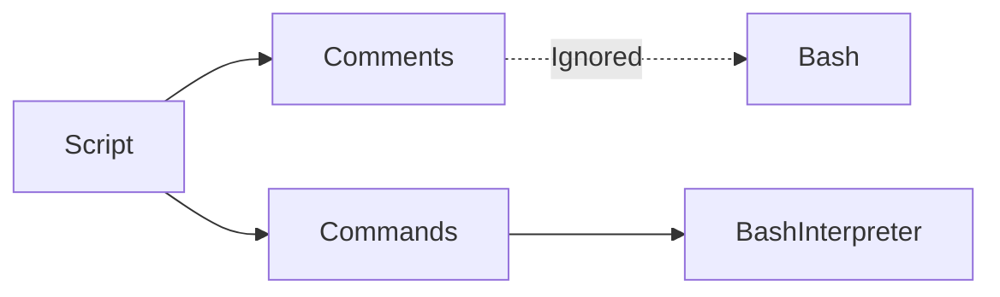

# Bash Scripting Fundamentals

## Overview

Bash (Bourne Again SHell) scripting is the process of writing commands in a text file that the Bash shell executes sequentially.

A Bash script automates repetitive tasks such as:

- Server administration
- Application deployment
- Backup automation
- Log analysis
- CI/CD pipelines
- Infrastructure management

Bash scripting is one of the **most important skills** for DevOps Engineers, Cloud Engineers, SREs, and Linux Administrators.

> **Interview Point**
>
> A Bash script is simply a text file containing Linux commands executed by the Bash interpreter.

---

## Why It Is Used

Bash scripting helps to:

- Automate repetitive tasks
- Reduce manual effort
- Ensure consistency
- Improve productivity
- Integrate with CI/CD pipelines
- Manage cloud infrastructure

---

## Architecture / Working



---

## Key Components

| Component | Purpose |
|------------|----------|
| Shebang | Specifies the interpreter |
| Variables | Store values |
| User Input | Accept runtime input |
| Arguments | Pass values during execution |
| Exit Codes | Indicate success/failure |
| Comments | Document the script |

---

## Types

### Interactive Scripts

Require user input.

### Non-Interactive Scripts

Run automatically (cron jobs, CI/CD pipelines).

---

## Lifecycle / Workflow



---

## Configuration / Syntax

Typical workflow

```bash
nano script.sh

chmod +x script.sh

./script.sh
```

---

## Important Commands

```bash
chmod +x

bash script.sh

./script.sh
```

---

## Important Files

| File | Purpose |
|------|---------|
| script.sh | Bash script |
| ~/.bashrc | User shell configuration |
| /bin/bash | Bash interpreter |

---

## Real-World Use Cases

- Server provisioning
- Automated backups
- Log cleanup
- Health checks
- Docker automation
- Kubernetes deployments
- Azure CLI automation
- AWS CLI automation

---

## Advantages

- Easy to learn
- Built into Linux
- Excellent for automation
- Integrates with Linux commands
- Lightweight

---

## Limitations

- Less suitable for complex application development
- Harder to maintain very large scripts
- Limited data structures compared to general-purpose programming languages

---

## Common Interview Questions (Concept Only)

- What is Bash scripting?
- What is a shebang?
- How do you execute a Bash script?
- How do you pass arguments to a script?
- What are exit codes?
- What does `$?` represent?

---

## Common Mistakes

- Forgetting execute permission
- Missing shebang
- Not quoting variables
- Ignoring exit codes
- Hardcoding values

---

## Troubleshooting

| Problem | Solution |
|----------|----------|
| Permission denied | Run `chmod +x script.sh` |
| Command not found | Verify the shebang and `PATH` |
| Variable empty | Verify assignment and quoting |
| Unexpected behavior | Enable debugging with `bash -x` or `set -x` |

---

## Summary

Bash scripting is a core Linux skill used to automate system administration, DevOps workflows, CI/CD pipelines, and cloud operations.

---

# Script Structure

## Overview

A Bash script follows a standard structure:

1. Shebang
2. Comments
3. Variable declarations
4. Logic
5. Commands
6. Exit status

A well-structured script is easier to read, debug, and maintain.

---

## Why It Is Used

- Improve readability
- Simplify maintenance
- Standardize automation

---

## Architecture / Working



---

## Key Components

| Component | Purpose |
|------------|----------|
| Shebang | Interpreter |
| Variables | Store values |
| Functions | Reusable logic |
| Commands | Perform tasks |
| Exit | Return status |

---

## Lifecycle / Workflow


---

## Configuration / Syntax

Example

```bash
#!/bin/bash

# Comments

NAME="Akshay"

echo "Hello $NAME"

exit 0
```

---

## Important Commands

```bash
chmod +x

bash
```

---

## Real-World Use Cases

- Backup scripts
- Deployment scripts
- Monitoring scripts

---

## Advantages

- Organized
- Readable
- Maintainable

---

## Limitations

- Poor structure makes debugging difficult

---

## Common Interview Questions (Concept Only)

- What is the structure of a Bash script?
- Why is a shebang important?

---

## Common Mistakes

- Placing commands before the shebang
- Mixing configuration and business logic without organization

---

## Troubleshooting

| Problem | Solution |
|----------|----------|
| Script fails unexpectedly | Validate syntax and execution order |

---

## Summary

A consistent script structure improves readability, maintenance, and reliability.

---

# Shebang

## Overview

A **shebang** is the first line of a script that specifies which interpreter should execute it.

Example

```bash
#!/bin/bash
```

> **Interview Point**
>
> The shebang must be the **first line** of the script.

---

## Why It Is Used

- Specify the interpreter
- Ensure consistent execution
- Improve portability

---

## Architecture / Working


---

## Key Components

| Component | Purpose |
|------------|----------|
| #! | Interpreter indicator |
| /bin/bash | Bash executable |

---

## Configuration / Syntax

```bash
#!/bin/bash
```

Portable alternative

```bash
#!/usr/bin/env bash
```

---

## Important Commands

Not applicable.

---

## Important Files

| File | Purpose |
|------|---------|
| /bin/bash | Bash interpreter |

---

## Real-World Use Cases

- CI/CD scripts
- Automation
- Server administration

---

## Advantages

- Explicit interpreter selection
- Consistent behavior

---

## Limitations

- Incorrect interpreter path causes execution failure

---

## Common Interview Questions (Concept Only)

- What is a shebang?
- Why is it required?
- Difference between `#!/bin/bash` and `#!/usr/bin/env bash`?

---

## Common Mistakes

- Omitting the shebang
- Using an incorrect interpreter path

---

## Troubleshooting

| Problem | Solution |
|----------|----------|
| Bad interpreter | Verify the interpreter exists and the path is correct |

---

## Summary

The shebang tells Linux which interpreter should execute the script.

---

# Variables

## Overview

Variables store data used during script execution.

Examples:

- User names
- Paths
- Server names
- IP addresses
- Configuration values

> **Interview Point**
>
> Bash variable assignment must **not contain spaces** around the `=` operator.

Correct:

```bash
NAME=Akshay
```

Incorrect:

```bash
NAME = Akshay
```

---

## Why It Is Used

- Store reusable values
- Simplify configuration
- Avoid hardcoding

---

## Architecture / Working



---

## Types

### User Variables

```bash
NAME=Akshay
```

### Environment Variables

```bash
PATH

HOME

USER
```

---

## Configuration / Syntax

Create variable

```bash
NAME="Akshay"
```

Access variable

```bash
echo $NAME
```

Read-only variable

```bash
readonly VERSION=1.0
```

Unset variable

```bash
unset NAME
```

---

## Important Commands

```bash
echo

unset

readonly
```

---

## Real-World Use Cases

- Server names
- Cloud regions
- Docker image names
- Pipeline configuration

---

## Advantages

- Flexible
- Reusable
- Easy maintenance

---

## Limitations

- Uninitialized variables can cause unexpected behavior

---

## Common Interview Questions (Concept Only)

- How are variables declared?
- Difference between shell and environment variables?
- Why should variables be quoted?

---

## Common Mistakes

- Spaces around `=`
- Forgetting `$` when referencing a variable
- Not quoting variables containing spaces

---

## Troubleshooting

| Problem | Solution |
|----------|----------|
| Empty variable | Verify assignment and scope |
| Unexpected word splitting | Quote variable expansions (`"$VAR"`) |

---

## Summary

Variables allow scripts to store and reuse values, improving flexibility and maintainability.

---

# User Input

## Overview

User input allows a script to receive values during execution.

The `read` command is commonly used.

---

## Why It Is Used

- Interactive scripts
- Configuration
- User-driven automation

---

## Architecture / Working


---

## Configuration / Syntax

Read input

```bash
read NAME
```

Prompt and read

```bash
read -p "Enter your name: " NAME
```

Silent input (password)

```bash
read -s PASSWORD
```

---

## Important Commands

```bash
read

read -p

read -s
```

---

## Real-World Use Cases

- Deployment confirmation
- Password entry
- Configuration scripts

---

## Advantages

- Interactive
- Flexible

---

## Limitations

- Unsuitable for unattended automation

---

## Common Interview Questions (Concept Only)

- What does `read` do?
- What is `read -p`?
- What is `read -s`?

---

## Common Mistakes

- Not validating user input
- Displaying sensitive input on the screen

---

## Troubleshooting

| Problem | Solution |
|----------|----------|
| Variable empty | Ensure `read` executed successfully |

---

## Summary

`read` collects user input and stores it in variables for use within scripts.

---

# Command-Line Arguments

## Overview

Command-line arguments allow values to be passed when executing a script.

Example

```bash
./backup.sh /home
```

Special parameters provide access to these arguments.

---

## Why It Is Used

- Automation
- Script customization
- Reusable scripts

---

## Key Components

| Variable | Description |
|----------|-------------|
| `$0` | Script name |
| `$1` | First argument |
| `$2` | Second argument |
| `$#` | Number of arguments |
| `$@` | All arguments individually |
| `$*` | All arguments as a single string |

> **Interview Point**
>
> `$@` preserves argument boundaries and is generally preferred over `$*` when forwarding arguments.

---

## Architecture / Working


---

## Configuration / Syntax

```bash
./script.sh arg1 arg2
```

Access first argument

```bash
echo $1
```

Count arguments

```bash
echo $#
```

---

## Important Commands

```bash
$0

$1

$#

$@

$*
```

---

## Real-World Use Cases

- Deployment scripts
- Backup scripts
- Infrastructure automation

---

## Advantages

- Reusable
- Flexible
- Easy automation

---

## Limitations

- Requires argument validation

---

## Common Interview Questions (Concept Only)

- What does `$0` represent?
- Difference between `$@` and `$*`?
- What does `$#` represent?

---

## Common Mistakes

- Not checking the number of arguments
- Assuming required arguments are always provided

---

## Troubleshooting

| Problem | Solution |
|----------|----------|
| Missing arguments | Validate using `$#` before processing |

---

## Summary

Command-line arguments allow Bash scripts to accept runtime parameters, making automation more flexible.

---

# Exit Codes

## Overview

Every Linux command returns an **exit code** when it finishes.

The exit code indicates whether the command succeeded or failed.

> **Interview Point**
>
> - **0** → Success
> - **Non-zero** → Error or abnormal termination

The exit status of the last executed command is stored in:

```bash
$?
```

---

## Why It Is Used

- Detect failures
- Control script execution
- Automate decision making

---

## Architecture / Working


---

## Types

| Exit Code | Meaning |
|-----------:|---------|
| 0 | Success |
| 1 | General error |
| 2 | Misuse of shell builtins (common convention) |
| 126 | Command found but not executable |
| 127 | Command not found |

---

## Configuration / Syntax

Check exit status

```bash
echo $?
```

Exit explicitly

```bash
exit 0
```

Exit with error

```bash
exit 1
```

---

## Important Commands

```bash
exit

echo $?
```

---

## Real-World Use Cases

- CI/CD pipelines
- Deployment validation
- Backup verification

---

## Advantages

- Reliable automation
- Easy error handling

---

## Limitations

- Meaning of non-zero codes may vary between programs

---

## Common Interview Questions (Concept Only)

- What is an exit code?
- What does `$?` represent?
- What does exit code 0 mean?

---

## Common Mistakes

- Ignoring exit codes
- Always returning `0` even after failures

---

## Troubleshooting

| Problem | Solution |
|----------|----------|
| Script continues after failure | Check exit codes and handle errors appropriately |

---

## Summary

Exit codes indicate command success or failure and are essential for robust Bash automation.

---

# Comments

## Overview

Comments document Bash scripts and improve readability.

The shell ignores comment lines during execution.

Single-line comments begin with:

```bash
#
```

> **Interview Point**
>
> Comments are ignored by the Bash interpreter and are intended for documentation only.

---

## Why It Is Used

- Explain logic
- Improve readability
- Simplify maintenance
- Document scripts

---

## Architecture / Working



---

## Configuration / Syntax

Single-line comment

```bash
# Install Docker
```

Inline comment

```bash
echo "Done"  # Display completion message
```

---

## Important Commands

Not applicable.

---

## Important Files

Not applicable.

---

## Real-World Use Cases

- Document deployment scripts
- Explain complex logic
- Team collaboration
- Maintenance

---

## Advantages

- Better readability
- Easier debugging
- Improved maintainability

---

## Limitations

- Outdated comments can become misleading if not maintained

---

## Common Interview Questions (Concept Only)

- How are comments written in Bash?
- Why are comments important?
- Does Bash execute comments?

---

## Common Mistakes

- Writing unclear or outdated comments
- Commenting obvious code instead of documenting intent

---

## Troubleshooting

| Problem | Solution |
|----------|----------|
| Comments misleading | Keep comments synchronized with code changes |

---

## Summary

Comments improve script readability and maintainability by documenting intent and logic without affecting execution.
