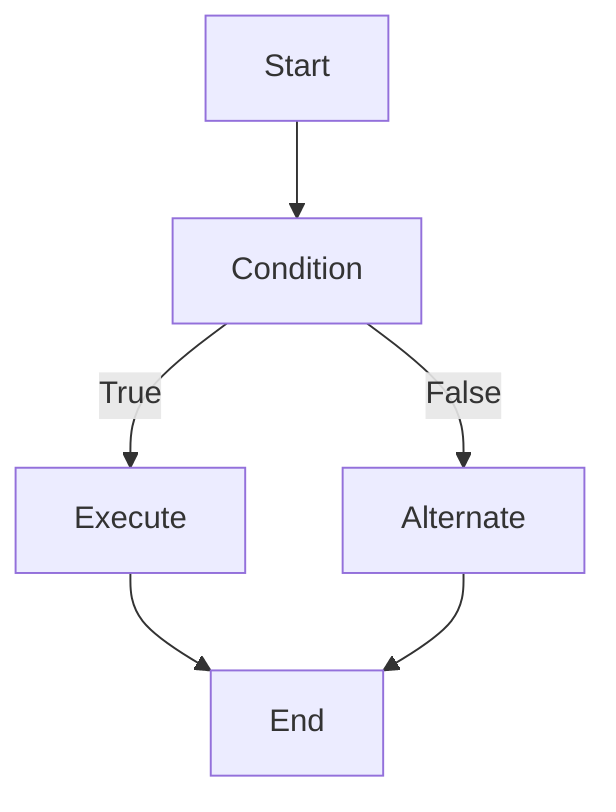
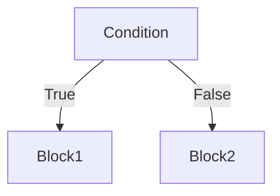
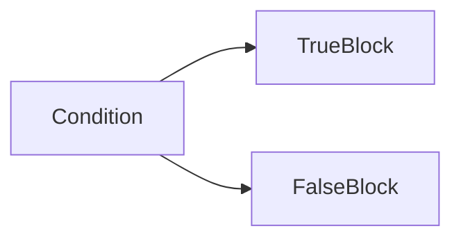
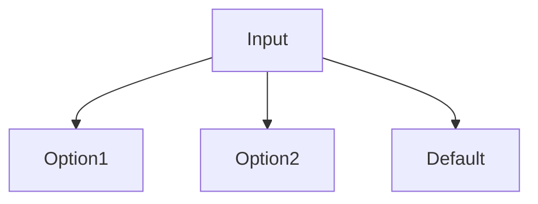
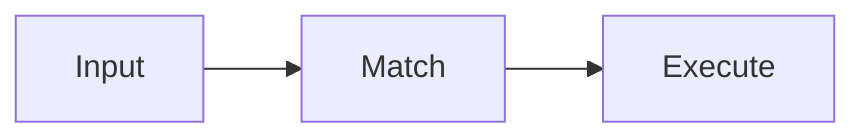
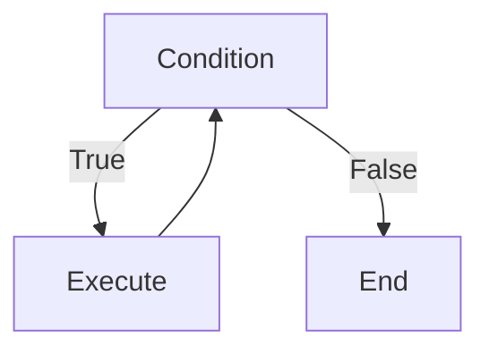
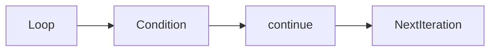

# Bash Control Flow

## Overview

Control Flow determines the order in which commands are executed in a Bash script.

It enables scripts to:

- Make decisions
- Repeat tasks
- Execute different actions based on conditions
- Organize reusable code

Control flow is one of the **most frequently asked Bash scripting topics** in DevOps, Linux, Cloud, and SRE interviews.

> **Interview Point**
>
> The most commonly used Bash control structures are:
>
> - `if`
> - `case`
> - `for`
> - `while`
> - `functions`

---

## Why It Is Used

Control flow is used to:

- Automate repetitive tasks
- Validate user input
- Process files
- Execute conditional logic
- Build deployment scripts
- Write CI/CD automation

---

## Architecture / Working



---

## Key Components

| Component | Purpose |
|------------|----------|
| if | Conditional execution |
| else | Alternate execution |
| case | Multiple condition handling |
| for | Iterate over a collection |
| while | Repeat while condition is true |
| function | Reusable code block |
| break | Exit loop |
| continue | Skip current iteration |

---

## Types

### Conditional Statements

- if
- if-else
- if-elif-else
- case

### Loops

- for
- while

### Flow Control

- break
- continue

---

## Lifecycle / Workflow


---

## Configuration / Syntax

```bash
if

case

for

while

function
```

---

## Important Commands

Not applicable.

---

## Important Files

Not applicable.

---

## Real-World Use Cases

- Validate deployment status
- Retry failed operations
- Process log files
- Backup multiple directories
- Automate cloud provisioning
- Execute deployment steps conditionally

---

## Advantages

- Powerful automation
- Reusable logic
- Better maintainability
- Flexible scripting

---

## Limitations

- Deeply nested logic reduces readability
- Bash is less suitable for highly complex application logic

---

## Common Interview Questions (Concept Only)

- Difference between `if` and `case`?
- Difference between `for` and `while`?
- When should functions be used?
- What does `break` do?
- What does `continue` do?

---

## Common Mistakes

- Missing `fi` or `done`
- Incorrect spacing in conditions
- Infinite loops
- Not quoting variables in conditions
- Writing duplicate code instead of using functions

---

## Troubleshooting

| Problem | Solution |
|----------|----------|
| Syntax error near `fi` | Verify matching `if`/`fi` blocks |
| Loop never ends | Check loop condition and update logic |
| Function not found | Define the function before calling it |
| Conditional always false | Verify operators and quote variables |

---

## Summary

Bash Control Flow enables scripts to make decisions, repeat operations, and organize reusable logic, making automation more efficient and maintainable.

---

# if, else

## Overview

The `if` statement executes commands only when a specified condition evaluates to **true**.

`else` provides an alternate execution path when the condition is false.

> **Interview Point**
>
> Every `if` block in Bash **must end with `fi`**.

---

## Why It Is Used

- Decision making
- Input validation
- File checks
- Deployment validation
- Error handling

---

## Architecture / Working



---

## Key Components

| Keyword | Purpose |
|----------|----------|
| if | Start condition |
| then | Commands to execute |
| elif | Additional condition |
| else | Default block |
| fi | End if block |

---

## Types

### if

### if-else

### if-elif-else

---

## Lifecycle / Workflow



---

## Configuration / Syntax

Basic if

```bash
if [ condition ]
then
    commands
fi
```

If-else

```bash
if [ condition ]
then
    commands
else
    commands
fi
```

If-elif-else

```bash
if [ condition ]
then
    commands
elif [ condition ]
then
    commands
else
    commands
fi
```

---

## Important Commands

Common test operators:

```bash
-e

-f

-d

-z

-n

=

!=

-lt

-gt

-eq
```

---

## Important Files

Not applicable.

---

## Real-World Use Cases

- Check if a file exists
- Verify Docker installation
- Validate deployment success
- Check service status

---

## Advantages

- Simple
- Flexible
- Easy to understand

---

## Limitations

- Large nested conditions reduce readability

---

## Common Interview Questions (Concept Only)

- Difference between `if` and `elif`?
- What is `fi`?
- How do you compare strings and integers in Bash?

---

## Common Mistakes

- Missing spaces around `[ ]`
- Forgetting `fi`
- Using incorrect comparison operators
- Not quoting variables

---

## Troubleshooting

| Problem | Solution |
|----------|----------|
| Syntax error | Verify brackets, spacing, and `fi` |
| Wrong result | Check comparison operator and variable values |

---

## Summary

`if` and `else` provide conditional execution based on the result of a logical expression.

---

# case

## Overview

The `case` statement evaluates a single value against multiple patterns.

It is cleaner and easier to maintain than long chains of `if-elif-else`.

> **Interview Point**
>
> Use `case` when checking one variable against multiple possible values.

---

## Why It Is Used

- Menu-driven scripts
- User choices
- Multiple conditions
- Command processing

---

## Architecture / Working



---

## Key Components

| Component | Purpose |
|------------|----------|
| case | Start block |
| Pattern | Match value |
| ;; | End pattern |
| * | Default case |
| esac | End block |

---

## Lifecycle / Workflow



---

## Configuration / Syntax

```bash
case $VAR in
    value1)
        commands
        ;;
    value2)
        commands
        ;;
    *)
        commands
        ;;
esac
```

---

## Important Commands

Not applicable.

---

## Important Files

Not applicable.

---

## Real-World Use Cases

- Deployment menus
- User role selection
- Environment selection

---

## Advantages

- Readable
- Easy maintenance
- Better than multiple `if` statements

---

## Limitations

- Best suited for matching patterns rather than complex logical expressions

---

## Common Interview Questions (Concept Only)

- Difference between `case` and `if`?
- What does `*` represent?
- Why is `;;` required?

---

## Common Mistakes

- Forgetting `esac`
- Missing `;;`
- Incorrect pattern matching

---

## Troubleshooting

| Problem | Solution |
|----------|----------|
| No match | Verify patterns and input value |

---

## Summary

`case` simplifies scripts that require multiple choices based on a single value.

---

# for Loop

## Overview

A `for` loop repeats a block of commands for every item in a list or sequence.

It is the most commonly used loop in Bash.

> **Interview Point**
>
> `for` loops are ideal when the **number of iterations is known**.

---

## Why It Is Used

- Process files
- Iterate through servers
- Loop through directories
- Execute repetitive commands

---

## Architecture / Working


---

## Types

### List-based Loop

### Numeric Loop

---

## Lifecycle / Workflow


---

## Configuration / Syntax

List loop

```bash
for ITEM in a b c
do
    commands
done
```

Numeric loop

```bash
for ((i=1;i<=5;i++))
do
    commands
done
```

---

## Important Commands

```bash
for

done
```

---

## Real-World Use Cases

- Deploy to multiple servers
- Backup directories
- Process log files

---

## Advantages

- Easy iteration
- Simple syntax

---

## Limitations

- Requires a defined collection or range

---

## Common Interview Questions (Concept Only)

- Difference between numeric and list loops?
- When should `for` be used?

---

## Common Mistakes

- Forgetting `done`
- Modifying the loop variable unexpectedly

---

## Troubleshooting

| Problem | Solution |
|----------|----------|
| Loop not executing | Verify the list or range is not empty |

---

## Summary

`for` loops execute commands repeatedly for each item in a collection.

---

# while Loop

## Overview

A `while` loop executes commands repeatedly **as long as a condition remains true**.

It is commonly used when the number of iterations is **unknown**.

> **Interview Point**
>
> `while` loops are preferred when execution depends on a condition rather than a fixed count.

---

## Why It Is Used

- Retry logic
- Wait for services
- Monitor applications
- Read files line by line

---

## Architecture / Working



---

## Lifecycle / Workflow


---

## Configuration / Syntax

```bash
while [ condition ]
do
    commands
done
```

---

## Important Commands

```bash
while

done
```

---

## Real-World Use Cases

- Wait for Kubernetes Pods
- Retry API requests
- Monitor services

---

## Advantages

- Flexible
- Ideal for unknown iteration counts

---

## Limitations

- Incorrect conditions can create infinite loops

---

## Common Interview Questions (Concept Only)

- Difference between `while` and `for`?
- What causes an infinite loop?

---

## Common Mistakes

- Forgetting to update the loop condition
- Creating endless loops unintentionally

---

## Troubleshooting

| Problem | Solution |
|----------|----------|
| Infinite loop | Verify the condition changes within the loop |

---

## Summary

`while` loops repeatedly execute commands until the specified condition becomes false.

---

# Functions

## Overview

Functions group reusable commands into a named block.

Instead of repeating code, a function can be called multiple times.

> **Interview Point**
>
> Functions improve script readability, reusability, and maintenance.

---

## Why It Is Used

- Reuse code
- Reduce duplication
- Improve organization
- Simplify maintenance

---

## Architecture / Working


---

## Key Components

| Component | Purpose |
|------------|----------|
| Function Name | Identifier |
| Body | Commands |
| Return Status | Exit code |

---

## Lifecycle / Workflow


---

## Configuration / Syntax

```bash
function greet() {
    echo "Hello"
}
```

or

```bash
greet() {
    echo "Hello"
}
```

Call function

```bash
greet
```

---

## Important Commands

```bash
function

return
```

---

## Real-World Use Cases

- Logging
- Error handling
- Deployment tasks
- Backup automation

---

## Advantages

- Reusable
- Easier debugging
- Better maintenance

---

## Limitations

- Poorly designed functions can become difficult to maintain

---

## Common Interview Questions (Concept Only)

- Why use functions?
- How do functions return values in Bash?

---

## Common Mistakes

- Calling a function before it is defined (without sourcing appropriately)
- Overly large functions with multiple responsibilities

---

## Troubleshooting

| Problem | Solution |
|----------|----------|
| Function not found | Ensure the function is defined before invocation |

---

## Summary

Functions organize reusable logic, making Bash scripts cleaner, easier to maintain, and more modular.

---

# break

## Overview

`break` immediately exits the nearest enclosing loop.

> **Interview Point**
>
> `break` exits the loop completely, regardless of remaining iterations.

---

## Why It Is Used

- Stop processing early
- Exit after finding a result
- Avoid unnecessary work

---

## Architecture / Working


---

## Configuration / Syntax

```bash
break
```

---

## Real-World Use Cases

- Stop searching after a match
- Exit retry loop after success
- End processing when a condition is met

---

## Advantages

- Improves efficiency
- Reduces unnecessary iterations

---

## Limitations

- Exits only the current loop unless a numeric argument is used

---

## Common Interview Questions (Concept Only)

- What does `break` do?
- When should `break` be used?

---

## Common Mistakes

- Using `break` outside a loop
- Exiting a loop unintentionally due to incorrect conditions

---

## Troubleshooting

| Problem | Solution |
|----------|----------|
| Loop exits unexpectedly | Review the conditions leading to `break` |

---

## Summary

`break` terminates loop execution immediately when a specific condition is met.

---

# continue

## Overview

`continue` skips the remainder of the current loop iteration and proceeds to the next iteration.

> **Interview Point**
>
> Unlike `break`, `continue` **does not exit the loop**.

---

## Why It Is Used

- Skip invalid data
- Ignore unnecessary iterations
- Continue processing remaining items

---

## Architecture / Working



---

## Configuration / Syntax

```bash
continue
```

---

## Real-World Use Cases

- Skip empty files
- Ignore failed records
- Process only valid input

---

## Advantages

- Cleaner logic
- Avoids deeply nested conditions

---

## Limitations

- Excessive use can reduce code readability

---

## Common Interview Questions (Concept Only)

- Difference between `break` and `continue`?
- When should `continue` be used?

---

## Common Mistakes

- Confusing `continue` with `break`
- Skipping required processing unintentionally

---

## Troubleshooting

| Problem | Solution |
|----------|----------|
| Code not executing | Verify that `continue` is not bypassing required statements |

---

## Summary

`continue` skips the current iteration and immediately proceeds with the next iteration of the loop, making it useful for ignoring unwanted data while continuing overall processing.
