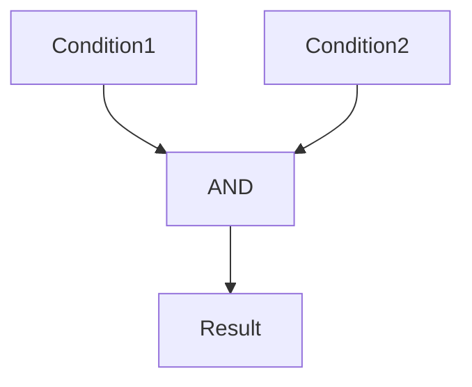
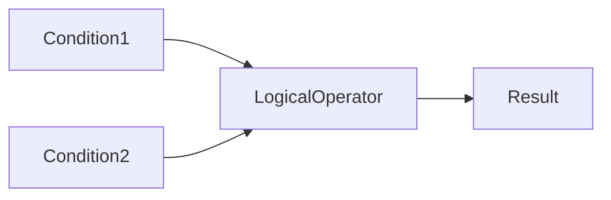

# Bash Operators

## Overview

Bash Operators are symbols or keywords used to perform calculations, compare values, manipulate strings, and evaluate logical conditions.

Operators are fundamental to:

- Conditional statements (`if`)
- Loops (`while`, `for`)
- Script validation
- Automation
- Error handling

They are extensively used in:

- DevOps automation
- CI/CD pipelines
- Linux administration
- Shell scripting
- Cloud automation

> **Interview Point**
>
> Bash operators are commonly used inside:
>
> - `[ ]`
> - `[[ ]]`
> - `(( ))`
> - `test`

---

## Why It Is Used

Operators help to:

- Perform arithmetic
- Compare numbers
- Compare strings
- Check files
- Build logical conditions
- Control script execution

---

## Architecture / Working


---

## Key Components

| Component | Purpose |
|------------|----------|
| Arithmetic Operators | Perform calculations |
| Comparison Operators | Compare numeric values |
| String Operators | Compare text values |
| Logical Operators | Combine multiple conditions |

---

## Types

- Arithmetic Operators
- Comparison Operators
- String Operators
- Logical Operators

---

## Lifecycle / Workflow


---

## Configuration / Syntax

Arithmetic evaluation

```bash
(( ))
```

Conditional evaluation

```bash
[ ]

[[ ]]
```

---

## Important Commands

```bash
test

[ ]

[[ ]]

(( ))
```

---

## Important Files

Not applicable.

---

## Real-World Use Cases

- Validate deployment status
- Compare server counts
- Check environment variables
- Verify configuration files
- Decide deployment environment
- Build CI/CD conditions

---

## Advantages

- Simple syntax
- Powerful scripting
- Supports automation
- Easy decision making

---

## Limitations

- Incorrect spacing causes syntax errors
- Different operators apply to numbers and strings

---

## Common Interview Questions (Concept Only)

- Difference between `[ ]` and `[[ ]]`?
- Difference between `=` and `-eq`?
- Difference between `&&` and `||`?
- When should `(( ))` be used?

---

## Common Mistakes

- Using numeric operators for strings
- Forgetting spaces around `[ ]`
- Not quoting variables
- Confusing `=` with `==` and `-eq`

---

## Troubleshooting

| Problem | Solution |
|----------|----------|
| Syntax error | Verify spacing around `[ ]` |
| Incorrect comparison | Use the appropriate operator for numbers or strings |
| Condition always false | Quote variables and validate their values |

---

## Summary

Bash Operators enable scripts to perform calculations, compare values, evaluate conditions, and implement decision-making logic.

---

# Arithmetic Operators

## Overview

Arithmetic operators perform mathematical calculations on numeric values.

They are commonly used inside:

```bash
(( ))
```

or

```bash
$(( ))
```

> **Interview Point**
>
> `(( ))` is preferred for arithmetic operations because it is cleaner and more efficient than using `expr`.

---

## Why It Is Used

- Increment counters
- Calculate values
- Process loops
- Monitor resources

---

## Architecture / Working


---

## Key Components

| Operator | Meaning |
|----------|----------|
| + | Addition |
| - | Subtraction |
| * | Multiplication |
| / | Division |
| % | Modulus (Remainder) |
| ++ | Increment |
| -- | Decrement |

---

## Types

### Binary Operators

- +
- -
- *
- /
- %

### Unary Operators

- ++
- --

---

## Lifecycle / Workflow


---

## Configuration / Syntax

Arithmetic expansion

```bash
RESULT=$((5 + 3))
```

Arithmetic evaluation

```bash
((COUNT++))
```

---

## Important Commands

```bash
(( ))

$(( ))
```

---

## Important Files

Not applicable.

---

## Real-World Use Cases

- Count files
- Retry attempts
- Resource calculations
- Monitoring scripts

---

## Advantages

- Fast
- Built into Bash
- Easy to read

---

## Limitations

- Designed for integer arithmetic (floating-point requires external tools such as `bc`)

---

## Common Interview Questions (Concept Only)

- Difference between `(( ))` and `$(( ))`?
- What does `%` do?
- How do you increment a variable?

---

## Common Mistakes

- Performing arithmetic inside `[ ]`
- Using floating-point numbers without appropriate tools

---

## Troubleshooting

| Problem | Solution |
|----------|----------|
| Incorrect calculation | Verify operator precedence and numeric values |

---

## Summary

Arithmetic operators perform mathematical operations used in counters, loops, and automation scripts.

---

# Comparison Operators

## Overview

Comparison operators compare numeric values and return **true** or **false**.

They are mainly used inside:

```bash
[ ]

[[ ]]
```

or

```bash
(( ))
```

> **Interview Point**
>
> Numeric comparisons use operators beginning with `-`, such as `-eq`, `-lt`, and `-gt`.

---

## Why It Is Used

- Validate input
- Compare numbers
- Control loops
- Decision making

---

## Architecture / Working


---

## Key Components

| Operator | Meaning |
|----------|----------|
| -eq | Equal |
| -ne | Not Equal |
| -gt | Greater Than |
| -lt | Less Than |
| -ge | Greater Than or Equal |
| -le | Less Than or Equal |

---

## Lifecycle / Workflow


---

## Configuration / Syntax

```bash
if [ "$A" -gt "$B" ]
then
    echo "Greater"
fi
```

---

## Important Commands

```bash
-eq

-ne

-gt

-lt

-ge

-le
```

---

## Important Files

Not applicable.

---

## Real-World Use Cases

- CPU threshold
- Memory monitoring
- Deployment validation

---

## Advantages

- Simple
- Reliable
- Easy to read

---

## Limitations

- Intended for numeric comparisons only

---

## Common Interview Questions (Concept Only)

- Difference between `-eq` and `=`?
- Difference between `-gt` and `>`?

---

## Common Mistakes

- Using `=` for numeric comparison
- Comparing empty variables without quoting them

---

## Troubleshooting

| Problem | Solution |
|----------|----------|
| Integer expression expected | Verify variables contain numeric values |

---

## Summary

Comparison operators compare numeric values and are essential for conditional logic.

---

# String Operators

## Overview

String operators compare text values and evaluate string properties.

They are used inside:

```bash
[[ ]]
```

or

```bash
[ ]
```

> **Interview Point**
>
> `[[ ]]` is generally preferred over `[ ]` for string comparisons because it provides enhanced functionality and fewer quoting issues.

---

## Why It Is Used

- Compare user input
- Validate environment names
- Check empty variables
- Compare file names

---

## Architecture / Working


---

## Key Components

| Operator | Meaning |
|----------|----------|
| = | Equal |
| == | Equal (preferred in `[[ ]]`) |
| != | Not Equal |
| -z | String is empty |
| -n | String is not empty |

---

## Types

### Equality

- =
- ==
- !=

### Length

- -z
- -n

---

## Lifecycle / Workflow


---

## Configuration / Syntax

Equality

```bash
if [[ "$A" == "$B" ]]
```

Empty string

```bash
if [ -z "$NAME" ]
```

Non-empty string

```bash
if [ -n "$NAME" ]
```

---

## Important Commands

```bash
=

==

!=

-z

-n
```

---

## Important Files

Not applicable.

---

## Real-World Use Cases

- Environment selection
- Username validation
- Deployment options

---

## Advantages

- Easy comparison
- Built-in support

---

## Limitations

- Incorrect quoting can lead to errors or unexpected behavior

---

## Common Interview Questions (Concept Only)

- Difference between `=` and `==`?
- What does `-z` do?
- What does `-n` do?

---

## Common Mistakes

- Forgetting to quote string variables
- Using numeric operators with strings

---

## Troubleshooting

| Problem | Solution |
|----------|----------|
| Unexpected comparison result | Quote variables and verify values |

---

## Summary

String operators compare text values and check whether strings are empty or populated.

---

# Logical Operators

## Overview

Logical operators combine multiple conditions into a single expression.

They enable scripts to execute commands only when multiple conditions are satisfied.

> **Interview Point**
>
> The most commonly used logical operators are:
>
> - `&&` (AND)
> - `||` (OR)
> - `!` (NOT)

---

## Why It Is Used

- Combine conditions
- Validate input
- Build complex decisions
- Error handling

---

## Architecture / Working



---

## Key Components

| Operator | Meaning |
|----------|----------|
| && | Logical AND |
| \|\| | Logical OR |
| ! | Logical NOT |

---

## Types

### AND

Both conditions must be true.

### OR

At least one condition must be true.

### NOT

Reverses the result.

---

## Lifecycle / Workflow



---

## Configuration / Syntax

AND

```bash
if [[ "$A" == "yes" && "$B" == "yes" ]]
```

OR

```bash
if [[ "$A" == "yes" || "$B" == "yes" ]]
```

NOT

```bash
if [[ ! -f file.txt ]]
```

---

## Important Commands

```bash
&&

||

!
```

---

## Important Files

Not applicable.

---

## Real-World Use Cases

- Deployment validation
- File verification
- User authentication
- CI/CD pipeline conditions

---

## Advantages

- Powerful decision making
- Reduces nested `if` statements
- Improves readability when used appropriately

---

## Limitations

- Overly complex logical expressions can become difficult to read and maintain

---

## Common Interview Questions (Concept Only)

- Difference between `&&` and `||`?
- What does `!` do?
- How do logical operators work in Bash?

---

## Common Mistakes

- Mixing numeric and string comparisons
- Incorrect operator precedence in complex expressions
- Omitting parentheses or grouping when needed for readability

---

## Troubleshooting

| Problem | Solution |
|----------|----------|
| Condition not behaving as expected | Test each condition individually and verify operator precedence |

---

## Summary

Logical operators combine conditions to build flexible and powerful decision-making logic in Bash scripts.
