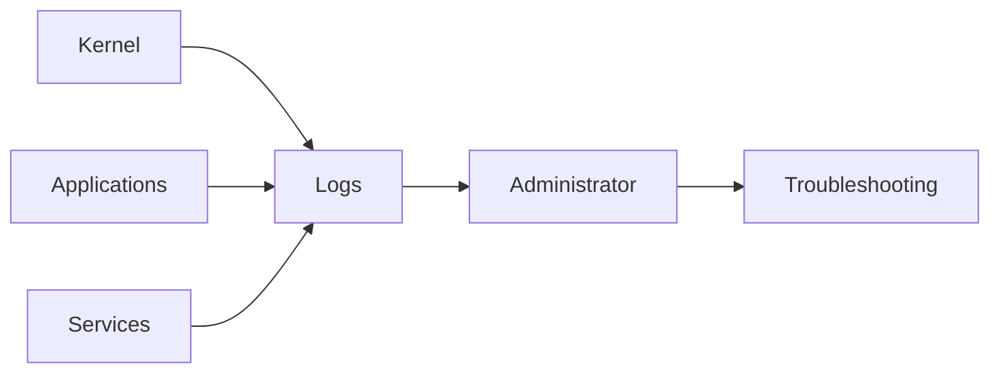
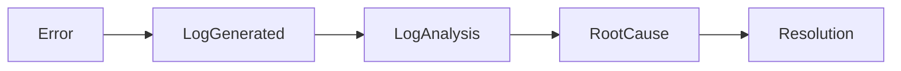
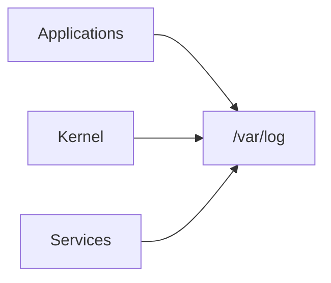
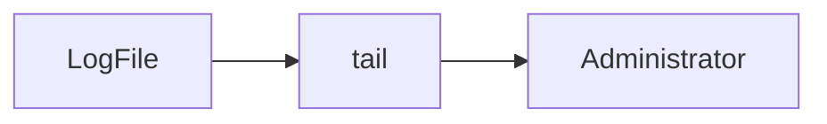
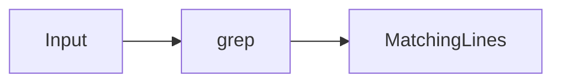
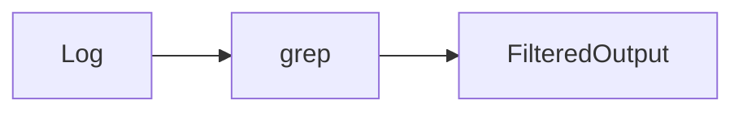
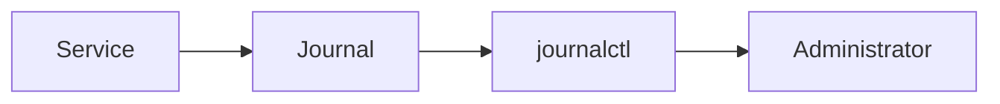

# Log Files & Troubleshooting

## Overview

Log files are records generated by the Linux kernel, operating system, services, and applications to capture events, errors, warnings, and operational information.

Troubleshooting involves analyzing these logs to identify the root cause of issues such as:

- Service failures
- Boot problems
- Network issues
- Authentication failures
- Application crashes
- Performance degradation

Linux log analysis is one of the **most frequently tested topics** in DevOps, SRE, Cloud, and Linux interviews.

> **Interview Point**
>
> The first step in troubleshooting a failed Linux service is typically:
>
> 1. `systemctl status <service>`
> 2. `journalctl -u <service>`

---

## Why It Is Used

Log files help to:

- Diagnose system failures
- Investigate application errors
- Monitor services
- Detect security events
- Analyze performance issues
- Audit system activity

---

## Architecture / Working



---

## Key Components

| Component | Purpose |
|------------|----------|
| System Logs | Operating system events |
| Application Logs | Application-specific events |
| Kernel Logs | Hardware and driver messages |
| journalctl | View systemd journal logs |
| dmesg | View kernel ring buffer |
| grep | Filter log entries |
| tail | View recent log entries |

---

## Types

### System Logs

Operating system events.

### Application Logs

Application-specific information.

### Authentication Logs

Login and authentication events.

### Kernel Logs

Hardware and kernel messages.

---

## Lifecycle / Workflow



---

## Configuration / Syntax

Common workflow

```bash
tail

grep

journalctl

dmesg
```

---

## Important Commands

```bash
tail

grep

journalctl

dmesg

less

cat
```

---

## Important Files

| File | Purpose |
|------|---------|
| /var/log/syslog | General system log (Ubuntu/Debian) |
| /var/log/messages | General system log (RHEL/CentOS/Rocky/AlmaLinux) |
| /var/log/auth.log | Authentication log (Ubuntu/Debian) |
| /var/log/secure | Authentication log (RHEL/CentOS/Rocky/AlmaLinux) |
| /var/log/kern.log | Kernel log (Ubuntu/Debian) |
| /var/log/dmesg | Boot-time kernel messages (if available) |
| /var/log/boot.log | Boot process log (distribution-dependent) |
| /var/log/nginx/ | Nginx logs |
| /var/log/apache2/ | Apache logs (Debian-based) |
| /var/log/httpd/ | Apache logs (RHEL-based) |

---

## Real-World Use Cases

- Investigate failed deployments
- Troubleshoot Docker services
- Debug Kubernetes nodes
- Analyze authentication failures
- Monitor production servers
- Identify hardware issues

---

## Advantages

- Centralized diagnostics
- Historical event tracking
- Faster troubleshooting
- Security auditing

---

## Limitations

- Large log files can be difficult to navigate
- Log retention depends on system configuration
- Insufficient logging makes troubleshooting difficult

---

## Common Interview Questions (Concept Only)

- Where are Linux logs stored?
- Difference between `journalctl` and `dmesg`?
- Which log file contains authentication events?
- How do you troubleshoot a failed service?
- How do you monitor logs in real time?

---

## Common Mistakes

- Ignoring timestamps
- Searching entire log files instead of filtering
- Forgetting to check kernel logs
- Not reviewing service-specific logs
- Overlooking log rotation

---

## Troubleshooting

| Problem | Solution |
|----------|----------|
| Service failed | Check `systemctl status` and `journalctl -u` |
| Login failure | Review authentication logs |
| Boot issue | Check `journalctl -b` and `dmesg` |
| Application crash | Inspect application-specific logs |
| High disk usage | Check log growth and log rotation configuration |

---

## Summary

Linux log analysis is one of the most important troubleshooting skills for DevOps and SRE engineers. Understanding where logs are stored and how to analyze them quickly is essential for resolving production incidents.

---

# Common Log Locations

## Overview

Linux stores logs under the `/var/log` directory.

Different distributions use different log files for similar events.

> **Interview Point**
>
> Ubuntu/Debian commonly use **`/var/log/syslog`**, while RHEL-based distributions commonly use **`/var/log/messages`**.

---

## Why It Is Used

Log locations provide centralized storage for:

- System events
- Authentication
- Kernel messages
- Service logs
- Application logs

---

## Architecture / Working



---

## Key Components

| Location | Purpose |
|----------|----------|
| /var/log/syslog | General system log (Ubuntu/Debian) |
| /var/log/messages | General system log (RHEL family) |
| /var/log/auth.log | Authentication (Ubuntu/Debian) |
| /var/log/secure | Authentication (RHEL family) |
| /var/log/kern.log | Kernel log (Ubuntu/Debian) |
| /var/log/nginx/ | Nginx logs |
| /var/log/apache2/ | Apache logs (Debian-based) |
| /var/log/httpd/ | Apache logs (RHEL-based) |

---

## Lifecycle / Workflow


---

## Configuration / Syntax

View system log

```bash
less /var/log/syslog
```

Authentication log

```bash
less /var/log/auth.log
```

---

## Important Commands

```bash
less

cat

tail
```

---

## Important Files

See table above.

---

## Real-World Use Cases

- Login troubleshooting
- Server diagnostics
- Service monitoring
- Security auditing

---

## Advantages

- Centralized logging
- Easy access
- Supports troubleshooting

---

## Limitations

- Log locations vary by distribution
- Logs may be rotated or archived

---

## Common Interview Questions (Concept Only)

- Where are Linux logs stored?
- Difference between syslog and messages?
- Which log stores authentication events?

---

## Common Mistakes

- Looking in the wrong log file for the Linux distribution
- Ignoring log rotation and archived logs

---

## Troubleshooting

| Problem | Solution |
|----------|----------|
| Log not found | Verify the distribution and correct log location |

---

## Summary

Understanding common log locations enables faster diagnosis of Linux system and application issues.

---

# tail

## Overview

`tail` displays the last lines of a file.

It is one of the most frequently used commands for monitoring logs.

> **Interview Point**
>
> `tail -f` continuously follows a log file and displays new entries in real time.

---

## Why It Is Used

- Monitor logs
- Debug applications
- Observe deployments
- Track service activity

---

## Architecture / Working



---

## Key Components

| Option | Purpose |
|---------|----------|
| -f | Follow log updates |
| -n | Display last N lines |

---

## Lifecycle / Workflow


---

## Configuration / Syntax

View last 10 lines

```bash
tail file.log
```

View last 100 lines

```bash
tail -n 100 file.log
```

Follow a log

```bash
tail -f file.log
```

---

## Important Commands

```bash
tail

tail -f

tail -n
```

---

## Important Files

Any log file under `/var/log`.

---

## Real-World Use Cases

- Monitor Nginx logs
- Follow application logs
- Watch deployment progress
- Debug production issues

---

## Advantages

- Fast
- Lightweight
- Real-time monitoring

---

## Limitations

- Shows only the end of a file
- Not suitable for advanced searching without combining other commands

---

## Common Interview Questions (Concept Only)

- What does `tail -f` do?
- Difference between `tail` and `less`?

---

## Common Mistakes

- Following the wrong log file
- Monitoring rotated log files without realizing rotation has occurred

---

## Troubleshooting

| Problem | Solution |
|----------|----------|
| No updates | Verify the application is writing to the expected log file |

---

## Summary

`tail` is the primary Linux command for viewing recent log entries and monitoring logs in real time.

---

# grep

## Overview

`grep` searches text for matching patterns.

It is one of the most powerful Linux troubleshooting commands.

> **Interview Point**
>
> Nearly every Linux troubleshooting task involves `grep`.

---

## Why It Is Used

- Search logs
- Filter output
- Find errors
- Locate configuration values

---

## Architecture / Working



---

## Key Components

| Option | Purpose |
|---------|----------|
| -i | Ignore case |
| -r | Recursive search |
| -n | Show line numbers |
| -v | Exclude matching lines |
| -E | Extended regular expressions |

---

## Lifecycle / Workflow



---

## Configuration / Syntax

Search

```bash
grep ERROR app.log
```

Ignore case

```bash
grep -i error app.log
```

Recursive search

```bash
grep -r nginx /etc
```

Show line numbers

```bash
grep -n ERROR app.log
```

---

## Important Commands

```bash
grep

grep -i

grep -r

grep -n

grep -v
```

---

## Important Files

Not applicable.

---

## Real-World Use Cases

- Find failed logins
- Search deployment logs
- Filter Kubernetes logs
- Debug applications

---

## Advantages

- Fast
- Powerful
- Script-friendly

---

## Limitations

- Large recursive searches can be slow
- Requires understanding of patterns and regular expressions for advanced usage

---

## Common Interview Questions (Concept Only)

- What is `grep`?
- What does `grep -i` do?
- What does `grep -v` do?

---

## Common Mistakes

- Forgetting quotes around patterns containing spaces or special characters
- Searching incorrect directories

---

## Troubleshooting

| Problem | Solution |
|----------|----------|
| No matches | Verify pattern, case sensitivity, and file path |

---

## Summary

`grep` is the standard Linux utility for searching and filtering logs and command output.

---

# journalctl

## Overview

`journalctl` displays logs stored in the **systemd journal**.

It is the primary log viewer on modern Linux systems using **systemd**.

> **Interview Point**
>
> `journalctl -u service_name` is the first command used to troubleshoot failed services.

---

## Why It Is Used

- Service troubleshooting
- Boot analysis
- System diagnostics
- Security investigations

---

## Architecture / Working


---

## Key Components

| Option | Purpose |
|---------|----------|
| -u | Service logs |
| -b | Current boot |
| -f | Follow logs |
| -n | Last N entries |
| --since | Logs after a specific time |

---

## Lifecycle / Workflow



---

## Configuration / Syntax

Current boot

```bash
journalctl -b
```

Service logs

```bash
journalctl -u nginx
```

Follow logs

```bash
journalctl -f
```

Last 50 entries

```bash
journalctl -n 50
```

---

## Important Commands

```bash
journalctl

journalctl -u

journalctl -b

journalctl -f

journalctl -n
```

---

## Important Files

| File | Purpose |
|------|---------|
| /var/log/journal/ | Persistent journal (if enabled) |
| /run/log/journal/ | Runtime journal stored in memory |

---

## Real-World Use Cases

- Docker troubleshooting
- Kubernetes services
- Jenkins failures
- SSH login failures

---

## Advantages

- Centralized logging
- Powerful filtering
- Boot analysis
- Service-specific logs

---

## Limitations

- Older logs may not be retained if persistent journaling is disabled

---

## Common Interview Questions (Concept Only)

- What is `journalctl`?
- How do you view logs for a service?
- How do you display logs from the current boot?

---

## Common Mistakes

- Searching the entire journal instead of filtering by service or time
- Assuming all historical logs are available without persistent journaling

---

## Troubleshooting

| Problem | Solution |
|----------|----------|
| Missing logs | Verify journaling configuration and filters |
| Service failed | Check `systemctl status` followed by `journalctl -u` |

---

## Summary

`journalctl` is the standard logging tool for systemd-based Linux systems and is essential for troubleshooting services and boot issues.

---

# dmesg

## Overview

`dmesg` displays messages from the Linux kernel ring buffer.

It is primarily used for diagnosing:

- Hardware
- Device drivers
- Boot problems
- Filesystems
- Kernel events

> **Interview Point**
>
> `dmesg` displays **kernel messages**, not application logs.

---

## Why It Is Used

- Hardware troubleshooting
- Driver debugging
- Boot diagnostics
- Device detection
- Filesystem analysis

---

## Architecture / Working


---

## Key Components

| Option | Purpose |
|---------|----------|
| -T | Human-readable timestamps |
| -H | Human-readable output (where supported) |
| -w | Follow new kernel messages in real time |

---

## Lifecycle / Workflow


---

## Configuration / Syntax

Display kernel messages

```bash
dmesg
```

Human-readable timestamps

```bash
dmesg -T
```

Follow new kernel messages

```bash
dmesg -w
```

---

## Important Commands

```bash
dmesg

dmesg -T

dmesg -w
```

---

## Important Files

Kernel messages are stored in the kernel ring buffer and may also be forwarded to system logs depending on the system configuration.

---

## Real-World Use Cases

- Diagnose disk failures
- Detect USB devices
- Analyze boot issues
- Debug kernel modules
- Troubleshoot hardware

---

## Advantages

- Fast hardware diagnostics
- Essential for kernel troubleshooting
- Provides low-level system information

---

## Limitations

- Displays kernel events only
- Older messages may be overwritten in the ring buffer
- Access may require elevated privileges depending on system settings

---

## Common Interview Questions (Concept Only)

- What does `dmesg` display?
- Difference between `dmesg` and `journalctl`?
- When should `dmesg` be used?

---

## Common Mistakes

- Using `dmesg` for application troubleshooting
- Ignoring timestamp formatting when correlating events

---

## Troubleshooting

| Problem | Solution |
|----------|----------|
| Hardware not detected | Review `dmesg` output for device and driver messages |
| Boot issues | Inspect recent kernel messages and initialization errors |

---

## Summary

`dmesg` is the primary Linux tool for viewing kernel messages and diagnosing hardware, driver, and boot-related issues.
