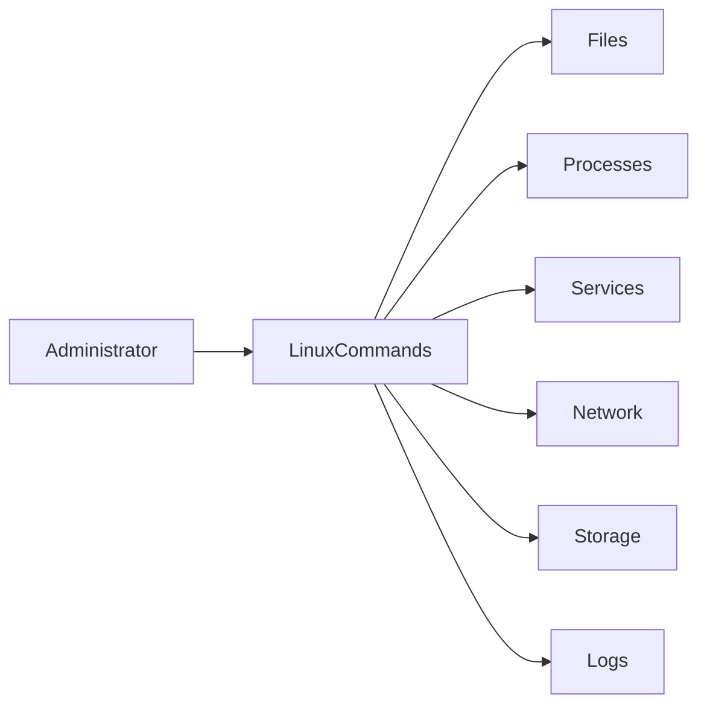

# Essential Interview Commands

## Overview

Linux command-line proficiency is one of the most important skills expected from DevOps Engineers, Cloud Engineers, Platform Engineers, SREs, and Linux Administrators.

These commands are used daily for:

- Server administration
- CI/CD pipelines
- Infrastructure management
- Monitoring
- Troubleshooting
- Deployment
- Security
- Automation

> **Interview Point**
>
> Most Linux interviews focus on **real-world command usage** rather than memorizing syntax. Be prepared to explain:
>
> - What the command does
> - When you use it
> - Common options
> - Real production scenarios

---

## Why It Is Used

These commands help to:

- Manage files
- Control permissions
- Monitor servers
- Troubleshoot services
- Transfer files
- Manage storage
- Configure networking
- Automate repetitive tasks

---

## Architecture / Working



---

## Key Components

| Category | Commands |
|-----------|----------|
| File Management | chmod, chown, find |
| Text Processing | grep |
| Process Management | ps, top, kill |
| Compression | tar |
| Networking | curl, wget, ssh, scp, ip |
| Service Management | systemctl, journalctl |
| Disk Management | df, du, lsblk |
| Scheduling | cron |
| Scripting | bash |

---

## Types

### File Management

- chmod
- chown
- find

### Text Processing

- grep

### Process Management

- ps
- top
- kill

### Compression

- tar

### Networking

- curl
- wget
- ssh
- scp
- ip

### Service Management

- systemctl
- journalctl

### Disk Management

- df
- du
- lsblk

### Scheduling

- cron

### Shell

- bash

---

## Lifecycle / Workflow


---

## Configuration / Syntax

General format

```bash
command [options] [arguments]
```

---

## Important Commands

See individual sections below.

---

## Important Files

| File | Purpose |
|------|---------|
| /etc/passwd | User accounts |
| /etc/group | Groups |
| /etc/crontab | System cron jobs |
| /var/log/ | Log directory |
| ~/.bashrc | User Bash configuration |

---

## Real-World Use Cases

- Deploy applications
- Troubleshoot production servers
- Transfer backups
- Monitor resources
- Configure services
- Automate maintenance

---

## Advantages

- Powerful
- Fast
- Scriptable
- Production-ready
- Universally available

---

## Limitations

- Incorrect command usage can affect production systems
- Some commands require root privileges

---

## Common Interview Questions (Concept Only)

- Which Linux commands do you use daily?
- How do you troubleshoot a failed service?
- How do you monitor processes?
- How do you find large files?
- How do you securely copy files?

---

## Common Mistakes

- Running destructive commands as root without verification
- Using relative paths in automation
- Ignoring command exit codes
- Forgetting permission requirements

---

## Troubleshooting

| Problem | Solution |
|----------|----------|
| Permission denied | Verify ownership and permissions |
| Service failed | Check `systemctl status` and `journalctl` |
| Disk full | Use `df` and `du` |
| Process consuming CPU | Use `top` or `ps` |
| File not found | Use `find` |

---

## Summary

These commands form the core Linux toolkit required for interviews and day-to-day DevOps operations.

---

# chmod

## Overview

Changes file or directory permissions.

---

## Why It Is Used

- Make scripts executable
- Secure files
- Control access

---

## Important Syntax

```bash
chmod +x script.sh
chmod 755 script.sh
chmod 644 file.txt
```

---

## Common Options

| Option | Purpose |
|----------|----------|
| +x | Add execute permission |
| -R | Recursive |
| 755 | rwxr-xr-x |
| 644 | rw-r--r-- |

---

## Real-World Use Cases

- Enable deployment scripts
- Secure configuration files

---

## Interview Questions

- Difference between 755 and 777?
- What does `chmod +x` do?

---

## Summary

Used to manage Linux file permissions.

---

# chown

## Overview

Changes file ownership.

---

## Why It Is Used

Assign files to users and groups.

---

## Important Syntax

```bash
chown user file.txt
chown user:group file.txt
chown -R user directory/
```

---

## Common Options

| Option | Purpose |
|----------|----------|
| -R | Recursive |

---

## Real-World Use Cases

- Fix application permissions
- Assign web server ownership

---

## Interview Questions

- Difference between `chmod` and `chown`?

---

## Summary

Controls ownership, not permissions.

---

# find

## Overview

Searches files and directories.

---

## Why It Is Used

Locate files efficiently.

---

## Important Syntax

```bash
find /home -name "*.log"
find / -type f
find . -size +100M
```

---

## Common Options

| Option | Purpose |
|----------|----------|
| -name | Search by name |
| -type | File or directory |
| -size | File size |
| -mtime | Modification time |

---

## Real-World Use Cases

- Locate logs
- Find old backups
- Search configuration files

---

## Interview Questions

- How do you find files larger than 1 GB?

---

## Summary

Essential Linux file search command.

---

# grep

## Overview

Searches text using patterns.

---

## Why It Is Used

Filter logs and command output.

---

## Important Syntax

```bash
grep ERROR app.log
grep -i failed app.log
grep -r nginx /etc
```

---

## Common Options

| Option | Purpose |
|----------|----------|
| -i | Ignore case |
| -r | Recursive |
| -n | Line numbers |
| -v | Invert match |

---

## Real-World Use Cases

- Search logs
- Debug applications

---

## Interview Questions

- Difference between `grep` and `find`?

---

## Summary

Primary text searching tool in Linux.

---

# ps

## Overview

Displays running processes.

---

## Why It Is Used

Monitor processes.

---

## Important Syntax

```bash
ps
ps -ef
ps aux
```

---

## Common Options

| Option | Purpose |
|----------|----------|
| -e | All processes |
| -f | Full format |
| aux | BSD-style detailed output |

---

## Real-World Use Cases

- Find process IDs
- Verify running services

---

## Interview Questions

- Difference between `ps` and `top`?

---

## Summary

Displays a snapshot of active processes.

---

# top

## Overview

Real-time process monitoring.

---

## Why It Is Used

Monitor CPU and memory usage.

---

## Important Syntax

```bash
top
```

---

## Useful Keys

| Key | Purpose |
|------|----------|
| P | Sort by CPU |
| M | Sort by Memory |
| q | Quit |

---

## Real-World Use Cases

- Troubleshoot high CPU usage
- Identify memory-intensive processes

---

## Interview Questions

- How do you identify a high CPU process?

---

## Summary

Real-time Linux process monitor.

---

# kill

## Overview

Terminates processes.

---

## Why It Is Used

Stop malfunctioning applications.

---

## Important Syntax

```bash
kill PID
kill -9 PID
killall nginx
```

---

## Common Signals

| Signal | Meaning |
|----------|----------|
| 15 | Graceful termination (SIGTERM) |
| 9 | Force kill (SIGKILL) |

> **Interview Point**
>
> Prefer `SIGTERM (15)` before using `SIGKILL (9)`.

---

## Real-World Use Cases

- Stop hung processes
- Restart applications

---

## Interview Questions

- Difference between `kill` and `kill -9`?

---

## Summary

Terminates Linux processes.

---

# tar

## Overview

Archives and extracts files.

---

## Why It Is Used

Backup and deployment.

---

## Important Syntax

Create archive

```bash
tar -cvf backup.tar folder/
```

Extract archive

```bash
tar -xvf backup.tar
```

Compressed archive

```bash
tar -czvf backup.tar.gz folder/
```

---

## Common Options

| Option | Purpose |
|----------|----------|
| -c | Create |
| -x | Extract |
| -v | Verbose |
| -f | File |
| -z | Gzip |

---

## Real-World Use Cases

- Server backups
- Deployment packages

---

## Interview Questions

- Difference between `.tar` and `.tar.gz`?

---

## Summary

Standard Linux archiving utility.

---

# curl

## Overview

Transfers data to and from servers.

---

## Why It Is Used

Test APIs and download data.

---

## Important Syntax

```bash
curl https://example.com
curl -I https://example.com
curl -X POST URL
```

---

## Common Options

| Option | Purpose |
|----------|----------|
| -I | Headers only |
| -X | HTTP method |
| -H | Custom header |
| -o | Save output |

---

## Real-World Use Cases

- API testing
- Health checks

---

## Interview Questions

- Difference between `curl` and `wget`?

---

## Summary

Powerful HTTP client.

---

# wget

## Overview

Downloads files from the internet.

---

## Why It Is Used

Download packages and scripts.

---

## Important Syntax

```bash
wget URL
wget -O file URL
wget -c URL
```

---

## Common Options

| Option | Purpose |
|----------|----------|
| -O | Output file |
| -c | Resume download |

---

## Real-World Use Cases

- Download installers
- Retrieve backups

---

## Interview Questions

- When would you use `wget` instead of `curl`?

---

## Summary

Command-line download utility.

---

# ssh

## Overview

Secure remote login protocol.

---

## Why It Is Used

Manage remote Linux servers.

---

## Important Syntax

```bash
ssh user@server
ssh -i key.pem user@server
```

---

## Common Options

| Option | Purpose |
|----------|----------|
| -i | Private key |
| -p | Port |

---

## Real-World Use Cases

- Server administration
- Cloud VM access

---

## Interview Questions

- What is SSH key authentication?

---

## Summary

Secure remote access protocol.

---

# scp

## Overview

Securely copies files over SSH.

---

## Why It Is Used

Transfer files between systems.

---

## Important Syntax

```bash
scp file.txt user@server:/home/user
scp -r folder user@server:/tmp
```

---

## Common Options

| Option | Purpose |
|----------|----------|
| -r | Recursive |
| -i | Identity key |

---

## Real-World Use Cases

- Upload deployment artifacts
- Download logs

---

## Interview Questions

- Difference between `scp` and `rsync`?

---

## Summary

Secure file transfer utility.

---

# systemctl

## Overview

Controls systemd services.

---

## Why It Is Used

Manage Linux services.

---

## Important Syntax

```bash
systemctl status nginx
systemctl start nginx
systemctl stop nginx
systemctl restart nginx
systemctl enable nginx
```

---

## Common Options

| Option | Purpose |
|----------|----------|
| status | Show status |
| start | Start service |
| stop | Stop service |
| restart | Restart service |
| enable | Start at boot |

---

## Real-World Use Cases

- Manage web servers
- Restart applications

---

## Interview Questions

- Difference between `enable` and `start`?

---

## Summary

Primary service management command.

---

# journalctl

## Overview

Displays systemd journal logs.

---

## Why It Is Used

Troubleshoot services.

---

## Important Syntax

```bash
journalctl -u nginx
journalctl -b
journalctl -f
```

---

## Common Options

| Option | Purpose |
|----------|----------|
| -u | Service logs |
| -b | Current boot |
| -f | Follow logs |

---

## Real-World Use Cases

- Diagnose service failures
- Boot troubleshooting

---

## Interview Questions

- Difference between `journalctl` and `dmesg`?

---

## Summary

Primary logging tool for systemd systems.

---

# df

## Overview

Displays filesystem disk usage.

---

## Why It Is Used

Monitor disk space.

---

## Important Syntax

```bash
df -h
```

---

## Common Options

| Option | Purpose |
|----------|----------|
| -h | Human-readable |

---

## Real-World Use Cases

- Disk capacity monitoring

---

## Interview Questions

- Difference between `df` and `du`?

---

## Summary

Shows filesystem usage.

---

# du

## Overview

Displays file and directory sizes.

---

## Why It Is Used

Locate storage usage.

---

## Important Syntax

```bash
du -sh folder
du -h
```

---

## Common Options

| Option | Purpose |
|----------|----------|
| -s | Summary |
| -h | Human-readable |

---

## Real-World Use Cases

- Find large directories

---

## Interview Questions

- How do you identify large folders?

---

## Summary

Measures directory and file sizes.

---

# lsblk

## Overview

Lists block storage devices.

---

## Why It Is Used

View disks and partitions.

---

## Important Syntax

```bash
lsblk
lsblk -f
```

---

## Common Options

| Option | Purpose |
|----------|----------|
| -f | Filesystem information |

---

## Real-World Use Cases

- Verify attached disks
- Storage troubleshooting

---

## Interview Questions

- How do you identify mounted disks?

---

## Summary

Displays block devices.

---

# ip

## Overview

Displays and manages network configuration.

---

## Why It Is Used

Network troubleshooting.

---

## Important Syntax

```bash
ip addr
ip route
ip link
```

---

## Common Options

| Command | Purpose |
|----------|----------|
| addr | IP addresses |
| route | Routing table |
| link | Network interfaces |

---

## Real-World Use Cases

- Verify IP addresses
- Diagnose networking

---

## Interview Questions

- How do you check the IP address of a server?

---

## Summary

Modern Linux networking utility.

---

# cron

## Overview

Schedules recurring tasks.

---

## Why It Is Used

Automation.

---

## Important Syntax

```bash
crontab -e
crontab -l
```

---

## Common Schedule

```text
* * * * * command
```

---

## Real-World Use Cases

- Backups
- Monitoring
- Maintenance

---

## Interview Questions

- Explain the five cron timing fields.

---

## Summary

Linux job scheduler.

---

# bash

## Overview

The Bash shell executes commands and scripts.

---

## Why It Is Used

Automation and system administration.

---

## Important Syntax

```bash
bash script.sh

./script.sh

source script.sh
```

---

## Common Commands

| Command | Purpose |
|----------|----------|
| bash script.sh | Run using Bash |
| ./script.sh | Execute directly |
| source script.sh | Run in current shell |

---

## Real-World Use Cases

- CI/CD automation
- Deployment scripts
- Server administration

---

## Interview Questions

- Difference between `bash script.sh` and `./script.sh`?
- Difference between `source script.sh` and `./script.sh`?

---

## Summary

Bash is the foundation of Linux automation and scripting, making it one of the most essential skills for DevOps and Cloud engineers.
