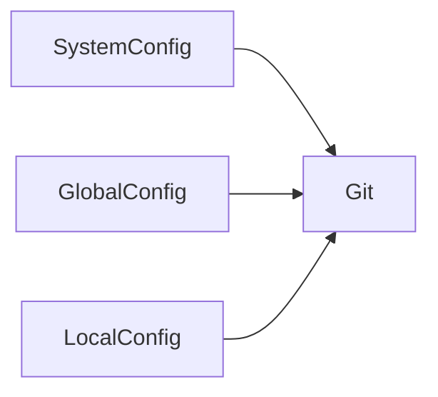
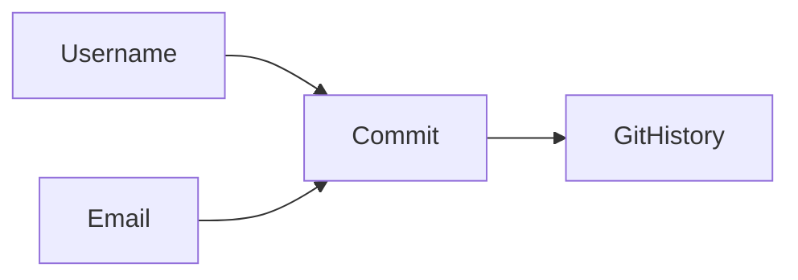
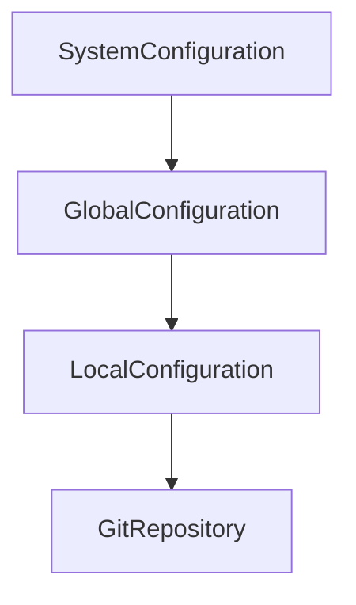

# Git Installation & Configuration

## Overview

Git Installation and Configuration is the first step in using Git for version control. Before tracking code changes, Git must be installed and configured with your identity.

Every commit created in Git contains metadata such as:

- Author Name
- Author Email
- Commit Timestamp
- Commit Message

This information is configured using the `git config` command.

> **Interview Point**
>
> Git must know **who is making the commit**. This is configured using:
>
> - `user.name`
> - `user.email`

---

## Why It Is Used

Git configuration is used to:

- Identify commit authors
- Customize Git behavior
- Configure editors
- Store default branch names
- Configure merge and pull behavior
- Manage user preferences

Without proper configuration:

- Commits may contain incorrect author information.
- Team collaboration becomes difficult.
- Git may prompt for missing identity information when committing.

---

## Architecture / Working


---

## Key Components

| Component | Purpose |
|------------|----------|
| Git Installation | Install Git software |
| git config | Configure Git settings |
| user.name | Commit author name |
| user.email | Commit author email |
| Global Configuration | Applies to all repositories |
| Local Configuration | Applies only to one repository |

---

## Types

### Global Configuration

Applies to every Git repository for the current user.

### Local Configuration

Applies only to the current repository.

### System Configuration

Applies to all users on the machine (typically managed by administrators).

---

## Lifecycle / Workflow


---

## Configuration / Syntax

Check Git version

```bash
git --version
```

Configure username

```bash
git config --global user.name "Akshay"
```

Configure email

```bash
git config --global user.email "user@example.com"
```

View configuration

```bash
git config --list
```

---

## Important Commands

```bash
git --version

git config

git config --list

git config --global

git config --local
```

---

## Important Files

| File | Purpose |
|------|---------|
| ~/.gitconfig | Global Git configuration |
| .git/config | Repository-specific configuration |
| /etc/gitconfig | System-wide Git configuration |

---

## Real-World Use Cases

- Configure developer identity
- Set default editor
- Configure default branch name
- Configure pull behavior
- Standardize Git settings across development machines

---

## Advantages

- Personalized Git environment
- Consistent commit history
- Flexible configuration levels
- Repository-specific customization

---

## Limitations

- Incorrect configuration results in incorrect commit metadata
- Local settings can override global settings and cause confusion if not understood

---

## Common Interview Questions (Concept Only)

- How do you configure Git?
- Why are username and email required?
- Where does Git store configuration?
- What is `git config`?
- How do you view Git configuration?

---

## Common Mistakes

- Using the wrong email address
- Forgetting to configure Git before committing
- Confusing global and local configuration
- Accidentally overriding global settings in a repository

---

## Troubleshooting

| Problem | Solution |
|----------|----------|
| Git asks for identity | Configure `user.name` and `user.email` |
| Incorrect author in commits | Check configuration with `git config --list` |
| Configuration not applied | Verify whether the setting is global or local |
| Wrong configuration file | Use `git config --show-origin --list` to identify the source |

---

## Summary

Installing Git and configuring your identity are essential first steps before using Git. Proper configuration ensures accurate commit history and consistent collaboration.

---

# Install Git

## Overview

Git must be installed before it can be used to manage repositories.

Git is available for:

- Linux
- Windows
- macOS

> **Interview Point**
>
> The first command to verify a Git installation is:
>
> ```bash
> git --version
> ```

---

## Why It Is Used

Installation provides:

- Git CLI
- Git repository management
- Version control functionality
- Integration with GitHub, Azure DevOps, GitLab, and Bitbucket

---

## Architecture / Working


---

## Key Components

| Component | Purpose |
|------------|----------|
| Git CLI | Command-line interface |
| Git Executable | Executes Git commands |
| Configuration Files | Store Git settings |

---

## Lifecycle / Workflow


---

## Configuration / Syntax

### Ubuntu / Debian

```bash
sudo apt update

sudo apt install git
```

### RHEL / CentOS / Rocky Linux

```bash
sudo dnf install git
```

or

```bash
sudo yum install git
```

### Verify Installation

```bash
git --version
```

---

## Important Commands

```bash
git --version
```

---

## Important Files

Installation paths vary by operating system.

---

## Real-World Use Cases

- Development workstations
- Build servers
- CI/CD agents
- Cloud virtual machines
- Containers

---

## Advantages

- Lightweight
- Cross-platform
- Easy installation

---

## Limitations

- Requires initial configuration before meaningful use

---

## Common Interview Questions (Concept Only)

- How do you install Git on Linux?
- How do you verify the installation?

---

## Common Mistakes

- Forgetting to verify installation
- Using an outdated Git version without checking compatibility

---

## Troubleshooting

| Problem | Solution |
|----------|----------|
| `git: command not found` | Install Git and verify the executable is in the `PATH` |
| Old Git version | Update Git using the operating system's package manager or official packages |

---

## Summary

Installing Git provides the command-line tools required for version control and repository management.

---

# git config

## Overview

`git config` is the command used to view, add, update, or remove Git configuration settings.

It manages:

- User identity
- Editors
- Aliases
- Default branch names
- Merge behavior
- Pull behavior

> **Interview Point**
>
> Git configuration exists at **three levels**:
>
> - System
> - Global
> - Local

---

## Why It Is Used

It allows Git to:

- Identify commit authors
- Customize behavior
- Improve workflow consistency

---

## Architecture / Working



---

## Key Components

| Command | Purpose |
|----------|----------|
| `git config --list` | Display all configuration |
| `git config user.name` | Configure username |
| `git config user.email` | Configure email |
| `git config --show-origin --list` | Show where each configuration value comes from |

---

## Lifecycle / Workflow


---

## Configuration / Syntax

List configuration

```bash
git config --list
```

Display a specific value

```bash
git config user.name
```

Remove a configuration value

```bash
git config --global --unset user.name
```

---

## Important Commands

```bash
git config

git config --list

git config --show-origin --list

git config --unset
```

---

## Important Files

| File | Purpose |
|------|---------|
| ~/.gitconfig | Global configuration |
| .git/config | Local configuration |
| /etc/gitconfig | System configuration |

---

## Real-World Use Cases

- Configure editors
- Set aliases
- Configure pull behavior
- Customize Git workflow

---

## Advantages

- Flexible
- Easy to modify
- Repository-specific customization

---

## Limitations

- Multiple configuration levels can cause confusion if precedence is not understood

---

## Common Interview Questions (Concept Only)

- What is `git config`?
- Where are Git settings stored?
- How do you display Git configuration?

---

## Common Mistakes

- Editing configuration files manually instead of using `git config`
- Forgetting which configuration level is being modified

---

## Troubleshooting

| Problem | Solution |
|----------|----------|
| Unexpected configuration value | Use `git config --show-origin --list` to locate its source |

---

## Summary

`git config` is the primary command for managing Git settings at the system, global, and local levels.

---

# Configure Username & Email

## Overview

Git records the author of every commit using:

- Username
- Email

These values become part of the project's commit history.

> **Interview Point**
>
> Every commit stores:
>
> - Author Name
> - Author Email
> - Commit Date
> - Commit Message

---

## Why It Is Used

Git uses this information to:

- Identify contributors
- Track project history
- Display commit authors
- Support collaboration

---

## Architecture / Working



---

## Key Components

| Setting | Purpose |
|----------|----------|
| user.name | Author name |
| user.email | Author email |

---

## Lifecycle / Workflow


---

## Configuration / Syntax

Global username

```bash
git config --global user.name "Akshay"
```

Global email

```bash
git config --global user.email "user@example.com"
```

View configured username

```bash
git config user.name
```

View configured email

```bash
git config user.email
```

---

## Important Commands

```bash
git config user.name

git config user.email
```

---

## Important Files

Stored in:

- `~/.gitconfig`
- `.git/config`

---

## Real-World Use Cases

- Team collaboration
- Open-source contributions
- Enterprise development
- CI/CD audit trails

---

## Advantages

- Accurate commit attribution
- Clear project history

---

## Limitations

- Existing commits retain the author information used at the time they were created

---

## Common Interview Questions (Concept Only)

- Why configure username and email?
- Where are they stored?
- Can global values be overridden?

---

## Common Mistakes

- Using different email addresses unintentionally across repositories
- Forgetting to configure identity before the first commit

---

## Troubleshooting

| Problem | Solution |
|----------|----------|
| Wrong author information | Update the configuration for future commits; rewriting old commits requires history modification |

---

## Summary

Username and email uniquely identify the author of Git commits and should be configured correctly before contributing to any repository.

---

# Global vs Local Configuration

## Overview

Git supports multiple configuration levels to provide flexibility.

Configuration precedence (highest to lowest):

1. Local
2. Global
3. System

> **Interview Point**
>
> Local configuration overrides global configuration for that repository.

---

## Why It Is Used

Different repositories may require:

- Different usernames
- Different emails
- Different editors
- Different workflows

---

## Architecture / Working



---

## Key Components

| Level | Scope | File |
|--------|------|------|
| System | All users | `/etc/gitconfig` |
| Global | Current user | `~/.gitconfig` |
| Local | Current repository | `.git/config` |

---

## Types

### System Configuration

Applies to every user on the machine.

### Global Configuration

Applies to every repository owned by the current user.

### Local Configuration

Applies only to the current repository.

---

## Lifecycle / Workflow


---

## Configuration / Syntax

Global

```bash
git config --global user.name "Akshay"
```

Local

```bash
git config --local user.name "Project User"
```

System (administrator privileges typically required)

```bash
git config --system user.name "Admin"
```

---

## Important Commands

```bash
git config --global

git config --local

git config --system

git config --show-origin --list
```

---

## Important Files

| File | Purpose |
|------|---------|
| `/etc/gitconfig` | System configuration |
| `~/.gitconfig` | Global configuration |
| `.git/config` | Local repository configuration |

---

## Real-World Use Cases

- Personal GitHub account globally
- Company repository with a corporate email locally
- Organization-wide settings managed at the system level

---

## Advantages

- Flexible configuration
- Repository-specific customization
- Supports multiple identities on one machine

---

## Limitations

- Multiple configuration levels can lead to unexpected behavior if precedence is misunderstood

---

## Common Interview Questions (Concept Only)

- Difference between global and local Git configuration?
- Which configuration has higher priority?
- Where are Git configuration files stored?

---

## Common Mistakes

- Setting repository-specific values globally
- Forgetting that local settings override global settings
- Assuming changing global settings updates existing commits

---

## Troubleshooting

| Problem | Solution |
|----------|----------|
| Unexpected username or email | Check local configuration first using `git config --show-origin --list` |
| Configuration not taking effect | Verify the configuration level and repository context |

---

## Summary

Git configuration is hierarchical. System settings provide defaults, global settings apply to the current user, and local settings override both for a specific repository, making Git flexible enough for both personal and enterprise development workflows.
