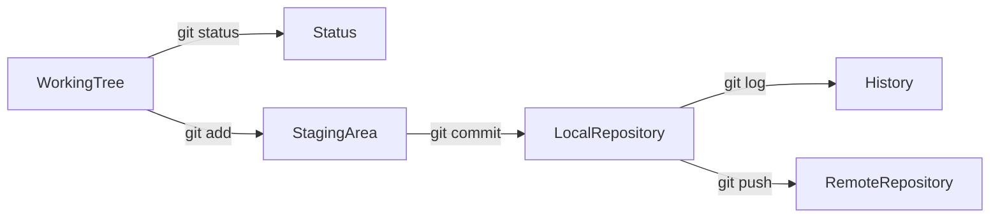
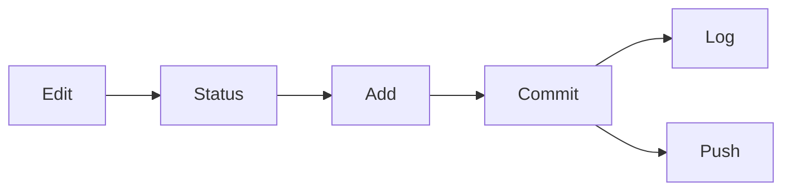
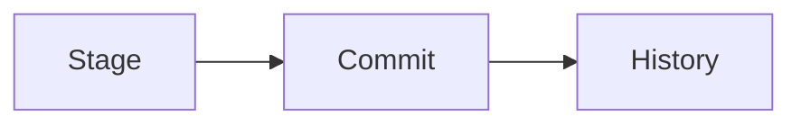
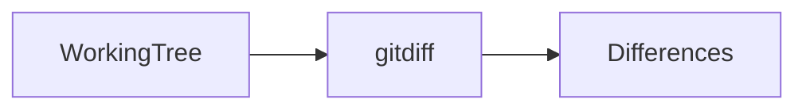

# Basic Git Workflow

## Overview

The Git workflow is the sequence of steps developers follow to track changes, save snapshots of their work, and maintain project history.

A typical Git workflow is:

1. Modify files
2. Check repository status
3. Stage changes
4. Commit changes
5. Review history
6. Push to a remote repository (covered in a later topic)

Understanding this workflow is one of the **most frequently asked Git interview topics** because it forms the foundation of daily Git usage.

> **Interview Point**
>
> The standard Git workflow is:
>
> **Working Tree → Staging Area → Local Repository → Remote Repository**

---

## Why It Is Used

The Git workflow helps developers:

- Track code changes
- Organize commits
- Review modifications
- Maintain project history
- Collaborate safely
- Enable CI/CD pipelines

---

## Architecture / Working



---

## Key Components

| Component | Purpose |
|------------|----------|
| Working Tree | Modify project files |
| Staging Area | Prepare files for commit |
| Local Repository | Stores commits |
| Commit | Snapshot of staged changes |
| History | Complete project timeline |

---

## Types

### Working Area

Files currently being edited.

### Staging Area (Index)

Prepared changes for the next commit.

### Repository

Stores committed history.

---

## Lifecycle / Workflow



---

## Configuration / Syntax

Typical workflow

```bash
git status

git add .

git commit -m "Added login feature"

git log
```

---

## Important Commands

```bash
git status

git add

git commit

git log

git diff

git show
```

---

## Important Files

| File | Purpose |
|------|---------|
| `.git/index` | Staging Area |
| `.git/HEAD` | Current branch |
| `.git/config` | Repository configuration |

---

## Real-World Use Cases

- Daily software development
- Infrastructure as Code
- Kubernetes manifests
- CI/CD pipelines
- Configuration management

---

## Advantages

- Organized development
- Safe code history
- Easy rollback
- Better collaboration
- Traceable changes

---

## Limitations

- Requires discipline to create meaningful commits
- Incorrect staging may include unintended changes

---

## Common Interview Questions (Concept Only)

- Explain the Git workflow.
- What happens after `git add`?
- What does `git commit` do?
- What is the purpose of `git status`?
- How do you view commit history?

---

## Common Mistakes

- Committing without reviewing changes
- Skipping `git status`
- Creating very large commits
- Writing unclear commit messages
- Forgetting to stage modified files

---

## Troubleshooting

| Problem | Solution |
|----------|----------|
| Files not committed | Ensure they are staged using `git add` |
| Unexpected files in commit | Review staged files with `git status` before committing |
| Missing changes | Use `git diff` to inspect modifications |
| Wrong commit message | Amend the latest commit with `git commit --amend` if it has not been shared |

---

## Summary

The Git workflow moves changes from the Working Tree to the Staging Area and finally into the Local Repository, creating a structured and traceable development process.

---

# git status

## Overview

`git status` displays the current state of the repository.

It shows:

- Modified files
- New (untracked) files
- Staged files
- Current branch
- Merge or rebase status

> **Interview Point**
>
> `git status` **does not change anything**. It is a read-only command used to inspect the repository.

---

## Why It Is Used

Developers use it to:

- Review changes
- Check staged files
- Verify branch
- Detect untracked files
- Confirm repository state before committing

---

## Architecture / Working


---

## Key Components

| Information | Description |
|-------------|-------------|
| Branch | Current branch |
| Changes to be committed | Staged files |
| Changes not staged | Modified files |
| Untracked files | New files |

---

## Lifecycle / Workflow


---

## Configuration / Syntax

```bash
git status
```

Short output

```bash
git status -s
```

---

## Important Commands

```bash
git status

git status -s
```

---

## Real-World Use Cases

- Before every commit
- During merge conflict resolution
- Before switching branches
- Before pushing code

---

## Advantages

- Safe
- Informative
- Easy to understand

---

## Limitations

- Shows repository state only; it does not display detailed code differences

---

## Common Interview Questions (Concept Only)

- What does `git status` display?
- Difference between tracked and untracked files?

---

## Common Mistakes

- Ignoring untracked files
- Forgetting to run `git status` before committing

---

## Troubleshooting

| Problem | Solution |
|----------|----------|
| Missing files | Check whether they are ignored or located outside the repository |

---

## Summary

`git status` provides a snapshot of the repository's current state and should be one of the most frequently used Git commands.

---

# git add

## Overview

`git add` moves changes from the Working Tree to the Staging Area.

Only staged changes become part of the next commit.

> **Interview Point**
>
> `git add` **does not commit changes**. It prepares them for the next commit.

---

## Why It Is Used

- Select files for commit
- Organize related changes
- Create meaningful commits

---

## Architecture / Working


---

## Key Components

| Command | Purpose |
|----------|----------|
| `git add file` | Stage one file |
| `git add .` | Stage all changes in the current directory |
| `git add -A` | Stage all changes, including deletions |

---

## Lifecycle / Workflow


---

## Configuration / Syntax

Stage one file

```bash
git add app.py
```

Stage everything

```bash
git add .
```

Stage all changes

```bash
git add -A
```

---

## Important Commands

```bash
git add

git add .

git add -A
```

---

## Real-World Use Cases

- Stage bug fixes
- Stage documentation separately
- Prepare release commits

---

## Advantages

- Fine-grained control
- Cleaner commit history

---

## Limitations

- Easy to forget staging modified files

---

## Common Interview Questions (Concept Only)

- What does `git add` do?
- Difference between `git add .` and `git add -A`?

---

## Common Mistakes

- Assuming `git add` creates a commit
- Staging unwanted files

---

## Troubleshooting

| Problem | Solution |
|----------|----------|
| File missing from commit | Verify it was staged using `git status` |

---

## Summary

`git add` prepares selected changes for the next commit by placing them into the Staging Area.

---

# git commit

## Overview

`git commit` creates a permanent snapshot of the staged changes.

Each commit has:

- Commit ID (SHA hash)
- Author
- Timestamp
- Commit message

> **Interview Point**
>
> Git commits are stored in the **Local Repository**, not on GitHub or another remote repository.

---

## Why It Is Used

- Save project history
- Record meaningful milestones
- Enable rollback
- Track changes over time

---

## Architecture / Working


---

## Key Components

| Component | Purpose |
|------------|----------|
| Commit Hash | Unique identifier |
| Commit Message | Description of changes |
| Author | Commit creator |

---

## Lifecycle / Workflow



---

## Configuration / Syntax

```bash
git commit -m "Added login feature"
```

Amend the latest commit

```bash
git commit --amend
```

---

## Important Commands

```bash
git commit

git commit -m

git commit --amend
```

---

## Real-World Use Cases

- Feature development
- Bug fixes
- Infrastructure updates
- Documentation changes

---

## Advantages

- Permanent history
- Easy rollback
- Clear project evolution

---

## Limitations

- Poor commit messages reduce history readability
- Rewriting shared commit history requires caution

---

## Common Interview Questions (Concept Only)

- What is a commit?
- What information does a commit contain?
- Where are commits stored?

---

## Common Mistakes

- Large, unrelated commits
- Poor commit messages
- Forgetting to stage files before committing

---

## Troubleshooting

| Problem | Solution |
|----------|----------|
| Nothing to commit | Verify changes are staged using `git status` |

---

## Summary

A commit creates a permanent snapshot of staged changes in the Local Repository.

---

# git log

## Overview

`git log` displays the commit history of a repository.

It provides information about:

- Commit IDs
- Authors
- Dates
- Commit messages

---

## Why It Is Used

- Review project history
- Locate previous changes
- Investigate bugs
- Audit commits

---

## Architecture / Working


---

## Key Components

| Information | Description |
|-------------|-------------|
| Commit Hash | Unique ID |
| Author | Commit creator |
| Date | Commit timestamp |
| Message | Description |

---

## Lifecycle / Workflow


---

## Configuration / Syntax

View full history

```bash
git log
```

Compact view

```bash
git log --oneline
```

Graph view

```bash
git log --graph --oneline --all
```

---

## Important Commands

```bash
git log

git log --oneline

git log --graph
```

---

## Real-World Use Cases

- Debugging
- Code reviews
- Release tracking

---

## Advantages

- Complete history
- Easy auditing
- Flexible filtering

---

## Limitations

- Large repositories may produce extensive output without filtering

---

## Common Interview Questions (Concept Only)

- What does `git log` display?
- How do you display a concise commit history?

---

## Common Mistakes

- Ignoring commit history before troubleshooting

---

## Troubleshooting

| Problem | Solution |
|----------|----------|
| Missing commits | Verify the current branch or inspect all branches with `git log --all` |

---

## Summary

`git log` provides a detailed history of repository commits and is essential for auditing and troubleshooting.

---

# git diff

## Overview

`git diff` displays the differences between versions of files.

It helps developers review modifications before committing.

> **Interview Point**
>
> `git diff` shows **changes**, while `git status` shows the **state** of the repository.

---

## Why It Is Used

- Review code changes
- Verify staged modifications
- Detect unintended edits

---

## Architecture / Working



---

## Key Components

| Comparison | Purpose |
|------------|----------|
| Working Tree vs Staging Area | Default `git diff` |
| Staging Area vs Local Repository | `git diff --cached` |

---

## Lifecycle / Workflow


---

## Configuration / Syntax

Unstaged changes

```bash
git diff
```

Staged changes

```bash
git diff --cached
```

Compare commits

```bash
git diff HEAD~1 HEAD
```

---

## Important Commands

```bash
git diff

git diff --cached
```

---

## Real-World Use Cases

- Review code before commit
- Debug unexpected modifications
- Code review preparation

---

## Advantages

- Clear comparison
- Prevents accidental commits
- Supports commit review

---

## Limitations

- Output can be lengthy for large changes

---

## Common Interview Questions (Concept Only)

- What does `git diff` compare?
- Difference between `git diff` and `git diff --cached`?

---

## Common Mistakes

- Forgetting to review changes before committing

---

## Troubleshooting

| Problem | Solution |
|----------|----------|
| No output | Verify whether there are unstaged changes or use `git diff --cached` for staged changes |

---

## Summary

`git diff` compares file versions, allowing developers to inspect modifications before creating commits.

---

# git show

## Overview

`git show` displays detailed information about a specific Git object, most commonly a commit.

It includes:

- Commit metadata
- Commit message
- File changes
- Patch (diff)

> **Interview Point**
>
> Running `git show` without arguments displays the **latest commit**.

---

## Why It Is Used

- Inspect a commit
- Review code changes
- Investigate history
- Verify commit details

---

## Architecture / Working


---

## Key Components

| Information | Description |
|-------------|-------------|
| Commit Hash | Unique identifier |
| Author | Commit creator |
| Date | Commit timestamp |
| Diff | Code changes |

---

## Lifecycle /Workflow


---

## Configuration / Syntax

Show latest commit

```bash
git show
```

Show a specific commit

```bash
git show <commit-hash>
```

Show only statistics

```bash
git show --stat
```

---

## Important Commands

```bash
git show

git show <hash>

git show --stat
```

---

## Real-World Use Cases

- Code review
- Bug investigation
- Release validation
- Commit auditing

---

## Advantages

- Detailed commit information
- Includes metadata and code changes
- Helpful for debugging

---

## Limitations

- Output can be verbose for large commits

---

## Common Interview Questions (Concept Only)

- What does `git show` display?
- How is `git show` different from `git log`?
- How do you inspect a specific commit?

---

## Common Mistakes

- Confusing `git show` with `git log`
- Reviewing only commit messages without inspecting the associated changes

---

## Troubleshooting

| Problem | Solution |
|----------|----------|
| Commit not found | Verify the commit hash using `git log` |

---

## Summary

`git show` displays comprehensive information about a commit, including metadata and code differences, making it a valuable command for reviewing and troubleshooting changes.
