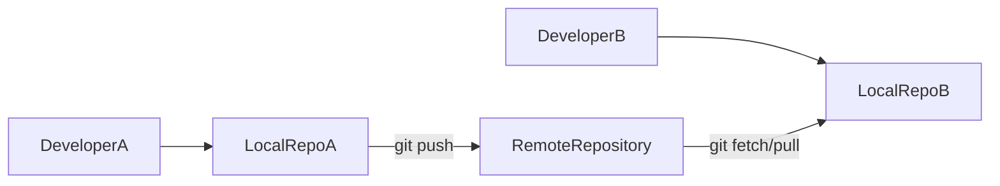
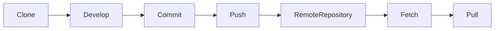
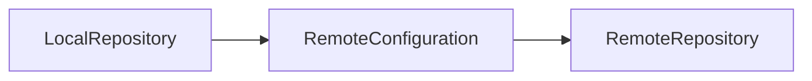
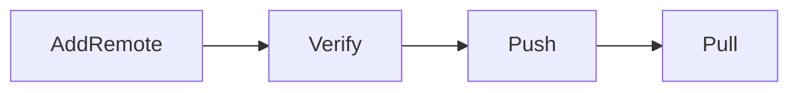
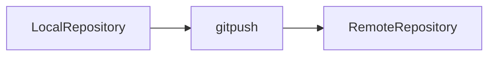
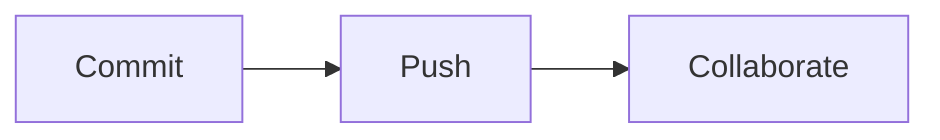
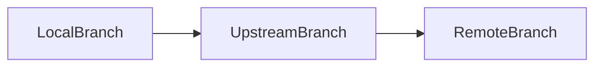

# Remote Repositories

## Overview

A Remote Repository is a shared Git repository hosted on platforms such as GitHub, Azure DevOps Repos, GitLab, or Bitbucket. It enables multiple developers to collaborate by sharing commits, branches, and project history.

Unlike the Local Repository, which exists only on a developer's machine, the Remote Repository acts as the central collaboration point for a team.

> **Interview Point**
>
> Git itself is a distributed version control system. Every developer has a complete Local Repository, while Remote Repositories are used for collaboration and synchronization.

---

## Why It Is Used

Remote repositories enable teams to:

- Collaborate on the same project
- Share commits
- Synchronize branches
- Backup repositories
- Trigger CI/CD pipelines
- Review code through Pull Requests

Without a remote repository:

- Collaboration becomes difficult.
- CI/CD automation is limited.
- Developers cannot easily share changes.

---

## Architecture / Working



---

## Key Components

| Component | Purpose |
|------------|----------|
| Local Repository | Developer's private repository |
| Remote Repository | Shared repository |
| Origin | Default remote name |
| Upstream Branch | Default remote branch relationship |
| Remote Tracking Branch | Local reference to a remote branch |

---

## Types

### Local Repository

Stored on the developer's machine.

### Remote Repository

Hosted on:

- GitHub
- Azure DevOps
- GitLab
- Bitbucket

---

## Lifecycle / Workflow



---

## Configuration / Syntax

View remotes

```bash
git remote -v
```

Fetch changes

```bash
git fetch
```

Pull changes

```bash
git pull
```

Push changes

```bash
git push
```

---

## Important Commands

```bash
git remote

git fetch

git pull

git push
```

---

## Important Files

| File | Purpose |
|------|---------|
| `.git/config` | Stores remote configuration |
| `.git/FETCH_HEAD` | Records fetched references |
| `.git/refs/remotes/` | Stores remote-tracking branch references |

---

## Real-World Use Cases

- Team collaboration
- CI/CD pipelines
- Open-source contributions
- Code reviews
- Multi-developer projects

---

## Advantages

- Central collaboration
- Backup
- Version sharing
- Supports Pull Requests
- Enables automated deployments

---

## Limitations

- Network connectivity required for synchronization
- Push conflicts may occur when the remote repository has newer commits

---

## Common Interview Questions (Concept Only)

- What is a remote repository?
- Difference between local and remote repositories?
- What is `origin`?
- How do developers synchronize code?
- Why are remote repositories important?

---

## Common Mistakes

- Forgetting to pull before pushing
- Pushing to the wrong remote
- Assuming local commits are automatically shared
- Ignoring remote updates

---

## Troubleshooting

| Problem | Solution |
|----------|----------|
| Push rejected | Pull or rebase the latest changes, resolve conflicts, then push again |
| Remote not found | Verify the remote URL using `git remote -v` |
| Authentication failed | Check credentials, SSH keys, or Personal Access Token (PAT) |

---

## Summary

Remote repositories enable collaboration, synchronization, and integration with DevOps tools. They are essential for modern software development and CI/CD workflows.

---

# git remote

## Overview

`git remote` manages connections between a Local Repository and one or more Remote Repositories.

Each remote has:

- Name
- URL

The default remote name is:

```text
origin
```

> **Interview Point**
>
> `origin` is only a **convention**, not a reserved Git keyword.

---

## Why It Is Used

Developers use `git remote` to:

- View configured remotes
- Add new remotes
- Rename remotes
- Remove remotes

---

## Architecture / Working



---

## Key Components

| Component | Purpose |
|------------|----------|
| Remote Name | Alias (e.g., origin) |
| URL | Remote repository address |

---

## Lifecycle / Workflow



---

## Configuration / Syntax

View remotes

```bash
git remote
```

Detailed view

```bash
git remote -v
```

Add remote

```bash
git remote add origin https://github.com/user/repo.git
```

Remove remote

```bash
git remote remove origin
```

Rename remote

```bash
git remote rename origin upstream
```

---

## Important Commands

```bash
git remote

git remote -v

git remote add

git remote remove

git remote rename
```

---

## Important Files

| File | Purpose |
|------|---------|
| `.git/config` | Stores remote information |

---

## Real-World Use Cases

- Connect GitHub repositories
- Configure Azure DevOps Repos
- Add multiple remotes
- Migrate repositories

---

## Advantages

- Flexible
- Supports multiple remotes
- Easy configuration

---

## Limitations

- Incorrect URLs prevent synchronization

---

## Common Interview Questions (Concept Only)

- What does `git remote` do?
- What is `origin`?
- Where are remote URLs stored?

---

## Common Mistakes

- Incorrect repository URL
- Using the wrong remote alias

---

## Troubleshooting

| Problem | Solution |
|----------|----------|
| Wrong remote | Update the URL using `git remote set-url` or remove and re-add the remote |
| Remote missing | Verify with `git remote -v` |

---

## Summary

`git remote` manages the connection between local and remote repositories.

---

# git fetch

## Overview

`git fetch` downloads commits, branches, and tags from a Remote Repository **without modifying the current Working Tree or local branch**.

It updates the remote-tracking branches only.

> **Interview Point**
>
> `git fetch` **does not merge** changes into the current branch.

---

## Why It Is Used

- Check remote updates safely
- Review incoming commits
- Synchronize remote-tracking branches
- Avoid automatic merges

---

## Architecture / Working


---

## Key Components

| Component | Purpose |
|------------|----------|
| Remote Repository | Source |
| Remote Tracking Branch | Updated after fetch |

---

## Lifecycle / Workflow


---

## Configuration / Syntax

Fetch all updates

```bash
git fetch
```

Fetch a specific remote

```bash
git fetch origin
```

Prune deleted remote-tracking branches

```bash
git fetch --prune
```

---

## Important Commands

```bash
git fetch

git fetch origin

git fetch --prune
```

---

## Important Files

| File | Purpose |
|------|---------|
| `.git/FETCH_HEAD` | Records fetched references |

---

## Real-World Use Cases

- Review remote work before merging
- Update branch references
- CI/CD synchronization

---

## Advantages

- Safe
- Non-destructive
- No automatic merge

---

## Limitations

- Local branch is not updated until you merge or rebase the fetched changes

---

## Common Interview Questions (Concept Only)

- What does `git fetch` do?
- Difference between `fetch` and `pull`?
- Does `fetch` modify the Working Tree?

---

## Common Mistakes

- Assuming fetched changes appear immediately in the current branch

---

## Troubleshooting

| Problem | Solution |
|----------|----------|
| Expected local branch updates | Merge or rebase the fetched changes after `git fetch` |

---

## Summary

`git fetch` downloads remote updates without modifying local work, making it the safest synchronization command.

---

# git pull

## Overview

`git pull` downloads changes from a Remote Repository **and integrates them into the current local branch**.

Internally, it performs:

```text
git fetch
+
git merge
```

(or `git rebase` if configured).

> **Interview Point**
>
> `git pull` is effectively **`git fetch` followed by integration** (merge by default).

---

## Why It Is Used

Developers use `git pull` to:

- Update local branches
- Receive teammates' changes
- Synchronize repositories

---

## Architecture / Working


---

## Key Components

| Component | Purpose |
|------------|----------|
| Fetch | Download updates |
| Merge | Integrate changes |

---

## Lifecycle / Workflow


---

## Configuration / Syntax

Pull latest changes

```bash
git pull
```

Pull a specific branch

```bash
git pull origin main
```

Rebase instead of merge

```bash
git pull --rebase
```

---

## Important Commands

```bash
git pull

git pull origin main

git pull --rebase
```

---

## Real-World Use Cases

- Daily synchronization
- Team collaboration
- Sprint development

---

## Advantages

- Simple
- Convenient
- Keeps branches up to date

---

## Limitations

- May introduce merge conflicts
- Automatic integration can make troubleshooting harder if changes are pulled without review

---

## Common Interview Questions (Concept Only)

- Difference between `fetch` and `pull`?
- What operations does `git pull` perform?

---

## Common Mistakes

- Pulling without committing or stashing local changes
- Pulling directly into production branches without understanding incoming changes

---

## Troubleshooting

| Problem | Solution |
|----------|----------|
| Merge conflict | Resolve conflicts, stage the resolved files, and complete the merge |
| Local changes would be overwritten | Commit or stash local changes before pulling |

---

## Summary

`git pull` synchronizes the local branch with the remote repository by fetching and integrating remote changes.

---

# git push

## Overview

`git push` uploads local commits to a Remote Repository.

Only committed changes are pushed.

Uncommitted modifications remain local.

> **Interview Point**
>
> `git push` transfers **commits**, not unstaged or uncommitted files.

---

## Why It Is Used

Developers use `git push` to:

- Share code
- Trigger CI/CD pipelines
- Create Pull Requests
- Backup commits

---

## Architecture / Working



---

## Key Components

| Component | Purpose |
|------------|----------|
| Local Commits | Source |
| Remote Repository | Destination |

---

## Lifecycle / Workflow



---

## Configuration / Syntax

Push current branch

```bash
git push
```

Push a specific branch

```bash
git push origin feature-login
```

Push and set upstream

```bash
git push -u origin feature-login
```

---

## Important Commands

```bash
git push

git push origin

git push -u
```

---

## Real-World Use Cases

- Team collaboration
- CI/CD
- Release deployments

---

## Advantages

- Share commits
- Backup work
- Trigger automation

---

## Limitations

- Pushes may be rejected if the remote contains newer commits or branch protection rules apply

---

## Common Interview Questions (Concept Only)

- What does `git push` upload?
- Why is push rejected sometimes?

---

## Common Mistakes

- Forgetting to commit before pushing
- Force-pushing shared branches without coordination

---

## Troubleshooting

| Problem | Solution |
|----------|----------|
| Push rejected | Pull or rebase the latest changes, resolve conflicts if necessary, then push again |
| Authentication failed | Verify SSH keys or Personal Access Token (PAT) configuration |

---

## Summary

`git push` uploads local commits to a remote repository, enabling collaboration and triggering automated workflows.

---

# Upstream Branches

## Overview

An Upstream Branch is the default remote branch associated with a local branch.

Once configured, Git knows:

- Where to push
- Where to pull
- Which branch to compare against

> **Interview Point**
>
> Setting an upstream branch eliminates the need to specify the remote and branch name for every `git push` or `git pull`.

---

## Why It Is Used

It simplifies Git commands and maintains branch relationships.

---

## Architecture / Working



---

## Key Components

| Component | Purpose |
|------------|----------|
| Local Branch | Current branch |
| Upstream Branch | Default remote reference |

---

## Lifecycle / Workflow


---

## Configuration / Syntax

Set upstream while pushing

```bash
git push -u origin feature-login
```

View tracking information

```bash
git branch -vv
```

---

## Important Commands

```bash
git push -u

git branch -vv
```

---

## Important Files

| File | Purpose |
|------|---------|
| `.git/config` | Stores upstream branch information |

---

## Real-World Use Cases

- Feature development
- Team collaboration
- CI/CD

---

## Advantages

- Simplifies Git commands
- Reduces typing
- Improves workflow consistency

---

## Limitations

- Incorrect upstream configuration can cause pushes or pulls to target the wrong remote branch

---

## Common Interview Questions (Concept Only)

- What is an upstream branch?
- How do you configure an upstream branch?
- Why is `-u` used with `git push`?

---

## Common Mistakes

- Forgetting to configure upstream for new branches
- Assuming every local branch already tracks a remote branch

---

## Troubleshooting

| Problem | Solution |
|----------|----------|
| No upstream configured | Set it using `git push -u origin <branch-name>` |

---

## Summary

Upstream branches define the default relationship between local and remote branches, making everyday Git operations simpler.

---

# Remote Tracking Branches

## Overview

Remote Tracking Branches are local references that represent the current state of branches on a Remote Repository.

Examples:

```text
origin/main

origin/develop

origin/feature-login
```

These branches are updated automatically when running:

- `git fetch`
- `git pull`

> **Interview Point**
>
> Remote-tracking branches are **read-only references** managed by Git. You do not commit directly to them.

---

## Why It Is Used

They allow developers to:

- Monitor remote changes
- Compare local work with remote branches
- Synchronize repositories safely

---

## Architecture / Working


---

## Key Components

| Component | Purpose |
|------------|----------|
| `origin/main` | Tracks the remote `main` branch |
| `origin/feature` | Tracks a remote feature branch |

---

## Lifecycle / Workflow


---

## Configuration / Syntax

List remote branches

```bash
git branch -r
```

List all branches

```bash
git branch -a
```

Update tracking branches

```bash
git fetch
```

---

## Important Commands

```bash
git branch -r

git branch -a

git fetch
```

---

## Important Files

| File | Purpose |
|------|---------|
| `.git/refs/remotes/` | Stores remote-tracking branch references |

---

## Real-World Use Cases

- Compare local and remote branches
- Review teammate changes
- Monitor repository updates

---

## Advantages

- Safe synchronization
- Clear visibility into remote state
- Supports collaboration

---

## Limitations

- Remote-tracking branches are not updated automatically; they require `git fetch` or `git pull`

---

## Common Interview Questions (Concept Only)

- What is a remote-tracking branch?
- Difference between a local branch and a remote-tracking branch?
- How are remote-tracking branches updated?

---

## Common Mistakes

- Trying to commit directly to a remote-tracking branch
- Assuming remote-tracking branches always reflect the latest remote state without fetching

---

## Troubleshooting

| Problem | Solution |
|----------|----------|
| Remote branch missing | Run `git fetch` to update remote-tracking references |
| Stale remote-tracking branches | Use `git fetch --prune` to remove references to deleted remote branches |

---

## Summary

Remote-tracking branches are local references to remote branches. They provide visibility into the remote repository's state and are updated during fetch or pull operations, enabling safe and efficient collaboration.
