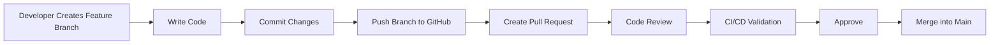
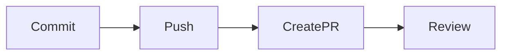
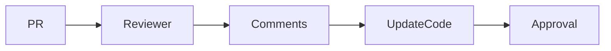
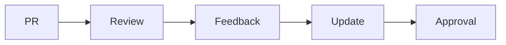
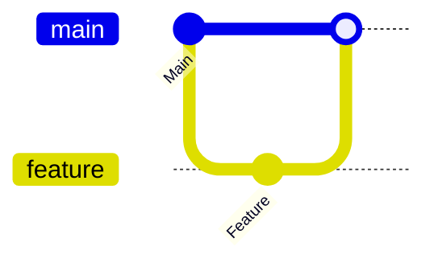
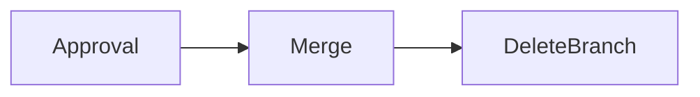
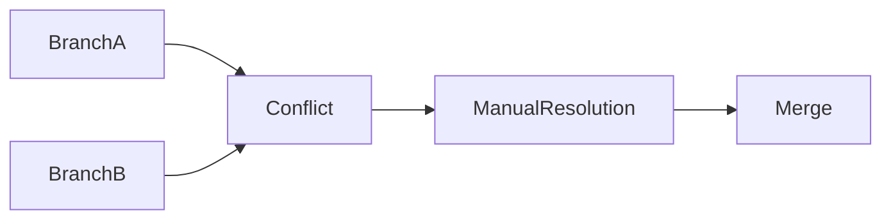
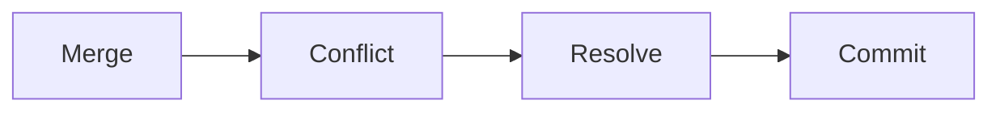

# Pull Requests

## Overview

A **Pull Request (PR)** is a GitHub feature used to propose, review, discuss, and merge changes from one branch into another. It is one of the most important collaboration features in GitHub and is heavily used in DevOps and enterprise software development.

Instead of directly merging code into the **main** branch, developers create a Pull Request so teammates can review the code before it becomes part of the project.

> **Interview Point**
>
> A Pull Request is **not a Git feature**. It is a **GitHub (and similar platforms) feature** built on top of Git.

---

## Why It Is Used

Pull Requests help teams:

- Review code before merging
- Maintain code quality
- Detect bugs early
- Discuss implementation changes
- Run automated CI/CD checks
- Enforce branch protection policies
- Maintain audit history

---

## Architecture / Working



---

## Key Components

| Component | Purpose |
|------------|----------|
| Source Branch | Branch containing new changes |
| Target Branch | Branch receiving the changes |
| Reviewer | Reviews the code |
| Comments | Discuss improvements |
| Approval | Required before merge |
| Merge | Combines changes |
| Status Checks | CI/CD validation |

---

## Types

### Feature Pull Request

Adds new functionality.

### Bug Fix Pull Request

Fixes existing issues.

### Hotfix Pull Request

Applies urgent production fixes.

### Documentation Pull Request

Updates documentation.

---

## Lifecycle / Workflow


---

## Configuration / Syntax (if applicable)

Typical Git workflow before creating a Pull Request

```bash
git checkout -b feature-login

git add .

git commit -m "Added login page"

git push -u origin feature-login
```

Then create the Pull Request through the GitHub web interface.

---

## Important Commands (if applicable)

```bash
git checkout

git add

git commit

git push

git fetch

git pull
```

---

## Important Files (if applicable)

| File | Purpose |
|------|---------|
| `.github/PULL_REQUEST_TEMPLATE.md` | Standard PR template |
| `.github/CODEOWNERS` | Automatically assigns reviewers |
| `.github/workflows/` | CI/CD workflow validation |

---

## Real-World Use Cases

- Feature development
- Production deployments
- Infrastructure as Code
- Kubernetes configuration updates
- DevOps automation
- Open-source contributions

---

## Advantages

- Better code quality
- Team collaboration
- Code review
- Automated validation
- Easy rollback
- Complete audit history

---

## Limitations

- Review process may slow delivery if approvals are delayed
- Large Pull Requests are harder to review
- Merge conflicts may require additional work

---

## Common Interview Questions (Concept Only)

- What is a Pull Request?
- Why do organizations use Pull Requests?
- Is Pull Request a Git feature?
- What happens before a Pull Request is merged?
- Why are Pull Requests important in DevOps?

---

## Common Mistakes

- Creating very large Pull Requests
- Merging without code review
- Ignoring CI/CD failures
- Using unclear PR titles
- Not updating feature branches before opening a PR

---

## Troubleshooting

| Problem | Solution |
|----------|----------|
| Cannot create PR | Push the branch to the remote repository first |
| CI checks failed | Fix the issues and push additional commits |
| Merge conflicts | Update the branch and resolve conflicts |
| Reviewer cannot approve | Verify repository permissions |

---

## Summary

Pull Requests provide a structured process for reviewing, validating, and merging code, making them an essential part of modern GitHub and DevOps workflows.

---

# Create Pull Request

## Overview

Creating a Pull Request (PR) submits changes from one branch to another for review before merging.

Most Pull Requests merge:

```text
feature branch → main branch
```

or

```text
feature branch → develop branch
```

> **Interview Point**
>
> Creating a Pull Request does **not** merge code. It only requests a review.

---

## Why It Is Used

Developers create Pull Requests to:

- Request code review
- Trigger CI/CD pipelines
- Receive feedback
- Protect production branches
- Enable team collaboration

---

## Architecture / Working


---

## Key Components

| Component | Purpose |
|------------|----------|
| Source Branch | Contains new code |
| Target Branch | Receives changes |
| Title | Summary of changes |
| Description | Detailed explanation |
| Reviewer | Reviews the code |

---

## Lifecycle / Workflow



---

## Configuration / Syntax (if applicable)

Push the feature branch

```bash
git push origin feature-login
```

Create the Pull Request using the GitHub interface.

---

## Important Commands (if applicable)

```bash
git push

git status
```

---

## Real-World Use Cases

- New feature submission
- Bug fixes
- Infrastructure updates
- Documentation changes

---

## Advantages

- Enables collaboration
- Improves code quality
- Starts automated validation

---

## Limitations

- Requires remote repository access
- Dependent on reviewer availability

---

## Common Interview Questions (Concept Only)

- How do you create a Pull Request?
- What information should a Pull Request contain?
- What happens after creating a Pull Request?

---

## Common Mistakes

- Missing description
- Wrong target branch
- Opening PR before testing
- Poor PR title

---

## Troubleshooting

| Problem | Solution |
|----------|----------|
| Branch missing | Push it using `git push` |
| Wrong base branch | Edit the Pull Request target branch before merging |

---

## Summary

Creating a Pull Request begins the collaborative review process before code is merged into the target branch.

---

# Review Process

## Overview

The Review Process allows other developers to examine code before it is merged.

Reviewers can:

- Approve
- Request changes
- Leave comments
- Reject the Pull Request

> **Interview Point**
>
> Most enterprise organizations require **at least one approval** before merging into protected branches.

---

## Why It Is Used

Code review helps:

- Improve quality
- Detect bugs
- Share knowledge
- Maintain coding standards
- Reduce production issues

---

## Architecture / Working



---

## Key Components

| Component | Purpose |
|------------|----------|
| Reviewer | Reviews changes |
| Comments | Suggest improvements |
| Approval | Accepts changes |
| Requested Changes | Requires modifications |

---

## Types

### Approval

Ready to merge.

### Request Changes

Developer must update code.

### Comment

Discussion without blocking the merge.

---

## Lifecycle / Workflow



---

## Real-World Use Cases

- Enterprise development
- DevOps pipelines
- Security review
- Infrastructure review

---

## Advantages

- Higher quality code
- Better collaboration
- Knowledge sharing
- Reduced defects

---

## Limitations

- Slower delivery if reviews are delayed
- Quality depends on reviewer expertise

---

## Common Interview Questions (Concept Only)

- Why is code review important?
- What happens during a Pull Request review?
- Who approves Pull Requests?

---

## Common Mistakes

- Ignoring reviewer feedback
- Approving without understanding the code
- Reviewing very large Pull Requests

---

## Troubleshooting

| Problem | Solution |
|----------|----------|
| Approval blocked | Complete required reviews and status checks |
| Requested changes remain | Address feedback and push updated commits |

---

## Summary

The review process ensures code quality, collaboration, and compliance with organizational standards before merging.

---

# Merge Pull Request

## Overview

Merging a Pull Request integrates the approved changes into the target branch.

After merging:

- Feature branch history becomes part of the target branch.
- CI/CD pipelines may start automatically.
- Feature branch is usually deleted.

---

## Why It Is Used

Merging:

- Integrates completed work
- Updates production code
- Maintains project history
- Completes development tasks

---

## Architecture / Working



---

## Key Components

| Component | Purpose |
|------------|----------|
| Source Branch | Branch being merged |
| Target Branch | Receives changes |
| Merge Commit | Records merge (if applicable) |

---

## Types

### Merge Commit

Preserves branch history.

### Squash Merge

Combines all commits into one.

### Rebase Merge

Applies commits linearly without a merge commit.

> **Interview Point**
>
> GitHub supports multiple merge strategies depending on repository settings.

---

## Lifecycle / Workflow



---

## Configuration / Syntax (if applicable)

Typical Git merge

```bash
git checkout main

git merge feature-login
```

Most GitHub merges are completed through the web interface.

---

## Important Commands (if applicable)

```bash
git merge

git push
```

---

## Real-World Use Cases

- Sprint completion
- Production releases
- Infrastructure deployment

---

## Advantages

- Integrates completed work
- Maintains history
- Enables deployments

---

## Limitations

- Merge conflicts may occur
- Wrong merge strategy can make history harder to read

---

## Common Interview Questions (Concept Only)

- What happens after merging a Pull Request?
- What merge strategies does GitHub support?
- What is Squash Merge?

---

## Common Mistakes

- Merging without approvals
- Using the wrong merge strategy
- Forgetting to delete merged branches

---

## Troubleshooting

| Problem | Solution |
|----------|----------|
| Merge blocked | Complete required reviews and CI/CD checks |
| Merge conflict | Resolve conflicts before merging |

---

## Summary

Merging a Pull Request integrates reviewed and approved changes into the target branch, completing the development workflow.

---

# Resolve Merge Conflicts

## Overview

A Merge Conflict occurs when Git cannot automatically combine changes from two branches because both modified the same part of the code or file.

Git stops the merge and requires manual intervention.

> **Interview Point**
>
> Git never guesses which change is correct. The developer must resolve the conflict.

---

## Why It Is Used

Conflict resolution:

- Prevents accidental data loss
- Ensures correct integration
- Preserves code quality

---

## Architecture / Working



---

## Key Components

| Component | Purpose |
|------------|----------|
| Conflict Marker | Indicates conflicting sections |
| Manual Edit | Choose the correct code |
| Final Commit | Completes merge |

---

## Lifecycle / Workflow



---

## Configuration / Syntax (if applicable)

View conflicts

```bash
git status
```

Resolve conflicts manually.

Stage resolved files

```bash
git add .
```

Complete merge

```bash
git commit
```

Abort merge

```bash
git merge --abort
```

---

## Important Commands (if applicable)

```bash
git status

git add

git commit

git merge --abort

git diff
```

---

## Important Files (if applicable)

| File | Purpose |
|------|---------|
| `.git/MERGE_HEAD` | Stores merge state |
| `.git/HEAD` | Current branch |

---

## Real-World Use Cases

- Multiple developers editing the same file
- Infrastructure changes
- Kubernetes manifests
- CI/CD pipeline updates

---

## Advantages

- Prevents overwriting teammates' work
- Forces careful review
- Preserves repository integrity

---

## Limitations

- Manual effort required
- Large conflicts can be time-consuming
- Poor branch management increases conflict frequency

---

## Common Interview Questions (Concept Only)

- What causes merge conflicts?
- How do you resolve merge conflicts?
- What command cancels a merge?
- Why does Git stop during a conflict?

---

## Common Mistakes

- Deleting conflict markers incorrectly
- Keeping the wrong version of the code
- Forgetting to stage resolved files
- Skipping testing after conflict resolution

---

## Troubleshooting

| Problem | Solution |
|----------|----------|
| Merge stopped | Resolve all conflicts and stage the files before completing the merge |
| Conflict markers remain | Remove all markers after selecting the correct code |
| Merge should be canceled | Use `git merge --abort` |
| Unsure which version to keep | Review both changes using `git diff` or a merge tool before resolving |

---

## Summary

Merge conflict resolution is a critical Git skill. Developers manually reconcile conflicting changes, validate the result, stage the resolved files, and complete the merge. It is one of the most frequently discussed topics in Git and GitHub interviews.
