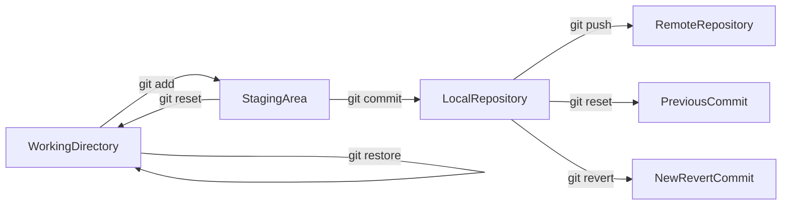
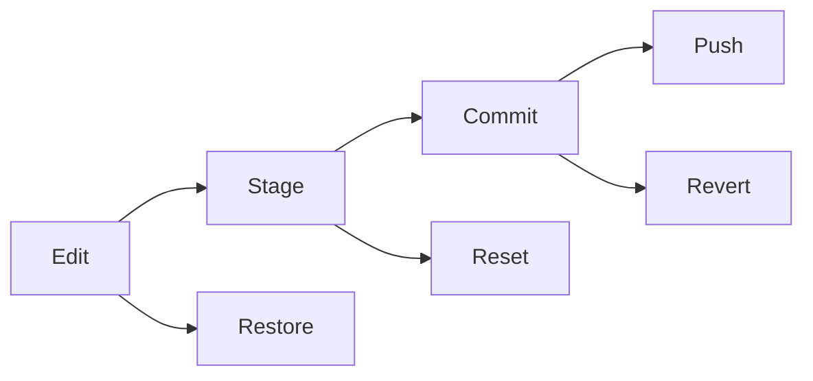

# Undoing Changes

## Overview

Undoing changes is one of the most important Git concepts for both interviews and real-world development. Git provides multiple commands to reverse or modify changes at different stages of the Git workflow.

Depending on where the change exists (Working Directory, Staging Area, Local Repository, or Remote Repository), different commands are used.

> **Interview Point**
>
> One of the most frequently asked Git interview questions is:
>
> **"What is the difference between `git restore`, `git reset`, and `git revert`?"**
>
> These commands serve different purposes and should not be used interchangeably.

---

## Why It Is Used

Undoing changes helps developers:

- Recover from mistakes
- Remove unwanted changes
- Undo commits safely
- Correct commit messages
- Restore deleted files
- Maintain a clean Git history

---

## Architecture / Working



---

## Key Components

| Component | Purpose |
|------------|----------|
| Working Directory | Current file modifications |
| Staging Area | Prepared changes |
| Local Repository | Commit history |
| Restore | Undo file changes |
| Reset | Move HEAD or unstage changes |
| Revert | Reverse a commit safely |
| Amend | Modify latest commit |

---

## Types

### Working Directory Undo

- `git restore`

### Staging Area Undo

- `git reset`

### Commit History Undo

- `git reset`
- `git revert`

### Modify Latest Commit

- `git commit --amend`

---

## Lifecycle / Workflow



---

## Configuration / Syntax

```bash
git restore file.txt

git reset HEAD file.txt

git revert <commit-id>

git commit --amend
```

---

## Important Commands

```bash
git restore

git reset

git revert

git commit --amend
```

---

## Important Files

| File | Purpose |
|------|---------|
| `.git/HEAD` | Current commit reference |
| `.git/index` | Staging Area |

---

## Real-World Use Cases

- Undo accidental edits
- Remove wrongly staged files
- Reverse production bugs
- Fix commit messages
- Restore deleted files
- Correct deployment mistakes

---

## Advantages

- Recover mistakes quickly
- Protect project history
- Safe collaboration
- Flexible recovery options

---

## Limitations

- Incorrect use of `git reset --hard` may permanently remove uncommitted work
- Resetting published commits can disrupt collaborators

---

## Common Interview Questions (Concept Only)

- Difference between restore, reset, and revert?
- Which command is safest after pushing commits?
- When should reset be avoided?
- What does amend do?

---

## Common Mistakes

- Using `git reset --hard` without understanding its impact
- Resetting commits that have already been shared
- Using `git revert` instead of `git restore`
- Confusing restore with reset

---

## Troubleshooting

| Problem | Solution |
|----------|----------|
| Wrong file restored | Recover changes only if they still exist elsewhere (e.g., another commit or stash) |
| Reset removed staged files | Stage them again if needed |
| Wrong commit reverted | Revert the revert commit or create a new corrective commit |
| Amend already pushed | Avoid amending shared commits; create a new commit or coordinate a force push if necessary |

---

## Summary

Git provides multiple mechanisms to undo changes depending on where those changes exist. Choosing the correct command is essential for maintaining repository integrity and collaborating safely.

---

# git restore

## Overview

`git restore` restores files in the Working Directory from the Staging Area or the latest commit.

It is primarily used to discard **uncommitted** changes.

> **Interview Point**
>
> `git restore` **does not affect commit history.**

---

## Why It Is Used

Developers use it to:

- Discard local edits
- Restore deleted files
- Undo accidental modifications

---

## Architecture / Working


---

## Key Components

| Component | Purpose |
|------------|----------|
| Working Directory | Source of modified files |
| Last Commit | Restore source |

---

## Lifecycle / Workflow


---

## Configuration / Syntax

Restore one file

```bash
git restore app.py
```

Restore all files

```bash
git restore .
```

Restore staged version

```bash
git restore --staged app.py
```

---

## Important Commands

```bash
git restore

git restore .

git restore --staged
```

---

## Real-World Use Cases

- Undo accidental edits
- Recover deleted files
- Clean Working Directory

---

## Advantages

- Safe
- Simple
- Does not modify commit history

---

## Limitations

- Cannot recover discarded uncommitted changes unless they exist elsewhere

---

## Common Interview Questions (Concept Only)

- What does `git restore` do?
- Does `git restore` remove commits?

---

## Common Mistakes

- Assuming restore removes commits
- Restoring the wrong file

---

## Troubleshooting

| Problem | Solution |
|----------|----------|
| File not restored | Ensure the file exists in the target commit or staging area |

---

## Summary

`git restore` is the preferred command for undoing uncommitted file changes without affecting repository history.

---

# git reset

## Overview

`git reset` changes the current branch (HEAD) and can also modify the Staging Area and Working Directory depending on the reset mode.

It is one of Git's most powerful—and potentially dangerous—commands.

> **Interview Point**
>
> `git reset` **rewrites Git history**. Avoid using it on commits that have already been shared with others.

---

## Why It Is Used

Developers use it to:

- Unstage files
- Remove commits
- Move HEAD
- Correct local mistakes

---

## Architecture / Working


---

## Key Components

| Mode | Effect |
|------|---------|
| Soft | Move HEAD only |
| Mixed | Move HEAD and reset Staging Area (default) |
| Hard | Move HEAD, reset Staging Area, and Working Directory |

---

## Types

### Soft Reset

Keeps staged changes.

### Mixed Reset

Keeps Working Directory changes.

### Hard Reset

Deletes local changes.

---

## Lifecycle / Workflow


---

## Configuration / Syntax

Soft reset

```bash
git reset --soft HEAD~1
```

Mixed reset

```bash
git reset HEAD~1
```

Hard reset

```bash
git reset --hard HEAD~1
```

Unstage file

```bash
git reset HEAD app.py
```

---

## Important Commands

```bash
git reset

git reset --soft

git reset --hard
```

---

## Real-World Use Cases

- Undo local commits
- Remove staged files
- Rewrite local history

---

## Advantages

- Flexible
- Powerful
- Supports multiple recovery scenarios

---

## Limitations

- Hard reset permanently removes uncommitted changes
- Rewriting published history can disrupt collaboration

---

## Common Interview Questions (Concept Only)

- Difference between soft, mixed, and hard reset?
- When should `git reset` not be used?
- What does `git reset --hard` do?

---

## Common Mistakes

- Using hard reset accidentally
- Resetting commits after pushing to a shared repository

---

## Troubleshooting

| Problem | Solution |
|----------|----------|
| Lost local changes | Recovery may not be possible unless they were committed or stashed |
| Wrong reset | Check `git reflog` to locate previous HEAD positions if recovery is needed |

---

## Summary

`git reset` modifies branch history and should be used carefully, especially when working with shared repositories.

---

# git revert

## Overview

`git revert` creates a **new commit** that reverses the changes introduced by an earlier commit.

Unlike `git reset`, it **does not remove existing commits**.

> **Interview Point**
>
> `git revert` is the safest method for undoing changes that have already been pushed to a shared repository.

---

## Why It Is Used

Developers use it to:

- Undo production bugs
- Reverse incorrect commits
- Preserve Git history
- Safely collaborate

---

## Architecture / Working


---

## Key Components

| Component | Purpose |
|------------|----------|
| Original Commit | Remains in history |
| Revert Commit | Reverses previous changes |

---

## Lifecycle / Workflow


---

## Configuration / Syntax

```bash
git revert <commit-id>
```

---

## Important Commands

```bash
git revert
```

---

## Real-World Use Cases

- Undo faulty releases
- Reverse production bugs
- Enterprise collaboration

---

## Advantages

- Safe
- Maintains history
- Ideal for shared repositories

---

## Limitations

- Does not remove the original commit from history
- Multiple revert commits can clutter history if used excessively

---

## Common Interview Questions (Concept Only)

- Difference between reset and revert?
- Why is revert preferred after pushing?
- Does revert delete commits?

---

## Common Mistakes

- Using reset instead of revert on shared branches
- Reverting the wrong commit

---

## Troubleshooting

| Problem | Solution |
|----------|----------|
| Revert conflict | Resolve conflicts, stage resolved files, and complete the revert |
| Wrong revert | Revert the revert commit or create a corrective commit |

---

## Summary

`git revert` safely reverses committed changes by creating a new commit while preserving project history.

---

# Amend Commit

## Overview

`git commit --amend` modifies the **most recent commit**.

It can be used to:

- Change the commit message
- Add forgotten files
- Replace the latest commit

> **Interview Point**
>
> Amending rewrites the latest commit. Avoid amending commits that have already been pushed unless you understand the impact and coordinate with collaborators.

---

## Why It Is Used

Developers use amend to:

- Fix commit messages
- Add missing files
- Improve commit quality

---

## Architecture / Working


---

## Key Components

| Component | Purpose |
|------------|----------|
| Latest Commit | Gets replaced |
| New Commit | Updated version |

---

## Lifecycle / Workflow


---

## Configuration / Syntax

Change commit message

```bash
git commit --amend
```

Amend without changing the message

```bash
git commit --amend --no-edit
```

---

## Important Commands

```bash
git commit --amend

git commit --amend --no-edit
```

---

## Real-World Use Cases

- Correct typos
- Add forgotten configuration files
- Improve commit messages
- Clean local history before pushing

---

## Advantages

- Keeps commit history clean
- Prevents unnecessary extra commits
- Easy to fix recent mistakes

---

## Limitations

- Rewrites commit history
- Should not be used on commits that others have already based work on

---

## Common Interview Questions (Concept Only)

- What does `git commit --amend` do?
- When should amend be avoided?
- Does amend create a new commit?

---

## Common Mistakes

- Amending a pushed commit without understanding the consequences
- Assuming amend modifies older commits

---

## Troubleshooting

| Problem | Solution |
|----------|----------|
| Forgot to stage changes | Stage the files before running `git commit --amend` |
| Amended pushed commit | Coordinate with collaborators and force-push only if appropriate |

---

## Summary

`git commit --amend` replaces the latest commit with an updated version, making it an excellent tool for correcting recent mistakes before sharing commits.
