# Collaboration Workflow

## Overview

A **Git Collaboration Workflow** is the standard process teams follow to develop, review, and merge code safely using Git and GitHub.

Instead of every developer working directly on the `main` branch, each developer creates an independent feature branch, implements changes, submits a Pull Request (PR), undergoes code review, and then merges the approved changes.

This workflow minimizes conflicts, improves code quality, and supports Continuous Integration (CI) and Continuous Delivery (CD).

> **Interview Point**
>
> In enterprise environments, **developers rarely commit directly to the `main` branch**. All changes typically go through **feature branches** and **Pull Requests**.

---

## Why It Is Used

A collaboration workflow helps teams:

- Work simultaneously without affecting each other
- Maintain a stable main branch
- Enable code reviews
- Reduce merge conflicts
- Integrate CI/CD pipelines
- Maintain complete version history
- Improve software quality

---

## Architecture / Working

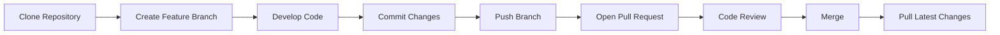

---

## Key Components

| Component | Purpose |
|------------|----------|
| Remote Repository | Central codebase |
| Local Repository | Developer workspace |
| Feature Branch | Isolated development |
| Pull Request | Code review |
| Main Branch | Stable production-ready code |
| Merge | Integrate approved changes |

---

## Types (if applicable)

### Feature Branch Workflow

Each feature is developed in a separate branch.

### GitHub Flow

Simple workflow using:

- Main
- Feature Branch
- Pull Request

### Git Flow

More structured workflow with:

- Main
- Develop
- Feature
- Release
- Hotfix

> **Interview Point**
>
> GitHub Flow is commonly used in modern DevOps environments because of its simplicity and CI/CD compatibility.

---

## Lifecycle / Workflow

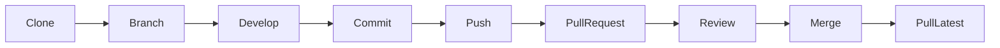

---

## Configuration / Syntax (if applicable)

Typical collaboration workflow

```bash
git clone https://github.com/user/project.git

git checkout -b feature-login

git add .

git commit -m "Add login feature"

git push origin feature-login

# Create Pull Request on GitHub

git checkout main

git pull origin main
```

---

## Important Commands (if applicable)

```bash
git clone

git checkout -b

git add

git commit

git push

git pull

git fetch

git merge
```

---

## Important Files (if applicable)

| File | Purpose |
|------|---------|
| `.git/config` | Repository configuration |
| `.git/HEAD` | Current branch reference |
| `README.md` | Project documentation |
| `.github/PULL_REQUEST_TEMPLATE.md` | Pull Request template |
| `.github/CODEOWNERS` | Code review ownership |

---

## Real-World Use Cases

- Enterprise application development
- Infrastructure as Code (Terraform/Bicep)
- Kubernetes deployments
- Azure DevOps projects
- Open-source contributions
- CI/CD pipelines

---

## Advantages

- Parallel development
- Better code quality
- Easier collaboration
- Reduced production issues
- Complete audit history
- Supports automated testing

---

## Limitations

- Requires branch management
- Code reviews may delay merges
- Merge conflicts may occur
- Developers must frequently synchronize with the main branch

---

## Common Interview Questions (Concept Only)

- Describe a typical Git collaboration workflow.
- Why should developers use feature branches?
- Why are Pull Requests important?
- Why shouldn't developers commit directly to the main branch?
- How do teams collaborate using GitHub?

---

## Common Mistakes

- Developing directly on the main branch
- Creating very large Pull Requests
- Not pulling the latest changes before starting work
- Forgetting to delete merged branches
- Ignoring CI/CD failures

---

## Troubleshooting

| Problem | Solution |
|----------|----------|
| Merge conflicts | Pull the latest changes and resolve conflicts before merging |
| Push rejected | Fetch or pull the latest remote changes, then retry |
| Outdated feature branch | Rebase or merge the latest main branch into the feature branch |
| Pull Request blocked | Complete required reviews and CI/CD checks |

---

## Summary

The Git Collaboration Workflow enables multiple developers to work safely using feature branches, Pull Requests, code reviews, and controlled merges, ensuring high-quality software delivery.

---

# Clone Repository

## Overview

Cloning creates a complete local copy of a remote Git repository, including:

- Source code
- Commit history
- Branches
- Tags
- Remote configuration

It is the first step in almost every Git collaboration workflow.

> **Interview Point**
>
> `git clone` downloads the **entire repository**, not just the latest files.

---

## Why It Is Used

Developers clone repositories to:

- Start development
- Review existing code
- Build applications locally
- Contribute to projects
- Synchronize with a shared repository

---

## Architecture / Working

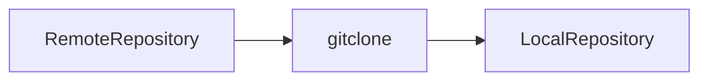

---

## Key Components

| Component | Purpose |
|------------|----------|
| Remote Repository | Source project |
| Local Repository | Developer copy |
| Origin | Default remote name |

---

## Lifecycle / Workflow

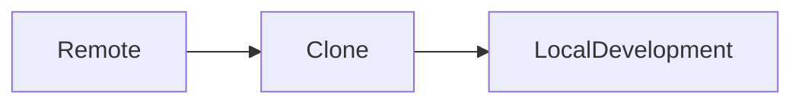

---

## Configuration / Syntax (if applicable)

Clone using HTTPS

```bash
git clone https://github.com/user/project.git
```

Clone using SSH

```bash
git clone git@github.com:user/project.git
```

---

## Important Commands (if applicable)

```bash
git clone
```

---

## Important Files (if applicable)

| File | Purpose |
|------|---------|
| `.git/config` | Stores remote configuration |

---

## Real-World Use Cases

- New developer onboarding
- CI/CD agents
- Infrastructure repositories
- Open-source projects

---

## Advantages

- Complete project history
- Easy setup
- Offline development

---

## Limitations

- Large repositories require more time and storage
- Initial clone depends on network speed

---

## Common Interview Questions (Concept Only)

- What does `git clone` do?
- What information is downloaded during cloning?

---

## Common Mistakes

- Cloning the wrong repository
- Using the wrong authentication method

---

## Troubleshooting

| Problem | Solution |
|----------|----------|
| Authentication failed | Verify SSH keys or Personal Access Token |
| Repository not found | Verify the repository URL and permissions |

---

## Summary

Cloning creates a complete local copy of a remote repository and is the first step in the Git collaboration process.

---

# Create Feature Branch

## Overview

A Feature Branch is an isolated branch used to develop a specific feature or fix without affecting the main branch.

Each task should have its own branch.

> **Interview Point**
>
> Enterprise teams generally create **one feature branch per task, bug, or user story**.

---

## Why It Is Used

Feature branches:

- Isolate development
- Reduce conflicts
- Support code reviews
- Enable parallel development

---

## Architecture / Working

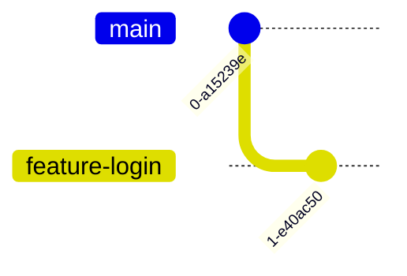

---

## Key Components

| Component | Purpose |
|------------|----------|
| Main Branch | Stable code |
| Feature Branch | New development |

---

## Lifecycle / Workflow

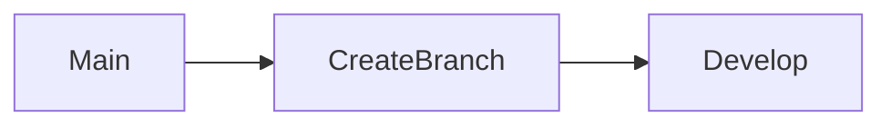

---

## Configuration / Syntax (if applicable)

Create and switch to a branch

```bash
git checkout -b feature-login
```

List branches

```bash
git branch
```

---

## Important Commands (if applicable)

```bash
git checkout -b

git branch
```

---

## Important Files (if applicable)

None

---

## Real-World Use Cases

- Feature development
- Bug fixes
- Infrastructure updates
- Documentation improvements

---

## Advantages

- Safe isolation
- Easy testing
- Simplified reviews

---

## Limitations

- Long-lived branches increase merge conflicts
- Requires regular synchronization with the main branch

---

## Common Interview Questions (Concept Only)

- Why use feature branches?
- Why avoid working directly on the main branch?

---

## Common Mistakes

- Using the main branch for development
- Naming branches inconsistently
- Keeping branches active for too long

---

## Troubleshooting

| Problem | Solution |
|----------|----------|
| Branch already exists | Choose a different name or reuse the existing branch |
| Wrong base branch | Recreate the feature branch from the correct base if necessary |

---

## Summary

Feature branches isolate work, improve collaboration, and reduce risks when multiple developers work on the same project.

---

# Commit Changes

## Overview

A commit records a snapshot of staged changes in the local repository.

Each commit should represent one logical unit of work.

> **Interview Point**
>
> Commit **small, meaningful changes** instead of large batches of unrelated modifications.

---

## Why It Is Used

Commits:

- Save progress
- Track changes
- Support rollback
- Improve collaboration
- Maintain project history

---

## Architecture / Working

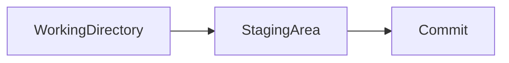

---

## Key Components

| Component | Purpose |
|------------|----------|
| Commit | Snapshot |
| Message | Describes changes |

---

## Lifecycle / Workflow

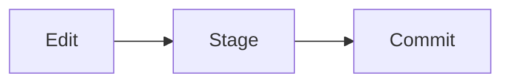

---

## Configuration / Syntax (if applicable)

```bash
git add .

git commit -m "Add login validation"
```

---

## Important Commands (if applicable)

```bash
git add

git commit

git status
```

---

## Important Files (if applicable)

| File | Purpose |
|------|---------|
| `.git/HEAD` | Current commit reference |

---

## Real-World Use Cases

- Feature development
- Bug fixes
- Infrastructure updates

---

## Advantages

- Maintains history
- Enables rollback
- Improves collaboration

---

## Limitations

- Poor commit messages reduce clarity
- Large commits are difficult to review

---

## Common Interview Questions (Concept Only)

- What is a commit?
- What makes a good commit message?

---

## Common Mistakes

- Large commits
- Vague commit messages
- Forgetting to stage changes

---

## Troubleshooting

| Problem | Solution |
|----------|----------|
| Nothing to commit | Stage modified files before committing |
| Wrong commit message | Amend the latest commit if it has not been shared |

---

## Summary

Commits capture logical units of work and form the foundation of Git history.

---

# Push Branch

## Overview

After committing locally, developers push the feature branch to the remote repository so others can review and collaborate.

---

## Why It Is Used

Pushing:

- Shares work
- Backs up commits
- Enables Pull Requests
- Triggers CI/CD pipelines

---

## Architecture / Working

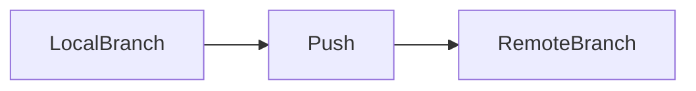

---

## Key Components

| Component | Purpose |
|------------|----------|
| Local Branch | Source |
| Remote Branch | Shared branch |

---

## Lifecycle / Workflow

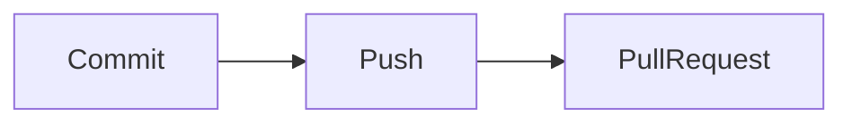

---

## Configuration / Syntax (if applicable)

First push

```bash
git push -u origin feature-login
```

Subsequent pushes

```bash
git push
```

---

## Important Commands (if applicable)

```bash
git push

git status
```

---

## Important Files (if applicable)

| File | Purpose |
|------|---------|
| `.git/config` | Stores upstream branch configuration |

---

## Real-World Use Cases

- Team collaboration
- CI/CD pipelines
- Code review

---

## Advantages

- Shares changes
- Supports automation
- Creates backups

---

## Limitations

- Requires network connectivity
- Push may fail if the remote branch has newer commits

---

## Common Interview Questions (Concept Only)

- What does `git push` do?
- What does `-u` mean?

---

## Common Mistakes

- Forgetting to push before creating a Pull Request
- Pushing to the wrong branch

---

## Troubleshooting

| Problem | Solution |
|----------|----------|
| Push rejected | Pull or fetch the latest changes and resolve conflicts if needed |
| Authentication failed | Verify SSH keys or Personal Access Token |

---

## Summary

Pushing uploads local commits to the remote repository, enabling collaboration and automation.

---

# Open Pull Request

## Overview

A Pull Request (PR) requests that changes from a feature branch be reviewed and merged into another branch, typically `main` or `develop`.

It is the standard mechanism for collaborative development on GitHub.

---

## Why It Is Used

Pull Requests:

- Enable code review
- Trigger CI/CD
- Protect the main branch
- Improve software quality

---

## Architecture / Working

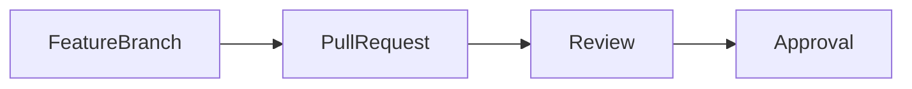

---

## Key Components

| Component | Purpose |
|------------|----------|
| Source Branch | Contains new changes |
| Target Branch | Receives approved changes |
| Reviewer | Reviews the code |

---

## Lifecycle / Workflow

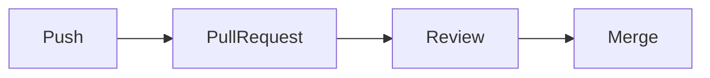

---

## Configuration / Syntax (if applicable)

After pushing the branch, create the Pull Request using the GitHub web interface.

---

## Important Commands (if applicable)

No dedicated Git command. Pull Requests are created on Git hosting platforms such as GitHub.

---

## Important Files (if applicable)

| File | Purpose |
|------|---------|
| `.github/PULL_REQUEST_TEMPLATE.md` | Pull Request template |
| `.github/CODEOWNERS` | Automatic reviewer assignment |

---

## Real-World Use Cases

- Feature integration
- Bug fixes
- Infrastructure changes
- Open-source contributions

---

## Advantages

- Code review
- Better collaboration
- Automated testing

---

## Limitations

- Requires reviewer availability
- Large Pull Requests are difficult to review

---

## Common Interview Questions (Concept Only)

- What is a Pull Request?
- Why is code review important?

---

## Common Mistakes

- Creating oversized Pull Requests
- Ignoring CI failures
- Choosing the wrong target branch

---

## Troubleshooting

| Problem | Solution |
|----------|----------|
| Cannot create PR | Push the branch to the remote repository first |
| Merge blocked | Complete required reviews and status checks |

---

## Summary

Pull Requests provide a controlled, review-based approach to integrating code into shared branches.

---

# Merge Changes

## Overview

After a Pull Request is approved, its changes are merged into the target branch.

GitHub supports multiple merge strategies:

- Merge Commit
- Squash Merge
- Rebase Merge

---

## Why It Is Used

Merging:

- Integrates completed work
- Maintains project history
- Enables deployments

---

## Architecture / Working

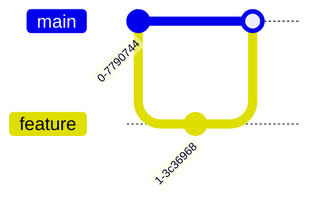

---

## Key Components

| Component | Purpose |
|------------|----------|
| Merge Strategy | Defines integration method |
| Target Branch | Receives changes |

---

## Lifecycle / Workflow

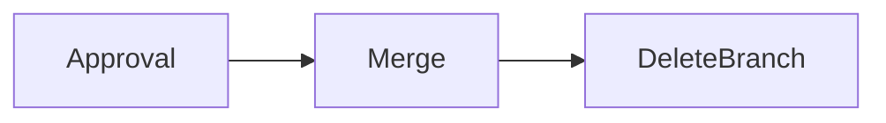

---

## Configuration / Syntax (if applicable)

Local merge

```bash
git checkout main

git merge feature-login
```

Most GitHub merges are performed through the web interface.

---

## Important Commands (if applicable)

```bash
git merge
```

---

## Important Files (if applicable)

None

---

## Real-World Use Cases

- Sprint completion
- Production deployment
- Infrastructure updates

---

## Advantages

- Integrates features
- Preserves history
- Supports releases

---

## Limitations

- Merge conflicts may occur
- Incorrect merge strategy can complicate history

---

## Common Interview Questions (Concept Only)

- What happens after a Pull Request is approved?
- What merge strategies are available?

---

## Common Mistakes

- Merging without review
- Ignoring merge conflicts
- Forgetting to delete merged branches

---

## Troubleshooting

| Problem | Solution |
|----------|----------|
| Merge conflicts | Resolve conflicts before completing the merge |
| Merge blocked | Satisfy branch protection rules and required checks |

---

## Summary

Merging combines reviewed changes into the target branch and completes the development cycle.

---

# Sync Local Repository

## Overview

After changes are merged into the remote repository, developers synchronize their local repository to stay up to date.

Keeping local repositories synchronized reduces merge conflicts and ensures developers work from the latest code.

> **Interview Point**
>
> Developers should **pull the latest changes before creating a new feature branch**.

---

## Why It Is Used

Synchronization:

- Updates local code
- Reduces conflicts
- Keeps history current
- Improves collaboration

---

## Architecture / Working

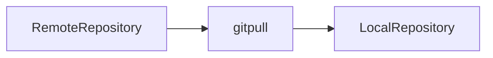

---

## Key Components

| Component | Purpose |
|------------|----------|
| Fetch | Downloads changes |
| Pull | Fetches and integrates changes |
| Merge/Rebase | Updates local branch |

---

## Lifecycle / Workflow

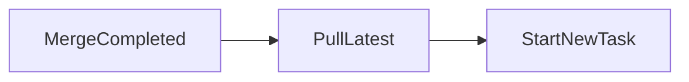

---

## Configuration / Syntax (if applicable)

Update the main branch

```bash
git checkout main

git pull origin main
```

Fetch changes only

```bash
git fetch
```

---

## Important Commands (if applicable)

```bash
git fetch

git pull

git status
```

---

## Important Files (if applicable)

| File | Purpose |
|------|---------|
| `.git/FETCH_HEAD` | Stores fetched references |

---

## Real-World Use Cases

- Daily development
- Sprint planning
- Feature branching
- CI/CD preparation

---

## Advantages

- Keeps repositories current
- Minimizes merge conflicts
- Improves team collaboration

---

## Limitations

- Pulling may introduce merge conflicts
- Requires network connectivity

---

## Common Interview Questions (Concept Only)

- Difference between `git fetch` and `git pull`?
- Why should you sync before creating a feature branch?
- How often should developers pull the latest changes?

---

## Common Mistakes

- Working on outdated code
- Skipping synchronization before new work
- Pulling into the wrong branch

---

## Troubleshooting

| Problem | Solution |
|----------|----------|
| Local branch behind remote | Run `git pull` to update it |
| Merge conflicts during pull | Resolve conflicts, commit the resolution, and continue |
| Uncommitted changes prevent pull | Commit, stash, or discard local changes before pulling |

---

## Summary

Synchronizing the local repository ensures developers always work with the latest codebase, reducing integration issues and improving collaboration across the team.
