# Docker Fundamentals

## Overview

Docker is an open-source containerization platform that enables developers to package applications and their dependencies into **containers**.

A container is a lightweight, portable, and isolated runtime environment that contains everything needed to run an application:

- Application code
- Runtime
- Libraries
- Dependencies
- Configuration files

Unlike Virtual Machines (VMs), containers share the host operating system kernel, making them much faster and more resource-efficient.

> **Interview Point**
>
> **Docker is a containerization platform, not a virtualization platform.**

---

## Why It Is Used

Docker is widely used because it:

- Eliminates the "Works on My Machine" problem
- Provides consistent environments
- Simplifies application deployment
- Improves CI/CD automation
- Enables microservices architecture
- Reduces infrastructure overhead
- Accelerates software delivery

---

## Architecture / Working

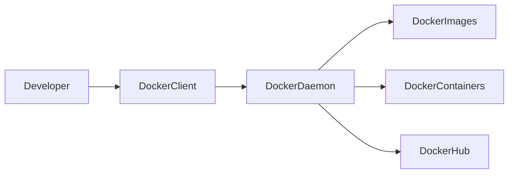

---

## Key Components

| Component | Purpose |
|-----------|----------|
| Docker Client | User interface to interact with Docker |
| Docker Daemon | Background service that manages Docker objects |
| Docker Engine | Core Docker runtime |
| Docker Image | Read-only application template |
| Docker Container | Running instance of an image |
| Docker Registry | Stores Docker images |
| Docker Hub | Public Docker registry |
| Docker Network | Enables communication between containers |
| Docker Volume | Persistent storage for containers |

---

## Types (if applicable)

### Docker Objects

| Object | Description |
|----------|-------------|
| Image | Blueprint for containers |
| Container | Running application |
| Volume | Persistent storage |
| Network | Container communication |
| Registry | Stores images |

---

## Lifecycle / Workflow

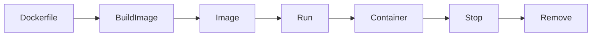

---

## Configuration / Syntax (if applicable)

Build an image

```bash
docker build -t myapp .
```

Run a container

```bash
docker run myapp
```

List containers

```bash
docker ps
```

---

## Important Commands (if applicable)

```bash
docker build

docker run

docker images

docker ps

docker stop

docker rm

docker pull

docker push
```

---

## Important Files (if applicable)

| File | Purpose |
|------|---------|
| Dockerfile | Defines how to build an image |
| .dockerignore | Excludes files during image build |
| docker-compose.yml *(Docker Compose)* | Defines multi-container applications |

---

## Real-World Use Cases

- Microservices
- CI/CD pipelines
- Cloud-native applications
- Development environments
- Kubernetes deployments
- Application packaging
- Infrastructure automation

---

## Advantages

- Lightweight
- Fast startup
- Portable
- Consistent environments
- Easy scaling
- Resource efficient
- Supports DevOps workflows

---

## Limitations

- Shares the host OS kernel
- Not suitable for applications requiring different operating system kernels
- Containers are ephemeral unless persistent storage is configured
- Security depends on proper configuration

---

## Common Interview Questions (Concept Only)

- What is Docker?
- Why is Docker popular?
- What is a container?
- What is the difference between an image and a container?
- What problem does Docker solve?

---

## Common Mistakes

- Treating containers like virtual machines
- Storing persistent data inside containers
- Running containers as the root user
- Creating unnecessarily large images
- Forgetting to use `.dockerignore`

---

## Troubleshooting

| Problem | Solution |
|----------|----------|
| Docker daemon not running | Start the Docker service |
| Permission denied | Add the user to the Docker group or use `sudo` |
| Image not found | Verify the image name or pull it from the registry |
| Port already in use | Use a different host port or stop the conflicting process |

---

## Summary

Docker packages applications into lightweight containers that run consistently across environments, making it a foundational technology for DevOps, CI/CD, and cloud-native development.

---

# What is Docker

## Overview

Docker is an open-source platform used to build, package, distribute, and run applications inside containers.

Each container includes:

- Application code
- Runtime
- System libraries
- Dependencies
- Configuration

Containers run consistently across development, testing, and production environments.

---

## Why It Is Used

Docker enables:

- Faster deployments
- Environment consistency
- Easy scaling
- Application isolation
- Efficient resource utilization

---

## Architecture / Working

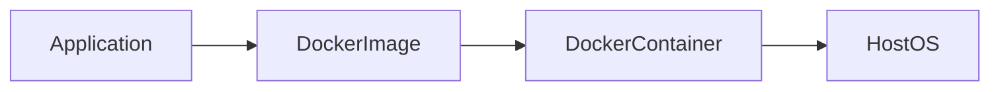

---

## Key Components

| Component | Purpose |
|------------|----------|
| Image | Application template |
| Container | Running application |
| Engine | Executes containers |

---

## Real-World Use Cases

- Java applications
- Python applications
- Node.js applications
- NGINX
- Databases
- Microservices

---

## Advantages

- Portable
- Lightweight
- Fast deployment

---

## Limitations

- Shared kernel
- Requires container security best practices

---

## Common Interview Questions (Concept Only)

- What is Docker?
- Why is Docker used?

---

## Summary

Docker standardizes application packaging and deployment using containers.

---

# Virtual Machines vs Docker

## Overview

Virtual Machines virtualize hardware, while Docker virtualizes the operating system.

> **Interview Point**
>
> Docker containers **share the host kernel**, whereas each Virtual Machine includes its own guest operating system.

---

## Why It Is Used

Understanding this comparison helps determine when to use containers versus VMs.

---

## Architecture / Working

### Virtual Machine

```text
Application
Guest OS
Hypervisor
Host OS
Hardware
```

### Docker

```text
Application
Container
Docker Engine
Host OS
Hardware
```

---

## Key Components

| Virtual Machine | Docker Container |
|----------------|------------------|
| Guest OS | Shared Host Kernel |
| Hypervisor | Docker Engine |
| Large Size | Lightweight |
| Slow Boot | Fast Startup |

---

## Types (if applicable)

### Virtual Machine

- VMware
- Hyper-V
- VirtualBox
- KVM

### Containers

- Docker
- Podman
- containerd

---

## Real-World Use Cases

### Virtual Machines

- Multiple operating systems
- Legacy applications
- Strong isolation requirements

### Docker

- CI/CD
- Microservices
- Cloud-native applications

---

## Advantages

| Docker | Virtual Machine |
|----------|----------------|
| Fast | Strong isolation |
| Lightweight | Multiple operating systems |
| Portable | Mature virtualization |

---

## Limitations

| Docker | Virtual Machine |
|----------|----------------|
| Shared kernel | Resource intensive |
| Limited to compatible kernels | Slower startup |

---

## Common Interview Questions (Concept Only)

- Docker vs Virtual Machine?
- Which is faster?
- Which uses fewer resources?
- Can Docker replace Virtual Machines?

---

## Summary

Docker provides lightweight operating-system-level virtualization, while Virtual Machines provide full hardware virtualization with separate guest operating systems.

---

# Docker Architecture

## Overview

Docker follows a **Client-Server architecture**.

The Docker Client communicates with the Docker Daemon, which performs all container operations.

---

## Why It Is Used

This architecture separates user interaction from container management.

---

## Architecture / Working

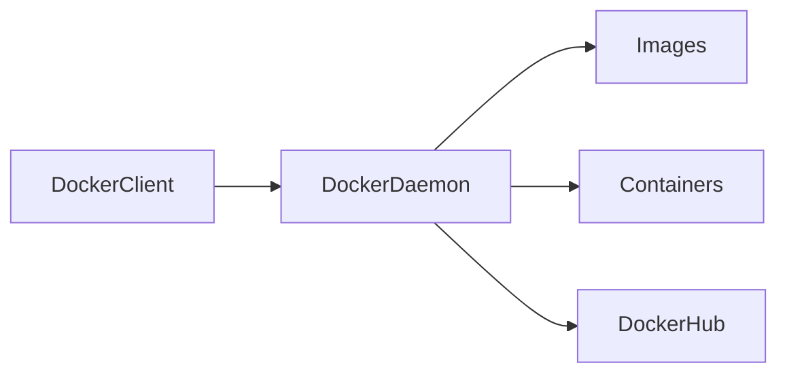

---

## Key Components

| Component | Purpose |
|------------|----------|
| Client | Sends commands |
| Daemon | Executes commands |
| Registry | Stores images |

---

## Lifecycle / Workflow

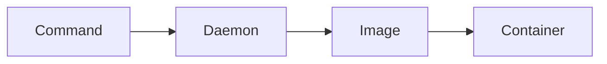

---

## Advantages

- Modular
- Easy automation
- Remote management support

---

## Common Interview Questions (Concept Only)

- Explain Docker Architecture.
- What is the Docker Daemon?

---

## Summary

Docker uses a Client-Server model where the client sends commands and the daemon manages images and containers.

---

# Docker Components

## Overview

Docker consists of several components working together.

---

## Why It Is Used

Each component has a dedicated responsibility.

---

## Key Components

| Component | Function |
|------------|----------|
| Docker Client | Sends Docker commands |
| Docker Daemon | Manages Docker objects |
| Docker Engine | Core runtime |
| Docker Images | Read-only templates |
| Docker Containers | Running applications |
| Docker Hub | Public image registry |
| Docker Registry | Stores images |
| Docker Networks | Networking |
| Docker Volumes | Persistent storage |

---

## Real-World Use Cases

- Application deployment
- CI/CD
- Container orchestration

---

## Common Interview Questions (Concept Only)

- Name Docker components.
- What is the role of Docker Engine?

---

## Summary

Docker components work together to build, store, run, and manage containers.

---

# Docker Engine

## Overview

Docker Engine is the core runtime responsible for creating and managing Docker containers.

It includes:

- Docker Daemon (`dockerd`)
- REST API
- Docker CLI integration

---

## Why It Is Used

Docker Engine:

- Builds images
- Runs containers
- Manages networks
- Manages volumes

---

## Architecture / Working

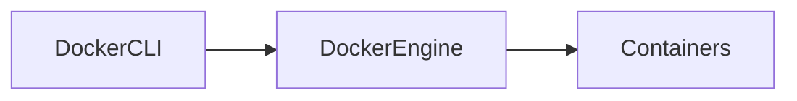

---

## Key Components

| Component | Purpose |
|------------|----------|
| Daemon | Executes Docker operations |
| REST API | Communication interface |
| CLI | User interaction |

---

## Advantages

- Fast
- Reliable
- Lightweight

---

## Common Interview Questions (Concept Only)

- What is Docker Engine?
- Is Docker Engine the same as Docker Daemon?

---

## Summary

Docker Engine is the runtime responsible for managing Docker objects.

---

# Docker Client

## Overview

Docker Client is the command-line interface used by users to interact with Docker.

Example:

```bash
docker run nginx
```

The client sends this request to the Docker Daemon.

---

## Why It Is Used

Provides a simple interface for Docker operations.

---

## Architecture / Working

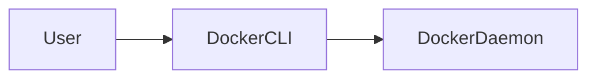

---

## Important Commands

```bash
docker run

docker build

docker pull

docker push

docker ps
```

---

## Common Interview Questions (Concept Only)

- What is Docker Client?
- Does Docker Client create containers?

---

## Summary

Docker Client sends requests to Docker Daemon for execution.

---

# Docker Daemon

## Overview

Docker Daemon (`dockerd`) is the background service responsible for managing Docker objects.

It performs operations such as:

- Build images
- Run containers
- Manage networks
- Manage volumes
- Pull images
- Push images

---

## Why It Is Used

The daemon executes all Docker operations requested by clients.

---

## Architecture / Working

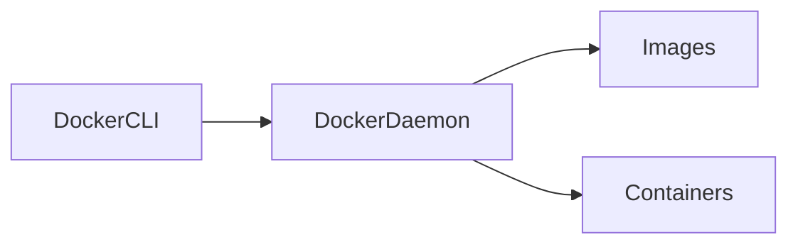

---

## Important Commands

Check daemon status

```bash
systemctl status docker
```

Start daemon

```bash
sudo systemctl start docker
```

---

## Common Interview Questions (Concept Only)

- What is Docker Daemon?
- Can Docker work without the daemon?

---

## Troubleshooting

| Problem | Solution |
|----------|----------|
| Cannot connect to Docker daemon | Start the Docker service and verify user permissions |
| Docker service failed | Review logs with `journalctl -u docker` |

---

## Summary

Docker Daemon is the background service that manages Docker resources and executes container operations.

---

# Docker Hub

## Overview

Docker Hub is Docker's default public registry for storing and distributing Docker images.

It contains:

- Official images
- Community images
- Private repositories (supported with appropriate plans)

---

## Why It Is Used

Docker Hub simplifies image sharing and distribution.

---

## Architecture / Working

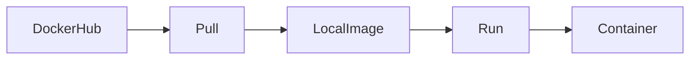

---

## Important Commands

Pull image

```bash
docker pull nginx
```

Push image

```bash
docker push username/image
```

Login

```bash
docker login
```

---

## Real-World Use Cases

- Base images
- Enterprise image distribution
- CI/CD pipelines

---

## Advantages

- Large public repository
- Official images
- Easy sharing

---

## Limitations

- Pull rate limits for anonymous users
- Public images require security verification

---

## Common Interview Questions (Concept Only)

- What is Docker Hub?
- Difference between Docker Hub and a private registry?

---

## Summary

Docker Hub is the default public registry for storing, sharing, and downloading Docker images.

---

# Docker Workflow

## Overview

A typical Docker workflow consists of creating an application, packaging it into an image, running it as a container, testing it, and optionally publishing the image to a registry.

---

## Why It Is Used

The workflow ensures consistent application packaging and deployment across environments.

---

## Architecture / Working

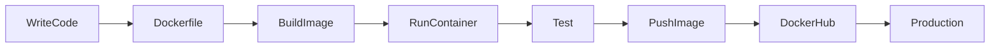

---

## Key Components

| Step | Description |
|------|-------------|
| Write Code | Develop the application |
| Create Dockerfile | Define image instructions |
| Build Image | Create a Docker image |
| Run Container | Start the application |
| Test | Validate functionality |
| Push Image | Upload to a registry |
| Deploy | Run in production |

---

## Lifecycle / Workflow

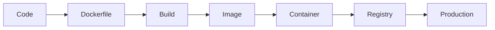

---

## Configuration / Syntax (if applicable)

Build an image

```bash
docker build -t myapp:v1 .
```

Run the image

```bash
docker run -d myapp:v1
```

Push the image

```bash
docker push username/myapp:v1
```

---

## Important Commands (if applicable)

```bash
docker build

docker run

docker tag

docker login

docker push

docker pull
```

---

## Real-World Use Cases

- CI/CD pipelines
- Microservices deployments
- Kubernetes workloads
- Cloud-native applications
- Application versioning

---

## Advantages

- Consistent deployment process
- Easy automation
- Portable across environments
- Supports rapid releases

---

## Limitations

- Requires proper image versioning
- Inefficient Dockerfiles can produce large images

---

## Common Interview Questions (Concept Only)

- Explain the Docker workflow.
- What happens after `docker build`?
- What is the difference between an image and a running container?
- Why is Docker Hub used in the workflow?

---

## Common Mistakes

- Building images without a `.dockerignore` file
- Using the `latest` tag for production deployments
- Not testing images before pushing them
- Forgetting to version images

---

## Troubleshooting

| Problem | Solution |
|----------|----------|
| Build fails | Check the Dockerfile syntax and build context |
| Image not found | Verify the image name or pull it from the registry |
| Push denied | Authenticate with the registry and verify permissions |

---

## Summary

The Docker workflow follows a simple lifecycle: **Code → Dockerfile → Build Image → Run Container → Test → Push to Registry → Deploy**, enabling consistent, portable, and automated application delivery.
