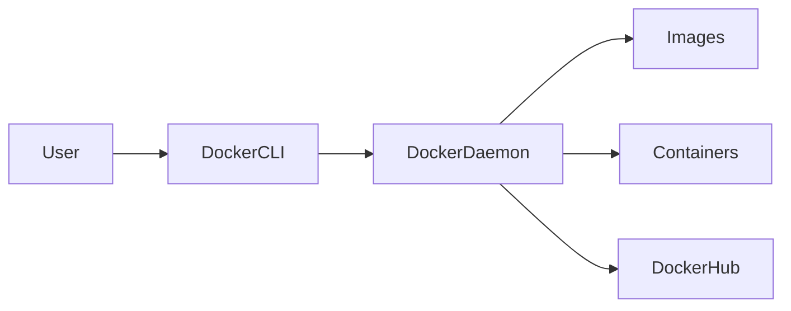
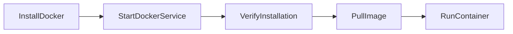
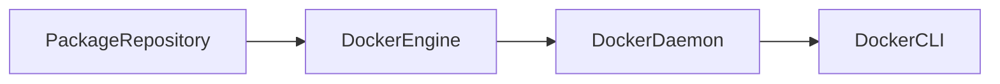
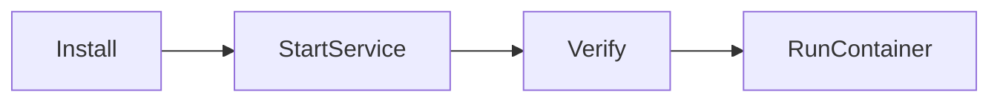
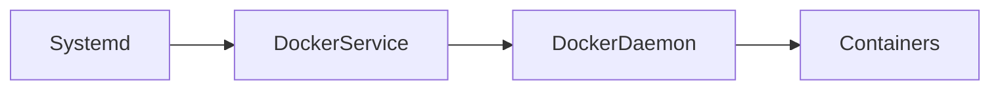
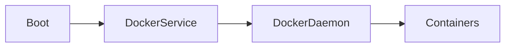
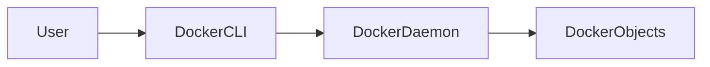
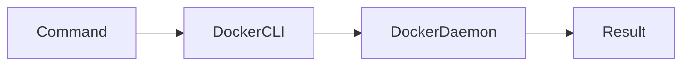

# Docker Installation & Configuration

## Overview

Docker Installation & Configuration is the process of installing the Docker Engine, enabling the Docker service, configuring user access, and verifying that Docker is functioning correctly.

A standard Docker installation includes:

- Docker Engine
- Docker CLI
- Docker Daemon (`dockerd`)
- Docker Buildx
- Docker Compose Plugin

> **Interview Point**
>
> Docker consists of **Docker Client (CLI)** and **Docker Daemon**, which communicate through the Docker Engine.

---

## Why It Is Used

Installing and configuring Docker allows you to:

- Build container images
- Run containers
- Manage containerized applications
- Automate CI/CD pipelines
- Deploy applications consistently
- Use Docker with Kubernetes and cloud platforms

---

## Architecture / Working



---

## Key Components

| Component | Purpose |
|-----------|----------|
| Docker Engine | Core container runtime |
| Docker CLI | Command-line interface |
| Docker Daemon | Background service managing Docker objects |
| Docker Images | Templates used to create containers |
| Docker Containers | Running instances of images |
| Docker Registry | Stores Docker images |
| Docker Hub | Default public registry |

---

## Types (if applicable)

### Installation Methods

| Method | Description |
|----------|-------------|
| Official Docker Repository | Recommended for production |
| Distribution Package Manager | Available through OS repositories |
| Docker Desktop | Windows and macOS environments |

> **Interview Point**
>
> For production Linux servers, install Docker from the **official Docker repository** to receive the latest stable releases.

---

## Lifecycle / Workflow



---

## Configuration / Syntax (if applicable)

Verify Docker version

```bash
docker --version
```

Check Docker information

```bash
docker info
```

Verify service status

```bash
systemctl status docker
```

Run a test container

```bash
docker run hello-world
```

---

## Important Commands (if applicable)

```bash
docker --version

docker info

docker version

docker run hello-world

systemctl status docker

systemctl start docker

systemctl enable docker
```

---

## Important Files (if applicable)

| File | Purpose |
|------|---------|
| `/etc/docker/daemon.json` | Docker daemon configuration |
| `/var/run/docker.sock` | Docker daemon communication socket |
| `/etc/systemd/system/docker.service.d/` | Docker service overrides |
| `/var/lib/docker/` | Docker images, containers, and volumes |

---

## Real-World Use Cases

- Development workstations
- CI/CD build agents
- Kubernetes worker nodes
- Cloud virtual machines
- Self-hosted runners
- Application hosting

---

## Advantages

- Simple installation
- Fast setup
- Cross-platform support
- Lightweight runtime
- Easy integration with CI/CD

---

## Limitations

- Requires kernel features supported by the host OS
- Linux containers cannot run natively on Windows without a compatibility layer
- Requires proper user permission management

---

## Common Interview Questions (Concept Only)

- How do you install Docker?
- How do you verify Docker is installed?
- Where is Docker configuration stored?
- How do you start the Docker service?
- What is the Docker socket?

---

## Common Mistakes

- Forgetting to start the Docker service
- Running every Docker command with `sudo` instead of configuring user permissions
- Installing outdated Docker packages from distribution repositories
- Ignoring Docker daemon configuration

---

## Troubleshooting

| Problem | Solution |
|----------|----------|
| Docker command not found | Verify Docker installation and PATH |
| Cannot connect to Docker daemon | Start the Docker service |
| Permission denied | Add the user to the `docker` group or use `sudo` |
| Docker service failed | Check logs with `journalctl -u docker` |

---

## Summary

Installing and configuring Docker properly ensures a stable foundation for containerized application development, deployment, and DevOps automation.

---

# Installing Docker

## Overview

Docker can be installed on Linux, Windows, and macOS.

For Linux production servers, Docker should be installed from the **official Docker repository**.

---

## Why It Is Used

Installing Docker provides:

- Docker Engine
- Docker CLI
- Docker Daemon
- Docker Buildx
- Docker Compose Plugin

---

## Architecture / Working



---

## Key Components

| Component | Purpose |
|------------|----------|
| Docker Engine | Core runtime |
| Docker CLI | User commands |
| Docker Daemon | Background service |

---

## Lifecycle / Workflow



---

## Configuration / Syntax (if applicable)

Ubuntu (official repository)

Update packages

```bash
sudo apt update
```

Install Docker

```bash
sudo apt install docker-ce docker-ce-cli containerd.io docker-buildx-plugin docker-compose-plugin
```

Verify installation

```bash
docker --version
```

Test Docker

```bash
docker run hello-world
```

---

## Important Commands (if applicable)

```bash
docker --version

docker info

docker run hello-world
```

---

## Important Files (if applicable)

| File | Purpose |
|------|---------|
| `/usr/bin/docker` | Docker CLI executable |

---

## Real-World Use Cases

- Linux servers
- Cloud virtual machines
- Developer workstations
- CI/CD agents

---

## Advantages

- Easy installation
- Lightweight
- Cross-platform

---

## Limitations

- Requires administrative privileges during installation

---

## Common Interview Questions (Concept Only)

- How do you verify Docker installation?
- Which repository should be used for production installations?

---

## Common Mistakes

- Installing outdated packages
- Skipping verification after installation

---

## Troubleshooting

| Problem | Solution |
|----------|----------|
| Installation failed | Verify package repository configuration and dependencies |
| Docker command missing | Ensure the Docker CLI package is installed correctly |

---

## Summary

Installing Docker from the official repository provides the latest stable features and security updates.

---

# Docker Service Management

## Overview

Docker runs as a background service called the **Docker Daemon (`dockerd`)**.

The service is managed using `systemctl` on most Linux distributions.

> **Interview Point**
>
> If Docker commands fail with **"Cannot connect to the Docker daemon"**, the Docker service is often stopped.

---

## Why It Is Used

Service management allows administrators to:

- Start Docker
- Stop Docker
- Restart Docker
- Enable Docker at boot
- Check Docker status

---

## Architecture / Working



---

## Key Components

| Component | Purpose |
|------------|----------|
| systemd | Service manager |
| Docker Service | Starts Docker Daemon |
| Docker Daemon | Executes Docker operations |

---

## Lifecycle / Workflow



---

## Configuration / Syntax (if applicable)

Check status

```bash
systemctl status docker
```

Start service

```bash
sudo systemctl start docker
```

Stop service

```bash
sudo systemctl stop docker
```

Restart service

```bash
sudo systemctl restart docker
```

Enable at boot

```bash
sudo systemctl enable docker
```

Disable at boot

```bash
sudo systemctl disable docker
```

---

## Important Commands (if applicable)

```bash
systemctl status docker

systemctl start docker

systemctl stop docker

systemctl restart docker

systemctl enable docker

systemctl disable docker
```

---

## Important Files (if applicable)

| File | Purpose |
|------|---------|
| `/lib/systemd/system/docker.service` | Docker service definition |
| `/etc/systemd/system/` | Custom service overrides |

---

## Real-World Use Cases

- Production servers
- Kubernetes nodes
- CI/CD build agents
- Cloud virtual machines

---

## Advantages

- Automatic startup
- Easy management
- Reliable operation

---

## Limitations

- Containers stop if the Docker service is stopped
- Service failures affect all managed containers

---

## Common Interview Questions (Concept Only)

- How do you start Docker?
- How do you enable Docker after reboot?
- How do you verify the Docker service is running?

---

## Common Mistakes

- Forgetting to enable Docker at boot
- Restarting the service during active deployments without planning
- Ignoring Docker service logs

---

## Troubleshooting

| Problem | Solution |
|----------|----------|
| Docker service inactive | Start the service using `systemctl start docker` |
| Service repeatedly fails | Review logs with `journalctl -u docker` |
| Docker starts after every reboot unexpectedly | Check whether the service is enabled with `systemctl is-enabled docker` |

---

## Summary

Docker Service Management ensures the Docker Daemon remains available for creating and managing containers.

---

# Docker CLI Basics

## Overview

The Docker CLI (Command-Line Interface) is the primary tool used to interact with Docker.

Every Docker command starts with:

```bash
docker
```

The CLI communicates with the Docker Daemon through the Docker API.

---

## Why It Is Used

The Docker CLI allows users to:

- Build images
- Run containers
- Stop containers
- Inspect Docker objects
- Manage images
- Manage networks
- Manage volumes

---

## Architecture / Working



---

## Key Components

| Component | Purpose |
|------------|----------|
| Docker CLI | Accepts user commands |
| Docker Daemon | Executes requests |
| Docker Objects | Images, containers, networks, and volumes |

---

## Types (if applicable)

### Common Docker CLI Categories

| Category | Examples |
|----------|----------|
| Images | `docker images`, `docker pull`, `docker build` |
| Containers | `docker run`, `docker ps`, `docker stop` |
| System | `docker info`, `docker version` |
| Networks | `docker network` |
| Volumes | `docker volume` |

---

## Lifecycle / Workflow



---

## Configuration / Syntax (if applicable)

Display version

```bash
docker --version
```

Display system information

```bash
docker info
```

List images

```bash
docker images
```

List running containers

```bash
docker ps
```

List all containers

```bash
docker ps -a
```

Run a container

```bash
docker run nginx
```

Stop a container

```bash
docker stop <container-id>
```

Remove a container

```bash
docker rm <container-id>
```

Remove an image

```bash
docker rmi <image-id>
```

Display help

```bash
docker --help
```

---

## Important Commands (if applicable)

```bash
docker --version

docker version

docker info

docker images

docker image ls

docker ps

docker ps -a

docker run

docker stop

docker rm

docker rmi

docker logs

docker inspect

docker exec

docker pull

docker push

docker build
```

---

## Important Files (if applicable)

| File | Purpose |
|------|---------|
| `/usr/bin/docker` | Docker CLI executable |
| `~/.docker/config.json` | Docker CLI configuration and registry authentication |

---

## Real-World Use Cases

- Managing development containers
- Deploying applications
- Debugging container issues
- Viewing logs
- Building CI/CD pipelines
- Managing production workloads

---

## Advantages

- Easy to learn
- Fast execution
- Powerful automation capabilities
- Script-friendly
- Cross-platform

---

## Limitations

- Command syntax can be extensive for beginners
- Requires Docker Daemon availability
- Administrative permissions may be required

---

## Common Interview Questions (Concept Only)

- What is Docker CLI?
- Does Docker CLI run containers directly?
- Which command lists running containers?
- How do you inspect a running container?
- Difference between `docker ps` and `docker ps -a`?

---

## Common Mistakes

- Confusing images with containers
- Removing containers before stopping them (when not using force)
- Forgetting container names or IDs
- Running commands without checking container status

---

## Troubleshooting

| Problem | Solution |
|----------|----------|
| Docker command not found | Verify Docker CLI installation and PATH configuration |
| Cannot connect to Docker daemon | Ensure the Docker service is running |
| Permission denied | Add the user to the `docker` group or use `sudo` |
| No containers listed | Verify whether containers are stopped by using `docker ps -a` |

---

## Summary

The Docker CLI is the primary interface for interacting with Docker. It communicates with the Docker Daemon to build images, run containers, manage Docker resources, and automate container operations.
