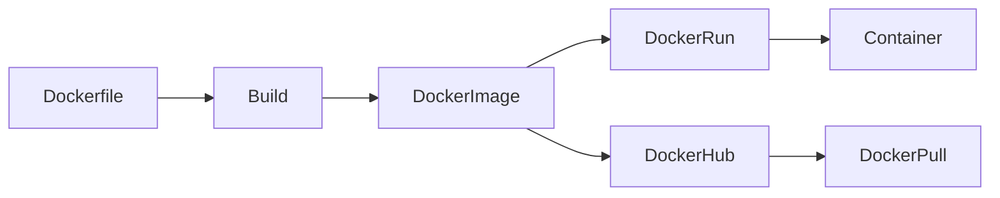
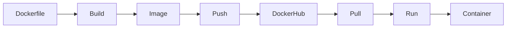
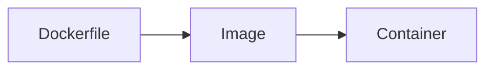
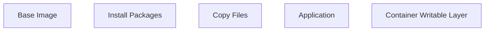
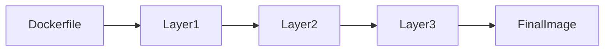
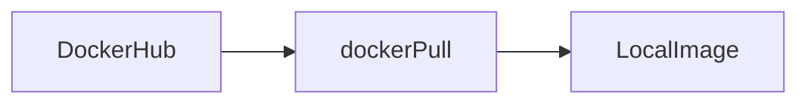
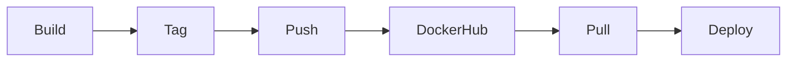

# Docker Images

## Overview

A **Docker Image** is a **read-only template** used to create Docker containers.

It contains everything required to run an application:

- Application code
- Runtime
- Libraries
- Dependencies
- Environment variables
- Configuration files

An image itself **does not run**. When an image is executed using the `docker run` command, Docker creates a **container**, which is the running instance of that image.

> **Interview Point**
>
> **Image = Blueprint**
>
> **Container = Running Instance of an Image**

---

## Why It Is Used

Docker Images provide:

- Consistent application packaging
- Reproducible deployments
- Fast application startup
- Version-controlled application releases
- Easy distribution through registries
- Simplified CI/CD automation

---

## Architecture / Working



---

## Key Components

| Component | Purpose |
|-----------|----------|
| Docker Image | Read-only application template |
| Image Layers | Individual filesystem changes |
| Image Tag | Image version identifier |
| Docker Registry | Stores Docker images |
| Docker Hub | Public image repository |

---

## Types (if applicable)

### Official Images

Maintained by Docker or trusted publishers.

Examples:

- nginx
- ubuntu
- redis
- mysql
- postgres

---

### Community Images

Published by community members.

---

### Custom Images

Created by organizations using a Dockerfile.

Example:

```bash
docker build -t myapp:v1 .
```

---

## Lifecycle / Workflow



---

## Configuration / Syntax (if applicable)

Build an image

```bash
docker build -t myapp:v1 .
```

Run image

```bash
docker run myapp:v1
```

Tag image

```bash
docker tag myapp:v1 myrepo/myapp:v1
```

Push image

```bash
docker push myrepo/myapp:v1
```

---

## Important Commands (if applicable)

```bash
docker build

docker images

docker image ls

docker pull

docker push

docker tag

docker rmi

docker image inspect

docker history

docker search
```

---

## Important Files (if applicable)

| File | Purpose |
|------|---------|
| Dockerfile | Defines how an image is built |
| .dockerignore | Excludes files from the build context |

---

## Real-World Use Cases

- Packaging Java applications
- Hosting Python APIs
- Microservices deployment
- CI/CD pipelines
- Kubernetes deployments
- Cloud-native applications

---

## Advantages

- Portable
- Lightweight
- Version-controlled
- Immutable
- Easy distribution
- Fast deployment

---

## Limitations

- Large images consume more storage
- Poorly designed images increase build time
- Images must be rebuilt after application changes

---

## Common Interview Questions (Concept Only)

- What is a Docker Image?
- Difference between Image and Container?
- Can multiple containers use the same image?
- Where are Docker Images stored?
- What is an immutable image?

---

## Common Mistakes

- Confusing images with containers
- Using the `latest` tag in production
- Building unnecessarily large images
- Not removing unused images
- Including secrets in images

---

## Troubleshooting

| Problem | Solution |
|----------|----------|
| Image not found | Verify the image name or pull it from a registry |
| Image build failed | Check the Dockerfile syntax and build context |
| Disk space full | Remove unused images with `docker image prune` |
| Pull access denied | Verify registry authentication and image permissions |

---

## Summary

A Docker Image is a portable, immutable template that packages an application and all its dependencies. Images are the foundation of Docker-based deployments and enable consistent execution across development, testing, and production environments.

---

# What is an Image

## Overview

A Docker Image is a **read-only template** that contains everything required to run an application.

An image includes:

- Application code
- Runtime
- Libraries
- Dependencies
- Configuration
- Metadata

Images are created from a **Dockerfile**.

---

## Why It Is Used

Images ensure that applications run consistently across different environments.

---

## Architecture / Working



---

## Key Components

| Component | Description |
|------------|-------------|
| Filesystem | Application files |
| Metadata | Image configuration |
| Layers | Incremental filesystem changes |

---

## Real-World Use Cases

- Application packaging
- Cloud deployments
- Kubernetes workloads
- CI/CD pipelines

---

## Advantages

- Immutable
- Portable
- Version-controlled

---

## Limitations

- Read-only
- Requires a container to execute

---

## Common Interview Questions (Concept Only)

- What is a Docker Image?
- Can an image run by itself?

---

## Summary

A Docker Image is a reusable, immutable package used to create containers.

---

# Image Layers

## Overview

Docker Images are built using **multiple read-only layers**.

Each instruction in a Dockerfile creates a new layer.

Example:

```Dockerfile
FROM ubuntu

RUN apt update

RUN apt install nginx

COPY app /app

CMD ["nginx","-g","daemon off;"]
```

Each instruction creates a separate layer.

---

## Why It Is Used

Layering provides:

- Faster builds
- Image caching
- Reduced storage usage
- Shared layers between images

---

## Architecture / Working



---

## Key Components

| Layer | Purpose |
|--------|----------|
| Base Layer | Operating system |
| Dependency Layer | Installed packages |
| Application Layer | Source code |
| Writable Layer | Container-specific changes |

---

## Lifecycle / Workflow



---

## Real-World Use Cases

- Faster CI builds
- Shared image caching
- Layer reuse across applications

---

## Advantages

- Build cache
- Storage optimization
- Faster downloads

---

## Limitations

- Poor Dockerfile ordering reduces cache efficiency
- Large layers increase image size

---

## Common Interview Questions (Concept Only)

- What are Docker Image Layers?
- Why are layers important?
- Which Dockerfile commands create layers?

---

## Common Mistakes

- Changing frequently modified files early in the Dockerfile
- Creating unnecessary layers
- Installing unused packages

---

## Troubleshooting

| Problem | Solution |
|----------|----------|
| Slow builds | Reorder Dockerfile to maximize cache usage |
| Large images | Combine related commands and remove unnecessary files |

---

## Summary

Image layers improve build performance, storage efficiency, and image reuse by storing filesystem changes incrementally.

---

# Pull Images

## Overview

`docker pull` downloads images from a Docker registry (typically Docker Hub) to the local machine.

---

## Why It Is Used

Used to retrieve pre-built images for running applications.

---

## Architecture / Working



---

## Configuration / Syntax (if applicable)

Pull the latest image

```bash
docker pull nginx
```

Pull a specific version

```bash
docker pull nginx:1.27
```

---

## Important Commands (if applicable)

```bash
docker pull ubuntu

docker pull nginx:latest
```

---

## Real-World Use Cases

- Deploying web servers
- Running databases
- CI/CD automation
- Kubernetes deployments

---

## Advantages

- Quick downloads
- Official images available
- Versioned images

---

## Limitations

- Requires network access
- Private images require authentication

---

## Common Interview Questions (Concept Only)

- What does `docker pull` do?
- What happens if the image already exists locally?

---

## Common Mistakes

- Pulling the wrong tag
- Relying on the `latest` tag

---

## Troubleshooting

| Problem | Solution |
|----------|----------|
| Pull access denied | Authenticate using `docker login` |
| Manifest not found | Verify the image tag |

---

## Summary

`docker pull` downloads container images from a registry to the local system.

---

# List Images

## Overview

Docker stores downloaded and locally built images on the host.

They can be listed using the Docker CLI.

---

## Why It Is Used

Allows administrators to:

- View installed images
- Check image versions
- Manage storage

---

## Configuration / Syntax (if applicable)

List images

```bash
docker images
```

or

```bash
docker image ls
```

---

## Important Commands (if applicable)

```bash
docker images

docker image ls
```

---

## Real-World Use Cases

- Verify builds
- Identify outdated images
- Storage management

---

## Advantages

- Quick inventory
- Version visibility

---

## Limitations

- Does not show running containers

---

## Common Interview Questions (Concept Only)

- Which command lists Docker Images?

---

## Summary

`docker images` displays all locally available Docker images.

---

# Remove Images

## Overview

Unused images should be removed to reclaim disk space.

---

## Why It Is Used

Prevents unnecessary storage consumption.

---

## Configuration / Syntax (if applicable)

Remove image

```bash
docker rmi IMAGE_ID
```

Remove unused images

```bash
docker image prune
```

Remove everything unused

```bash
docker system prune
```

---

## Important Commands (if applicable)

```bash
docker rmi

docker image prune

docker system prune
```

---

## Real-World Use Cases

- CI/CD cleanup
- Disk management
- Build servers

---

## Advantages

- Frees storage
- Removes unused resources

---

## Limitations

- Images referenced by containers cannot be removed until those containers are deleted or updated

---

## Common Interview Questions (Concept Only)

- How do you remove an image?
- Why can't an image sometimes be deleted?

---

## Common Mistakes

- Attempting to delete images used by running or stopped containers
- Removing images required for deployments

---

## Troubleshooting

| Problem | Solution |
|----------|----------|
| Image is being used | Remove dependent containers first or use force cautiously |

---

## Summary

Removing unused images helps maintain storage efficiency and keeps Docker hosts clean.

---

# Search Images

## Overview

Docker can search public images available on Docker Hub.

---

## Why It Is Used

Helps locate existing images before building custom ones.

---

## Configuration / Syntax (if applicable)

```bash
docker search nginx
```

---

## Important Commands (if applicable)

```bash
docker search

docker search ubuntu
```

---

## Real-World Use Cases

- Finding official images
- Evaluating community images

---

## Advantages

- Easy image discovery
- Official publisher indicators

---

## Limitations

- Searches public registries only
- Private registries require different tools or authentication

---

## Common Interview Questions (Concept Only)

- How do you search for Docker images?

---

## Summary

`docker search` searches Docker Hub for publicly available images.

---

# Image Tags

## Overview

Tags identify different versions of the same Docker image.

Format:

```text
repository:tag
```

Example:

```text
nginx:1.27

ubuntu:24.04

myapp:v2
```

If no tag is specified, Docker uses:

```text
latest
```

> **Interview Point**
>
> Avoid relying on the `latest` tag in production. Use explicit version tags for predictable deployments.

---

## Why It Is Used

Tags provide:

- Version control
- Rollback capability
- Environment-specific images

---

## Types (if applicable)

### Common Tags

| Tag | Example |
|------|----------|
| Version | nginx:1.27 |
| Latest | nginx:latest |
| Custom | myapp:v1.0.0 |
| Environment | myapp:prod |

---

## Configuration / Syntax (if applicable)

Tag an image

```bash
docker tag myapp:v1 myrepo/myapp:v1
```

Push a tagged image

```bash
docker push myrepo/myapp:v1
```

---

## Real-World Use Cases

- Production releases
- Rollbacks
- CI/CD pipelines

---

## Advantages

- Version management
- Controlled deployments
- Easy rollback

---

## Limitations

- Poor tagging strategies can cause deployment confusion
- `latest` is mutable and may point to different image versions over time

---

## Common Interview Questions (Concept Only)

- What is an image tag?
- Why should you avoid the `latest` tag in production?

---

## Common Mistakes

- Reusing the same tag for different image contents
- Not versioning production images

---

## Summary

Image tags uniquely identify image versions and are essential for reliable deployments and release management.

---

# Docker Hub

## Overview

Docker Hub is Docker's default cloud-based image registry used to store, manage, and distribute Docker images.

It provides:

- Official images
- Verified publisher images
- Community images
- Private repositories

---

## Why It Is Used

Docker Hub simplifies image sharing and enables CI/CD pipelines to pull and publish container images.

---

## Architecture / Working


---

## Key Components

| Component | Purpose |
|-----------|----------|
| Repository | Stores related image versions |
| Tags | Identify image versions |
| Official Images | Maintained by Docker |
| Private Repository | Restricted image storage |

---

## Lifecycle / Workflow



---

## Configuration / Syntax (if applicable)

Login

```bash
docker login
```

Push image

```bash
docker push username/myapp:v1
```

Pull image

```bash
docker pull username/myapp:v1
```

Logout

```bash
docker logout
```

---

## Important Commands (if applicable)

```bash
docker login

docker logout

docker push

docker pull

docker search
```

---

## Real-World Use Cases

- CI/CD pipelines
- Kubernetes deployments
- Image sharing across teams
- Public open-source applications
- Internal enterprise image distribution (using private repositories)

---

## Advantages

- Centralized image repository
- Official and verified images
- Easy integration with CI/CD tools
- Supports image versioning and collaboration

---

## Limitations

- Pull rate limits for anonymous users
- Private repositories require appropriate plans or permissions
- Public images should be validated before use in production

---

## Common Interview Questions (Concept Only)

- What is Docker Hub?
- Difference between Docker Hub and a private registry?
- What are official images?
- How do you push an image to Docker Hub?

---

## Common Mistakes

- Using unverified community images in production
- Publishing sensitive images to public repositories
- Forgetting to tag images before pushing
- Using `latest` for production releases

---

## Troubleshooting

| Problem | Solution |
|----------|----------|
| Authentication failed | Verify credentials and run `docker login` |
| Push access denied | Confirm repository ownership and permissions |
| Repository not found | Ensure the repository exists and the image is correctly tagged |

---

## Summary

Docker Hub is the default Docker registry used to store, share, version, and distribute container images. It plays a central role in container-based development, CI/CD pipelines, and cloud-native deployments.
