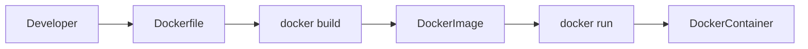
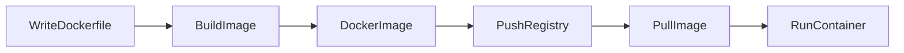
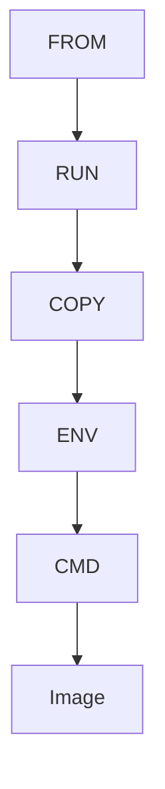
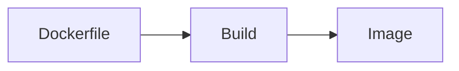
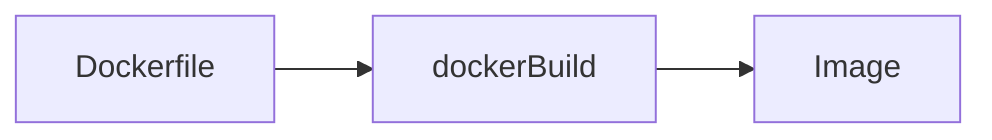

# Dockerfile

## Overview

A **Dockerfile** is a text file that contains a set of instructions used to automatically build a Docker Image.

Instead of manually configuring containers every time, a Dockerfile allows you to define the entire image creation process in code, making image builds **repeatable, version-controlled, and automated**.

A Dockerfile is the foundation of **Docker Image creation** and is widely used in DevOps, CI/CD pipelines, Kubernetes deployments, and cloud-native applications.

> **Interview Point**
>
> - **Dockerfile → Docker Image → Docker Container**
> - Dockerfile is **not** an image.
> - Dockerfile is **not** a container.
> - Dockerfile is simply the recipe used to build an image.

---

## Why It Is Used

Dockerfiles help to:

- Automate image creation
- Standardize application deployment
- Eliminate manual configuration
- Version-control infrastructure
- Simplify CI/CD pipelines
- Ensure consistent application environments

---

## Architecture / Working



---

## Key Components

| Component | Purpose |
|-----------|----------|
| Dockerfile | Defines image build instructions |
| Build Context | Files sent during image build |
| Docker Image | Built output |
| Docker Container | Running instance of the image |
| Docker Build Cache | Speeds up repeated builds |

---

## Types (if applicable)

### Single-stage Build

- Simple Dockerfile
- Everything built in one stage

---

### Multi-stage Build

- Multiple `FROM` statements
- Produces smaller production images
- Common in enterprise applications

> **Interview Point**
>
> Multi-stage builds are widely used in production because they reduce image size.

---

## Lifecycle / Workflow



---

## Configuration / Syntax (if applicable)

Example Dockerfile

```dockerfile
FROM ubuntu:24.04

RUN apt update

WORKDIR /app

COPY . .

ENV APP_ENV=production

EXPOSE 8080

CMD ["python3","app.py"]
```

Build image

```bash
docker build -t myapp:v1 .
```

Run container

```bash
docker run myapp:v1
```

---

## Important Commands (if applicable)

```bash
docker build

docker images

docker history

docker inspect

docker run

docker tag

docker push
```

---

## Important Files (if applicable)

| File | Purpose |
|------|---------|
| Dockerfile | Image build instructions |
| .dockerignore | Excludes unnecessary files from the build context |

---

## Real-World Use Cases

- Java applications
- Python APIs
- Node.js applications
- Microservices
- CI/CD pipelines
- Kubernetes deployments
- Azure Container Apps
- Azure Kubernetes Service (AKS)

---

## Advantages

- Automated builds
- Version-controlled
- Reproducible environments
- Easy CI/CD integration
- Infrastructure as Code (IaC) friendly

---

## Limitations

- Poorly written Dockerfiles create large images
- Incorrect instruction ordering reduces cache efficiency
- Secrets should never be embedded in Dockerfiles

---

## Common Interview Questions (Concept Only)

- What is a Dockerfile?
- Why is a Dockerfile used?
- What is the difference between a Dockerfile and a Docker Image?
- What is the Docker build context?
- How does Docker build an image?

---

## Common Mistakes

- Using `ADD` when `COPY` is sufficient
- Installing unnecessary packages
- Copying the entire project before installing dependencies
- Forgetting to use `.dockerignore`
- Using the `latest` base image in production
- Embedding passwords or secrets in the Dockerfile

---

## Troubleshooting

| Problem | Solution |
|----------|----------|
| Build failed | Verify Dockerfile syntax and build context |
| Slow builds | Optimize instruction order to leverage cache |
| Large image size | Use smaller base images and multi-stage builds |
| File not found during build | Ensure the file exists in the build context |

---

## Summary

A Dockerfile is a declarative blueprint used to build Docker Images automatically. It is one of the most important Docker concepts and forms the basis of containerized application delivery.

---

# Dockerfile Basics

## Overview

A Dockerfile consists of sequential instructions executed from top to bottom.

Each instruction creates a new **read-only image layer** (except a few metadata instructions).

---

## Why It Is Used

- Automates image creation
- Creates consistent environments
- Simplifies deployments

---

## Architecture / Working



---

## Key Components

Typical Dockerfile order:

1. FROM
2. RUN
3. WORKDIR
4. COPY
5. ENV
6. EXPOSE
7. CMD

---

## Lifecycle / Workflow



---

## Advantages

- Easy to understand
- Version-controlled
- Repeatable

---

## Limitations

- Poor ordering reduces cache performance

---

## Common Interview Questions (Concept Only)

- How are Dockerfile instructions executed?
- Does every instruction create a layer?

---

## Summary

Dockerfiles execute instructions sequentially to produce Docker Images.

---

# Common Instructions

## Overview

Dockerfiles contain predefined instructions that define how an image is built.

---

## Why It Is Used

Each instruction performs a specific task during image creation.

---

## Key Components

| Instruction | Purpose |
|------------|----------|
| FROM | Base image |
| RUN | Execute commands during build |
| COPY | Copy local files |
| ADD | Copy files or URLs |
| WORKDIR | Set working directory |
| ENV | Environment variables |
| EXPOSE | Document listening ports |
| CMD | Default runtime command |
| ENTRYPOINT | Fixed executable |

---

## Real-World Use Cases

- Installing packages
- Copying application code
- Configuring runtime settings

---

## Common Interview Questions (Concept Only)

- Which Dockerfile instructions are most commonly used?
- Which instructions create layers?

---

## Summary

Dockerfiles are built using standardized instructions that automate image creation.

---

# FROM

## Overview

`FROM` specifies the base image.

It is the **first instruction** in almost every Dockerfile.

---

## Why It Is Used

Every image starts from an existing image.

---

## Configuration / Syntax (if applicable)

```dockerfile
FROM ubuntu:24.04
```

Using Alpine

```dockerfile
FROM alpine:3.20
```

Multi-stage example

```dockerfile
FROM golang:1.24 AS builder

FROM alpine:3.20
```

---

## Advantages

- Reuses existing images
- Reduces build effort

---

## Limitations

- Larger base images increase final image size

---

## Common Interview Questions (Concept Only)

- Why is FROM required?
- Can a Dockerfile contain multiple FROM instructions?

---

## Summary

`FROM` defines the base image from which a new Docker Image is built.

---

# RUN

## Overview

`RUN` executes commands during the image build process.

It is commonly used to:

- Install software
- Update packages
- Create directories

---

## Why It Is Used

Configures the image before runtime.

---

## Configuration / Syntax (if applicable)

```dockerfile
RUN apt update
```

Install packages

```dockerfile
RUN apt install -y nginx
```

Combine commands

```dockerfile
RUN apt update && apt install -y nginx
```

---

## Advantages

- Automates installation
- Supports build caching

---

## Limitations

- Each `RUN` creates a new image layer

---

## Common Interview Questions (Concept Only)

- When is RUN executed?
- Does RUN execute during container startup?

---

## Summary

`RUN` executes commands while building the image.

---

# COPY

## Overview

`COPY` copies files from the build context into the image.

---

## Why It Is Used

Copies:

- Application source code
- Configuration files
- Static assets

---

## Configuration / Syntax (if applicable)

Copy one file

```dockerfile
COPY app.py /app/
```

Copy everything

```dockerfile
COPY . .
```

---

## Advantages

- Simple
- Predictable
- Secure

---

## Limitations

- Copies only local files from the build context

---

## Common Interview Questions (Concept Only)

- Difference between COPY and ADD?

---

## Summary

`COPY` copies local files into the Docker Image.

---

# ADD

## Overview

`ADD` performs all functions of `COPY` and also supports additional features.

It can:

- Extract local compressed archives automatically
- Download files from URLs (though generally discouraged)

---

## Why It Is Used

Useful when automatic archive extraction is required.

---

## Configuration / Syntax (if applicable)

```dockerfile
ADD archive.tar.gz /app/
```

---

## Advantages

- Automatic archive extraction

---

## Limitations

- More complex behavior than `COPY`
- Using `COPY` is recommended unless `ADD` features are required

---

## Common Interview Questions (Concept Only)

- COPY vs ADD?

---

## Summary

Use `COPY` by default; use `ADD` only when its additional capabilities are needed.

---

# WORKDIR

## Overview

`WORKDIR` sets the working directory for subsequent Dockerfile instructions.

---

## Why It Is Used

Avoids repeatedly specifying directory paths.

---

## Configuration / Syntax (if applicable)

```dockerfile
WORKDIR /app
```

---

## Advantages

- Cleaner Dockerfiles
- Easier maintenance

---

## Common Interview Questions (Concept Only)

- What does WORKDIR do?

---

## Summary

`WORKDIR` sets the current working directory for future instructions.

---

# ENV

## Overview

`ENV` defines environment variables inside the image.

---

## Why It Is Used

Stores application configuration values.

---

## Configuration / Syntax (if applicable)

```dockerfile
ENV APP_ENV=production
```

---

## Advantages

- Easy configuration
- Reusable across instructions

---

## Limitations

- Environment variables are visible inside the image
- Do **not** store secrets using `ENV`

---

## Common Interview Questions (Concept Only)

- Difference between ENV and build arguments?

---

## Summary

`ENV` sets environment variables available during image build and container runtime.

---

# EXPOSE

## Overview

`EXPOSE` documents the network port that the containerized application listens on.

> **Interview Point**
>
> `EXPOSE` does **not** publish a port. It only serves as documentation and metadata.

---

## Why It Is Used

Indicates the intended listening port for the application.

---

## Configuration / Syntax (if applicable)

```dockerfile
EXPOSE 80
```

Multiple ports

```dockerfile
EXPOSE 80 443
```

---

## Advantages

- Improves image documentation
- Clarifies expected network ports

---

## Limitations

- Does not make the port accessible outside the container

---

## Common Interview Questions (Concept Only)

- Does EXPOSE publish ports?
- Difference between EXPOSE and `-p`?

---

## Summary

`EXPOSE` documents the container's listening ports but does not publish them.

---

# CMD

## Overview

`CMD` specifies the **default command** executed when the container starts.

Only the **last CMD** instruction in a Dockerfile is used.

---

## Why It Is Used

Provides the default startup behavior.

---

## Configuration / Syntax (if applicable)

Preferred exec form

```dockerfile
CMD ["python3","app.py"]
```

Shell form

```dockerfile
CMD python3 app.py
```

---

## Advantages

- Easy to override at runtime
- Defines default behavior

---

## Limitations

- Only one CMD is effective
- Easily overridden by runtime commands

---

## Common Interview Questions (Concept Only)

- Difference between CMD and RUN?
- Can CMD be overridden?

---

## Summary

`CMD` specifies the default command executed when the container starts.

---

# ENTRYPOINT

## Overview

`ENTRYPOINT` defines the primary executable that always runs when the container starts.

Unlike `CMD`, it is **not easily replaced** by runtime arguments.

---

## Why It Is Used

Ensures the container always launches a specific application.

---

## Configuration / Syntax (if applicable)

```dockerfile
ENTRYPOINT ["python3"]
```

With CMD

```dockerfile
ENTRYPOINT ["python3"]

CMD ["app.py"]
```

---

## Advantages

- Fixed executable
- Supports additional runtime arguments

---

## Limitations

- Harder to override compared to CMD

---

## Common Interview Questions (Concept Only)

- CMD vs ENTRYPOINT?
- Can they be used together?

---

## Summary

`ENTRYPOINT` defines the container's main executable, while `CMD` typically supplies default arguments.

---

# Build Images

## Overview

Docker Images are built from Dockerfiles using the `docker build` command.

---

## Why It Is Used

Converts Dockerfile instructions into a reusable image.

---

## Lifecycle / Workflow



---

## Configuration / Syntax (if applicable)

Build image

```bash
docker build -t myapp:v1 .
```

Specify Dockerfile

```bash
docker build -f Dockerfile.prod -t myapp:v1 .
```

---

## Important Commands (if applicable)

```bash
docker build

docker images

docker history
```

---

## Real-World Use Cases

- CI/CD pipelines
- Application packaging
- Production deployments

---

## Advantages

- Automated
- Repeatable
- Version-controlled

---

## Limitations

- Large build contexts slow down builds

---

## Common Interview Questions (Concept Only)

- What does `docker build` do?
- What is the build context?

---

## Common Mistakes

- Running `docker build` from the wrong directory
- Sending unnecessary files in the build context

---

## Troubleshooting

| Problem | Solution |
|----------|----------|
| Build context too large | Use a `.dockerignore` file |
| Dockerfile not found | Specify the correct file with `-f` or verify the build directory |

---

## Summary

`docker build` converts a Dockerfile into a Docker Image using the specified build context.

---

# Tag Images

## Overview

Image tags identify specific versions of Docker Images.

Format:

```text
repository:tag
```

Example:

```text
myapp:v1.0.0
```

---

## Why It Is Used

Tags provide:

- Version control
- Rollback capability
- Deployment consistency

---

## Configuration / Syntax (if applicable)

Create a tag

```bash
docker tag myapp:v1 myrepo/myapp:v1
```

Push tagged image

```bash
docker push myrepo/myapp:v1
```

List tags

```bash
docker images
```

---

## Real-World Use Cases

- CI/CD releases
- Production deployments
- Blue/Green deployments
- Rollbacks

---

## Advantages

- Version management
- Easy identification
- Reliable deployments

---

## Limitations

- Poor tagging practices can lead to deployment confusion
- Avoid relying on the mutable `latest` tag in production

---

## Common Interview Questions (Concept Only)

- What is an image tag?
- Why shouldn't you use `latest` in production?
- How do you tag an existing image?

---

## Common Mistakes

- Reusing tags for different image contents
- Not following a versioning strategy
- Pushing images without meaningful tags

---

## Troubleshooting

| Problem | Solution |
|----------|----------|
| Push rejected | Verify the repository name, tag, and authentication |
| Incorrect image version deployed | Use explicit version tags instead of `latest` |

---

## Summary

Image tags uniquely identify Docker Image versions and are critical for version control, CI/CD pipelines, and predictable production deployments.
