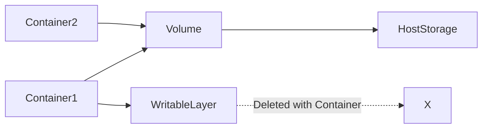
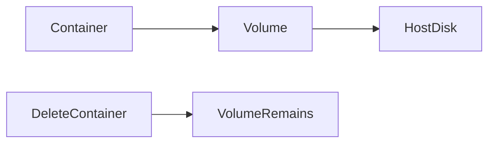
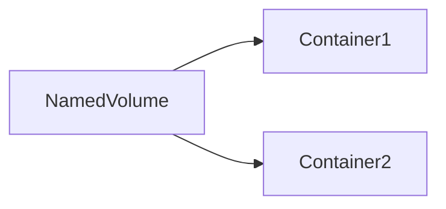

# Docker Volumes

## Overview

Docker **Volumes** are Docker-managed storage locations used to **persist data independently of containers**.

By default, data written inside a container is stored in its **writable layer**, which is deleted when the container is removed. Volumes solve this problem by storing data outside the container lifecycle.

Docker Volumes are the **recommended method** for persistent storage in production.

> **Interview Point**
>
> Containers are **ephemeral**, but volumes are **persistent**.

---

## Why It Is Used

Docker Volumes are used to:

- Persist application data
- Share data between containers
- Backup and restore application data
- Store databases
- Separate application code from application data
- Prevent data loss when containers are recreated

---

## Architecture / Working



---

## Key Components

| Component | Purpose |
|-----------|----------|
| Docker Volume | Persistent storage managed by Docker |
| Container | Uses the volume |
| Docker Daemon | Manages volume lifecycle |
| Host Storage | Physical storage location |

---

## Types (if applicable)

| Type | Description | Managed By |
|------|-------------|------------|
| Named Volume | Docker-managed persistent storage | Docker |
| Anonymous Volume | Automatically created unnamed volume | Docker |
| Bind Mount | Maps a host directory to the container | Host OS |
| tmpfs Mount | Stores data in memory only | Linux Kernel |

> **Interview Point**
>
> For production, **Named Volumes** are generally preferred over Bind Mounts because Docker manages them.

---

## Lifecycle / Workflow


---

## Configuration / Syntax (if applicable)

Create a volume

```bash
docker volume create myvolume
```

Run a container using the volume

```bash
docker run -d \
-v myvolume:/data \
nginx
```

List volumes

```bash
docker volume ls
```

Inspect volume

```bash
docker volume inspect myvolume
```

Remove volume

```bash
docker volume rm myvolume
```

---

## Important Commands (if applicable)

```bash
docker volume create

docker volume ls

docker volume inspect

docker volume rm

docker volume prune

docker run -v

docker run --mount
```

---

## Important Files (if applicable)

| File / Location | Purpose |
|----------------|----------|
| `/var/lib/docker/volumes/` | Default Docker volume storage location (Linux) |
| `/etc/docker/daemon.json` | Docker daemon configuration |

---

## Real-World Use Cases

- MySQL data
- PostgreSQL databases
- MongoDB storage
- Jenkins home directory
- WordPress uploads
- Application logs
- Shared configuration
- CI/CD cache

---

## Advantages

- Persistent storage
- Docker-managed
- Easy backup
- Easy migration
- Shareable across containers
- Supports production workloads

---

## Limitations

- Volumes consume disk space
- Manual cleanup may be required
- Data management is separate from image management

---

## Common Interview Questions (Concept Only)

- Why are Docker Volumes needed?
- Where are Docker Volumes stored?
- What happens to data after a container is deleted?
- Difference between Volumes and Bind Mounts?
- Can multiple containers share a volume?

---

## Common Mistakes

- Storing database data inside the container filesystem
- Removing volumes accidentally
- Using Bind Mounts unnecessarily in production
- Forgetting to back up persistent volumes

---

## Troubleshooting

| Problem | Solution |
|----------|----------|
| Data lost | Verify a volume was mounted instead of using the container's writable layer |
| Volume not mounted | Check the mount path and container configuration |
| Permission denied | Verify ownership and permissions on the mounted storage |
| Disk full | Remove unused volumes with `docker volume prune` after confirming they are no longer needed |

---

## Summary

Docker Volumes provide persistent, Docker-managed storage that survives container deletion and is the preferred solution for storing production application data.

---

# Persistent Storage

## Overview

Containers are **ephemeral**, meaning their writable layer is removed when the container is deleted.

Persistent storage ensures that important application data survives container recreation.

---

## Why It Is Used

Persistent storage is required for:

- Databases
- Uploaded files
- Configuration
- Logs
- Shared application data

Without persistent storage, all runtime data is lost when the container is removed.

---

## Architecture / Working



---

## Key Components

| Component | Purpose |
|-----------|----------|
| Volume | Stores persistent data |
| Host Storage | Physical storage |
| Container | Reads/Writes data |

---

## Real-World Use Cases

- MySQL
- PostgreSQL
- Jenkins
- GitLab
- Redis persistence

---

## Advantages

- Prevents data loss
- Independent of container lifecycle

---

## Limitations

- Requires backup planning

---

## Common Interview Questions (Concept Only)

- Why is persistent storage required?
- What happens if a container without a volume is deleted?

---

## Summary

Persistent storage ensures application data remains available even after containers are recreated or removed.

---

# Named Volumes

## Overview

Named Volumes are Docker-managed persistent storage with a user-defined name.

Example:

```text
database-data
jenkins-home
```

Docker automatically stores and manages these volumes.

---

## Why It Is Used

Named Volumes provide:

- Easy management
- Data persistence
- Better portability
- Secure storage

---

## Architecture / Working



---

## Configuration / Syntax (if applicable)

Create volume

```bash
docker volume create db-data
```

Mount volume

```bash
docker run -v db-data:/var/lib/mysql mysql
```

---

## Important Commands (if applicable)

```bash
docker volume create

docker volume ls

docker volume inspect

docker volume rm
```

---

## Real-World Use Cases

- Databases
- Jenkins
- Shared application storage
- CI/CD cache

---

## Advantages

- Docker-managed
- Easy backup
- Reusable
- Recommended for production

---

## Limitations

- Stored in Docker's default storage location unless configured otherwise

---

## Common Interview Questions (Concept Only)

- What is a Named Volume?
- Why are Named Volumes preferred in production?

---

## Common Mistakes

- Assuming removing a container also removes the volume
- Forgetting to clean up unused volumes

---

## Troubleshooting

| Problem | Solution |
|----------|----------|
| Volume not found | Verify the volume name with `docker volume ls` |

---

## Summary

Named Volumes are Docker-managed persistent storage and are the preferred choice for production applications.

---

# Bind Mounts

## Overview

A Bind Mount maps a directory or file from the **host machine** directly into a container.

Unlike volumes, Docker does not manage the storage.

---

## Why It Is Used

Bind Mounts are useful for:

- Local development
- Live code editing
- Configuration files
- Log collection

---

## Architecture / Working


---

## Configuration / Syntax (if applicable)

Linux example

```bash
docker run \
-v /home/user/app:/app \
nginx
```

Using the `--mount` syntax

```bash
docker run \
--mount type=bind,source=/home/user/app,target=/app \
nginx
```

---

## Advantages

- Immediate synchronization
- Ideal for development
- Uses existing host directories

---

## Limitations

- Host-dependent paths
- Permission issues
- Less portable than named volumes

---

## Real-World Use Cases

- Local development
- Source code mounting
- Configuration overrides
- Log analysis

---

## Common Interview Questions (Concept Only)

- Difference between Bind Mounts and Named Volumes?
- When should Bind Mounts be used?

---

## Common Mistakes

- Using Bind Mounts for production databases
- Mounting incorrect host directories
- Ignoring file permission differences between host and container

---

## Troubleshooting

| Problem | Solution |
|----------|----------|
| Permission denied | Verify host directory ownership and permissions |
| Files not visible | Confirm the correct source path is mounted |

---

## Summary

Bind Mounts directly expose host files and directories inside containers and are primarily intended for development and debugging workflows.

---

# Create & Manage Volumes

## Overview

Docker provides commands to create, inspect, list, and remove volumes.

---

## Why It Is Used

Volume management helps administrators organize persistent storage.

---

## Lifecycle / Workflow


---

## Configuration / Syntax (if applicable)

Create

```bash
docker volume create app-data
```

List

```bash
docker volume ls
```

Inspect

```bash
docker volume inspect app-data
```

Delete

```bash
docker volume rm app-data
```

Remove unused

```bash
docker volume prune
```

---

## Important Commands (if applicable)

```bash
docker volume create

docker volume ls

docker volume inspect

docker volume rm

docker volume prune
```

---

## Real-World Use Cases

- Database storage
- Backup preparation
- Storage cleanup

---

## Advantages

- Easy management
- Centralized storage

---

## Limitations

- Orphaned volumes can accumulate if not cleaned up

---

## Common Interview Questions (Concept Only)

- How do you create a Docker Volume?
- How do you remove unused volumes?

---

## Common Mistakes

- Deleting active volumes
- Forgetting to inspect a volume before removal

---

## Troubleshooting

| Problem | Solution |
|----------|----------|
| Volume in use | Stop and remove dependent containers before deleting the volume |

---

## Summary

Docker provides simple commands to create, inspect, manage, and remove persistent storage volumes.

---

# Mount Volumes to Containers

## Overview

Volumes become useful only after they are mounted into containers.

A mounted volume allows containers to read and write persistent data.

---

## Why It Is Used

Mounting volumes enables:

- Persistent databases
- Shared application files
- Log storage
- Configuration management

---

## Architecture / Working


---

## Configuration / Syntax (if applicable)

Using `-v`

```bash
docker run \
-v db-data:/var/lib/mysql \
mysql
```

Using `--mount`

```bash
docker run \
--mount source=db-data,target=/var/lib/mysql,type=volume \
mysql
```

---

## Important Commands (if applicable)

```bash
docker run -v

docker run --mount
```

---

## Real-World Use Cases

- MySQL data directory
- PostgreSQL data directory
- Jenkins home
- Application uploads
- Shared logs

---

## Advantages

- Data persistence
- Easy sharing between containers
- Independent of container lifecycle

---

## Limitations

- Incorrect mount paths can hide container files
- Requires proper planning for backups and permissions

---

## Common Interview Questions (Concept Only)

- How do you mount a volume?
- Difference between `-v` and `--mount`?
- Can one volume be mounted into multiple containers?

---

## Common Mistakes

- Mounting the wrong target directory
- Overwriting application files with an incorrect mount
- Assuming data is stored inside the image rather than the mounted volume

---

## Troubleshooting

| Problem | Solution |
|----------|----------|
| Data not visible | Verify both the source volume and target mount path |
| Application cannot write | Check filesystem permissions and ownership |

---

## Summary

Mounting volumes connects persistent storage to containers, allowing applications to retain data beyond the lifecycle of individual containers.
