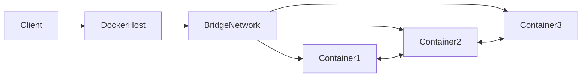
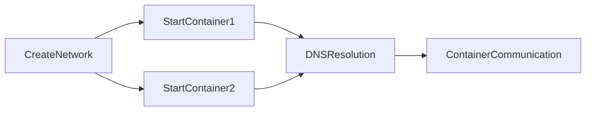
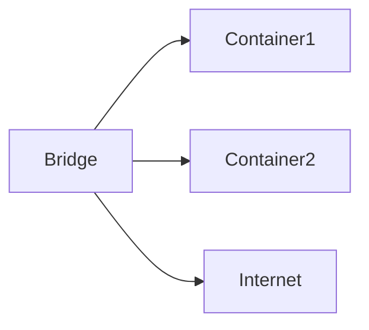
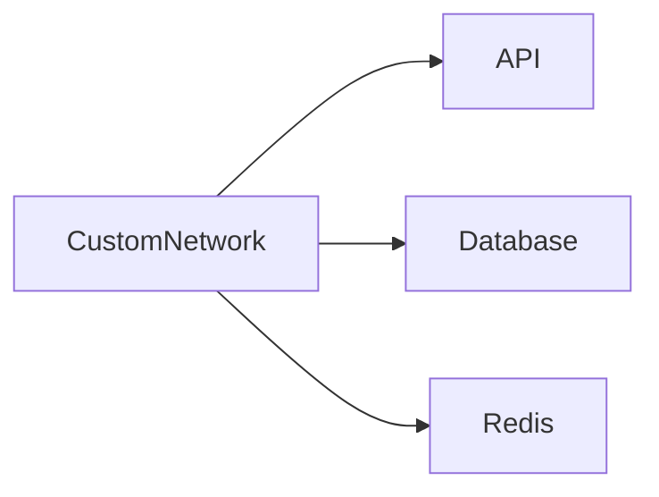
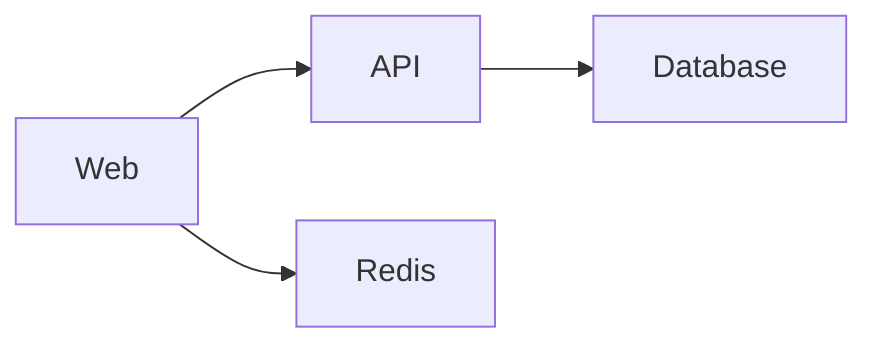

# Docker Networking

## Overview

Docker Networking enables containers to communicate with:

- Other containers
- The Docker host
- External networks
- The Internet

Every container is attached to a Docker network. Docker provides several built-in network drivers, with **Bridge** being the default.

> **Interview Point**
>
> Every Docker container is connected to a network.
>
> If no network is specified, Docker automatically connects the container to the **default bridge network**.

---

## Why It Is Used

Docker Networking is used to:

- Enable communication between containers
- Expose applications to users
- Isolate applications
- Connect containers to databases
- Build microservice architectures
- Improve network security

---

## Architecture / Working



---

## Key Components

| Component | Purpose |
|-----------|----------|
| Network Driver | Defines networking behavior |
| Bridge Network | Default network for standalone containers |
| Host Network | Shares host networking stack |
| None Network | No network connectivity |
| Custom Network | User-created isolated network |
| Container IP | IP assigned to each container |
| DNS | Docker's built-in service discovery |

---

## Types (if applicable)

| Network Type | Description | Production Usage |
|--------------|-------------|------------------|
| Bridge | Default isolated network | Very Common |
| Host | Shares host network | Limited |
| None | No networking | Special Cases |
| Overlay | Multi-host networking | Docker Swarm |
| Macvlan | Gives container its own MAC/IP | Advanced |

> **Interview Point**
>
> For Docker interviews, focus primarily on:
>
> - Bridge
> - Host
> - None
> - Custom Bridge Networks

---

## Lifecycle / Workflow



---

## Configuration / Syntax (if applicable)

Create a custom network

```bash
docker network create my-network
```

Run container

```bash
docker run -d \
--network my-network \
nginx
```

Inspect network

```bash
docker network inspect my-network
```

List networks

```bash
docker network ls
```

---

## Important Commands (if applicable)

```bash
docker network ls

docker network inspect

docker network create

docker network rm

docker network connect

docker network disconnect

docker run --network
```

---

## Important Files (if applicable)

Docker networking is managed internally by Docker.

Useful locations:

| File | Purpose |
|------|----------|
| /etc/docker/daemon.json | Docker daemon configuration |
| iptables rules | Network routing (Linux) |

---

## Real-World Use Cases

- Web server ↔ Database
- Frontend ↔ Backend
- API ↔ Redis
- Jenkins ↔ Docker Agent
- Microservices communication
- Kubernetes container networking concepts

---

## Advantages

- Automatic DNS
- Network isolation
- Secure communication
- Easy container discovery
- Supports multiple network drivers

---

## Limitations

- Host networking reduces isolation
- Bridge networking is limited to one Docker host
- Overlay networking requires orchestration

---

## Common Interview Questions (Concept Only)

- What is Docker Networking?
- What is the default Docker network?
- How do containers communicate?
- What are Docker Network Drivers?
- Difference between Bridge and Host Network?

---

## Common Mistakes

- Using default bridge for every application
- Publishing unnecessary ports
- Assuming localhost always refers to the host
- Ignoring network isolation

---

## Troubleshooting

| Problem | Solution |
|----------|----------|
| Containers cannot communicate | Verify they are on the same network |
| DNS resolution fails | Inspect the Docker network configuration |
| Port inaccessible | Verify `-p` port mapping and firewall rules |
| Network missing | Use `docker network ls` to confirm its existence |

---

## Summary

Docker Networking enables secure communication between containers and external systems. Understanding Bridge, Host, None, and Custom Networks is essential for Docker and DevOps interviews.

---

# Container Communication

## Overview

Containers communicate using Docker Networks.

Containers connected to the same network can communicate using:

- Container Name
- Container IP Address

Docker provides built-in DNS resolution for user-defined networks.

---

## Why It Is Used

Allows applications to communicate without exposing every service externally.

Example:

```
Frontend
      ↓
Backend API
      ↓
Database
```

---

## Architecture / Working


---

## Key Components

- Docker DNS
- Container hostname
- Network driver
- Network interface

---

## Configuration / Syntax (if applicable)

Example

```bash
docker network create app-network

docker run -d --name db \
--network app-network mysql

docker run -d --name api \
--network app-network myapi
```

API connects using

```
db:3306
```

instead of

```
172.x.x.x
```

---

## Real-World Use Cases

- API → Database
- Web → Redis
- Jenkins → Agent
- Application → RabbitMQ

---

## Advantages

- Automatic DNS
- No manual IP management
- Easy scaling

---

## Limitations

- Works only inside the same network

---

## Common Interview Questions (Concept Only)

- How do Docker containers communicate?
- Why use container names instead of IP addresses?

---

## Common Mistakes

- Using container IPs instead of service names
- Connecting containers to different networks unintentionally

---

## Troubleshooting

| Problem | Solution |
|----------|----------|
| Cannot reach another container | Ensure both containers are attached to the same network |

---

## Summary

Containers communicate through Docker networks using built-in DNS and container names.

---

# Bridge Network

## Overview

Bridge Network is Docker's **default network driver**.

Standalone containers automatically join the default bridge network unless another network is specified.

---

## Why It Is Used

Provides:

- Isolation
- Internal communication
- Internet access

---

## Architecture / Working



---

## Key Components

- Virtual bridge
- NAT
- Internal DNS (custom bridge networks)
- IP allocation

---

## Configuration / Syntax (if applicable)

Default bridge

```bash
docker run nginx
```

Custom bridge

```bash
docker network create mybridge
```

Run

```bash
docker run \
--network mybridge \
nginx
```

---

## Important Commands (if applicable)

```bash
docker network ls

docker network inspect bridge
```

---

## Real-World Use Cases

- Web applications
- Development environments
- Microservices on a single host

---

## Advantages

- Easy setup
- Network isolation
- Internet connectivity

---

## Limitations

- Default bridge has limited DNS functionality compared to user-defined bridge networks
- Single-host only

---

## Common Interview Questions (Concept Only)

- What is the Bridge Network?
- What is the default Docker network?

---

## Common Mistakes

- Using the default bridge when a custom bridge network would provide better isolation and service discovery

---

## Troubleshooting

| Problem | Solution |
|----------|----------|
| Containers cannot resolve names | Use a user-defined bridge network |

---

## Summary

Bridge is Docker's default network driver for standalone containers.

---

# Host Network

## Overview

Host Network removes network isolation.

The container shares the host's network stack.

No separate container IP is assigned.

---

## Why It Is Used

Useful when:

- Maximum network performance is required
- Port mapping should be avoided

---

## Architecture / Working


---

## Configuration / Syntax (if applicable)

```bash
docker run \
--network host \
nginx
```

---

## Real-World Use Cases

- Monitoring tools
- Network appliances
- Performance testing

---

## Advantages

- Lowest latency
- No NAT
- No port mapping required

---

## Limitations

- Reduced isolation
- Higher security risk
- Linux-only support (limited/non-functional on Docker Desktop)

---

## Common Interview Questions (Concept Only)

- What is Host Network?
- When should Host Networking be used?

---

## Common Mistakes

- Using Host Networking unnecessarily
- Running multiple services that require the same port

---

## Troubleshooting

| Problem | Solution |
|----------|----------|
| Port conflict | Ensure the host port is not already in use |

---

## Summary

Host Networking shares the host network directly with the container for maximum performance but reduced isolation.

---

# None Network

## Overview

The None Network disables networking completely.

The container has:

- No IP
- No Internet
- No external communication

---

## Why It Is Used

Useful for:

- Security
- Offline processing
- Batch jobs

---

## Architecture / Working


---

## Configuration / Syntax (if applicable)

```bash
docker run \
--network none \
ubuntu
```

---

## Real-World Use Cases

- Security-sensitive workloads
- Offline data processing
- Testing

---

## Advantages

- Maximum isolation
- Improved security

---

## Limitations

- No communication
- No Internet access

---

## Common Interview Questions (Concept Only)

- What is the None Network?

---

## Common Mistakes

- Expecting Internet connectivity from a container using the None network

---

## Troubleshooting

| Problem | Solution |
|----------|----------|
| No connectivity | Confirm that the container was not started with `--network none` |

---

## Summary

The None Network provides complete network isolation.

---

# Create Custom Networks

## Overview

Custom Networks provide isolated communication environments for related containers.

Docker automatically enables built-in DNS on user-defined bridge networks.

---

## Why It Is Used

Improves:

- Isolation
- Security
- Service discovery

---

## Architecture / Working



---

## Configuration / Syntax (if applicable)

Create

```bash
docker network create app-network
```

List

```bash
docker network ls
```

Inspect

```bash
docker network inspect app-network
```

Delete

```bash
docker network rm app-network
```

---

## Important Commands (if applicable)

```bash
docker network create

docker network inspect

docker network rm
```

---

## Real-World Use Cases

- Production applications
- Microservices
- CI/CD
- Databases

---

## Advantages

- Automatic DNS
- Better isolation
- Cleaner architecture

---

## Limitations

- Must be created and managed explicitly

---

## Common Interview Questions (Concept Only)

- Why use custom networks instead of the default bridge?
- How do you create a Docker network?

---

## Common Mistakes

- Forgetting to attach containers to the custom network

---

## Troubleshooting

| Problem | Solution |
|----------|----------|
| Container not reachable | Verify it is connected to the correct custom network |

---

## Summary

Custom Networks provide secure, isolated networking with automatic service discovery and are recommended for production deployments.

---

# Connect Containers

## Overview

Containers can be connected to the same network so they can communicate using Docker's built-in DNS.

This is the standard approach for multi-container applications.

---

## Why It Is Used

Allows services to communicate securely without exposing every container externally.

---

## Architecture / Working



---

## Configuration / Syntax (if applicable)

Create network

```bash
docker network create app-network
```

Run database

```bash
docker run -d \
--name mysql \
--network app-network \
mysql
```

Run application

```bash
docker run -d \
--name app \
--network app-network \
myapp
```

Connect an existing container

```bash
docker network connect app-network container_name
```

Disconnect

```bash
docker network disconnect app-network container_name
```

---

## Important Commands (if applicable)

```bash
docker network connect

docker network disconnect

docker network inspect
```

---

## Real-World Use Cases

- Nginx ↔ Backend
- Backend ↔ MySQL
- Backend ↔ Redis
- Jenkins ↔ Docker Agents
- WordPress ↔ MySQL

---

## Advantages

- Automatic DNS resolution
- Secure internal communication
- Easy service scaling

---

## Limitations

- Containers on different networks cannot communicate unless explicitly connected

---

## Common Interview Questions (Concept Only)

- How do two Docker containers communicate?
- How do you connect an existing container to a network?
- Can one container be connected to multiple Docker networks?

---

## Common Mistakes

- Attempting to communicate between containers on different networks
- Using IP addresses instead of container names
- Exposing internal services unnecessarily

---

## Troubleshooting

| Problem | Solution |
|----------|----------|
| Connection refused | Verify the target service is running and listening on the expected port |
| Name resolution failed | Confirm both containers are attached to the same user-defined network |
| Cannot connect after creation | Use `docker network connect` to attach the container to the required network |

---

## Summary

Connecting containers through user-defined Docker networks enables secure, reliable communication using built-in DNS and container names, making it the preferred approach for modern containerized applications.
