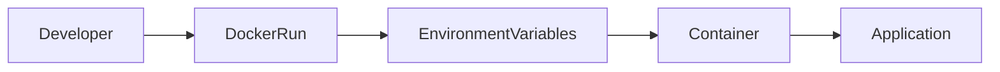
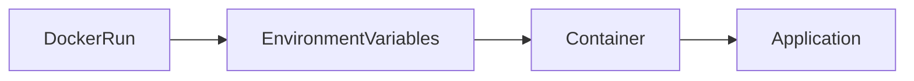
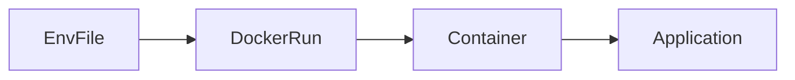

# Environment Variables

## Overview

Environment Variables are **key-value pairs** that provide configuration values to applications running inside Docker containers.

Instead of hardcoding configuration such as database credentials, API endpoints, or application settings into an image, environment variables allow these values to be supplied **at runtime**, making containers more flexible and reusable.

Docker supports passing environment variables using:

- `-e` option
- `--env` option
- `--env-file`
- Docker Compose `.env` files

> **Interview Point**
>
> Docker Images should remain **generic**. Environment-specific configuration should be supplied through **Environment Variables**, not hardcoded into the image.

---

## Why It Is Used

Environment Variables are used to:

- Configure applications without rebuilding images
- Separate configuration from application code
- Support multiple environments (Development, Testing, Production)
- Store application settings
- Simplify CI/CD deployments
- Improve deployment flexibility

---

## Architecture / Working



---

## Key Components

| Component | Purpose |
|-----------|----------|
| Environment Variable | Configuration value |
| Docker CLI | Passes variables during container startup |
| Dockerfile ENV | Defines default variables |
| Container | Receives variables |
| Application | Reads variables at runtime |

---

## Types (if applicable)

| Type | Description |
|------|-------------|
| Runtime Variables | Passed using `docker run` |
| Dockerfile ENV | Default variables defined during image creation |
| Environment File | Variables stored in a separate file |
| Docker Compose Variables | Variables loaded through Compose |

---

## Lifecycle / Workflow


---

## Configuration / Syntax (if applicable)

Pass a variable

```bash
docker run \
-e APP_ENV=production \
nginx
```

Pass multiple variables

```bash
docker run \
-e DB_HOST=mysql \
-e DB_PORT=3306 \
myapp
```

Using long syntax

```bash
docker run \
--env APP_ENV=production \
myapp
```

---

## Important Commands (if applicable)

```bash
docker run -e

docker run --env

docker inspect

docker exec

printenv

env
```

---

## Important Files (if applicable)

| File | Purpose |
|------|----------|
| Dockerfile | Default environment variables |
| .env | Stores environment variables |
| docker-compose.yml | Uses environment variables |

---

## Real-World Use Cases

- Database credentials
- API URLs
- Logging levels
- Application ports
- Feature flags
- Cloud configuration
- CI/CD pipeline variables

---

## Advantages

- Flexible configuration
- Reusable images
- Easy deployment
- Supports multiple environments
- No image rebuild required for configuration changes

---

## Limitations

- Environment variables are visible to privileged users and through container inspection
- Not suitable for highly sensitive secrets in production
- Incorrect values can cause application startup failures

---

## Common Interview Questions (Concept Only)

- What are Docker Environment Variables?
- Why use Environment Variables instead of hardcoding configuration?
- How do you pass Environment Variables to a container?
- Can Environment Variables override Dockerfile defaults?

---

## Common Mistakes

- Hardcoding passwords inside Dockerfiles
- Storing secrets directly in images
- Forgetting required variables
- Using inconsistent variable names across environments

---

## Troubleshooting

| Problem | Solution |
|----------|----------|
| Variable not available | Verify the `-e` or `--env` option was used correctly |
| Incorrect application configuration | Confirm variable names match what the application expects |
| Value not updated | Restart the container with the new variable values |

---

## Summary

Environment Variables provide a simple and portable way to configure Docker containers without modifying or rebuilding images.

---

# Passing Environment Variables

## Overview

Docker allows environment variables to be passed **when starting a container**.

These values are available immediately to the application running inside the container.

---

## Why It Is Used

Passing variables at runtime enables:

- Environment-specific configuration
- Image reuse
- Easy deployment automation
- Dynamic configuration during CI/CD

---

## Architecture / Working



---

## Key Components

| Component | Purpose |
|-----------|----------|
| `-e` | Pass a single variable |
| `--env` | Long-form option |
| `docker run` | Starts the container |

---

## Configuration / Syntax (if applicable)

Single variable

```bash
docker run \
-e APP_ENV=production \
myapp
```

Multiple variables

```bash
docker run \
-e DB_HOST=mysql \
-e DB_USER=admin \
-e DB_PORT=3306 \
myapp
```

Long syntax

```bash
docker run \
--env APP_ENV=production \
myapp
```

Pass an existing host variable

```bash
docker run \
-e HOME \
ubuntu
```

---

## Important Commands (if applicable)

```bash
docker run -e

docker exec

printenv

env
```

View variables inside a running container

```bash
docker exec container_name printenv
```

---

## Real-World Use Cases

- Database hostname
- Redis server
- API keys
- Logging configuration
- Cloud regions
- Build numbers

---

## Advantages

- Runtime flexibility
- No image rebuild required
- Easy automation

---

## Limitations

- Variables exist only for that container instance
- Not ideal for storing production secrets

---

## Common Interview Questions (Concept Only)

- How do you pass Environment Variables to a Docker container?
- How do you verify variables inside a running container?

---

## Common Mistakes

- Misspelling variable names
- Forgetting quotation marks when values contain spaces
- Assuming variables persist after the container is removed

---

## Troubleshooting

| Problem | Solution |
|----------|----------|
| Variable missing | Verify the container was started with the correct `-e` or `--env` option |
| Wrong value | Inspect the running container using `printenv` or `env` |

---

## Summary

Runtime Environment Variables allow the same Docker image to be deployed with different configurations across environments.

---

# Using .env Files

## Overview

A **.env file** stores multiple environment variables in a single file, allowing them to be loaded into Docker containers.

This approach is cleaner than specifying numerous `-e` options on the command line.

> **Interview Point**
>
> `.env` files improve configuration management but **should not contain production secrets** unless they are protected and excluded from version control.

---

## Why It Is Used

`.env` files help to:

- Simplify container startup
- Organize configuration
- Reuse settings
- Reduce command complexity
- Standardize deployments

---

## Architecture / Working



---

## Key Components

| Component | Purpose |
|-----------|----------|
| `.env` | Stores key-value pairs |
| `--env-file` | Loads variables into the container |
| Container | Receives variables |

---

## Configuration / Syntax (if applicable)

Example `.env`

```text
APP_ENV=production
DB_HOST=mysql
DB_PORT=3306
DB_USER=admin
```

Run container

```bash
docker run \
--env-file .env \
myapp
```

View loaded variables

```bash
docker exec container_name printenv
```

---

## Important Commands (if applicable)

```bash
docker run --env-file

docker exec

printenv

env
```

---

## Important Files (if applicable)

| File | Purpose |
|------|----------|
| `.env` | Stores environment variables |
| `.gitignore` | Prevents accidental commits of sensitive `.env` files |
| `docker-compose.yml` | Can reference variables from `.env` |

---

## Real-World Use Cases

- Development configuration
- Testing environments
- Local application settings
- CI/CD deployments
- Multiple deployment environments

---

## Advantages

- Cleaner configuration
- Easy maintenance
- Reusable across deployments
- Reduces lengthy command lines

---

## Limitations

- Plain-text storage
- Unsuitable for sensitive production secrets
- Requires proper access control

---

## Common Interview Questions (Concept Only)

- What is a `.env` file?
- How do you load Environment Variables from a file?
- Should secrets be stored in `.env` files?
- What is the difference between `-e` and `--env-file`?

---

## Common Mistakes

- Committing `.env` files containing credentials to Git
- Using incorrect file formatting (spaces around `=`, invalid syntax)
- Assuming changes to the `.env` file affect running containers automatically

---

## Troubleshooting

| Problem | Solution |
|----------|----------|
| Variables not loaded | Verify the file path passed to `--env-file` |
| Application still uses old values | Restart the container after updating the `.env` file |
| Invalid variable format | Ensure each line follows the `KEY=VALUE` format |

---

## Summary

`.env` files provide a convenient way to manage multiple Docker Environment Variables, making deployments cleaner and more maintainable. They are well-suited for development and non-sensitive configuration, while production secrets should be managed using dedicated secret management solutions.
