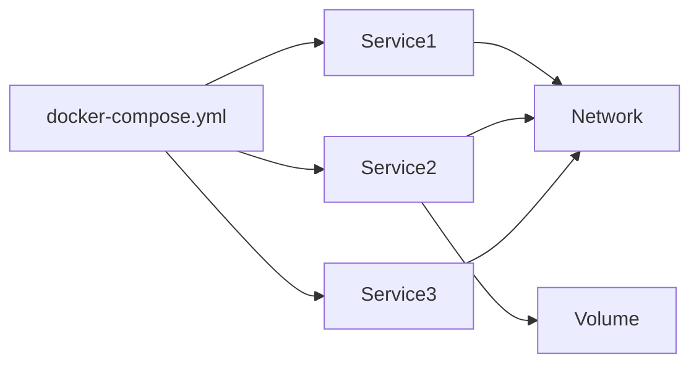
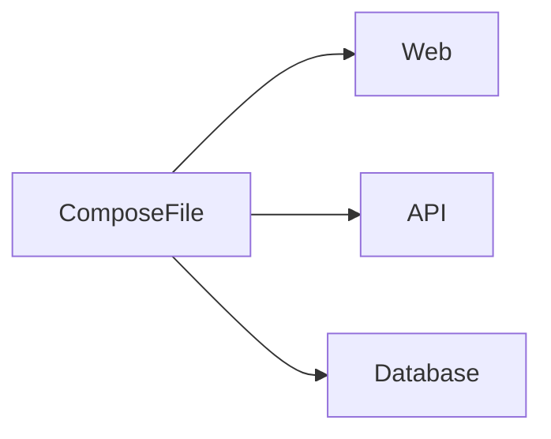
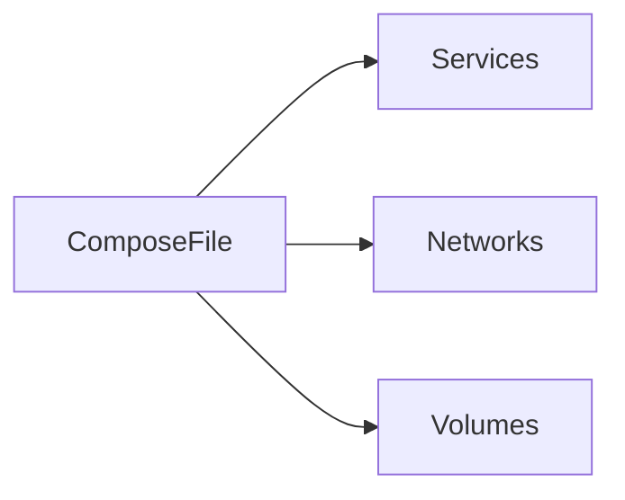
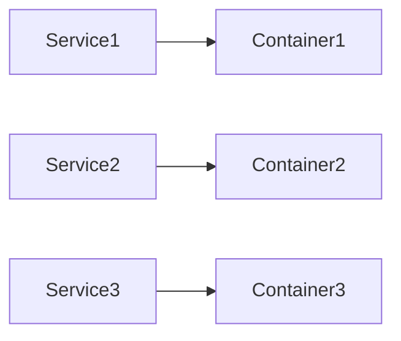
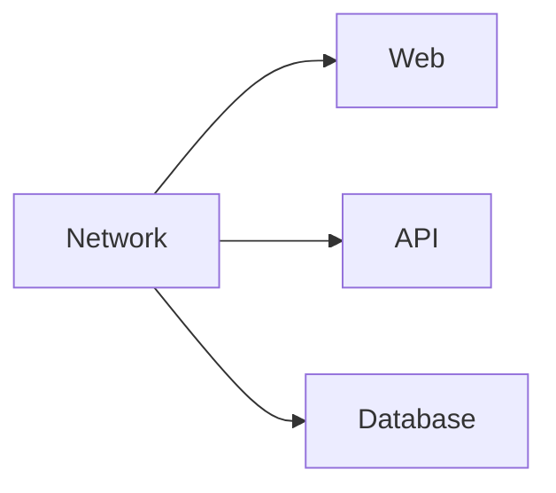

# Docker Compose

## Overview

Docker Compose is a tool used to **define and manage multi-container Docker applications** using a single YAML configuration file (`docker-compose.yml` or `compose.yaml`).

Instead of running multiple `docker run` commands, Docker Compose allows you to define all containers, networks, volumes, and environment variables in one file and start the entire application with a single command.

> **Interview Point**
>
> - **Docker** manages individual containers.
> - **Docker Compose** manages multiple related containers as a single application.

---

## Why It Is Used

Docker Compose is used to:

- Run multi-container applications
- Simplify local development
- Automate container creation
- Create isolated environments
- Manage application dependencies
- Standardize deployments
- Simplify testing environments

---

## Architecture / Working



---

## Key Components

| Component | Purpose |
|-----------|----------|
| Compose File | Defines the application |
| Services | Individual containers |
| Networks | Communication between services |
| Volumes | Persistent storage |
| Environment Variables | Runtime configuration |
| Build | Build image from Dockerfile |
| Image | Pull existing image |

---

## Types (if applicable)

Docker Compose itself has no types, but commonly used components include:

- Services
- Networks
- Volumes
- Environment Variables
- Build Configuration
- Image Configuration

---

## Lifecycle / Workflow


---

## Configuration / Syntax (if applicable)

Example

```yaml
services:
  web:
    image: nginx

  db:
    image: mysql
```

Start application

```bash
docker compose up
```

---

## Important Commands (if applicable)

```bash
docker compose up

docker compose down

docker compose ps

docker compose logs

docker compose start

docker compose stop

docker compose restart
```

---

## Important Files (if applicable)

| File | Purpose |
|------|----------|
| compose.yaml | Main Compose configuration (preferred name) |
| docker-compose.yml | Legacy but still widely supported Compose configuration |
| .env | Environment variables |
| Dockerfile | Image build instructions |

---

## Real-World Use Cases

- Web + Database
- WordPress + MySQL
- Node.js + MongoDB
- Python + Redis
- Jenkins + Docker Agent
- Local microservice development

---

## Advantages

- Simple application deployment
- Infrastructure as Code
- Easy container orchestration on a single host
- Reproducible environments
- Automatic networking

---

## Limitations

- Single-host management only
- Not intended for large-scale production orchestration
- Limited scaling compared to Kubernetes

---

## Common Interview Questions (Concept Only)

- What is Docker Compose?
- Why use Docker Compose?
- Docker vs Docker Compose?
- What is a Compose file?
- How does Docker Compose manage multiple containers?

---

## Common Mistakes

- Using `docker run` instead of Compose for multi-container applications
- Hardcoding configuration
- Not using named volumes
- Forgetting dependencies between services

---

## Troubleshooting

| Problem | Solution |
|----------|----------|
| Service not starting | Verify the Compose file syntax and service configuration |
| Container cannot connect | Ensure services are on the same Compose network |
| Image build failed | Check the Dockerfile and build context |
| Configuration changes not applied | Recreate containers after modifying the Compose file |

---

## Summary

Docker Compose simplifies the deployment and management of multi-container applications using a single YAML configuration file.

---

# Purpose of Docker Compose

## Overview

Docker Compose allows developers to manage an entire application stack using a single command.

Instead of creating containers individually, Compose creates:

- Containers
- Networks
- Volumes

automatically.

---

## Why It Is Used

Compose solves problems such as:

- Multiple docker run commands
- Manual networking
- Manual volume creation
- Environment consistency

---

## Architecture / Working



---

## Real-World Use Cases

- MERN Stack
- Django + PostgreSQL
- Spring Boot + MySQL
- WordPress

---

## Advantages

- Faster development
- One-command deployment
- Consistent environments

---

## Limitations

- Not a replacement for Kubernetes

---

## Common Interview Questions (Concept Only)

- Why use Docker Compose?
- What problems does Docker Compose solve?

---

## Summary

Docker Compose automates deployment and management of multi-container applications.

---

# docker-compose.yml Structure

## Overview

The Compose file defines the complete application architecture.

It is written in **YAML**.

---

## Why It Is Used

Defines:

- Services
- Networks
- Volumes
- Environment Variables
- Build settings

---

## Architecture / Working



---

## Configuration / Syntax (if applicable)

Example

```yaml
services:
  web:
    image: nginx

volumes:
  db-data:

networks:
  app-network:
```

---

## Key Components

| Section | Purpose |
|----------|----------|
| services | Containers |
| volumes | Persistent storage |
| networks | Networking |
| environment | Variables |
| build | Build images |
| image | Pull images |

---

## Advantages

- Human readable
- Version controlled
- Infrastructure as Code

---

## Limitations

- YAML indentation is significant

---

## Common Interview Questions (Concept Only)

- What is docker-compose.yml?
- Which sections are most commonly used?

---

## Common Mistakes

- Incorrect indentation
- Misspelled keys
- Mixing tabs and spaces

---

## Troubleshooting

| Problem | Solution |
|----------|----------|
| YAML parsing error | Verify indentation and syntax |

---

## Summary

The Compose file is the blueprint that defines the complete multi-container application.

---

# Services

## Overview

A Service represents one container definition.

Each service specifies how a container should run.

---

## Why It Is Used

Examples:

- Web Server
- API
- Database
- Redis
- RabbitMQ

---

## Architecture / Working



---

## Configuration / Syntax (if applicable)

```yaml
services:

  web:
    image: nginx

  db:
    image: mysql
```

---

## Real-World Use Cases

- Frontend
- Backend
- Database
- Cache

---

## Advantages

- Organized configuration
- Easy scaling
- Service discovery

---

## Limitations

- Each service should ideally have a single responsibility

---

## Common Interview Questions (Concept Only)

- What is a Service in Docker Compose?
- Does one service create one container?

---

## Summary

Services define the containers that make up the application.

---

# Networks

## Overview

Docker Compose automatically creates a dedicated network for the application.

All services can communicate using their **service names**.

---

## Why It Is Used

Provides:

- Isolation
- DNS
- Secure communication

---

## Architecture / Working



---

## Configuration / Syntax (if applicable)

```yaml
networks:

  app-network:
```

Assign network

```yaml
services:

  web:
    networks:
      - app-network
```

---

## Advantages

- Automatic DNS
- Easy communication
- Network isolation

---

## Limitations

- Communication is limited to services connected to the same network

---

## Common Interview Questions (Concept Only)

- Does Docker Compose automatically create a network?
- How do services communicate?

---

## Common Mistakes

- Forgetting to attach services to custom networks when multiple networks are used

---

## Troubleshooting

| Problem | Solution |
|----------|----------|
| Service unreachable | Confirm both services are connected to the same network |

---

## Summary

Compose automatically manages networking, enabling services to communicate using service names.

---

# Volumes

## Overview

Compose manages persistent storage using Docker Volumes.

---

## Why It Is Used

Stores:

- Databases
- Logs
- Uploaded files

---

## Configuration / Syntax (if applicable)

```yaml
volumes:

  mysql-data:
```

Mount

```yaml
services:

  db:
    volumes:
      - mysql-data:/var/lib/mysql
```

---

## Advantages

- Persistent
- Docker-managed
- Shareable

---

## Limitations

- Requires cleanup if no longer needed

---

## Common Interview Questions (Concept Only)

- How are Volumes defined in Docker Compose?
- Why use Volumes with databases?

---

## Common Mistakes

- Storing database data only in the container filesystem

---

## Troubleshooting

| Problem | Solution |
|----------|----------|
| Data missing after container recreation | Verify a named volume is configured and mounted correctly |

---

## Summary

Compose Volumes provide persistent storage independent of container lifecycle.

---

# Environment Variables

## Overview

Compose allows environment variables to configure services without changing images.

---

## Why It Is Used

Separates configuration from application code.

---

## Configuration / Syntax (if applicable)

```yaml
services:

  app:

    environment:

      APP_ENV: production

      DB_HOST: mysql
```

Using `.env`

```yaml
env_file:
  - .env
```

---

## Advantages

- Flexible configuration
- Reusable images
- Environment-specific settings

---

## Limitations

- Not suitable for sensitive secrets without additional protection

---

## Common Interview Questions (Concept Only)

- How do you pass environment variables in Docker Compose?
- What is the purpose of the `.env` file?

---

## Common Mistakes

- Committing `.env` files with credentials to source control
- Forgetting to restart services after changing environment variables

---

## Troubleshooting

| Problem | Solution |
|----------|----------|
| Variables not loaded | Verify the `.env` file path and Compose configuration |

---

## Summary

Environment Variables make Compose deployments configurable and reusable.

---

# Build vs Image

## Overview

Docker Compose supports two methods of obtaining container images.

---

## Why It Is Used

Depending on whether the image already exists.

---

## Key Components

| Option | Purpose |
|---------|----------|
| build | Builds image locally |
| image | Pulls existing image |

---

## Configuration / Syntax (if applicable)

Using build

```yaml
services:

  app:

    build: .
```

Using image

```yaml
services:

  app:

    image: nginx:latest
```

Build with custom Dockerfile

```yaml
services:

  app:

    build:

      context: .

      dockerfile: Dockerfile
```

---

## Real-World Use Cases

Build

- Internal applications
- CI/CD pipelines

Image

- MySQL
- Redis
- Nginx

---

## Advantages

| Build | Image |
|--------|-------|
| Custom application images | Faster deployment using existing images |
| Full control over image creation | No local build required |

---

## Limitations

| Build | Image |
|--------|-------|
| Requires Dockerfile | Limited to available images or pre-built custom images |

---

## Common Interview Questions (Concept Only)

- Difference between `build` and `image`?
- When should you use each?

---

## Common Mistakes

- Using `image` when local application changes require rebuilding
- Forgetting to rebuild after modifying the Dockerfile

---

## Troubleshooting

| Problem | Solution |
|----------|----------|
| Old application version running | Rebuild the image before starting the services |

---

## Summary

Use **build** for custom applications and **image** for existing images from a registry.

---

# Common Docker Compose Commands

## Overview

Docker Compose provides commands to manage the complete application lifecycle.

---

## Why It Is Used

Simplifies deployment, management, debugging, and cleanup.

---

## Configuration / Syntax (if applicable)

Start application

```bash
docker compose up
```

Detached mode

```bash
docker compose up -d
```

Stop application

```bash
docker compose stop
```

Remove application

```bash
docker compose down
```

List services

```bash
docker compose ps
```

View logs

```bash
docker compose logs
```

Restart

```bash
docker compose restart
```

Build images

```bash
docker compose build
```

Pull images

```bash
docker compose pull
```

Execute command

```bash
docker compose exec web bash
```

---

## Important Commands (if applicable)

| Command | Purpose |
|----------|----------|
| `docker compose up` | Create and start services |
| `docker compose up -d` | Run in detached mode |
| `docker compose down` | Stop and remove containers, networks, and the default network |
| `docker compose ps` | List running services |
| `docker compose logs` | View service logs |
| `docker compose build` | Build images |
| `docker compose pull` | Download images |
| `docker compose exec` | Execute commands in a running service |
| `docker compose restart` | Restart services |
| `docker compose stop` | Stop services without removing them |

---

## Real-World Use Cases

- Local development
- CI/CD testing
- QA environments
- Demonstration environments

---

## Advantages

- Simple commands
- One-command deployment
- Easy troubleshooting

---

## Limitations

- Intended for single-host environments
- Not designed for large-scale orchestration

---

## Common Interview Questions (Concept Only)

- Difference between `docker compose up` and `docker compose down`?
- Difference between `stop` and `down`?
- What does `docker compose exec` do?
- How do you rebuild services after changing the Dockerfile?

---

## Common Mistakes

- Using `down` when only `stop` is needed
- Forgetting to rebuild images after source code or Dockerfile changes
- Assuming `down` always removes named volumes (it does **not** unless `-v` is specified)

---

## Troubleshooting

| Problem | Solution |
|----------|----------|
| Containers not updated | Run `docker compose build` or `docker compose up --build` |
| Logs unavailable | Confirm the service is running with `docker compose ps` |
| Old image still in use | Rebuild or pull the latest image before starting services |

---

## Summary

Docker Compose commands manage the full lifecycle of multi-container applications, from building and starting services to debugging and cleanup, making them essential for development and DevOps workflows.
