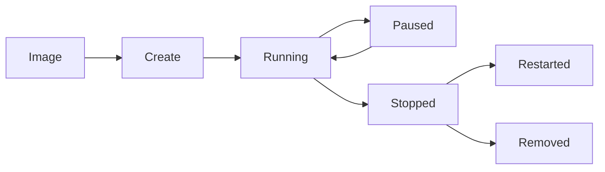
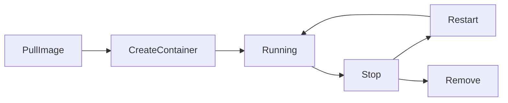
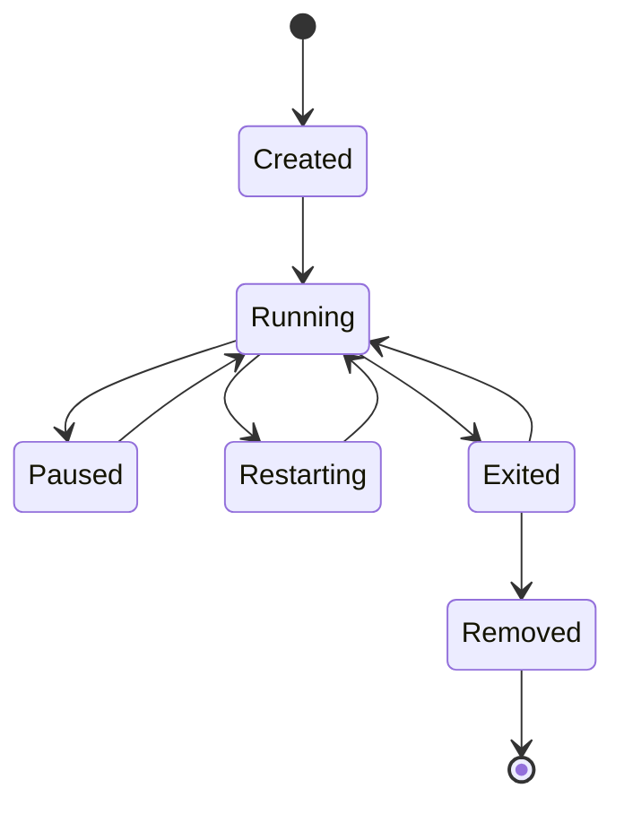
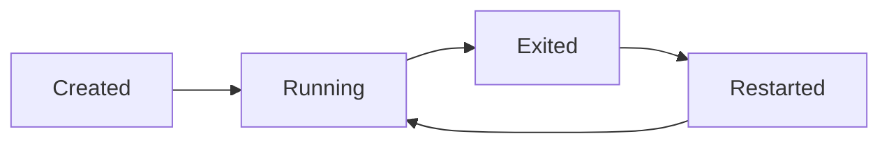
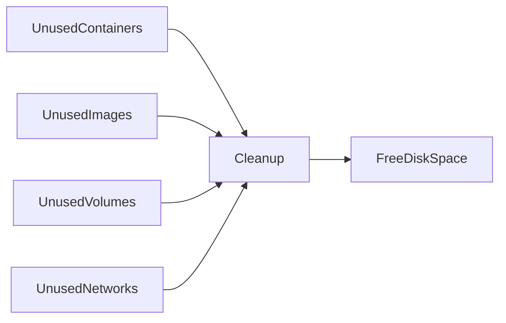
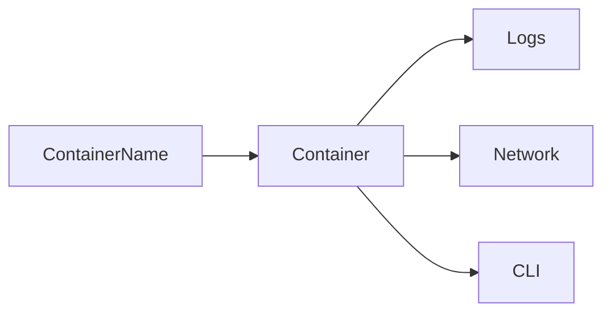

# Container Lifecycle Management

## Overview

Container Lifecycle Management refers to the process of creating, running, monitoring, stopping, restarting, and removing Docker containers.

Unlike Virtual Machines, Docker containers are **ephemeral** (temporary). They are designed to be easily created, destroyed, and recreated.

Proper lifecycle management ensures:

- Stable application deployment
- Efficient resource utilization
- Easy recovery from failures
- Cleaner Docker hosts
- Reliable CI/CD pipelines

> **Interview Point**
>
> Docker containers are designed to be **immutable** and **ephemeral**. Instead of modifying a running container, rebuild the image and create a new container.

---

## Why It Is Used

Container Lifecycle Management helps to:

- Deploy applications consistently
- Automate application recovery
- Manage running containers
- Remove unused resources
- Reduce storage consumption
- Improve production reliability

---

## Architecture / Working



---

## Key Components

| Component | Purpose |
|-----------|----------|
| Image | Blueprint for container creation |
| Container | Running instance of an image |
| Docker Engine | Manages container lifecycle |
| Restart Policy | Controls automatic restart behavior |
| Container Name | Human-readable identifier |
| Volumes | Persist application data |

---

## Types (if applicable)

Container lifecycle includes the following states:

- Created
- Running
- Paused
- Restarting
- Exited (Stopped)
- Dead
- Removed

---

## Lifecycle / Workflow



---

## Configuration / Syntax (if applicable)

Create container

```bash
docker create nginx
```

Run container

```bash
docker run nginx
```

Stop

```bash
docker stop container_name
```

Restart

```bash
docker restart container_name
```

Remove

```bash
docker rm container_name
```

---

## Important Commands (if applicable)

```bash
docker create

docker run

docker start

docker stop

docker restart

docker pause

docker unpause

docker rm

docker ps

docker ps -a

docker inspect
```

---

## Important Files (if applicable)

Docker manages container metadata internally.

Useful locations:

| File | Purpose |
|------|----------|
| `/var/lib/docker/containers/` | Container metadata and logs (Linux) |
| `/etc/docker/daemon.json` | Docker daemon configuration |

---

## Real-World Use Cases

- Deploy web applications
- Restart failed services
- Remove temporary containers
- CI/CD deployments
- Blue-Green deployments
- Rolling updates

---

## Advantages

- Automated lifecycle management
- Faster deployments
- Easy recovery
- Better resource utilization
- Supports Infrastructure as Code

---

## Limitations

- Containers are temporary
- Persistent storage requires volumes
- Incorrect cleanup can waste disk space

---

## Common Interview Questions (Concept Only)

- What is the Docker Container Lifecycle?
- Why are Docker containers considered ephemeral?
- What happens when a container is removed?
- Difference between stop, restart, and remove?
- Why should applications be stateless inside containers?

---

## Common Mistakes

- Storing important data inside containers
- Modifying running containers instead of rebuilding images
- Forgetting to remove unused containers
- Assuming container deletion removes associated volumes

---

## Troubleshooting

| Problem | Solution |
|----------|----------|
| Container exits immediately | Check logs using `docker logs` |
| Container won't restart | Verify restart policy and application logs |
| Cannot remove container | Stop the container before removing it |
| Disk space increasing | Remove unused containers, images, and volumes |

---

## Summary

Container Lifecycle Management ensures Docker containers are created, monitored, restarted, and removed efficiently while maintaining reliable and repeatable deployments.

---

# Container States

## Overview

A Docker container moves through several states during its lifecycle.

Understanding these states is a common interview topic and helps troubleshoot container issues.

---

## Why It Is Used

Container states indicate the current status of an application.

---

## Architecture / Working



---

## Key Components

| State | Description |
|--------|-------------|
| Created | Container created but not started |
| Running | Application is executing |
| Paused | Processes temporarily suspended |
| Restarting | Container restarting automatically |
| Exited | Container stopped |
| Dead | Container failed unexpectedly |
| Removed | Container deleted |

---

## Lifecycle / Workflow



---

## Configuration / Syntax (if applicable)

Check running containers

```bash
docker ps
```

Check all containers

```bash
docker ps -a
```

Inspect container state

```bash
docker inspect container_name
```

---

## Important Commands (if applicable)

```bash
docker ps

docker ps -a

docker inspect
```

---

## Real-World Use Cases

- Monitoring application status
- Production troubleshooting
- CI/CD validation

---

## Advantages

- Easy monitoring
- Quick troubleshooting

---

## Limitations

- Exited containers still consume disk space until removed

---

## Common Interview Questions (Concept Only)

- What are Docker container states?
- What does Exited mean?
- Difference between Paused and Stopped?

---

## Common Mistakes

- Confusing "Exited" with "Removed"
- Ignoring containers stuck in the Restarting state

---

## Troubleshooting

| Problem | Solution |
|----------|----------|
| Container repeatedly restarts | Check application logs and restart policy |
| Container stuck in Exited | Inspect the exit code and application error |

---

## Summary

Container states help administrators understand the current lifecycle stage and diagnose runtime issues.

---

# Resource Cleanup

## Overview

Over time, Docker hosts accumulate unused:

- Containers
- Images
- Networks
- Volumes
- Build Cache

Cleaning these resources improves disk usage and overall performance.

---

## Why It Is Used

Resource cleanup:

- Frees disk space
- Removes obsolete resources
- Improves Docker performance
- Prevents storage exhaustion

---

## Architecture / Working



---

## Configuration / Syntax (if applicable)

Remove stopped containers

```bash
docker container prune
```

Remove unused images

```bash
docker image prune
```

Remove unused volumes

```bash
docker volume prune
```

Remove unused networks

```bash
docker network prune
```

Remove everything unused

```bash
docker system prune
```

Remove everything including unused volumes

```bash
docker system prune -a --volumes
```

---

## Important Commands (if applicable)

```bash
docker system prune

docker image prune

docker container prune

docker network prune

docker volume prune
```

---

## Real-World Use Cases

- CI/CD agents
- Development systems
- Production maintenance
- Build servers

---

## Advantages

- Saves storage
- Improves performance
- Reduces clutter

---

## Limitations

- Removing resources without verification can delete data required later

---

## Common Interview Questions (Concept Only)

- How do you clean up Docker resources?
- What does `docker system prune` remove?
- Does `docker system prune` remove named volumes by default?

---

## Common Mistakes

- Running cleanup commands without understanding their impact
- Deleting important images or volumes accidentally

---

## Troubleshooting

| Problem | Solution |
|----------|----------|
| Disk still full | Check for large logs, build cache, or unused volumes |
| Required image removed | Pull or rebuild the image again |

---

## Summary

Resource cleanup is an important operational task that keeps Docker hosts efficient and prevents unnecessary storage consumption.

---

# Container Naming

## Overview

Every Docker container has:

- Container ID
- Container Name

If no name is specified, Docker automatically assigns a random name.

Example

```
focused_turing

happy_pare

admiring_bose
```

Using meaningful names makes administration much easier.

---

## Why It Is Used

Container names provide:

- Easy identification
- Service discovery
- Simpler management
- Readable logs
- Easier scripting

---

## Architecture / Working



---

## Configuration / Syntax (if applicable)

Create named container

```bash
docker run \
--name web-server \
nginx
```

Rename container

```bash
docker rename web-server nginx-prod
```

List containers

```bash
docker ps
```

---

## Important Commands (if applicable)

```bash
docker run --name

docker rename

docker ps
```

---

## Real-World Use Cases

- Web servers
- Database containers
- Jenkins
- Redis
- RabbitMQ

---

## Advantages

- Easy management
- Better readability
- Easier networking
- Simpler troubleshooting

---

## Limitations

- Names must be unique on a Docker host

---

## Common Interview Questions (Concept Only)

- Why assign container names?
- Difference between Container ID and Container Name?
- Can container names be changed?

---

## Common Mistakes

- Using duplicate names
- Relying on randomly generated names in production

---

## Troubleshooting

| Problem | Solution |
|----------|----------|
| Name already in use | Remove or rename the existing container |

---

## Summary

Meaningful container names improve administration, networking, automation, and troubleshooting.

---

# Restart Policies

## Overview

Restart Policies determine how Docker should automatically restart containers after they stop or when the Docker daemon restarts.

They improve application availability without requiring external monitoring tools.

> **Interview Point**
>
> Restart Policies are frequently asked in Docker and DevOps interviews.

---

## Why It Is Used

Restart Policies help:

- Automatically recover failed applications
- Reduce downtime
- Improve production reliability
- Simplify operations

---

## Architecture / Working


---

## Key Components

| Policy | Description |
|---------|-------------|
| `no` | Never restart (default) |
| `on-failure` | Restart only if the container exits with a non-zero status |
| `unless-stopped` | Restart automatically unless explicitly stopped by the user |
| `always` | Always restart the container after it stops or the Docker daemon restarts |

---

## Types (if applicable)

### no

Default behavior

```bash
--restart=no
```

---

### on-failure

Restart only when the application fails.

```bash
--restart=on-failure
```

Maximum retries

```bash
--restart=on-failure:5
```

---

### unless-stopped

Container restarts automatically unless it was intentionally stopped.

```bash
--restart=unless-stopped
```

---

### always

Always restart after failure or daemon restart.

```bash
--restart=always
```

---

## Lifecycle / Workflow


---

## Configuration / Syntax (if applicable)

Example

```bash
docker run \
-d \
--restart unless-stopped \
nginx
```

Inspect restart policy

```bash
docker inspect container_name
```

---

## Important Commands (if applicable)

```bash
docker run --restart

docker inspect
```

---

## Real-World Use Cases

- Web servers
- APIs
- Monitoring agents
- Logging services
- Production applications

---

## Advantages

- Automatic recovery
- Reduced downtime
- Improved service availability
- Simple configuration

---

## Limitations

- Restart policies do not fix application bugs
- Containers that repeatedly fail will continue restarting according to the configured policy

---

## Common Interview Questions (Concept Only)

- What are Docker Restart Policies?
- Difference between `always` and `unless-stopped`?
- When should `on-failure` be used?
- What is the default restart policy?

---

## Common Mistakes

- Assuming restart policies resolve application errors
- Using `always` without understanding restart loops
- Forgetting to configure restart policies for production services

---

## Troubleshooting

| Problem | Solution |
|----------|----------|
| Container continuously restarting | Check application logs and exit codes |
| Restart policy not working as expected | Verify the configured policy with `docker inspect` |

---

## Summary

Restart Policies automatically recover containers after failures or daemon restarts, making them essential for highly available Docker deployments.
