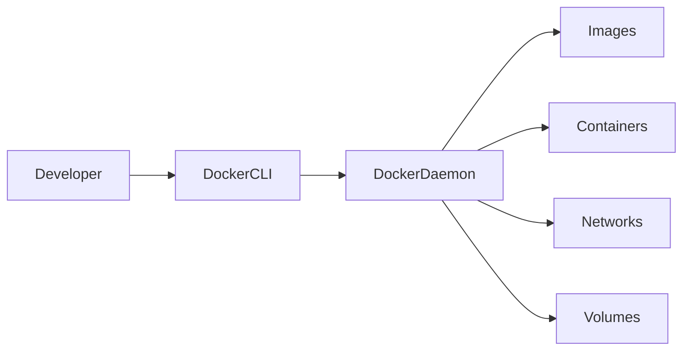
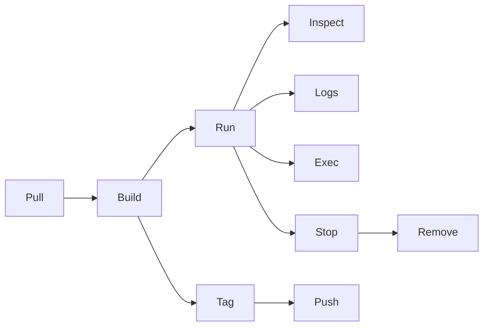

# Docker Commands (Must Know)

## Overview

Docker provides a rich set of CLI commands to manage the complete container lifecycle, including pulling images, creating containers, networking, storage, and image management.

These commands are among the **most frequently asked Docker interview topics** and are used daily by DevOps Engineers, Cloud Engineers, Platform Engineers, and SREs.

> **Interview Point**
>
> Every Docker command follows this syntax:
>
> ```bash
> docker <object> <command> [options]
> ```
>
> Example:
>
> ```bash
> docker container ls
> docker image pull nginx
> ```
>
> Docker also provides shorthand commands:
>
> ```bash
> docker ps
> docker pull
> docker run
> ```

---

## Why It Is Used

Docker commands help you:

- Build applications
- Create containers
- Deploy applications
- Manage storage
- Configure networking
- Troubleshoot issues
- Automate CI/CD pipelines

---

## Architecture / Working



---

## Key Components

| Component | Purpose |
|-----------|----------|
| Image Commands | Manage Docker Images |
| Container Commands | Manage Containers |
| Volume Commands | Manage Persistent Storage |
| Network Commands | Manage Networking |
| Compose Commands | Multi-container Applications |

---

## Types (if applicable)

Docker commands can be grouped into:

| Category | Examples |
|----------|----------|
| Image Management | pull, build, images, rmi |
| Container Management | run, ps, exec, logs, stop |
| Storage | volume |
| Networking | network |
| Multi-Container | compose |
| Registry | tag, push |

---

## Lifecycle / Workflow



---

## Configuration / Syntax (if applicable)

General syntax

```bash
docker <command> [OPTIONS]
```

Example

```bash
docker run -d -p 80:80 nginx
```

---

## Important Commands (if applicable)

# docker pull

## Overview

Downloads an image from a Docker Registry.

---

### Syntax

```bash
docker pull <image>
```

---

### Example

```bash
docker pull nginx
```

Specific version

```bash
docker pull nginx:1.27
```

---

### Common Options

| Option | Purpose |
|---------|----------|
| image:tag | Download a specific version |

---

### Real-World Use Cases

- Download base images
- Deploy applications
- Kubernetes node preparation

---

### Common Interview Questions

- What does `docker pull` do?
- Where does Docker pull images from?

---

# docker images

## Overview

Lists all locally available Docker Images.

---

### Syntax

```bash
docker images
```

---

### Example

```bash
docker images
```

---

### Sample Output

```text
REPOSITORY   TAG      IMAGE ID
nginx        latest   abc123
ubuntu       24.04    xyz456
```

---

### Useful Options

```bash
docker images -a
```

Show all images.

---

### Real-World Use Cases

- Verify downloaded images
- Check image versions

---

### Common Interview Questions

- How do you list local images?

---

# docker build

## Overview

Builds a Docker Image from a Dockerfile.

---

### Syntax

```bash
docker build -t image_name .
```

---

### Example

```bash
docker build -t myapp:v1 .
```

---

### Common Options

| Option | Purpose |
|---------|----------|
| -t | Tag image |
| -f | Specify Dockerfile |
| --no-cache | Ignore cache |

---

### Real-World Use Cases

- CI/CD image creation
- Application packaging

---

### Common Interview Questions

- What does `docker build` do?
- Why use the `-t` option?

---

# docker run

## Overview

Creates and starts a container.

---

### Syntax

```bash
docker run [OPTIONS] IMAGE
```

---

### Example

```bash
docker run nginx
```

Detached mode

```bash
docker run -d nginx
```

Port mapping

```bash
docker run -d -p 8080:80 nginx
```

Interactive mode

```bash
docker run -it ubuntu bash
```

---

### Common Options

| Option | Purpose |
|---------|----------|
| -d | Detached mode |
| -it | Interactive terminal |
| --name | Container name |
| -p | Port mapping |
| -v | Mount volume |
| -e | Environment variable |
| --restart | Restart policy |

---

### Real-World Use Cases

- Start web servers
- Database containers
- Development environments

---

### Common Interview Questions

- Difference between `docker run` and `docker start`?
- What does `-d` mean?
- What does `-it` mean?

---

# docker ps

## Overview

Lists containers.

---

### Syntax

```bash
docker ps
```

All containers

```bash
docker ps -a
```

---

### Real-World Use Cases

- Monitor running containers
- Check container status

---

### Common Interview Questions

- Difference between `docker ps` and `docker ps -a`?

---

# docker exec

## Overview

Executes commands inside a running container.

---

### Syntax

```bash
docker exec [OPTIONS] CONTAINER COMMAND
```

---

### Example

```bash
docker exec -it nginx bash
```

---

### Real-World Use Cases

- Troubleshooting
- Installing packages
- Checking logs

---

### Common Interview Questions

- Difference between `docker exec` and `docker run`?

---

# docker logs

## Overview

Displays container logs.

---

### Syntax

```bash
docker logs CONTAINER
```

---

### Example

```bash
docker logs nginx
```

Follow logs

```bash
docker logs -f nginx
```

---

### Common Interview Questions

- How do you troubleshoot container failures?

---

# docker inspect

## Overview

Displays detailed JSON information.

---

### Syntax

```bash
docker inspect container_name
```

---

### Information Available

- IP Address
- Mounts
- Networks
- Restart Policy
- Image ID

---

### Common Interview Questions

- What information does `docker inspect` provide?

---

# docker stop

## Overview

Gracefully stops a running container.

---

### Syntax

```bash
docker stop CONTAINER
```

---

### Example

```bash
docker stop nginx
```

---

### Common Interview Questions

- Difference between stop and kill?

---

# docker start

## Overview

Starts an existing stopped container.

---

### Syntax

```bash
docker start CONTAINER
```

---

### Example

```bash
docker start nginx
```

---

### Common Interview Questions

- Does `docker start` create a new container?

---

# docker restart

## Overview

Stops and starts a container.

---

### Syntax

```bash
docker restart CONTAINER
```

---

### Example

```bash
docker restart nginx
```

---

### Real-World Use Cases

- Restart web applications
- Apply configuration changes

---

# docker rm

## Overview

Removes containers.

---

### Syntax

```bash
docker rm CONTAINER
```

---

### Remove stopped container

```bash
docker rm nginx
```

Force removal

```bash
docker rm -f nginx
```

---

### Common Interview Questions

- Can you remove a running container?

---

# docker rmi

## Overview

Removes Docker Images.

---

### Syntax

```bash
docker rmi IMAGE
```

---

### Example

```bash
docker rmi nginx
```

---

### Common Interview Questions

- Difference between `docker rm` and `docker rmi`?

---

# docker volume

## Overview

Manages Docker Volumes.

---

### Common Commands

Create volume

```bash
docker volume create data
```

List

```bash
docker volume ls
```

Inspect

```bash
docker volume inspect data
```

Remove

```bash
docker volume rm data
```

---

### Real-World Use Cases

- Database persistence
- Application storage

---

### Common Interview Questions

- Why use Docker Volumes?

---

# docker network

## Overview

Manages Docker Networks.

---

### Common Commands

List

```bash
docker network ls
```

Create

```bash
docker network create app-network
```

Inspect

```bash
docker network inspect app-network
```

Remove

```bash
docker network rm app-network
```

---

### Common Interview Questions

- Why create custom Docker Networks?

---

# docker compose

## Overview

Runs multi-container applications.

---

### Common Commands

Start services

```bash
docker compose up
```

Detached mode

```bash
docker compose up -d
```

Stop

```bash
docker compose down
```

View logs

```bash
docker compose logs
```

Restart

```bash
docker compose restart
```

---

### Real-World Use Cases

- WordPress
- Microservices
- CI/CD testing

---

### Common Interview Questions

- Difference between Docker Compose and Docker Engine?

---

# docker tag

## Overview

Creates another name or version for an existing image.

---

### Syntax

```bash
docker tag SOURCE_IMAGE TARGET_IMAGE
```

---

### Example

```bash
docker tag myapp:v1 myrepo/myapp:v1
```

---

### Common Interview Questions

- Why tag images before pushing?

---

# docker push

## Overview

Uploads an image to a Docker Registry.

---

### Syntax

```bash
docker push username/myapp:v1
```

---

### Example

```bash
docker push akshay/myapp:v1
```

---

### Requirements

- Login required
- Image must be tagged correctly

---

### Common Interview Questions

- Why is image tagging required before pushing?

---

## Important Files (if applicable)

| File | Purpose |
|------|----------|
| Dockerfile | Builds Docker Images |
| docker-compose.yml | Multi-container application definition |
| `.dockerignore` | Excludes files from build context |
| `/etc/docker/daemon.json` | Docker daemon configuration |
| `~/.docker/config.json` | Docker client configuration and authentication |

---

## Real-World Use Cases

- CI/CD pipelines
- Kubernetes deployments
- Local development
- Containerized microservices
- Application packaging
- Production deployments

---

## Advantages

- Easy container management
- Fast deployments
- Automation friendly
- Consistent environments
- Simplified troubleshooting

---

## Limitations

- Commands require appropriate permissions
- Large images take longer to build and transfer
- Incorrect command usage can remove important resources

---

## Common Interview Questions (Concept Only)

- Difference between `docker run` and `docker start`?
- Difference between `docker stop` and `docker kill`?
- Difference between `docker rm` and `docker rmi`?
- Difference between `docker exec` and `docker attach`?
- Difference between `docker pull` and `docker push`?
- What does `docker inspect` return?
- How do you view container logs?
- How do you enter a running container?
- How do you persist container data?
- How do you build an image from a Dockerfile?
- What is the purpose of `docker tag`?
- How do you deploy multiple containers together?

---

## Common Mistakes

- Using `docker run` instead of `docker start` for an existing container
- Forgetting to map ports with `-p`
- Running containers without meaningful names
- Not mounting volumes for persistent data
- Pushing images without proper tags
- Forgetting to authenticate before pushing
- Removing images still referenced by containers
- Using the `latest` tag in production deployments

---

## Troubleshooting

| Problem | Solution |
|----------|----------|
| Image not found | Verify the image name, tag, and registry |
| Container exits immediately | Check logs using `docker logs` |
| Cannot remove image | Remove dependent containers first |
| Port already allocated | Use a different host port or stop the conflicting service |
| Push denied | Run `docker login` and verify repository permissions |
| Container not accessible | Check port mapping and container status |
| No shell available with `docker exec` | Use the shell available in the image (e.g., `sh` instead of `bash` for minimal images) |
| Disk space running low | Clean up unused images, containers, networks, and volumes with the appropriate prune commands |

---

## Summary

The Docker CLI is the primary interface for building, running, managing, troubleshooting, and distributing containerized applications. Mastering these commands is essential for DevOps Engineers, Cloud Engineers, Platform Engineers, and SREs, as they are used daily in development, CI/CD pipelines, and production environments. Understanding not only **how** to use each command but also **when** to use it is a common focus in technical interviews.
