# Pipeline Stages

## Overview

**Pipeline Stages** are the building blocks of a Jenkins Pipeline. They organize the CI/CD workflow into logical phases, making pipelines easier to read, maintain, debug, and monitor.

A Jenkins Pipeline is composed of several predefined blocks such as:

- `agent`
- `stages`
- `stage`
- `steps`
- `post`
- `environment`
- `parameters`

Each block has a specific purpose in controlling how and where the pipeline executes.

> **Interview Point**
>
> Every Declarative Pipeline must contain:
>
> - `pipeline`
> - `agent`
> - `stages`
> - At least one `stage`
> - `steps` inside every stage

---

## Why It Is Used

Pipeline stages help to:

- Organize CI/CD workflows
- Improve readability
- Execute tasks sequentially
- Isolate failures
- Simplify troubleshooting
- Reuse pipeline logic
- Display progress visually in Jenkins

---

## Architecture / Working

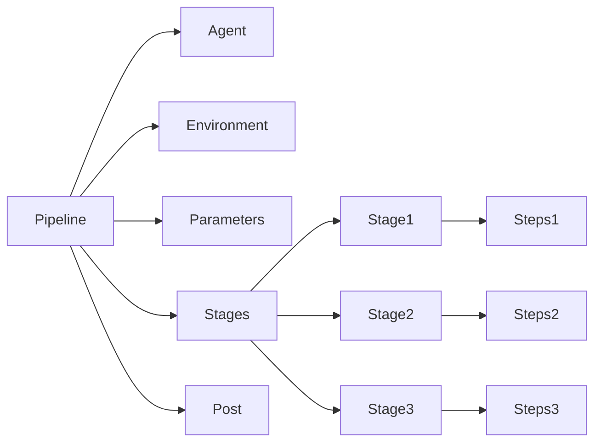

---

## Key Components

| Component | Purpose |
|------------|----------|
| `pipeline` | Root block of the Jenkins Pipeline |
| `agent` | Specifies where the pipeline executes |
| `stages` | Collection of all pipeline stages |
| `stage` | Logical phase of execution |
| `steps` | Commands executed inside a stage |
| `environment` | Defines environment variables |
| `parameters` | Accepts user input before execution |
| `post` | Executes actions after pipeline completion |

---

## Types (if applicable)

Pipeline blocks:

- Agent
- Stages
- Stage
- Steps
- Environment
- Parameters
- Post

---

## Lifecycle / Workflow

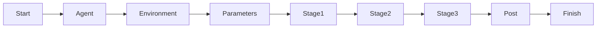

---

## Configuration / Syntax (if applicable)

Complete Pipeline Example

```groovy
pipeline {

    agent any

    environment {

        APP_NAME = "Demo"

    }

    parameters {

        string(
            name: 'VERSION',
            defaultValue: '1.0',
            description: 'Application Version'
        )

    }

    stages {

        stage('Build') {

            steps {

                echo "Building ${APP_NAME}"

            }

        }

        stage('Test') {

            steps {

                echo "Running Tests"

            }

        }

        stage('Deploy') {

            steps {

                echo "Deploy Version ${params.VERSION}"

            }

        }

    }

    post {

        always {

            echo "Pipeline Completed"

        }

    }

}
```

---

## Important Commands (if applicable)

Validate Jenkins Service

```bash
systemctl status jenkins
```

Restart Jenkins

```bash
systemctl restart jenkins
```

View Pipeline Logs

```bash
journalctl -u jenkins
```

---

## Important Files (if applicable)

| File | Purpose |
|------|----------|
| Jenkinsfile | Pipeline definition |
| config.xml | Job configuration |
| workspace | Pipeline workspace |
| Jenkins Home | Stores pipeline configuration |

---

## Real-World Use Cases

- Build applications
- Execute automated tests
- Docker image creation
- Kubernetes deployment
- Azure deployment
- AWS deployment
- Infrastructure provisioning
- Security scanning

---

## Advantages

- Structured pipeline
- Easy debugging
- Better visualization
- Supports CI/CD
- Easier maintenance
- Version controlled

---

## Limitations

- Large pipelines require proper organization
- Poor stage design reduces readability
- Incorrect stage dependencies increase execution time

---

## Common Interview Questions (Concept Only)

- What are Pipeline Stages?
- Why are stages important?
- What is the purpose of the `agent` block?
- Difference between `stage` and `steps`?
- What is the `post` block?
- What is the `environment` block?
- What are pipeline parameters?
- Can multiple stages run in parallel?

---

## Common Mistakes

- Putting all commands into a single stage
- Hardcoding environment variables
- Ignoring the `post` section
- Not using parameters for configurable builds
- Mixing Declarative and Scripted syntax incorrectly

---

## Troubleshooting

| Problem | Solution |
|----------|----------|
| Stage skipped | Verify conditions and pipeline logic |
| Pipeline syntax error | Validate Jenkinsfile syntax |
| Environment variable not found | Check `environment` block |
| Parameter not recognized | Verify parameter declaration |
| Post actions not executed | Check pipeline completion status |

---

## Summary

Pipeline Stages divide the CI/CD workflow into logical phases, making pipelines modular, readable, maintainable, and easier to troubleshoot. Understanding each pipeline block is essential for building production-ready Jenkins pipelines.

---

# agent

## Overview

The **agent** block specifies **where** a Jenkins Pipeline or stage executes.

It tells Jenkins which machine (node) or container should perform the pipeline tasks.

> **Interview Point**
>
> Without an agent, Jenkins has no execution environment for running the pipeline.

---

## Why It Is Used

The agent block:

- Selects the execution node
- Supports distributed builds
- Enables platform-specific execution
- Supports Docker and Kubernetes agents

---

## Architecture / Working

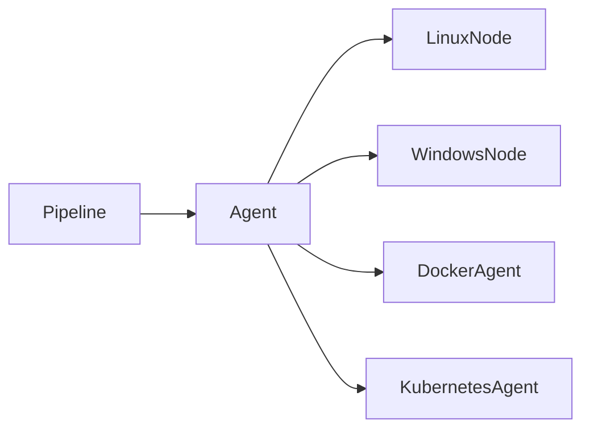

---

## Key Components

| Agent Type | Purpose |
|------------|----------|
| `any` | Any available agent |
| `none` | No global agent |
| `label` | Specific node label |
| `docker` | Docker container |
| `dockerfile` | Build from Dockerfile |

---

## Types (if applicable)

### Agent Any

```groovy
agent any
```

Uses any available Jenkins agent.

---

### Agent None

```groovy
agent none
```

Each stage must define its own agent.

---

### Label Agent

```groovy
agent {

    label 'linux'

}
```

Runs only on agents with the specified label.

---

### Docker Agent

```groovy
agent {

    docker {

        image 'maven:3.9'

    }

}
```

Runs inside a Docker container.

---

## Lifecycle / Workflow

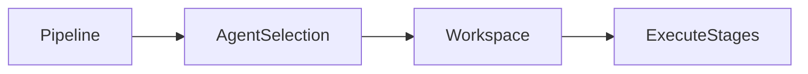

---

## Configuration / Syntax (if applicable)

Global Agent

```groovy
pipeline {

    agent any

}
```

Stage Agent

```groovy
stage('Build') {

    agent {

        label 'linux'

    }

}
```

---

## Important Commands (if applicable)

Not applicable.

---

## Important Files (if applicable)

```
Jenkinsfile
```

---

## Real-World Use Cases

- Linux builds
- Windows builds
- Docker builds
- Kubernetes builds

---

## Advantages

- Distributed execution
- Better scalability
- Platform flexibility

---

## Limitations

- Requires available agents
- Label configuration must be correct

---

## Common Interview Questions (Concept Only)

- What is an Agent?
- Difference between `any` and `none`?
- What are agent labels?
- Can every stage use a different agent?

---

## Common Mistakes

- Running everything on the controller
- Incorrect node labels
- Missing stage agent when using `agent none`

---

## Troubleshooting

| Problem | Solution |
|----------|----------|
| Job waiting for executor | Verify available agents |
| Label not found | Verify node labels |
| Agent offline | Check node connectivity |

---

## Summary

The `agent` block specifies the execution environment for a pipeline or stage and enables distributed, scalable builds.

---

# stages

## Overview

The `stages` block groups all pipeline stages together.

It acts as the parent container for every `stage`.

---

## Why It Is Used

- Organizes pipeline execution
- Improves readability
- Defines workflow order

---

## Architecture / Working

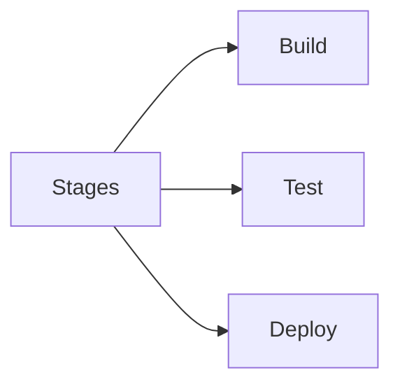

---

## Key Components

- Parent container
- Contains one or more stages

---

## Types (if applicable)

Not applicable.

---

## Lifecycle / Workflow

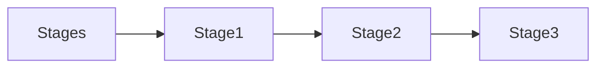

---

## Configuration / Syntax (if applicable)

```groovy
stages {

    stage('Build') {}

    stage('Test') {}

}
```

---

## Important Commands (if applicable)

Not applicable.

---

## Important Files (if applicable)

```
Jenkinsfile
```

---

## Real-World Use Cases

- Build
- Test
- Deploy

---

## Advantages

- Organized workflow
- Easy visualization

---

## Limitations

- Cannot contain executable commands directly

---

## Common Interview Questions (Concept Only)

- What is the purpose of `stages`?

---

## Common Mistakes

- Adding steps directly inside `stages`

---

## Troubleshooting

- Validate pipeline syntax

---

## Summary

The `stages` block groups all execution phases within the pipeline.

---

# stage

## Overview

A **stage** represents a logical phase in the CI/CD workflow.

Typical stages include:

- Checkout
- Build
- Test
- Package
- Deploy

---

## Why It Is Used

Stages divide large workflows into manageable sections.

---

## Architecture / Working

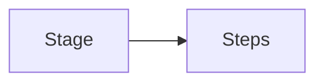

---

## Key Components

- Stage Name
- Steps
- Agent (optional)
- Conditions (optional)

---

## Types (if applicable)

Typical stages

- Build
- Test
- Deploy

---

## Lifecycle / Workflow

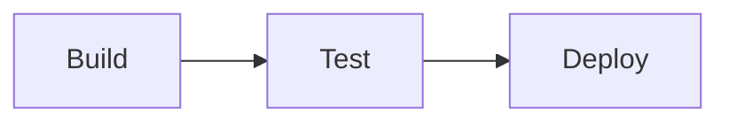

---

## Configuration / Syntax (if applicable)

```groovy
stage('Build') {

    steps {

        echo 'Building'

    }

}
```

---

## Important Commands (if applicable)

Not applicable.

---

## Important Files (if applicable)

```
Jenkinsfile
```

---

## Real-World Use Cases

- Application Build
- Docker Build
- Infrastructure Deployment

---

## Advantages

- Modular workflow
- Easier debugging

---

## Limitations

- Poor stage design reduces readability

---

## Common Interview Questions (Concept Only)

- What is a Stage?
- Why are stages important?

---

## Common Mistakes

- Large monolithic stages

---

## Troubleshooting

- Review stage logs

---

## Summary

Stages represent logical phases of a Jenkins Pipeline.

---

# steps

## Overview

The `steps` block contains the actual commands executed within a stage.

---

## Why It Is Used

It defines the work performed during a stage.

---

## Architecture / Working


---

## Key Components

- Shell commands
- Jenkins steps
- Plugin steps

---

## Types (if applicable)

Examples

- `echo`
- `sh`
- `bat`
- `checkout`

---

## Configuration / Syntax (if applicable)

```groovy
steps {

    echo "Hello"

    sh "mvn clean package"

}
```

---

## Real-World Use Cases

- Build code
- Run tests
- Execute scripts

---

## Advantages

- Flexible
- Easy to extend

---

## Limitations

- Only valid inside a stage

---

## Common Interview Questions (Concept Only)

- What is the purpose of `steps`?
- Can `steps` exist outside a stage?

---

## Common Mistakes

- Writing commands outside `steps`

---

## Troubleshooting

- Verify shell commands
- Review Console Output

---

## Summary

The `steps` block contains the executable tasks for each stage.

---

# post

## Overview

The `post` block defines actions executed **after pipeline or stage completion**, regardless of whether the pipeline succeeds or fails.

It is commonly used for cleanup, notifications, and artifact handling.

> **Interview Point**
>
> The `post` block is similar to a `finally` block in programming languages.

---

## Why It Is Used

- Send notifications
- Clean workspace
- Archive artifacts
- Publish reports
- Perform cleanup

---

## Architecture / Working

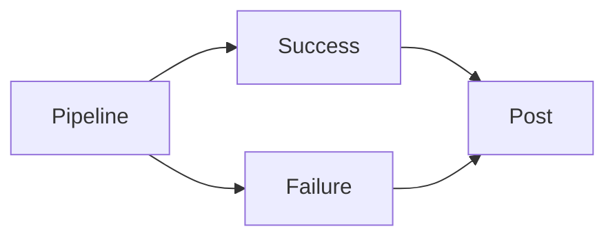

---

## Key Components

| Condition | Purpose |
|-----------|----------|
| always | Runs every time |
| success | Runs only on success |
| failure | Runs only on failure |
| unstable | Runs for unstable builds |
| cleanup | Cleanup tasks |

---

## Configuration / Syntax (if applicable)

```groovy
post {

    always {

        echo "Pipeline Finished"

    }

}
```

---

## Real-World Use Cases

- Slack notification
- Email notification
- Workspace cleanup
- Artifact publishing

---

## Advantages

- Reliable cleanup
- Centralized notifications

---

## Limitations

- Runs only after stage/pipeline completion

---

## Common Interview Questions (Concept Only)

- What is the `post` block?
- Difference between `always` and `success`?

---

## Common Mistakes

- Forgetting cleanup

---

## Troubleshooting

- Verify post condition

---

## Summary

The `post` block executes actions after pipeline completion for cleanup and notifications.

---

# environment

## Overview

The `environment` block defines environment variables available throughout the pipeline or a specific stage.

---

## Why It Is Used

- Store configuration values
- Avoid hardcoding
- Reuse variables

---

## Architecture / Working

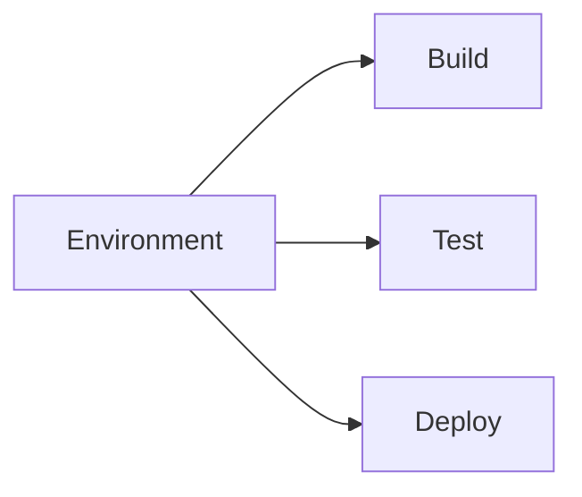

---

## Key Components

- Variables
- Credentials
- Configuration values

---

## Configuration / Syntax (if applicable)

```groovy
environment {

    APP_NAME = "demo"

}
```

---

## Real-World Use Cases

- Docker image names
- Azure subscription IDs
- Application names
- Build versions

---

## Advantages

- Centralized configuration
- Easy maintenance

---

## Limitations

- Not suitable for plaintext secrets

---

## Common Interview Questions (Concept Only)

- What is the `environment` block?
- Where should secrets be stored?

---

## Common Mistakes

- Hardcoding credentials

---

## Troubleshooting

- Verify variable names
- Check variable scope

---

## Summary

The `environment` block stores reusable variables for pipeline execution.

---

# parameters

## Overview

The `parameters` block allows users to provide input values before a pipeline starts.

Parameters make pipelines reusable and configurable.

---

## Why It Is Used

- Select environments
- Choose application versions
- Enable feature flags
- Control deployment options

---

## Architecture / Working

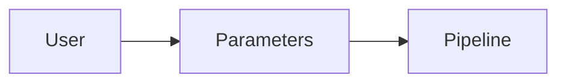

---

## Key Components

| Parameter Type | Purpose |
|---------------|----------|
| string | Text input |
| booleanParam | True/False |
| choice | Dropdown selection |
| password | Hidden input |
| text | Multi-line text |

---

## Configuration / Syntax (if applicable)

```groovy
parameters {

    choice(
        name: 'ENV',
        choices: ['Dev','QA','Prod'],
        description: 'Deployment Environment'
    )

}
```

Access Parameter

```groovy
echo "${params.ENV}"
```

---

## Real-World Use Cases

- Select deployment environment
- Select Docker image tag
- Enable rollback
- Choose release version

---

## Advantages

- Flexible pipelines
- Reusable jobs
- Reduces duplication

---

## Limitations

- Too many parameters complicate the user experience

---

## Common Interview Questions (Concept Only)

- What are pipeline parameters?
- How do you access parameter values?
- What parameter types are available?

---

## Common Mistakes

- Hardcoding values instead of using parameters
- Using unclear parameter names

---

## Troubleshooting

| Problem | Solution |
|----------|----------|
| Parameter missing | Verify declaration in the `parameters` block |
| Incorrect value | Validate parameter type and default value |

---

## Summary

The `parameters` block enables runtime user input, making Jenkins Pipelines flexible, reusable, and suitable for different deployment scenarios without modifying the Jenkinsfile.
