# Source Code Integration

## Overview

**Source Code Integration** is the process of connecting Jenkins with a Version Control System (VCS) such as Git or GitHub to automatically retrieve source code and trigger CI/CD pipelines.

Jenkins continuously integrates changes made by developers, builds the application, executes tests, and deploys the application if required.

> **Interview Point**
>
> Jenkins itself does not store source code. It always retrieves code from a Version Control System (Git, GitHub, Bitbucket, GitLab, Azure Repos, etc.).

---

## Why It Is Used

Source Code Integration enables Jenkins to:

- Automatically retrieve source code
- Trigger builds after code changes
- Support Continuous Integration (CI)
- Maintain version consistency
- Reduce manual deployment effort
- Improve collaboration among developers

---

## Architecture / Working

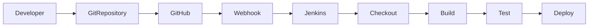

---

## Key Components

| Component | Purpose |
|------------|----------|
| Git Repository | Stores source code |
| Jenkins | CI/CD automation server |
| Git Plugin | Enables Git integration |
| Jenkinsfile | Pipeline definition |
| Webhook | Triggers Jenkins automatically |
| Poll SCM | Periodically checks repository for changes |
| Credentials | Authenticate repository access |

---

## Types (if applicable)

Common source code repositories supported by Jenkins:

- Git
- GitHub
- GitLab
- Bitbucket
- Azure Repos

---

## Lifecycle / Workflow

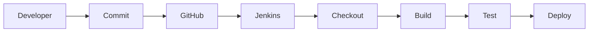

---

## Configuration / Syntax (if applicable)

Checkout Source Code

```groovy
pipeline {

    agent any

    stages {

        stage('Checkout') {

            steps {

                git url: 'https://github.com/company/demo.git',
                    branch: 'main'

            }

        }

    }

}
```

Using the Checkout Step

```groovy
checkout scm
```

---

## Important Commands (if applicable)

Clone Repository

```bash
git clone https://github.com/user/repository.git
```

View Current Branch

```bash
git branch
```

Verify Remote Repository

```bash
git remote -v
```

---

## Important Files (if applicable)

| File | Purpose |
|------|----------|
| Jenkinsfile | Pipeline definition |
| .git | Local Git metadata |
| config.xml | Jenkins job configuration |

---

## Real-World Use Cases

- Continuous Integration
- Automated testing
- Docker image builds
- Kubernetes deployments
- Infrastructure as Code
- Multi-branch pipelines

---

## Advantages

- Automated builds
- Continuous Integration
- Faster feedback
- Reduced manual effort
- Easy collaboration
- Version-controlled pipelines

---

## Limitations

- Requires proper repository access
- Build depends on repository availability
- Incorrect credentials stop pipeline execution

---

## Common Interview Questions (Concept Only)

- What is Source Code Integration?
- Why does Jenkins require a Git repository?
- How does Jenkins retrieve source code?
- Which repositories can Jenkins integrate with?
- What is repository checkout?

---

## Common Mistakes

- Incorrect repository URL
- Missing Git credentials
- Wrong branch selection
- Hardcoding repository credentials
- Forgetting to install Git plugin

---

## Troubleshooting

| Problem | Solution |
|----------|----------|
| Repository not found | Verify repository URL |
| Authentication failed | Check Git credentials |
| Branch not found | Verify branch name |
| Checkout failed | Verify Git installation |
| Permission denied | Check SSH keys or PAT |

---

## Summary

Source Code Integration connects Jenkins to version control systems, enabling automated checkout, builds, testing, and deployments whenever developers push new code.

---

# Git Integration

## Overview

**Git Integration** allows Jenkins to connect directly with Git repositories for source code retrieval and build automation.

Git is the most commonly used Version Control System in Jenkins environments.

> **Interview Point**
>
> Jenkins uses the **Git Plugin** to communicate with Git repositories.

---

## Why It Is Used

Git Integration allows Jenkins to:

- Clone repositories
- Checkout branches
- Detect code changes
- Trigger builds
- Maintain version history

---

## Architecture / Working

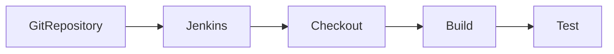

---

## Key Components

| Component | Purpose |
|------------|----------|
| Git Plugin | Connects Jenkins to Git |
| Git Repository | Stores source code |
| Branch | Source code version |
| Credentials | Authentication |
| Workspace | Local checkout location |

---

## Types (if applicable)

Repository Access Methods

- HTTPS
- SSH

---

## Lifecycle / Workflow

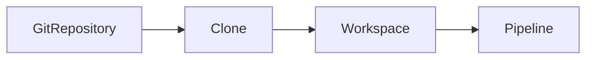

---

## Configuration / Syntax (if applicable)

Declarative Pipeline

```groovy
pipeline {

    agent any

    stages {

        stage('Checkout') {

            steps {

                git branch: 'main',
                    url: 'https://github.com/company/app.git'

            }

        }

    }

}
```

---

## Important Commands (if applicable)

```bash
git clone
git pull
git fetch
git branch
git checkout
```

---

## Important Files (if applicable)

```
.git
Jenkinsfile
```

---

## Real-World Use Cases

- Java projects
- Python applications
- Node.js applications
- Infrastructure repositories

---

## Advantages

- Version control
- Easy integration
- Supports branching
- Reliable automation

---

## Limitations

- Requires Git installation
- Requires repository permissions

---

## Common Interview Questions (Concept Only)

- How does Jenkins integrate with Git?
- Which plugin enables Git integration?
- Difference between HTTPS and SSH integration?

---

## Common Mistakes

- Missing Git plugin
- Wrong repository URL
- Invalid credentials

---

## Troubleshooting

| Problem | Solution |
|----------|----------|
| Git executable not found | Install Git on Jenkins node |
| Clone failed | Verify repository URL |
| Authentication failed | Check SSH key or PAT |

---

## Summary

Git Integration enables Jenkins to retrieve source code directly from Git repositories and is the foundation of most Jenkins pipelines.

---

# GitHub Integration

## Overview

**GitHub Integration** connects Jenkins with GitHub repositories to automatically build, test, and deploy applications whenever code changes occur.

GitHub integration typically uses:

- Git Plugin
- GitHub Plugin
- GitHub Webhooks

---

## Why It Is Used

- Automatic build triggers
- Pull Request validation
- CI/CD automation
- Branch builds

---

## Architecture / Working

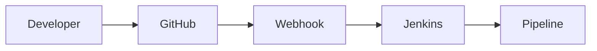

---

## Key Components

| Component | Purpose |
|------------|----------|
| GitHub Repository | Stores code |
| GitHub Webhook | Build trigger |
| Jenkins GitHub Plugin | Integration |
| Personal Access Token | Authentication |

---

## Types (if applicable)

Authentication

- HTTPS + PAT
- SSH Keys

---

## Lifecycle / Workflow

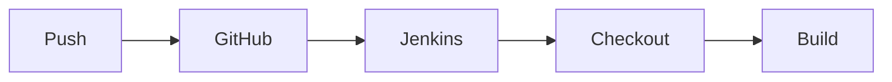

---

## Configuration / Syntax (if applicable)

Repository URL

```
https://github.com/company/project.git
```

---

## Important Commands (if applicable)

```bash
git push
git pull
git clone
```

---

## Important Files (if applicable)

```
Jenkinsfile
```

---

## Real-World Use Cases

- GitHub Actions alternative
- Enterprise CI/CD
- Pull Request validation

---

## Advantages

- Automatic pipeline execution
- Supports Webhooks
- Easy integration

---

## Limitations

- Requires GitHub access
- Webhook configuration required

---

## Common Interview Questions (Concept Only)

- How does Jenkins integrate with GitHub?
- What is a GitHub Webhook?
- Why use Personal Access Tokens?

---

## Common Mistakes

- Invalid Webhook URL
- Missing repository permissions

---

## Troubleshooting

| Problem | Solution |
|----------|----------|
| Webhook not received | Verify Webhook configuration |
| Authentication failed | Check PAT or SSH key |
| Pipeline not triggered | Verify trigger settings |

---

## Summary

GitHub Integration enables Jenkins to automatically build and deploy applications based on GitHub repository events.

---

# Repository Checkout

## Overview

**Repository Checkout** is the process of downloading the required source code from a Git repository into the Jenkins workspace before executing pipeline stages.

It is typically the first stage of a Jenkins Pipeline.

---

## Why It Is Used

- Retrieve latest code
- Build correct version
- Execute tests
- Deploy selected branch

---

## Architecture / Working

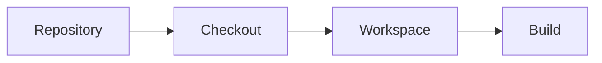

---

## Key Components

| Component | Purpose |
|------------|----------|
| Repository | Source code |
| Workspace | Local copy |
| Branch | Selected version |

---

## Types (if applicable)

- Full checkout
- Branch checkout
- Tag checkout

---

## Lifecycle / Workflow

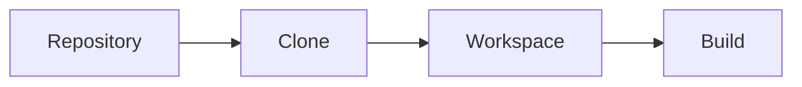

---

## Configuration / Syntax (if applicable)

```groovy
steps {

    checkout scm

}
```

or

```groovy
steps {

    git url: 'https://github.com/company/app.git'

}
```

---

## Important Commands (if applicable)

```bash
git clone
git checkout
git fetch
```

---

## Important Files (if applicable)

```
Workspace
.git
```

---

## Real-World Use Cases

- CI builds
- Release builds
- Feature branch builds

---

## Advantages

- Retrieves latest code
- Supports branches
- Supports tags

---

## Limitations

- Repository access required

---

## Common Interview Questions (Concept Only)

- What is repository checkout?
- What is `checkout scm`?

---

## Common Mistakes

- Wrong branch selection
- Incorrect repository URL

---

## Troubleshooting

- Verify credentials
- Verify workspace

---

## Summary

Repository Checkout downloads source code into the Jenkins workspace before the pipeline begins execution.

---

# Webhooks

## Overview

A **Webhook** is an HTTP callback sent from GitHub (or another Git server) to Jenkins whenever a repository event occurs.

Instead of Jenkins continuously checking the repository, GitHub immediately notifies Jenkins about new changes.

> **Interview Point**
>
> **Webhooks are event-driven**, making them faster and more efficient than Poll SCM.

---

## Why It Is Used

- Instant build triggering
- Faster CI/CD
- Reduced server load
- Event-driven automation

---

## Architecture / Working

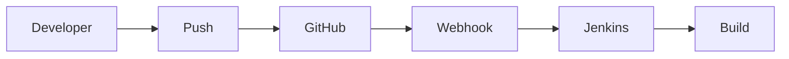

---

## Key Components

| Component | Purpose |
|------------|----------|
| GitHub | Sends event |
| Webhook URL | Jenkins endpoint |
| Jenkins | Receives notification |

---

## Types (if applicable)

Common Events

- Push
- Pull Request
- Tag Creation
- Release

---

## Lifecycle / Workflow

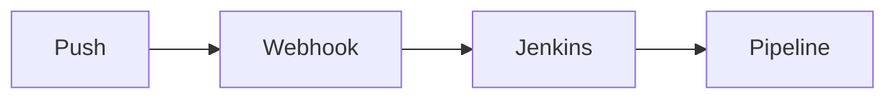

---

## Configuration / Syntax (if applicable)

Typical Webhook URL

```
http://jenkins-server/github-webhook/
```

---

## Important Commands (if applicable)

Not applicable.

---

## Important Files (if applicable)

None

---

## Real-World Use Cases

- Automatic builds
- Pull Request validation
- Continuous Delivery

---

## Advantages

- Immediate execution
- Efficient
- Event-driven

---

## Limitations

- Requires network connectivity
- Webhook URL must be reachable

---

## Common Interview Questions (Concept Only)

- What is a Webhook?
- Why are Webhooks preferred over Poll SCM?
- Which GitHub events trigger Jenkins?

---

## Common Mistakes

- Incorrect Webhook URL
- Firewall blocking requests
- Missing GitHub trigger configuration

---

## Troubleshooting

| Problem | Solution |
|----------|----------|
| Webhook not received | Verify GitHub delivery logs |
| HTTP 404 | Check Jenkins Webhook endpoint |
| Build not triggered | Verify trigger configuration |

---

## Summary

Webhooks provide real-time notifications from GitHub to Jenkins, enabling immediate pipeline execution after repository events.

---

# Poll SCM

## Overview

**Poll SCM** is a Jenkins build trigger that periodically checks the source code repository for changes.

If changes are detected, Jenkins starts a new build.

Unlike Webhooks, Jenkins initiates the check instead of the repository notifying Jenkins.

> **Interview Point**
>
> Poll SCM is useful when Webhooks cannot be configured, but it consumes more resources because Jenkins repeatedly polls the repository.

---

## Why It Is Used

- Detect repository changes
- Trigger automated builds
- Alternative to Webhooks
- Works with repositories that do not support Webhooks

---

## Architecture / Working

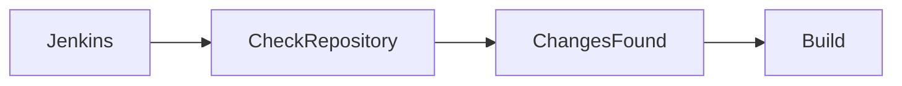

---

## Key Components

| Component | Purpose |
|------------|----------|
| Jenkins Scheduler | Periodic polling |
| Git Repository | Source code |
| Cron Expression | Polling schedule |

---

## Types (if applicable)

Example schedules

| Schedule | Meaning |
|-----------|---------|
| `* * * * *` | Every minute |
| `H/5 * * * *` | Every 5 minutes (hashed) |
| `H/15 * * * *` | Every 15 minutes |

---

## Lifecycle / Workflow

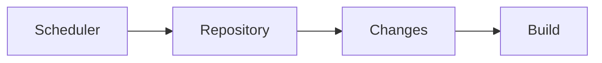

---

## Configuration / Syntax (if applicable)

Example Poll SCM Schedule

```
H/5 * * * *
```

This checks the repository approximately every five minutes.

---

## Important Commands (if applicable)

Not applicable.

---

## Important Files (if applicable)

```
config.xml
```

---

## Real-World Use Cases

- Legacy Git servers
- Internal repositories
- Air-gapped environments
- Systems without Webhook support

---

## Advantages

- Easy to configure
- No external connectivity required
- Works with almost any Git server

---

## Limitations

- Increased server load
- Delayed build triggering
- Less efficient than Webhooks

---

## Common Interview Questions (Concept Only)

- What is Poll SCM?
- How does Poll SCM work?
- Difference between Poll SCM and Webhooks?
- Which one is preferred in production?

---

## Common Mistakes

- Polling too frequently
- Using Poll SCM when Webhooks are available
- Incorrect cron expressions

---

## Troubleshooting

| Problem | Solution |
|----------|----------|
| Build not triggered | Verify Poll SCM schedule |
| Repository not checked | Verify Git configuration |
| High Jenkins CPU usage | Reduce polling frequency or use Webhooks |

---

## Summary

Poll SCM periodically checks the repository for changes and triggers builds when updates are detected. While reliable, it is generally less efficient than Webhooks and is mainly used when event-driven triggers are unavailable.
