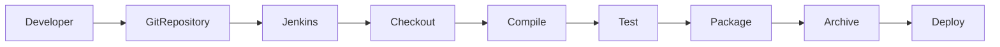
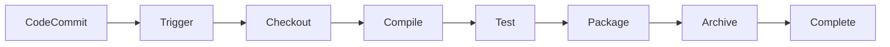
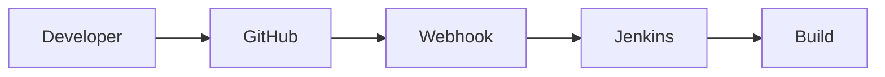
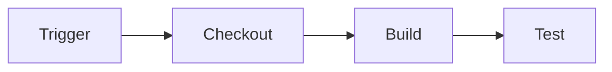
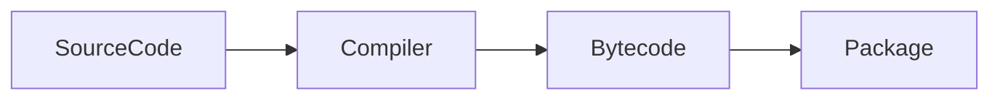
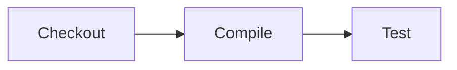
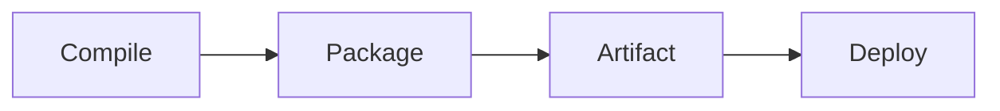
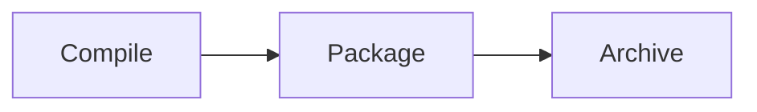
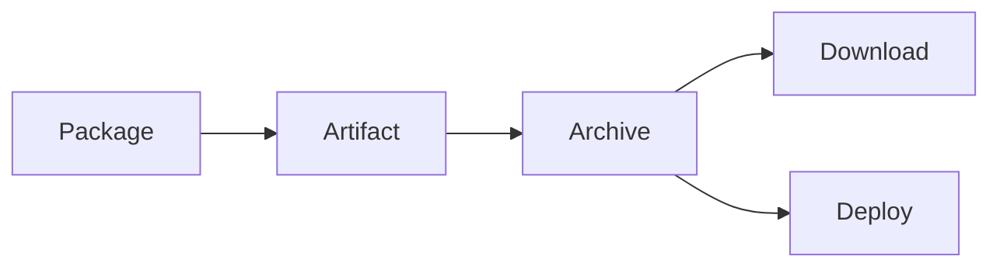
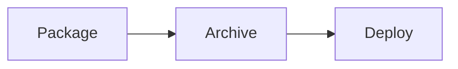

# Build Automation

## Overview

**Build Automation** is the process of automatically compiling, testing, packaging, and preparing an application for deployment without manual intervention.

In Jenkins, Build Automation is implemented using **Jobs** or **Pipelines**, which execute predefined steps whenever a build is triggered.

A typical automated build includes:

- Checkout source code
- Install dependencies
- Compile application
- Run tests
- Package application
- Archive artifacts
- Publish reports
- Deploy (optional)

> **Interview Point**
>
> Build Automation is one of the primary responsibilities of Jenkins and is the foundation of Continuous Integration (CI).

---

## Why It Is Used

Build Automation helps organizations:

- Eliminate manual build processes
- Ensure consistent builds
- Detect issues early
- Reduce human errors
- Improve software quality
- Enable Continuous Integration
- Speed up software delivery

---

## Architecture / Working



---

## Key Components

| Component | Purpose |
|------------|----------|
| Source Code Repository | Stores application code |
| Jenkins Pipeline | Automates the build process |
| Build Agent | Executes build tasks |
| Build Tool | Maven, Gradle, npm, etc. |
| Artifact | Output generated by the build |
| Artifact Repository | Stores build artifacts |

---

## Types (if applicable)

Common Build Types

- Java (Maven, Gradle)
- .NET (MSBuild)
- Node.js (npm)
- Python (pip)
- Go
- Docker Build

---

## Lifecycle / Workflow



---

## Configuration / Syntax (if applicable)

Example Pipeline

```groovy
pipeline {

    agent any

    stages {

        stage('Checkout') {

            steps {

                git url: 'https://github.com/company/app.git'

            }

        }

        stage('Build') {

            steps {

                sh 'mvn clean package'

            }

        }

        stage('Archive') {

            steps {

                archiveArtifacts artifacts: 'target/*.jar'

            }

        }

    }

}
```

---

## Important Commands (if applicable)

Java Build

```bash
mvn clean package
```

Gradle Build

```bash
gradle build
```

Node.js

```bash
npm install
npm run build
```

.NET

```bash
dotnet build
```

---

## Important Files (if applicable)

| File | Purpose |
|------|----------|
| Jenkinsfile | Pipeline definition |
| pom.xml | Maven configuration |
| build.gradle | Gradle configuration |
| package.json | Node.js project configuration |

---

## Real-World Use Cases

- CI Pipelines
- Docker image creation
- Microservice builds
- Infrastructure automation
- Automated testing
- Enterprise software delivery

---

## Advantages

- Fast builds
- Consistent execution
- Reduced manual work
- Easy troubleshooting
- Supports CI/CD
- Improves software quality

---

## Limitations

- Requires proper pipeline design
- Build failures stop downstream stages
- Build tools must be installed on agents

---

## Common Interview Questions (Concept Only)

- What is Build Automation?
- Why is Build Automation important?
- How does Jenkins automate builds?
- What are the stages of a build pipeline?
- What is the difference between Build Automation and Deployment Automation?

---

## Common Mistakes

- Building on the Jenkins Controller
- Hardcoding paths
- Ignoring failed tests
- Not archiving artifacts
- Mixing build and deployment logic

---

## Troubleshooting

| Problem | Solution |
|----------|----------|
| Build fails | Review Console Output |
| Build tool missing | Install required tool |
| Dependency download failure | Verify internet access and repositories |
| Workspace issues | Clean workspace |
| Build timeout | Increase timeout or optimize build |

---

## Summary

Build Automation enables Jenkins to automatically compile, test, package, and prepare applications for deployment, making software delivery faster, more reliable, and repeatable.

---

# Build Triggers

## Overview

A **Build Trigger** determines **when** Jenkins starts a build.

Instead of manually clicking **Build Now**, Jenkins can automatically execute jobs based on predefined events or schedules.

> **Interview Point**
>
> In production, **Webhooks** are the preferred trigger mechanism because they provide immediate, event-driven builds. **Poll SCM** is typically used only when Webhooks cannot be configured.

---

## Why It Is Used

Build Triggers help to:

- Automatically start builds
- Enable Continuous Integration
- Reduce manual effort
- Detect code changes quickly
- Automate software delivery

---

## Architecture / Working



---

## Key Components

| Component | Purpose |
|------------|----------|
| Jenkins Job | Executes build |
| Trigger | Starts build |
| Git Repository | Source code |
| Scheduler | Time-based execution |
| Webhook | Event-based execution |

---

## Types (if applicable)

| Trigger | Description |
|----------|-------------|
| Manual Build | User starts build manually |
| GitHub Webhook | Triggered after code push |
| Poll SCM | Jenkins periodically checks repository |
| Scheduled Build | Cron-based execution |
| Upstream Build | Triggered after another job |

---

## Lifecycle / Workflow



---

## Configuration / Syntax (if applicable)

Example Poll SCM

```
H/5 * * * *
```

Webhook

```
http://jenkins-server/github-webhook/
```

---

## Important Commands (if applicable)

Not applicable.

---

## Important Files (if applicable)

```
config.xml
```

---

## Real-World Use Cases

- CI Pipelines
- Nightly Builds
- Release Builds
- Automated Testing

---

## Advantages

- Automatic execution
- Supports CI
- Reduces manual work

---

## Limitations

- Incorrect trigger configuration prevents builds
- Poll SCM consumes more resources than Webhooks

---

## Common Interview Questions (Concept Only)

- What is a Build Trigger?
- Difference between Webhook and Poll SCM?
- Which trigger is recommended for production?
- What is a Scheduled Build?

---

## Common Mistakes

- Polling too frequently
- Invalid Webhook configuration
- Missing repository permissions

---

## Troubleshooting

| Problem | Solution |
|----------|----------|
| Trigger not working | Verify trigger configuration |
| Build not starting | Check repository access |
| Poll SCM not detecting changes | Verify polling schedule |

---

## Summary

Build Triggers determine when Jenkins starts a build, with Webhooks providing the most efficient event-driven automation.

---

# Compile Application

## Overview

**Compilation** is the process of converting source code into executable code or intermediate bytecode.

For compiled languages like Java, C#, and Go, this stage detects syntax errors before packaging.

> **Interview Point**
>
> Not every language requires compilation. Java, C#, Go, and C/C++ are compiled, while Python and JavaScript are interpreted.

---

## Why It Is Used

- Detect syntax errors
- Generate executable code
- Validate project structure
- Prepare for packaging

---

## Architecture / Working



---

## Key Components

| Component | Purpose |
|------------|----------|
| Source Code | Input |
| Compiler | Converts code |
| Build Tool | Executes compilation |
| Output | Bytecode or executable |

---

## Types (if applicable)

Common Build Tools

- Maven
- Gradle
- MSBuild
- Go Build

---

## Lifecycle / Workflow



---

## Configuration / Syntax (if applicable)

Maven

```bash
mvn compile
```

Gradle

```bash
gradle compileJava
```

.NET

```bash
dotnet build
```

---

## Important Commands (if applicable)

```bash
mvn compile
gradle build
dotnet build
go build
```

---

## Important Files (if applicable)

```
pom.xml
build.gradle
```

---

## Real-World Use Cases

- Java applications
- Spring Boot
- Microservices
- Enterprise software

---

## Advantages

- Early error detection
- Validates source code
- Produces executable output

---

## Limitations

- Language dependent
- Requires build tools

---

## Common Interview Questions (Concept Only)

- What happens during compilation?
- Which languages require compilation?
- Difference between compile and package?

---

## Common Mistakes

- Missing dependencies
- Wrong JDK version
- Incorrect compiler configuration

---

## Troubleshooting

| Problem | Solution |
|----------|----------|
| Compilation failed | Review compiler output |
| Missing dependency | Verify dependency repository |
| Unsupported Java version | Install correct JDK |

---

## Summary

Compilation converts source code into executable or intermediate code and is one of the first quality checks during CI.

---

# Package Application

## Overview

Packaging is the process of bundling compiled code and required resources into a deployable artifact.

Common package formats include:

- JAR
- WAR
- ZIP
- TAR
- DLL
- Docker Image

> **Interview Point**
>
> **Compile** creates executable code, while **Package** creates a deployable artifact.

---

## Why It Is Used

- Create deployable artifacts
- Bundle dependencies
- Prepare for deployment
- Enable artifact versioning

---

## Architecture / Working



---

## Key Components

| Component | Purpose |
|------------|----------|
| Compiled Code | Input |
| Build Tool | Packages application |
| Artifact | Deployment package |

---

## Types (if applicable)

- JAR
- WAR
- ZIP
- Docker Image

---

## Lifecycle / Workflow



---

## Configuration / Syntax (if applicable)

Maven

```bash
mvn package
```

Gradle

```bash
gradle build
```

---

## Important Commands (if applicable)

```bash
mvn package
gradle build
```

---

## Important Files (if applicable)

```
pom.xml
build.gradle
```

---

## Real-World Use Cases

- Java deployment
- Spring Boot
- Containerization

---

## Advantages

- Standard deployment format
- Easy distribution
- Version controlled

---

## Limitations

- Depends on successful compilation

---

## Common Interview Questions (Concept Only)

- What is packaging?
- Difference between compile and package?
- What is a JAR file?

---

## Common Mistakes

- Packaging before tests
- Missing dependencies
- Incorrect packaging type

---

## Troubleshooting

| Problem | Solution |
|----------|----------|
| Package failed | Verify compile stage |
| Missing artifact | Check output directory |

---

## Summary

Packaging creates deployable artifacts that are later stored, distributed, and deployed.

---

# Archive Artifacts

## Overview

**Artifact Archiving** is the process of storing build outputs generated during the pipeline so they can be downloaded, deployed, or reused later.

Examples include:

- JAR files
- WAR files
- ZIP archives
- Reports
- Test results

> **Interview Point**
>
> Archived artifacts are stored by Jenkins. They are different from publishing artifacts to repositories like Nexus or Artifactory.

---

## Why It Is Used

- Preserve build outputs
- Enable deployments
- Share build artifacts
- Support rollback
- Maintain build history

---

## Architecture / Working



---

## Key Components

| Component | Purpose |
|------------|----------|
| Artifact | Build output |
| Jenkins Archive | Stores artifacts |
| Workspace | Source location |

---

## Types (if applicable)

Common archived files

- JAR
- WAR
- ZIP
- HTML Reports
- XML Reports

---

## Lifecycle / Workflow



---

## Configuration / Syntax (if applicable)

```groovy
archiveArtifacts artifacts: 'target/*.jar'
```

Archive Multiple Files

```groovy
archiveArtifacts artifacts: '**/*.zip'
```

---

## Important Commands (if applicable)

Not applicable.

---

## Important Files (if applicable)

```
target/
build/
workspace/
```

---

## Real-World Use Cases

- Store JAR files
- Download build outputs
- Archive test reports
- Deploy production artifacts

---

## Advantages

- Artifact history
- Easy downloads
- Supports deployments
- Enables rollback

---

## Limitations

- Consumes Jenkins storage
- Not intended as a long-term artifact repository

---

## Common Interview Questions (Concept Only)

- What is Artifact Archiving?
- Difference between Archive Artifacts and Artifact Repository?
- Why archive artifacts?
- What file types are commonly archived?

---

## Common Mistakes

- Archiving the wrong path
- Archiving unnecessary large files
- Forgetting to archive deployment artifacts

---

## Troubleshooting

| Problem | Solution |
|----------|----------|
| Artifact missing | Verify output directory |
| Archive step failed | Check file pattern |
| No artifacts found | Ensure build completed successfully |

---

## Summary

Artifact Archiving stores build outputs generated during the pipeline, making them available for download, deployment, auditing, and rollback. In production environments, archived artifacts are often published to dedicated artifact repositories such as Nexus or Artifactory for long-term storage and distribution.
