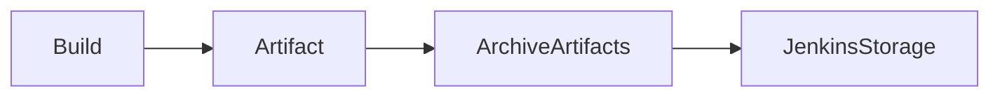
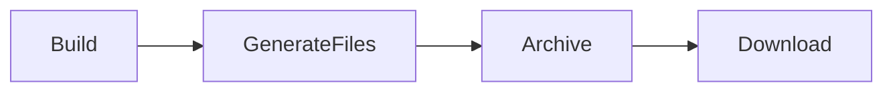
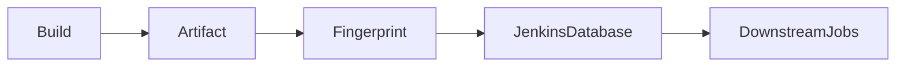
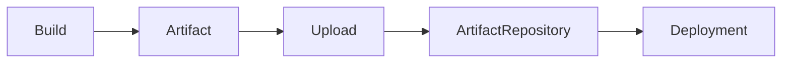
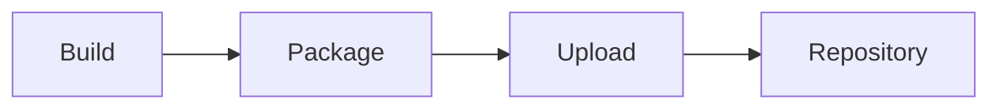
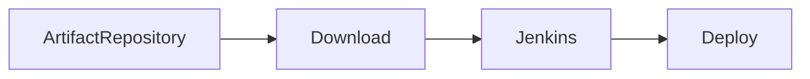

# Artifact Management

## Overview

**Artifact Management** is the process of storing, tracking, sharing, and retrieving build outputs (artifacts) generated during a Jenkins pipeline.

Artifacts are the deployable files created after a successful build, such as:

- JAR files
- WAR files
- ZIP packages
- Docker image metadata
- Configuration files
- Reports
- Static website files

Instead of rebuilding the application for every deployment, Jenkins stores the generated artifacts so they can be deployed across multiple environments.

> **Interview Point**
>
> **Source Code is the input of a build, while Artifacts are the output of a build.**

---

## Why It Is Used

Artifact Management helps to:

- Store build outputs
- Reuse the same build for multiple deployments
- Maintain build consistency
- Enable rollback to previous versions
- Share build outputs across pipeline stages
- Improve deployment reliability

---

## Architecture / Working


---

## Key Components

| Component | Purpose |
|------------|----------|
| Jenkins Build | Produces artifacts |
| Artifact | Build output |
| Archive | Stores artifacts in Jenkins |
| Artifact Repository | Long-term artifact storage |
| Deployment Pipeline | Downloads artifacts for deployment |

---

## Types (if applicable)

Common Artifact Types

| Artifact | Example |
|-----------|----------|
| Java Package | JAR |
| Enterprise Package | WAR |
| Compressed Package | ZIP |
| Static Website | HTML/CSS/JS |
| Reports | XML, HTML |
| Configuration Files | YAML, JSON |

---

## Lifecycle / Workflow


---

## Configuration / Syntax (if applicable)

Archive Artifacts

```groovy
pipeline {

    agent any

    stages {

        stage('Build') {

            steps {

                sh 'mvn package'

            }

        }

    }

    post {

        success {

            archiveArtifacts artifacts: 'target/*.jar'

        }

    }

}
```

---

## Important Commands (if applicable)

Artifact management is primarily handled through Jenkins Pipeline steps.

Example

```groovy
archiveArtifacts artifacts: 'target/*.jar'
```

Archive Multiple Files

```groovy
archiveArtifacts artifacts: '**/*.zip'
```

Allow Empty Archive

```groovy
archiveArtifacts artifacts: '**/*.jar', allowEmptyArchive: true
```

---

## Important Files (if applicable)

| File | Purpose |
|------|----------|
| Jenkinsfile | Pipeline definition |
| target/ | Maven build output |
| build/ | Gradle build output |
| dist/ | Frontend build output |

---

## Real-World Use Cases

- Archive Java JAR files
- Store WAR files
- Publish static websites
- Store deployment packages
- Archive test reports
- Reuse builds across Dev, QA, and Production

---

## Advantages

- Prevents rebuilding the same application
- Enables consistent deployments
- Supports rollback
- Preserves build history
- Improves deployment efficiency

---

## Limitations

- Consumes Jenkins storage
- Not suitable for long-term artifact management
- Large artifacts increase disk usage

---

## Common Interview Questions (Concept Only)

- What is an artifact?
- Why archive artifacts?
- What types of files are artifacts?
- Where are archived artifacts stored?
- Difference between artifacts and source code?

---

## Common Mistakes

- Forgetting to archive artifacts
- Using incorrect file paths
- Archiving unnecessary files
- Storing extremely large artifacts in Jenkins

---

## Troubleshooting

| Problem | Solution |
|----------|----------|
| Artifact not found | Verify artifact path |
| Empty archive | Check build output directory |
| Missing build output | Confirm build completed successfully |
| Storage full | Remove old builds or use external repository |

---

## Summary

Artifact Management enables Jenkins to store build outputs so they can be reused for deployments, testing, and rollback without rebuilding the application.

---

# Archive Artifacts

## Overview

**Archive Artifacts** is a Jenkins feature that stores files generated during a build so they remain available after the build finishes.

Archived artifacts can be:

- Downloaded manually
- Used by downstream jobs
- Shared with deployment pipelines
- Preserved for future reference

> **Interview Point**
>
> Archiving stores artifacts inside Jenkins. It does **not** publish them to external repositories like Nexus or Artifactory.

---

## Why It Is Used

Archive Artifacts helps to:

- Preserve build outputs
- Share files between jobs
- Enable deployments
- Maintain historical builds
- Avoid rebuilding applications

---

## Architecture / Working



---

## Key Components

| Component | Purpose |
|------------|----------|
| Build Output | Generated files |
| Archive Step | Saves artifacts |
| Jenkins Storage | Stores archived files |
| Build History | Links artifacts to builds |

---

## Types (if applicable)

Typical Archived Files

- JAR
- WAR
- ZIP
- Reports
- Logs
- Configuration files

---

## Lifecycle / Workflow



---

## Configuration / Syntax (if applicable)

Archive Single File

```groovy
archiveArtifacts artifacts: 'target/app.jar'
```

Archive Multiple Files

```groovy
archiveArtifacts artifacts: '**/*.jar'
```

---

## Important Commands (if applicable)

```groovy
archiveArtifacts artifacts: '**/*.jar'
```

---

## Important Files (if applicable)

| File | Purpose |
|------|----------|
| Jenkinsfile | Pipeline |
| target/ | Build output |
| build/ | Gradle output |

---

## Real-World Use Cases

- Archive Spring Boot JAR
- Archive WAR files
- Archive reports
- Archive static website

---

## Advantages

- Easy access
- Build history
- Supports downstream jobs
- Simplifies deployment

---

## Limitations

- Limited storage
- Not a replacement for artifact repositories

---

## Common Interview Questions (Concept Only)

- What is Archive Artifacts?
- Why archive build outputs?
- Can archived artifacts be downloaded?
- Where are archived artifacts stored?

---

## Common Mistakes

- Incorrect archive path
- Forgetting wildcard usage
- Archiving temporary files

---

## Troubleshooting

| Problem | Solution |
|----------|----------|
| Nothing archived | Verify file path |
| Missing artifact | Ensure build created the file |
| Download unavailable | Confirm archive step executed |

---

## Summary

Archive Artifacts stores build outputs within Jenkins for future download, deployment, or reuse.

---

# Fingerprints

## Overview

**Fingerprints** are unique identifiers (hashes) generated by Jenkins to track artifacts across multiple jobs and pipelines.

Instead of storing duplicate files, Jenkins calculates a fingerprint (typically an MD5 hash) for each artifact to identify and trace it throughout the CI/CD workflow.

Fingerprints help answer questions like:

- Which build produced this artifact?
- Which deployment used this artifact?
- Which downstream jobs consumed this artifact?

> **Interview Point**
>
> Fingerprints provide **traceability**, not artifact storage.

---

## Why It Is Used

Fingerprints help to:

- Track artifacts
- Maintain build traceability
- Identify artifact usage
- Improve auditing
- Support compliance

---

## Architecture / Working



---

## Key Components

| Component | Purpose |
|------------|----------|
| Artifact | File being tracked |
| Fingerprint | Unique hash |
| Jenkins Database | Stores fingerprint metadata |
| Build History | Tracks artifact usage |

---

## Types (if applicable)

Not Applicable

---

## Lifecycle / Workflow


---

## Configuration / Syntax (if applicable)

Generate Fingerprints

```groovy
fingerprint 'target/*.jar'
```

Archive with Fingerprints

```groovy
archiveArtifacts artifacts: 'target/*.jar', fingerprint: true
```

---

## Important Commands (if applicable)

```groovy
fingerprint 'target/*.jar'
```

---

## Important Files (if applicable)

Artifact files

Example

```
target/app.jar
```

---

## Real-World Use Cases

- Compliance audits
- Artifact traceability
- Multi-job pipelines
- Enterprise software delivery

---

## Advantages

- Build traceability
- Easy auditing
- Tracks artifact usage
- Supports enterprise compliance

---

## Limitations

- Does not store artifacts
- Slight metadata overhead

---

## Common Interview Questions (Concept Only)

- What are Jenkins Fingerprints?
- Why use fingerprints?
- Do fingerprints store artifacts?
- How do fingerprints improve traceability?

---

## Common Mistakes

- Confusing fingerprints with archived artifacts
- Not enabling fingerprint generation

---

## Troubleshooting

| Problem | Solution |
|----------|----------|
| Fingerprints missing | Enable fingerprint option |
| Artifact not tracked | Verify artifact path |

---

## Summary

Fingerprints uniquely identify artifacts and allow Jenkins to track where they were produced and consumed across multiple jobs.

---

# Artifact Upload

## Overview

**Artifact Upload** is the process of transferring build artifacts from Jenkins to an external artifact repository or storage system after a successful build.

Unlike archiving, uploading stores artifacts in a dedicated repository designed for long-term storage and version management.

Common artifact repositories include:

- Nexus Repository
- JFrog Artifactory
- Azure Artifacts
- AWS S3
- Google Cloud Storage

> **Interview Point**
>
> Jenkins archives artifacts locally, while artifact repositories provide centralized, scalable, and versioned storage.

---

## Why It Is Used

Artifact Upload helps to:

- Centralize artifact storage
- Enable deployments across environments
- Maintain version history
- Improve collaboration
- Support rollback

---

## Architecture / Working



---

## Key Components

| Component | Purpose |
|------------|----------|
| Jenkins | Produces artifact |
| Artifact | Build output |
| Repository | Stores artifacts |
| Credentials | Secure authentication |

---

## Types (if applicable)

Popular Artifact Repositories

| Repository | Usage |
|------------|-------|
| Nexus | Enterprise artifact management |
| Artifactory | Universal repository |
| Azure Artifacts | Azure DevOps |
| AWS S3 | Cloud storage |

---

## Lifecycle / Workflow



---

## Configuration / Syntax (if applicable)

Example Pipeline

```groovy
stage('Upload') {

    steps {

        echo 'Upload artifact to repository'

    }

}
```

Actual upload depends on the repository plugin or CLI being used.

---

## Important Commands (if applicable)

Repository-specific commands or plugins are commonly used.

---

## Important Files (if applicable)

| File | Purpose |
|------|----------|
| Jenkinsfile | Pipeline |
| Build Artifact | Upload target |

---

## Real-World Use Cases

- Publish Maven artifacts
- Store Docker images
- Release packages
- Enterprise software distribution

---

## Advantages

- Centralized storage
- Version control
- High availability
- Team collaboration

---

## Limitations

- Requires repository infrastructure
- Additional authentication setup

---

## Common Interview Questions (Concept Only)

- What is Artifact Upload?
- Why use Nexus instead of Jenkins archive?
- Why upload artifacts after every successful build?

---

## Common Mistakes

- Uploading failed builds
- Incorrect repository credentials
- Uploading duplicate versions

---

## Troubleshooting

| Problem | Solution |
|----------|----------|
| Upload failed | Verify credentials |
| Repository unreachable | Check network connectivity |
| Permission denied | Verify repository access rights |

---

## Summary

Artifact Upload transfers build outputs from Jenkins to external repositories for long-term storage, versioning, and deployment.

---

# Artifact Download

## Overview

**Artifact Download** is the process of retrieving previously stored artifacts from Jenkins archives or external artifact repositories for deployment, testing, or rollback.

Rather than rebuilding an application, deployment pipelines download an existing artifact that has already been tested and approved.

> **Interview Point**
>
> A core DevOps principle is **"Build Once, Deploy Many."** Artifact download supports this principle by reusing the same build across Development, QA, Staging, and Production.

---

## Why It Is Used

Artifact Download helps to:

- Reuse approved builds
- Enable rollback
- Ensure deployment consistency
- Reduce build time
- Support multi-environment deployments

---

## Architecture / Working



---

## Key Components

| Component | Purpose |
|------------|----------|
| Repository | Stores artifacts |
| Jenkins | Downloads artifacts |
| Deployment Pipeline | Deploys artifact |

---

## Types (if applicable)

Download Sources

- Jenkins Archive
- Nexus
- Artifactory
- Azure Artifacts
- AWS S3

---

## Lifecycle / Workflow


---

## Configuration / Syntax (if applicable)

Example Pipeline

```groovy
stage('Download') {

    steps {

        echo 'Download artifact'

    }

}
```

The implementation depends on the repository integration being used.

---

## Important Commands (if applicable)

Repository-specific CLI or Jenkins plugins are typically used.

---

## Important Files (if applicable)

Previously uploaded artifacts

Example

```
app-1.0.jar
```

---

## Real-World Use Cases

- Production deployment
- Disaster recovery
- Rollback
- Blue-Green deployment
- Release promotion

---

## Advantages

- Eliminates unnecessary rebuilds
- Ensures deployment consistency
- Supports rapid rollback
- Faster deployments

---

## Limitations

- Requires reliable artifact repository
- Version management is essential

---

## Common Interview Questions (Concept Only)

- Why download artifacts instead of rebuilding?
- What is "Build Once, Deploy Many"?
- Where are artifacts downloaded from?
- How do deployments use downloaded artifacts?

---

## Common Mistakes

- Downloading incorrect artifact versions
- Not verifying artifact integrity
- Missing repository credentials

---

## Troubleshooting

| Problem | Solution |
|----------|----------|
| Artifact not found | Verify version and repository path |
| Authentication failed | Check credentials |
| Download timeout | Verify repository availability |

---

## Summary

Artifact Download retrieves previously built and tested artifacts for deployment, ensuring consistent releases and supporting efficient rollback strategies without rebuilding the application.
