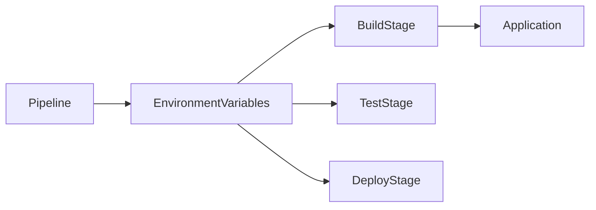
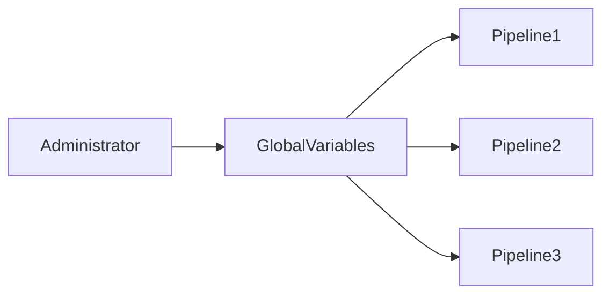
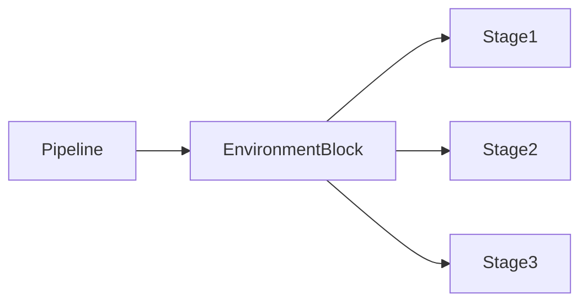

# Environment Variables

## Overview

**Environment Variables** are key-value pairs used to store configuration values that Jenkins pipelines and build jobs can access during execution.

They help make pipelines **dynamic**, **reusable**, and **environment-independent** by avoiding hardcoded values.

Common examples include:

- Build number
- Workspace path
- Git branch
- Java home
- Application environment
- Credentials (securely injected)

> **Interview Point**
>
> Environment variables exist **only during pipeline execution**. They are temporary and are recreated for every build.

---

## Why It Is Used

Environment Variables help to:

- Avoid hardcoding configuration values
- Reuse pipelines across environments
- Pass values between pipeline stages
- Store build metadata
- Configure tools and applications
- Inject credentials securely

---

## Architecture / Working



---

## Key Components

| Component | Purpose |
|-----------|----------|
| Global Variables | Available throughout Jenkins |
| Pipeline Variables | Defined inside Jenkinsfile |
| Build Variables | Automatically generated by Jenkins |
| Parameters | User-provided values |
| Credentials | Secure variables |

---

## Types (if applicable)

| Type | Scope |
|------|-------|
| Global Variables | Entire Jenkins instance |
| Pipeline Environment Variables | Current pipeline |
| Build Variables | Current build |
| Parameters | Current build |
| Credentials Variables | Current pipeline execution |

---

## Lifecycle / Workflow


---

## Configuration / Syntax (if applicable)

Declarative Pipeline

```groovy
pipeline {

    agent any

    environment {

        APP_ENV = 'Production'
        VERSION = '1.0'

    }

    stages {

        stage('Build') {

            steps {

                sh 'echo $APP_ENV'

            }

        }

    }

}
```

Scripted Pipeline

```groovy
node {

    env.APP_ENV = "Development"

    sh 'echo $APP_ENV'

}
```

---

## Important Commands (if applicable)

Display Environment Variables

```bash
printenv
```

```bash
env
```

Echo Variable

```bash
echo $BUILD_NUMBER
```

---

## Important Files (if applicable)

| File | Purpose |
|------|----------|
| Jenkinsfile | Defines pipeline variables |

---

## Real-World Use Cases

- Deploy to Dev, QA, or Production
- Configure Docker image tags
- Pass application versions
- Configure cloud deployments
- Inject credentials
- Configure build paths

---

## Advantages

- Improves pipeline reusability
- Eliminates hardcoded values
- Easy configuration management
- Supports dynamic pipelines
- Simple to maintain

---

## Limitations

- Variables exist only during execution
- Incorrect scope can cause unexpected behavior
- Sensitive values should use Jenkins Credentials instead of plain variables

---

## Common Interview Questions (Concept Only)

- What are Jenkins Environment Variables?
- Why are environment variables used?
- Where can environment variables be defined?
- How are environment variables accessed?
- Can credentials be stored as environment variables?

---

## Common Mistakes

- Hardcoding sensitive information
- Using incorrect variable names
- Overwriting built-in variables
- Assuming variables persist across builds

---

## Troubleshooting

| Problem | Solution |
|----------|----------|
| Variable not found | Verify scope and spelling |
| Variable empty | Ensure it is initialized before use |
| Wrong value | Check variable precedence |
| Credential missing | Verify Credential ID |

---

## Summary

Environment Variables provide temporary configuration values that make Jenkins pipelines flexible, reusable, and suitable for deploying applications across multiple environments.

---

# Global Variables

## Overview

**Global Variables** are variables that are available to all Jenkins jobs or pipelines across the Jenkins instance.

They are typically configured by administrators and provide common configuration values that multiple pipelines can use.

Examples include:

- JAVA_HOME
- MAVEN_HOME
- PATH
- Shared environment settings
- Global tool locations

> **Interview Point**
>
> Global Variables are configured once and reused across multiple pipelines, reducing duplication.

---

## Why It Is Used

Global Variables help to:

- Standardize configurations
- Share common values
- Reduce pipeline duplication
- Simplify maintenance
- Configure global tools

---

## Architecture / Working



---

## Key Components

| Component | Purpose |
|-----------|----------|
| Jenkins Configuration | Stores variables |
| Pipelines | Consume variables |
| Global Tool Configuration | Defines tool paths |

---

## Types (if applicable)

Common Global Variables

| Variable | Purpose |
|-----------|----------|
| JAVA_HOME | Java installation |
| PATH | Executable search path |
| MAVEN_HOME | Maven installation |
| GRADLE_HOME | Gradle installation |

---

## Lifecycle / Workflow


---

## Configuration / Syntax (if applicable)

Example

```groovy
echo env.JAVA_HOME
```

---

## Important Commands (if applicable)

```bash
printenv
```

---

## Important Files (if applicable)

Managed through Jenkins Global Configuration.

---

## Real-World Use Cases

- Java installations
- Maven installations
- Docker paths
- Shared configuration

---

## Advantages

- Centralized configuration
- Easy maintenance
- Consistent builds

---

## Limitations

- Requires administrator access
- Changes affect all pipelines

---

## Common Interview Questions (Concept Only)

- What are Global Variables?
- Where are they configured?
- Why use Global Variables?

---

## Common Mistakes

- Overwriting global values
- Using environment-specific values globally

---

## Troubleshooting

| Problem | Solution |
|----------|----------|
| Variable unavailable | Verify Jenkins configuration |
| Incorrect value | Review global settings |

---

## Summary

Global Variables provide centralized configuration values that can be reused across all Jenkins pipelines.

---

# Pipeline Environment Variables

## Overview

**Pipeline Environment Variables** are variables defined inside a Jenkinsfile that are available during the execution of a specific pipeline.

Unlike Global Variables, Pipeline Variables are isolated to a single pipeline.

> **Interview Point**
>
> Pipeline Environment Variables are the most commonly used variables in Declarative Pipelines.

---

## Why It Is Used

They help to:

- Configure pipeline behavior
- Define application settings
- Store temporary values
- Improve pipeline readability

---

## Architecture / Working



---

## Key Components

| Component | Purpose |
|-----------|----------|
| environment block | Defines variables |
| Pipeline | Uses variables |
| Stages | Access variables |

---

## Types (if applicable)

Scope

- Pipeline Level
- Stage Level

---

## Lifecycle / Workflow


---

## Configuration / Syntax (if applicable)

Pipeline-Level

```groovy
environment {

    APP_NAME = "Inventory"

}
```

Stage-Level

```groovy
stage('Build') {

    environment {

        BUILD_ENV = "QA"

    }

}
```

---

## Important Commands (if applicable)

Not Applicable

---

## Important Files (if applicable)

Jenkinsfile

---

## Real-World Use Cases

- Environment selection
- Docker image tags
- Version numbers
- Deployment configuration

---

## Advantages

- Easy to define
- Pipeline-specific
- Improves readability

---

## Limitations

- Limited to pipeline scope
- Recreated for every build

---

## Common Interview Questions (Concept Only)

- What is the environment block?
- What is the scope of pipeline variables?
- Difference between Global Variables and Pipeline Variables?

---

## Common Mistakes

- Incorrect variable scope
- Variable redefinition

---

## Troubleshooting

| Problem | Solution |
|----------|----------|
| Variable unavailable | Verify scope |
| Variable overwritten | Check stage-level definitions |

---

## Summary

Pipeline Environment Variables provide temporary configuration values that are specific to a single Jenkins pipeline.

---

# Parameters

## Overview

**Parameters** allow users to provide input values before starting a Jenkins build.

Instead of modifying the Jenkinsfile, users can choose values at build time.

Examples include:

- Environment
- Branch name
- Version
- Docker image tag
- Feature flags

> **Interview Point**
>
> Parameters make Jenkins pipelines **interactive** and **reusable**.

---

## Why It Is Used

Parameters help to:

- Deploy to different environments
- Build different branches
- Select application versions
- Trigger manual releases
- Customize pipeline execution

---

## Architecture / Working


---

## Key Components

| Component | Purpose |
|-----------|----------|
| Parameter | User input |
| Jenkins UI | Accepts values |
| Pipeline | Uses parameter |

---

## Types (if applicable)

Common Parameter Types

| Type | Purpose |
|------|----------|
| String | Text value |
| Boolean | True/False |
| Choice | Dropdown |
| Password | Secure input |
| Text | Multi-line input |

---

## Lifecycle / Workflow


---

## Configuration / Syntax (if applicable)

```groovy
parameters {

    choice(
        name: 'ENV',
        choices: ['Dev','QA','Prod']
    )

}
```

Using Parameter

```groovy
echo "${params.ENV}"
```

---

## Important Commands (if applicable)

Not Applicable

---

## Important Files (if applicable)

Jenkinsfile

---

## Real-World Use Cases

- Deployment selection
- Release version
- Build options
- Feature toggles

---

## Advantages

- Flexible builds
- User-friendly
- Reusable pipelines

---

## Limitations

- Manual input required
- Incorrect values may cause failures

---

## Common Interview Questions (Concept Only)

- What are Jenkins Parameters?
- What parameter types are available?
- How are parameters accessed?

---

## Common Mistakes

- Invalid parameter names
- Missing default values

---

## Troubleshooting

| Problem | Solution |
|----------|----------|
| Parameter missing | Verify Jenkinsfile |
| Invalid value | Validate user input |

---

## Summary

Parameters allow users to customize Jenkins builds without modifying the pipeline code.

---

# Build Variables

## Overview

**Build Variables** are predefined environment variables automatically generated by Jenkins for every build.

They provide information about the current build, workspace, job, branch, executor, and source code.

Common Build Variables include:

- BUILD_NUMBER
- BUILD_ID
- BUILD_URL
- JOB_NAME
- WORKSPACE
- NODE_NAME
- BUILD_TAG
- GIT_BRANCH
- GIT_COMMIT

> **Interview Point**
>
> Build Variables are automatically created by Jenkins—you do **not** need to define them manually.

---

## Why It Is Used

Build Variables help to:

- Identify the current build
- Access workspace paths
- Tag Docker images
- Generate reports
- Log build information
- Automate deployments

---

## Architecture / Working


---

## Key Components

| Variable | Purpose |
|-----------|----------|
| BUILD_NUMBER | Current build number |
| JOB_NAME | Job name |
| WORKSPACE | Workspace directory |
| BUILD_URL | Build URL |
| NODE_NAME | Build agent |
| GIT_BRANCH | Git branch |
| GIT_COMMIT | Commit hash |

---

## Types (if applicable)

Examples

| Variable | Description |
|-----------|-------------|
| BUILD_NUMBER | Sequential build ID |
| BUILD_ID | Build identifier |
| BUILD_TAG | Unique build tag |
| EXECUTOR_NUMBER | Jenkins executor |
| WORKSPACE | Build workspace |

---

## Lifecycle / Workflow


---

## Configuration / Syntax (if applicable)

Display Build Number

```groovy
echo env.BUILD_NUMBER
```

Display Workspace

```groovy
echo env.WORKSPACE
```

Display Job Name

```groovy
echo env.JOB_NAME
```

---

## Important Commands (if applicable)

List Environment Variables

```bash
printenv
```

---

## Important Files (if applicable)

Not Applicable

---

## Real-World Use Cases

- Docker image tagging
- Deployment logging
- Build auditing
- Release management
- Report generation

---

## Advantages

- Automatically available
- No configuration required
- Useful for automation
- Consistent across builds

---

## Limitations

- Values exist only during build execution
- Some variables depend on installed plugins (e.g., Git plugin)

---

## Common Interview Questions (Concept Only)

- What are Build Variables?
- Name some commonly used Jenkins Build Variables.
- How do you access BUILD_NUMBER?
- Difference between Build Variables and Environment Variables?
- What is WORKSPACE?

---

## Common Mistakes

- Assuming Build Variables persist after the build
- Overwriting predefined variables
- Using plugin-specific variables without the required plugin

---

## Troubleshooting

| Problem | Solution |
|----------|----------|
| Variable empty | Verify required plugin is installed |
| Variable not recognized | Check correct variable name and scope |
| Unexpected value | Confirm the build context (agent, branch, job) |

---

## Summary

Build Variables are automatically generated by Jenkins and provide essential metadata about the current build, such as build number, workspace, job name, and Git information. They are widely used for automation, logging, artifact naming, and deployment workflows.
