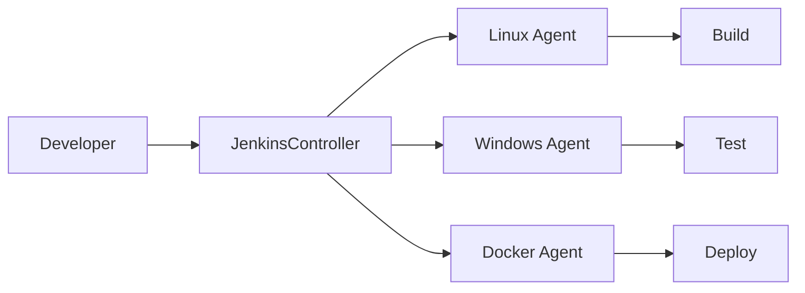
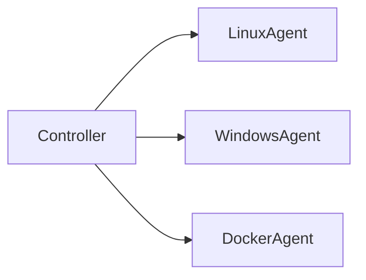
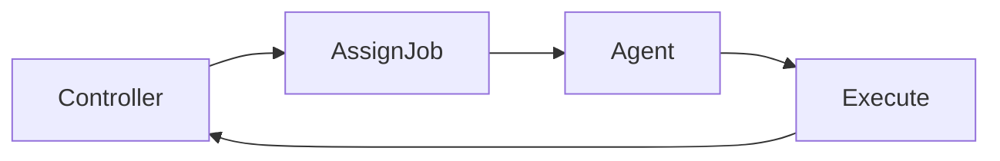
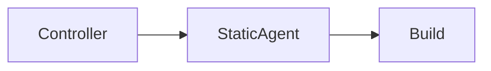
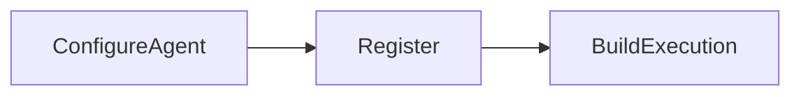
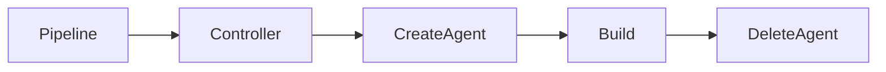
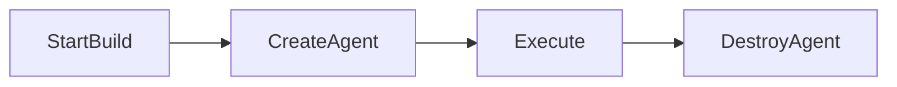
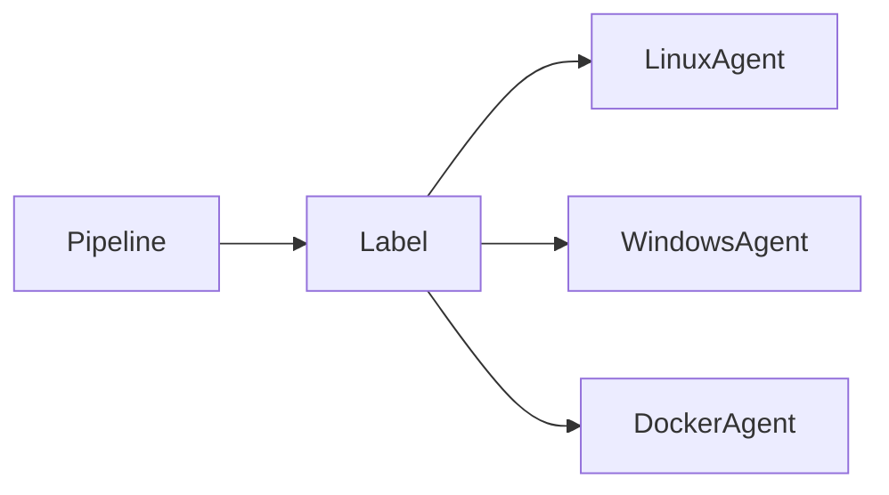
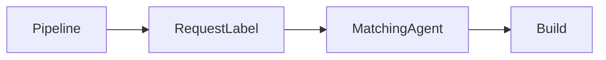

# Jenkins Agents

## Overview

**Jenkins Agents** (formerly called **Slave Nodes**) are machines that execute Jenkins jobs on behalf of the Jenkins Controller.

Instead of running every build on the Jenkins Controller, Jenkins distributes workloads to one or more agents. This improves scalability, performance, and resource utilization.

An agent can be:

- A physical server
- A virtual machine (VM)
- A Docker container
- A Kubernetes Pod
- A cloud VM (AWS EC2, Azure VM, GCP VM)

> **Interview Point**
>
> In modern Jenkins versions, the term **Agent** replaces the older term **Slave**.

---

## Why It Is Used

Jenkins Agents help to:

- Distribute build workloads
- Improve Jenkins performance
- Execute builds on different operating systems
- Isolate build environments
- Scale CI/CD pipelines
- Run multiple jobs in parallel

---

## Architecture / Working



### Working Process

1. Developer triggers a build.
2. Jenkins Controller schedules the job.
3. Controller selects a suitable Agent.
4. Source code is copied to the Agent.
5. Agent executes the build.
6. Results are returned to the Controller.
7. Controller displays logs and artifacts.

---

## Key Components

| Component | Purpose |
|-----------|----------|
| Jenkins Controller | Schedules and manages builds |
| Jenkins Agent | Executes jobs |
| Workspace | Directory where builds execute |
| Labels | Select the appropriate agent |
| Executor | Number of concurrent jobs an agent can run |

---

## Types (if applicable)

| Agent Type | Description |
|------------|-------------|
| Built-in Node | Controller executes jobs (not recommended for production) |
| Static Agent | Permanently configured machine |
| Dynamic Agent | Created only when required |
| Docker Agent | Container used as build machine |
| Kubernetes Agent | Pod created dynamically |
| Cloud Agent | VM launched from cloud providers |

---

## Lifecycle / Workflow


---

## Configuration / Syntax (if applicable)

Run pipeline on any available agent

```groovy
pipeline {

    agent any

}
```

Run pipeline on a specific agent

```groovy
pipeline {

    agent {

        label 'linux'

    }

}
```

Run on a Docker Agent

```groovy
pipeline {

    agent {

        docker {

            image 'maven:3.9'

        }

    }

}
```

---

## Important Commands (if applicable)

Restart Jenkins Agent Service (Linux)

```bash
sudo systemctl restart jenkins
```

Check Java Version (required for agent)

```bash
java -version
```

View Agent Workspace

```bash
pwd
```

---

## Important Files (if applicable)

| File | Purpose |
|------|----------|
| Jenkinsfile | Specifies the agent |
| agent.jar | Java agent used to connect to Controller |
| remoting.jar | Jenkins communication library |

---

## Real-World Use Cases

- Separate Linux and Windows builds
- Run Docker builds
- Execute Kubernetes deployments
- Mobile application builds
- Parallel testing
- Cloud-based build infrastructure

---

## Advantages

- Scalable architecture
- Parallel job execution
- Better resource utilization
- Environment isolation
- Faster pipeline execution
- Supports multiple operating systems

---

## Limitations

- Additional infrastructure required
- Network dependency between Controller and Agents
- Agent maintenance required
- Java must be installed on agents

---

## Common Interview Questions (Concept Only)

- What is a Jenkins Agent?
- Why are Agents required?
- Can Jenkins work without Agents?
- What are Executors?
- How does Jenkins select an Agent?

---

## Common Mistakes

- Running all jobs on Controller
- Using incorrect agent labels
- Forgetting to install Java
- Low disk space on agents
- Offline agents

---

## Troubleshooting

| Problem | Solution |
|----------|----------|
| Agent Offline | Verify network connectivity and Java process |
| Build stuck in queue | Check available executors and labels |
| Workspace errors | Clean workspace and retry |
| Agent disconnected | Restart agent service |
| Permission denied | Verify user permissions |

---

## Summary

Jenkins Agents execute build jobs assigned by the Jenkins Controller, enabling scalable, parallel, and distributed CI/CD pipelines across multiple machines and environments.

---

# Controller vs Agent

## Overview

The **Jenkins Controller** manages Jenkins, while **Agents** execute build jobs.

The Controller is the "brain" of Jenkins, whereas Agents provide the computing resources needed to run builds.

> **Interview Point**
>
> A production Jenkins setup should execute builds on Agents rather than on the Controller.

---

## Why It Is Used

Separating the Controller from Agents helps to:

- Improve scalability
- Prevent Controller overload
- Support multiple operating systems
- Isolate builds
- Increase reliability

---

## Architecture / Working



---

## Key Components

| Controller | Agent |
|------------|-------|
| Schedules jobs | Executes jobs |
| Stores configuration | Runs builds |
| Maintains plugins | Uses installed tools |
| Manages pipelines | Returns logs |

---

## Types (if applicable)

Not Applicable

---

## Lifecycle / Workflow



---

## Configuration / Syntax (if applicable)

Run on any agent

```groovy
agent any
```

Run on Linux agent

```groovy
agent {

    label 'linux'

}
```

---

## Important Commands (if applicable)

Not Applicable

---

## Important Files (if applicable)

| File | Purpose |
|------|----------|
| Jenkinsfile | Specifies build agent |

---

## Real-World Use Cases

- Linux builds
- Windows builds
- Kubernetes deployment
- Docker builds

---

## Advantages

- Better scalability
- Improved security
- Efficient resource usage

---

## Limitations

- Requires additional infrastructure
- Network dependency

---

## Common Interview Questions (Concept Only)

- Difference between Controller and Agent?
- Why avoid building on Controller?
- What does the Controller manage?

---

## Common Mistakes

- Using Controller for all builds
- No backup Controller

---

## Troubleshooting

| Problem | Solution |
|----------|----------|
| Controller overloaded | Move jobs to agents |
| Agent unavailable | Configure additional agents |

---

## Summary

The Controller manages Jenkins, while Agents perform the actual build execution.

---

# Static Agents

## Overview

A **Static Agent** is a permanently configured build machine that remains registered with Jenkins until it is manually removed.

These are commonly physical servers, virtual machines, or dedicated cloud VMs.

> **Interview Point**
>
> Static Agents are ideal for predictable workloads and long-running build environments.

---

## Why It Is Used

Static Agents help to:

- Provide dedicated build environments
- Support persistent tools
- Execute long-running builds
- Improve stability

---

## Architecture / Working



---

## Key Components

| Component | Purpose |
|-----------|----------|
| Permanent machine | Executes jobs |
| Labels | Job selection |
| Executors | Concurrent jobs |

---

## Types (if applicable)

Examples

- Linux VM
- Windows VM
- Physical Server

---

## Lifecycle / Workflow



---

## Configuration / Syntax (if applicable)

```groovy
agent {

    label 'linux-static'

}
```

---

## Important Commands (if applicable)

Check Java

```bash
java -version
```

---

## Important Files (if applicable)

agent.jar

---

## Real-World Use Cases

- Java builds
- Windows application builds
- Database testing

---

## Advantages

- Stable
- Persistent tools
- Predictable performance

---

## Limitations

- Manual maintenance
- Resource wastage during idle periods
- Limited scalability

---

## Common Interview Questions (Concept Only)

- What is a Static Agent?
- When should Static Agents be used?

---

## Common Mistakes

- Forgetting software updates
- Resource exhaustion

---

## Troubleshooting

| Problem | Solution |
|----------|----------|
| Offline Agent | Restart agent |
| Build failure | Verify installed tools |

---

## Summary

Static Agents are permanently available Jenkins nodes suitable for consistent and long-term build workloads.

---

# Dynamic Agents

## Overview

**Dynamic Agents** are temporary build machines created automatically when a pipeline starts and destroyed after the build completes.

They are commonly created using:

- Docker
- Kubernetes
- AWS EC2
- Azure Virtual Machines
- Google Cloud

> **Interview Point**
>
> Dynamic Agents provide **elastic scaling**, making them the preferred choice for cloud-native CI/CD environments.

---

## Why It Is Used

Dynamic Agents help to:

- Scale automatically
- Reduce infrastructure costs
- Provide clean build environments
- Eliminate manual maintenance

---

## Architecture / Working



---

## Key Components

| Component | Purpose |
|-----------|----------|
| Cloud Provider | Creates agent |
| Jenkins Controller | Requests agent |
| Temporary Agent | Executes build |

---

## Types (if applicable)

Dynamic Agent Platforms

- Docker
- Kubernetes
- AWS EC2
- Azure VM
- Google Cloud VM

---

## Lifecycle / Workflow



---

## Configuration / Syntax (if applicable)

Example Docker Agent

```groovy
agent {

    docker {

        image 'maven:3.9'

    }

}
```

---

## Important Commands (if applicable)

Docker

```bash
docker ps
```

Kubernetes

```bash
kubectl get pods
```

---

## Important Files (if applicable)

Jenkinsfile

---

## Real-World Use Cases

- Cloud CI/CD
- Kubernetes pipelines
- Large enterprise builds
- Parallel builds

---

## Advantages

- Automatic scaling
- Cost efficient
- Clean environments
- Fast provisioning

---

## Limitations

- Cloud infrastructure required
- Startup delay
- Configuration complexity

---

## Common Interview Questions (Concept Only)

- What is a Dynamic Agent?
- Difference between Static and Dynamic Agents?
- Why use Kubernetes Agents?

---

## Common Mistakes

- Resource limits too low
- Missing cloud credentials
- Incorrect templates

---

## Troubleshooting

| Problem | Solution |
|----------|----------|
| Agent not created | Verify cloud plugin configuration |
| Pod pending | Check Kubernetes resources |
| EC2 launch failed | Verify IAM permissions and quotas |

---

## Summary

Dynamic Agents are created on demand and destroyed after build completion, providing scalable and cost-effective build infrastructure.

---

# Agent Labels

## Overview

**Agent Labels** are identifiers assigned to Jenkins Agents that help the Controller decide where a pipeline should execute.

Labels allow pipelines to target agents with specific operating systems, tools, hardware, or environments.

Examples:

- linux
- windows
- docker
- maven
- java17
- kubernetes

> **Interview Point**
>
> Labels enable intelligent scheduling by matching pipeline requirements with suitable agents.

---

## Why It Is Used

Labels help to:

- Select the correct build machine
- Separate Linux and Windows builds
- Match installed tools
- Improve scheduling
- Organize agents

---

## Architecture / Working



---

## Key Components

| Component | Purpose |
|-----------|----------|
| Label | Agent identifier |
| Controller | Matches labels |
| Pipeline | Requests label |

---

## Types (if applicable)

Example Labels

- linux
- windows
- docker
- java
- maven
- kubernetes

---

## Lifecycle / Workflow



---

## Configuration / Syntax (if applicable)

Run on Linux Agent

```groovy
agent {

    label 'linux'

}
```

Multiple Labels

```groovy
agent {

    label 'linux && docker'

}
```

---

## Important Commands (if applicable)

Not Applicable

---

## Important Files (if applicable)

Jenkinsfile

---

## Real-World Use Cases

- Linux builds
- Windows builds
- GPU builds
- Docker builds
- Java-specific builds

---

## Advantages

- Better scheduling
- Efficient resource utilization
- Flexible pipeline execution
- Supports heterogeneous environments

---

## Limitations

- Poor label management can cause build queue delays
- Incorrect labels prevent job execution

---

## Common Interview Questions (Concept Only)

- What are Agent Labels?
- How does Jenkins choose an Agent?
- Can one Agent have multiple labels?
- Can a pipeline request multiple labels?

---

## Common Mistakes

- Typographical errors in labels
- Assigning duplicate or misleading labels
- Forgetting to assign labels to new agents

---

## Troubleshooting

| Problem | Solution |
|----------|----------|
| No matching agent | Verify agent labels and pipeline label expression |
| Build waiting indefinitely | Ensure a labeled agent is online with available executors |
| Wrong agent selected | Review label assignments and pipeline configuration |

---

## Summary

Agent Labels are logical identifiers used by Jenkins to schedule jobs on appropriate build machines. Proper label management enables efficient, scalable, and organized CI/CD execution across diverse environments.
