# Build Monitoring & Troubleshooting

## Overview

**Build Monitoring & Troubleshooting** is the process of observing Jenkins build execution, identifying failures, analyzing logs, and resolving issues to ensure reliable CI/CD pipelines.

Every Jenkins build generates execution details such as:

- Build status
- Console logs
- Execution time
- Artifacts
- Test reports
- Error messages

Monitoring builds helps quickly identify failures, minimize downtime, and maintain healthy CI/CD pipelines.

> **Interview Tip**
>
> The **Console Output** is the **first place** to investigate when a Jenkins build fails.

---

## Why It Is Used

Build monitoring helps to:

- Detect build failures early
- Identify pipeline bottlenecks
- Debug application and infrastructure issues
- Improve pipeline reliability
- Reduce Mean Time To Recovery (MTTR)
- Ensure successful software delivery

---

## Architecture / Working

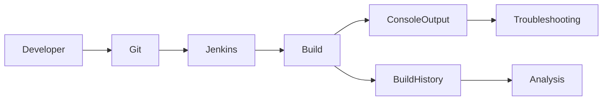

---

## Key Components

| Component | Purpose |
|-----------|----------|
| Console Output | View build logs |
| Build History | Track previous builds |
| Workspace | Build execution directory |
| Test Reports | Test results |
| Build Status | Success or failure indicator |
| Artifacts | Build outputs |

---

## Types (if applicable)

Build Status

| Status | Description |
|---------|-------------|
| Success | Build completed successfully |
| Failed | Build encountered an error |
| Unstable | Build succeeded but tests failed |
| Aborted | Build stopped manually or automatically |
| Running | Build is currently executing |

---

## Lifecycle / Workflow

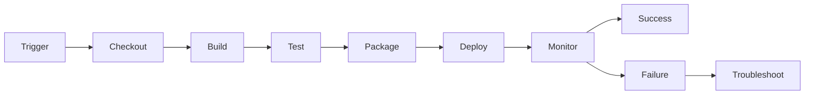

---

## Configuration / Syntax (if applicable)

Example Pipeline

```groovy
pipeline {

    agent any

    stages {

        stage('Build') {

            steps {

                sh 'mvn clean package'

            }

        }

    }

}
```

Display Workspace

```groovy
steps {

    sh 'pwd'

    sh 'ls -la'

}
```

---

## Important Commands (if applicable)

Jenkins Shell Commands

```bash
pwd
ls
cat
echo
env
```

Build Tool Commands

```bash
mvn clean package
gradle build
npm install
docker build
```

Linux Troubleshooting Commands

```bash
df -h
free -m
top
ps
```

---

## Important Files (if applicable)

| File | Purpose |
|------|----------|
| Jenkinsfile | Pipeline definition |
| Console Output | Build execution logs |
| pom.xml | Maven configuration |
| package.json | Node.js project configuration |
| Dockerfile | Docker image definition |

---

## Real-World Use Cases

- Investigating failed builds
- Debugging deployment failures
- Analyzing test failures
- Identifying dependency issues
- Monitoring long-running builds
- Verifying successful deployments

---

## Advantages

- Faster issue resolution
- Improved pipeline reliability
- Better visibility into builds
- Easier root cause analysis
- Historical tracking of build performance

---

## Limitations

- Large console logs can be difficult to analyze
- Historical logs consume storage
- Infrastructure issues may require external monitoring tools
- Log retention policies may remove older build information

---

## Common Interview Questions (Concept Only)

- How do you troubleshoot a failed Jenkins build?
- Where do you check Jenkins build errors?
- What information is available in Console Output?
- What is Build History?
- What is the difference between Failed and Unstable builds?

---

## Common Mistakes

- Ignoring Console Output
- Not checking previous successful builds
- Deleting workspaces before troubleshooting
- Ignoring test reports
- Hardcoding environment-specific values
- Assuming Jenkins is the cause without checking external tools

---

## Troubleshooting

| Problem | Solution |
|----------|----------|
| Build failed | Review Console Output |
| Build hanging | Check running processes and agent availability |
| Missing artifact | Verify package/build stage |
| Workspace issue | Clean workspace and rebuild |
| Test failure | Review test reports |

---

## Summary

Build Monitoring enables DevOps engineers to continuously observe Jenkins builds, identify failures, analyze execution logs, and maintain stable CI/CD pipelines.

---

# Console Output

## Overview

**Console Output** is the detailed log generated during every Jenkins build.

It records every command executed, plugin activity, errors, warnings, and execution results.

It is the **primary source of information** when troubleshooting Jenkins pipelines.

> **Interview Tip**
>
> Approximately **90% of Jenkins troubleshooting begins with Console Output.**

---

## Why It Is Used

Console Output helps to:

- View executed commands
- Identify failed pipeline stages
- Debug scripts
- Verify command execution
- Analyze plugin behavior

---

## Architecture / Working

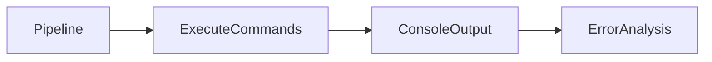

---

## Key Components

| Component | Purpose |
|-----------|----------|
| Command Logs | Shows executed commands |
| Errors | Displays failure messages |
| Warnings | Displays non-critical issues |
| Plugin Logs | Plugin execution details |
| Exit Codes | Command completion status |

---

## Types (if applicable)

Common Log Entries

- Pipeline execution
- Shell commands
- Git checkout
- Maven build
- Docker commands
- Kubernetes deployment

---

## Lifecycle / Workflow

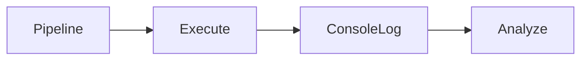

---

## Configuration / Syntax (if applicable)

Print Variable

```groovy
steps {

    echo "Deploy Started"

}
```

Execute Shell Command

```groovy
steps {

    sh 'pwd'

}
```

---

## Important Commands (if applicable)

```bash
echo
pwd
ls
env
```

---

## Important Files (if applicable)

Console Output (Generated by Jenkins)

---

## Real-World Use Cases

- Build debugging
- Deployment troubleshooting
- Environment verification
- Script validation

---

## Advantages

- Complete execution history
- Easy debugging
- Immediate feedback

---

## Limitations

- Large logs may be difficult to read
- Sensitive data should never appear in logs

---

## Common Interview Questions (Concept Only)

- What is Console Output?
- Why is Console Output important?
- What information does it contain?

---

## Common Mistakes

- Printing passwords or secrets
- Ignoring warning messages
- Not checking exit codes

---

## Troubleshooting

| Problem | Solution |
|----------|----------|
| Missing logs | Verify pipeline execution |
| Secret exposed | Mask credentials using Jenkins Credentials |
| Large logs | Use timestamps and meaningful logging |

---

## Summary

Console Output provides detailed execution logs and is the primary source for diagnosing Jenkins build failures.

---

# Build History

## Overview

**Build History** is the record of all builds executed for a Jenkins job.

Each build is assigned a unique build number and stores information such as:

- Build status
- Duration
- Trigger source
- Console Output
- Artifacts
- Test reports

---

## Why It Is Used

Build History helps to:

- Compare successful and failed builds
- Track deployment history
- Analyze recurring failures
- Audit pipeline execution

---

## Architecture / Working

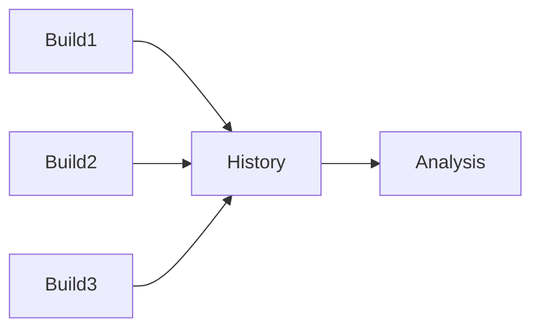

---

## Key Components

| Component | Purpose |
|-----------|----------|
| Build Number | Unique identifier |
| Status | Build result |
| Duration | Execution time |
| Trigger | Build source |
| Artifacts | Generated files |

---

## Types (if applicable)

Common Build States

- Success
- Failed
- Unstable
- Aborted

---

## Lifecycle / Workflow

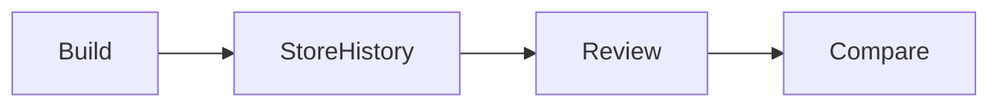

---

## Configuration / Syntax (if applicable)

Accessible from Jenkins Dashboard.

No scripting required.

---

## Important Commands (if applicable)

Not Applicable

---

## Important Files (if applicable)

Build metadata stored under:

```
JENKINS_HOME/jobs/<job-name>/builds/
```

---

## Real-World Use Cases

- Release audits
- Performance comparisons
- Rollback reference
- Failure investigation

---

## Advantages

- Historical tracking
- Easy comparison
- Build auditing

---

## Limitations

- Consumes disk space
- Older builds may be removed based on retention policies

---

## Common Interview Questions (Concept Only)

- What is Build History?
- What information does Build History store?

---

## Common Mistakes

- Deleting build history too aggressively
- Not configuring retention policies

---

## Troubleshooting

| Problem | Solution |
|----------|----------|
| Missing builds | Verify build retention settings |
| Large storage usage | Configure log rotation |

---

## Summary

Build History provides a complete record of pipeline executions and is essential for auditing and troubleshooting.

---

# Failed Builds

## Overview

A **Failed Build** occurs when any stage in the Jenkins pipeline exits with a non-zero exit code or encounters an unrecoverable error.

Common failure points include:

- Source code checkout
- Compilation
- Unit testing
- Code analysis
- Docker image creation
- Deployment

> **Interview Tip**
>
> In Linux, an exit code of **0** indicates success, while any **non-zero** value indicates failure.

---

## Why It Is Used

Analyzing failed builds helps to:

- Identify pipeline issues
- Fix application defects
- Improve CI/CD reliability

---

## Architecture / Working

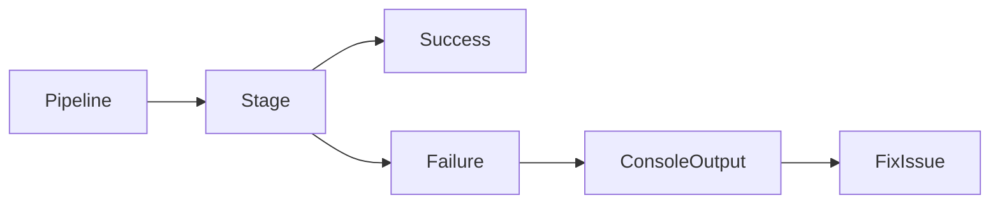

---

## Key Components

| Component | Purpose |
|-----------|----------|
| Exit Code | Success or failure |
| Console Output | Error details |
| Pipeline Stage | Failure location |

---

## Types (if applicable)

Common Build Failures

- Compilation error
- Dependency error
- Authentication error
- Test failure
- Docker build failure
- Deployment failure

---

## Lifecycle / Workflow

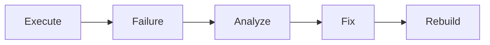

---

## Configuration / Syntax (if applicable)

Fail Pipeline

```groovy
error "Build Failed"
```

---

## Important Commands (if applicable)

```bash
echo $?
```

---

## Important Files (if applicable)

Console Output

---

## Real-World Use Cases

- Failed Maven builds
- Docker failures
- SonarQube failures
- Kubernetes deployment failures

---

## Advantages

- Early problem detection
- Faster debugging

---

## Limitations

- Multiple failures may hide the root cause
- External systems can affect pipeline results

---

## Common Interview Questions (Concept Only)

- What causes Jenkins builds to fail?
- How do you troubleshoot failed builds?
- What is an exit code?

---

## Common Mistakes

- Ignoring the first error message
- Restarting builds without fixing the root cause
- Not checking dependent services

---

## Troubleshooting

| Problem | Solution |
|----------|----------|
| Compilation error | Review compiler output |
| Dependency issue | Verify repository access |
| Docker failure | Check Docker daemon and image |
| Deployment failure | Verify target environment |

---

## Summary

Failed Builds provide valuable diagnostic information that helps identify and resolve issues before deployment.

---

# Workspace Cleanup

## Overview

The **Workspace** is the directory on the Jenkins agent where source code is checked out and build operations are performed.

Workspace Cleanup removes temporary files, old builds, cached artifacts, and other unnecessary data to ensure clean and reproducible builds.

> **Interview Tip**
>
> A clean workspace reduces issues caused by leftover files from previous builds.

---

## Why It Is Used

Workspace Cleanup helps to:

- Remove stale files
- Prevent build conflicts
- Free disk space
- Ensure reproducible builds

---

## Architecture / Working

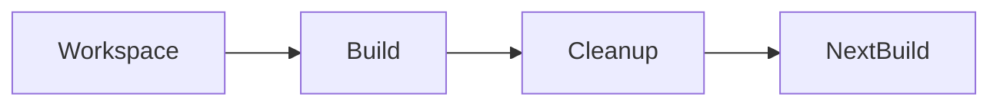

---

## Key Components

| Component | Purpose |
|-----------|----------|
| Workspace | Build directory |
| Cleanup | Remove temporary files |
| Agent | Executes cleanup |

---

## Types (if applicable)

Cleanup Methods

- Manual cleanup
- Automatic cleanup
- Workspace Cleanup Plugin

---

## Lifecycle / Workflow


---

## Configuration / Syntax (if applicable)

Declarative Pipeline

```groovy
post {

    always {

        cleanWs()

    }

}
```

Delete Workspace

```groovy
deleteDir()
```

---

## Important Commands (if applicable)

```bash
rm -rf
pwd
du -sh
```

---

## Important Files (if applicable)

Workspace Directory

```
JENKINS_HOME/workspace/
```

---

## Real-World Use Cases

- Remove old build artifacts
- Clean Docker build context
- Prepare fresh workspace

---

## Advantages

- Clean builds
- Reduced storage usage
- Improved reliability

---

## Limitations

- Re-downloading dependencies may increase build time
- Accidental cleanup can remove useful debug files

---

## Common Interview Questions (Concept Only)

- What is the Jenkins workspace?
- Why clean the workspace?
- What is `cleanWs()`?

---

## Common Mistakes

- Cleaning before artifact archiving
- Deleting required cache directories unintentionally

---

## Troubleshooting

| Problem | Solution |
|----------|----------|
| Cleanup failed | Check file permissions |
| Disk usage high | Schedule workspace cleanup |
| Files still exist | Verify cleanup plugin configuration |

---

## Summary

Workspace Cleanup ensures each build starts from a clean environment, improving consistency and reducing build failures caused by leftover files.

---

# Common Build Errors

## Overview

Common Build Errors are recurring issues encountered during Jenkins pipeline execution.

Understanding these errors helps DevOps engineers quickly identify root causes and restore pipeline functionality.

---

## Why It Is Used

Knowledge of common errors helps to:

- Reduce troubleshooting time
- Improve pipeline stability
- Prevent repeated failures

---

## Architecture / Working

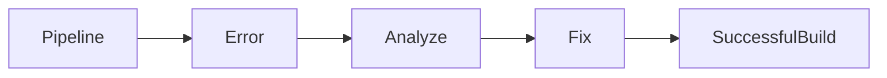

---

## Key Components

| Error Type | Typical Cause |
|------------|---------------|
| Git Checkout Failed | Authentication, wrong URL, missing branch |
| Compilation Failed | Source code errors |
| Test Failure | Failed unit or integration tests |
| Dependency Resolution Failed | Repository unavailable or incorrect dependency |
| Docker Build Failed | Invalid Dockerfile or Docker daemon issues |
| Permission Denied | Insufficient file or user permissions |
| Workspace Full | Disk space exhausted |
| Timeout | Long-running process exceeded configured limit |
| Agent Offline | Jenkins agent unavailable |
| Kubernetes Deployment Failed | Invalid manifest or cluster connectivity issue |

---

## Types (if applicable)

Build Errors

- SCM errors
- Build errors
- Test failures
- Infrastructure failures
- Deployment failures

---

## Lifecycle / Workflow

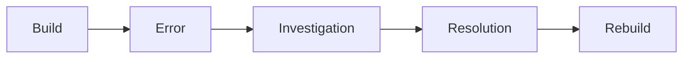

---

## Configuration / Syntax (if applicable)

Retry Example

```groovy
retry(3) {

    sh 'mvn clean package'

}
```

---

## Important Commands (if applicable)

```bash
git status
docker ps
kubectl get pods
systemctl status
df -h
```

---

## Important Files (if applicable)

| File | Purpose |
|------|----------|
| Jenkinsfile | Pipeline definition |
| Console Output | Error details |
| Build logs | Diagnostic information |

---

## Real-World Use Cases

- Fixing failed deployments
- Debugging authentication issues
- Resolving dependency conflicts
- Recovering from infrastructure outages

---

## Advantages

- Faster incident response
- Improved build stability
- Better pipeline reliability

---

## Limitations

- Some failures require investigation outside Jenkins
- Root causes may span multiple integrated systems

---

## Common Interview Questions (Concept Only)

- What are common Jenkins build failures?
- How do you identify the root cause of a failed build?
- What should you check first when a pipeline fails?
- How do you troubleshoot dependency download failures?
- Why might a Jenkins agent cause build failures?

---

## Common Mistakes

- Focusing on the last error instead of the first meaningful error
- Ignoring exit codes
- Not validating external service availability
- Re-running builds repeatedly without investigation
- Leaving insufficient disk space on agents

---

## Troubleshooting

| Error | Solution |
|-------|----------|
| Git checkout failed | Verify repository URL, credentials, and branch |
| Maven dependency error | Check repository availability and network connectivity |
| Docker build failed | Validate Dockerfile and Docker daemon status |
| Permission denied | Verify user permissions and file ownership |
| Disk full | Free disk space or clean workspaces |
| Agent offline | Restore agent connectivity and availability |
| Deployment failed | Validate target environment and deployment configuration |

---

## Summary

Common Build Errors typically involve source code, dependencies, authentication, infrastructure, or deployment issues. Effective troubleshooting begins with reviewing the **Console Output**, identifying the **first meaningful error**, verifying the affected pipeline stage, and checking the health of integrated services.
