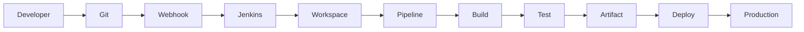
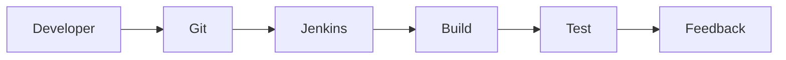
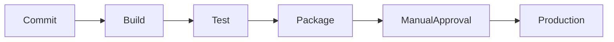
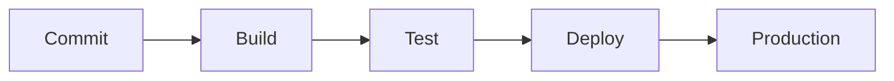
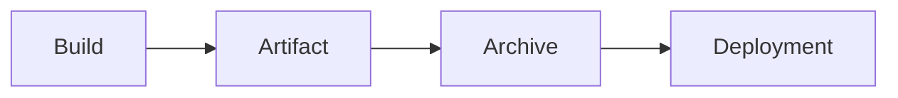
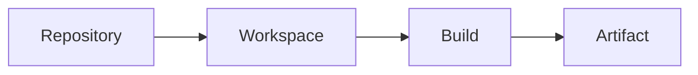
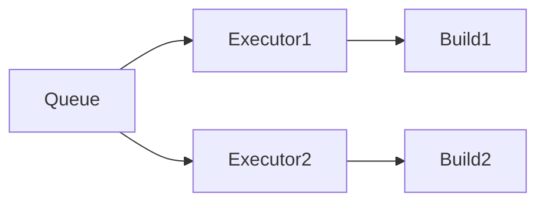
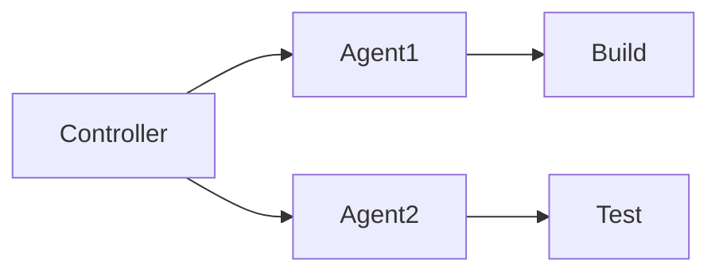
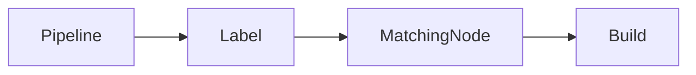
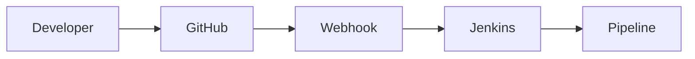

# Essential Jenkins Concepts

## Overview

**Essential Jenkins Concepts** are the core building blocks required to understand how Jenkins automates software delivery.

These concepts are the most frequently asked in DevOps, Cloud, SRE, Platform Engineer, and Azure/AWS interviews because they directly relate to designing, building, testing, and deploying applications using CI/CD pipelines.

The essential concepts covered are:

- Continuous Integration (CI)
- Continuous Delivery (CD)
- Continuous Deployment
- Pipeline as Code
- Build Triggers
- Build Artifacts
- Workspace
- Executor
- Node
- Label
- Webhooks

> **Interview Tip**
>
> Almost every Jenkins interview starts with:
>
> - What is CI/CD?
> - Difference between Continuous Delivery and Continuous Deployment?
> - What is Pipeline as Code?
> - What is a Jenkins Workspace?
> - Difference between Node and Executor?

---

## Why It Is Used

These concepts help organizations to:

- Automate software builds
- Improve software quality
- Reduce deployment time
- Eliminate manual errors
- Increase deployment frequency
- Enable rapid feedback
- Support scalable CI/CD pipelines

---

## Architecture / Working



---

## Key Components

| Component | Purpose |
|-----------|----------|
| Pipeline | Automates CI/CD workflow |
| Workspace | Build execution directory |
| Node | Machine that runs builds |
| Executor | Worker that executes builds |
| Label | Selects appropriate build node |
| Build Trigger | Starts pipeline execution |
| Artifact | Output generated after build |
| Webhook | Automatically triggers Jenkins |

---

## Types (if applicable)

### CI/CD Types

| Type | Description |
|------|-------------|
| Continuous Integration | Frequently merge code and automatically build/test |
| Continuous Delivery | Code is always deployable, manual approval before production |
| Continuous Deployment | Every successful build automatically reaches production |

---

## Lifecycle / Workflow

```mermaid
flowchart LR

Code Commit

Code Commit --> Webhook

Webhook --> Jenkins Pipeline

Pipeline --> Build

Build --> Test

Test --> Package

Package --> Artifact

Artifact --> Deploy
```

---

## Configuration / Syntax (if applicable)

Simple Jenkins Pipeline

```groovy
pipeline {

    agent any

    stages {

        stage('Build') {

            steps {

                sh 'mvn clean package'

            }

        }

    }

}
```

Using Label

```groovy
pipeline {

    agent {

        label 'docker'

    }

}
```

---

## Important Commands (if applicable)

```bash
git push
docker build
mvn package
gradle build
npm install
```

Useful Jenkins Pipeline Steps

```groovy
checkout scm

archiveArtifacts

cleanWs()

build()
```

---

## Important Files (if applicable)

| File | Purpose |
|------|----------|
| Jenkinsfile | Pipeline definition |
| config.xml | Jenkins configuration |
| Workspace Directory | Build execution files |
| Archive Directory | Stored artifacts |

---

## Real-World Use Cases

- Automatically build Java applications
- Deploy Docker containers
- Build Kubernetes applications
- Deploy to AWS/Azure
- Upload artifacts to Nexus
- Scan code with SonarQube
- Trigger deployments after Git commits

---

## Advantages

- Faster software delivery
- Automated builds
- Reduced manual work
- Consistent deployments
- Easy rollback using artifacts
- Improved collaboration

---

## Limitations

- Initial setup requires planning
- Plugin dependency
- Infrastructure maintenance
- Requires proper credential management

---

## Common Interview Questions (Concept Only)

- What is Continuous Integration?
- Difference between Continuous Delivery and Continuous Deployment?
- What is Pipeline as Code?
- What is a Jenkins Workspace?
- What is an Executor?
- Difference between Node and Label?
- What is a Build Artifact?
- What are Build Triggers?
- How do Webhooks work?
- Why are Labels used?

---

## Common Mistakes

- Confusing Continuous Delivery with Continuous Deployment
- Assuming every Node has only one Executor
- Hardcoding pipelines instead of using Jenkinsfiles
- Forgetting workspace cleanup
- Storing artifacts inside workspaces permanently
- Using Poll SCM instead of Webhooks when unnecessary

---

## Troubleshooting

| Problem | Solution |
|----------|----------|
| Pipeline not starting | Verify Build Trigger/Webhook |
| Build waiting | Check Executor availability |
| Job stuck in queue | Verify available Nodes |
| Wrong agent selected | Check Label configuration |
| Missing artifacts | Verify archiveArtifacts step |
| Workspace issues | Clean workspace before rebuild |

---

## Summary

The essential Jenkins concepts form the foundation of every CI/CD pipeline. Understanding how builds are triggered, executed, stored, and deployed is critical for both interviews and real-world DevOps work.

---

# Continuous Integration (CI)

## Overview

**Continuous Integration (CI)** is the practice of frequently merging code changes into a shared repository where every change is automatically built and tested.

The goal is to detect integration issues as early as possible.

Instead of integrating code at the end of development, developers integrate multiple times a day.

> **Interview Tip**
>
> CI answers:
>
> **"Can the application be built successfully after every code change?"**

---

## Why It Is Used

Continuous Integration helps to:

- Detect bugs early
- Reduce integration conflicts
- Improve software quality
- Automate testing
- Provide rapid developer feedback

---

## Architecture / Working



---

## Key Components

| Component | Purpose |
|-----------|----------|
| Source Code | Application code |
| Jenkins | CI server |
| Build Tool | Maven, Gradle, npm |
| Test Framework | JUnit, pytest |

---

## Types (if applicable)

Not Applicable

---

## Lifecycle / Workflow

```text
Code Commit
      ↓
Git Repository
      ↓
Jenkins Trigger
      ↓
Build
      ↓
Unit Tests
      ↓
Feedback
```

---

## Configuration / Syntax (if applicable)

```groovy
stage('Build') {

    steps {

        sh 'mvn clean package'

    }

}
```

---

## Important Commands (if applicable)

```bash
git push
mvn clean package
gradle build
npm test
```

---

## Important Files (if applicable)

- Jenkinsfile
- pom.xml
- build.gradle
- package.json

---

## Real-World Use Cases

- Java builds
- Docker image creation
- Automated testing
- Static code analysis

---

## Advantages

- Early bug detection
- Automated testing
- Faster development

---

## Limitations

- Requires automated tests
- Build failures stop integration

---

## Common Interview Questions (Concept Only)

- What is Continuous Integration?
- Why is CI important?

---

## Common Mistakes

- Infrequent commits
- No automated tests

---

## Troubleshooting

| Problem | Solution |
|----------|----------|
| Build failing | Review Console Output |
| Tests failing | Fix application code |

---

## Summary

Continuous Integration automates code integration by building and testing every code change.

---

# Continuous Delivery

## Overview

**Continuous Delivery** ensures that every successful build is always ready for deployment.

Production deployment still requires **manual approval**.

> **Interview Tip**
>
> Continuous Delivery =
> **Automatic Build + Automatic Test + Manual Production Deployment**

---

## Why It Is Used

- Faster releases
- Safer deployments
- Manual production approval
- Reduced deployment risk

---

## Architecture / Working



---

## Key Components

| Component | Purpose |
|-----------|----------|
| Build | Compile application |
| Test | Verify code |
| Manual Approval | Human approval |
| Production | Deployment |

---

## Types (if applicable)

Not Applicable

---

## Lifecycle /Workflow

Commit

↓

Build

↓

Test

↓

Approval

↓

Deploy

---

## Configuration / Syntax (if applicable)

```groovy
input 'Deploy to Production?'
```

---

## Important Commands (if applicable)

Not Applicable

---

## Important Files (if applicable)

Jenkinsfile

---

## Real-World Use Cases

- Banking applications
- Government software
- Healthcare systems

---

## Advantages

- Safer production releases
- Human approval

---

## Limitations

- Slower deployment

---

## Common Interview Questions (Concept Only)

- What is Continuous Delivery?
- Difference between Delivery and Deployment?

---

## Common Mistakes

- Confusing Delivery with Deployment

---

## Troubleshooting

Review approval stage.

---

## Summary

Continuous Delivery keeps software production-ready while requiring manual approval.

---

# Continuous Deployment

## Overview

**Continuous Deployment** automatically deploys every successful build to production.

No manual approval is required.

> **Interview Tip**
>
> Continuous Deployment =
>
> **Automatic Build + Automatic Test + Automatic Production Deployment**

---

## Why It Is Used

- Rapid software delivery
- Faster releases
- Fully automated deployments

---

## Architecture / Working



---

## Key Components

- Build
- Test
- Deployment

---

## Types (if applicable)

Not Applicable

---

## Lifecycle / Workflow

Commit

↓

Build

↓

Test

↓

Deploy

---

## Configuration / Syntax (if applicable)

```groovy
stage('Deploy') {

    steps {

        sh './deploy.sh'

    }

}
```

---

## Important Commands (if applicable)

Deployment scripts

---

## Important Files (if applicable)

Jenkinsfile

---

## Real-World Use Cases

- SaaS platforms
- Cloud-native applications

---

## Advantages

- Fast releases
- Fully automated

---

## Limitations

- Requires mature testing
- Higher production risk if tests are weak

---

## Common Interview Questions (Concept Only)

- What is Continuous Deployment?
- Difference between Delivery and Deployment?

---

## Common Mistakes

- Deploying without sufficient testing

---

## Troubleshooting

Validate deployment logs.

---

## Summary

Continuous Deployment automatically releases validated builds to production.

---

# Pipeline as Code

## Overview

**Pipeline as Code** means defining the entire CI/CD pipeline in a version-controlled file called **Jenkinsfile**.

Instead of configuring jobs manually through the Jenkins UI, the pipeline is written using **Groovy-based syntax** and stored alongside the application's source code.

> **Interview Tip**
>
> Pipeline as Code enables version control, peer review, and reproducible pipeline configurations.

---

## Why It Is Used

- Version control for pipelines
- Reproducible builds
- Easier collaboration
- Infrastructure automation
- Code review for CI/CD workflows

---

## Architecture / Working

```mermaid
flowchart LR

Developer --> Jenkinsfile

Jenkinsfile --> Git

Git --> Jenkins

Jenkins --> Pipeline Execution
```

---

## Key Components

| Component | Purpose |
|-----------|----------|
| Jenkinsfile | Pipeline definition |
| Groovy | Pipeline language |
| Git | Version control |

---

## Types (if applicable)

| Type | Description |
|------|-------------|
| Declarative Pipeline | Structured and recommended |
| Scripted Pipeline | Flexible and code-driven |

---

## Lifecycle / Workflow

Write Jenkinsfile → Commit to Git → Jenkins detects changes → Execute pipeline

---

## Configuration / Syntax (if applicable)

```groovy
pipeline {
    agent any

    stages {
        stage('Build') {
            steps {
                sh 'mvn package'
            }
        }
    }
}
```

---

## Important Commands (if applicable)

```groovy
checkout scm
sh
archiveArtifacts
```

---

## Important Files (if applicable)

- Jenkinsfile

---

## Real-World Use Cases

- Version-controlled pipelines
- Multi-developer collaboration
- Automated deployments

---

## Advantages

- Repeatable
- Auditable
- Easy to maintain

---

## Limitations

- Requires Groovy knowledge
- Syntax errors stop pipeline execution

---

## Common Interview Questions (Concept Only)

- What is Pipeline as Code?
- Why use Jenkinsfile?

---

## Common Mistakes

- Editing pipelines directly in the UI
- Not storing Jenkinsfile in Git

---

## Troubleshooting

Validate Jenkinsfile syntax and repository path.

---

## Summary

Pipeline as Code enables CI/CD workflows to be managed, versioned, and reviewed like application code.

---

# Build Triggers

## Overview

Build Triggers determine **when Jenkins starts a build**.

They automate pipeline execution based on predefined events or schedules.

---

## Why It Is Used

- Automate builds after code changes
- Schedule periodic jobs
- Integrate with external systems

---

## Architecture / Working

```mermaid
flowchart LR

Git Push --> Webhook

Webhook --> Jenkins

Jenkins --> Build
```

---

## Key Components

| Trigger | Purpose |
|---------|----------|
| Webhook | Immediate trigger from Git |
| Poll SCM | Periodically checks repository |
| Manual Build | User-triggered |
| Scheduled Build | Cron-based execution |
| Upstream Trigger | Triggered by another job |

---

## Types (if applicable)

- Manual Trigger
- Webhook Trigger
- Poll SCM
- Cron Schedule
- Upstream Build Trigger

---

## Lifecycle / Workflow

Trigger → Queue → Executor → Build

---

## Configuration / Syntax (if applicable)

```groovy
triggers {
    githubPush()
}
```

Cron Example

```groovy
triggers {
    cron('H 2 * * *')
}
```

---

## Important Commands (if applicable)

Not Applicable

---

## Important Files (if applicable)

Jenkinsfile

---

## Real-World Use Cases

- GitHub Push
- Nightly builds
- Weekly reports

---

## Advantages

- Fully automated execution
- Faster feedback

---

## Limitations

- Poor trigger configuration may cause unnecessary builds

---

## Common Interview Questions (Concept Only)

- What are Jenkins Build Triggers?
- Difference between Poll SCM and Webhooks?

---

## Common Mistakes

- Using Poll SCM when Webhooks are available
- Incorrect cron syntax

---

## Troubleshooting

Verify webhook configuration, repository permissions, and Jenkins trigger settings.

---

## Summary

Build Triggers automate when Jenkins starts a pipeline, enabling efficient and event-driven CI/CD.

---

# Build Artifacts

## Overview

A **Build Artifact** is the output produced by a successful build process.

Examples include:

- JAR files
- WAR files
- Docker images
- ZIP archives
- Binary executables
- Reports

Artifacts are typically archived or uploaded to repositories such as Nexus or Artifactory.

---

## Why It Is Used

- Store build outputs
- Enable deployments
- Support rollbacks
- Share release packages

---

## Architecture / Working



---

## Key Components

| Component | Purpose |
|-----------|----------|
| Build Output | Generated file |
| Archive | Jenkins storage |
| Repository | Long-term storage |

---

## Types (if applicable)

- Binary files
- Docker images
- Reports
- Logs

---

## Lifecycle / Workflow

Build → Package → Archive → Deploy

---

## Configuration / Syntax (if applicable)

```groovy
archiveArtifacts artifacts: '**/*.jar'
```

---

## Important Commands (if applicable)

```bash
mvn package
docker build
```

---

## Important Files (if applicable)

- JAR
- WAR
- ZIP
- Docker image

---

## Real-World Use Cases

- Application deployment
- Release management
- Artifact repository uploads

---

## Advantages

- Reusable outputs
- Supports rollback
- Version tracking

---

## Limitations

- Consumes storage
- Requires retention policies

---

## Common Interview Questions (Concept Only)

- What is a Build Artifact?
- Why archive artifacts?

---

## Common Mistakes

- Not archiving important outputs
- Keeping artifacts only in the workspace

---

## Troubleshooting

Verify archive paths and repository connectivity.

---

## Summary

Build Artifacts are deployable outputs generated by CI/CD pipelines and are essential for release management.

---

# Workspace

## Overview

A **Workspace** is the directory on a Jenkins node where source code is checked out and builds are executed.

Each job has its own workspace unless configured otherwise.

---

## Why It Is Used

- Store source code
- Execute builds
- Generate temporary files
- Hold build outputs before archiving

---

## Architecture / Working



---

## Key Components

| Component | Purpose |
|-----------|----------|
| Source Code | Checked out files |
| Temporary Files | Build data |
| Build Output | Generated artifacts |

---

## Types (if applicable)

- Controller Workspace
- Agent Workspace

---

## Lifecycle / Workflow

Checkout → Build → Test → Package → Cleanup

---

## Configuration / Syntax (if applicable)

```groovy
cleanWs()
```

---

## Important Commands (if applicable)

```bash
pwd
ls
rm -rf
```

---

## Important Files (if applicable)

```
JENKINS_HOME/workspace/
```

---

## Real-World Use Cases

- Build execution
- Temporary storage
- Artifact creation

---

## Advantages

- Isolated build environment
- Easy cleanup

---

## Limitations

- Disk space usage
- Leftover files if not cleaned

---

## Common Interview Questions (Concept Only)

- What is a Jenkins Workspace?
- Why clean the workspace?

---

## Common Mistakes

- Leaving stale files
- Storing permanent artifacts in the workspace

---

## Troubleshooting

Use `cleanWs()` and verify workspace permissions.

---

## Summary

The Workspace is the working directory where Jenkins performs all build-related activities.

---

# Executor

## Overview

An **Executor** is a worker thread on a Jenkins node that runs a build.

Each executor can execute **one build at a time**.

A node may have multiple executors, allowing it to run multiple builds concurrently.

---

## Why It Is Used

- Execute builds
- Improve parallelism
- Increase pipeline throughput

---

## Architecture / Working



---

## Key Components

| Component | Purpose |
|-----------|----------|
| Build Queue | Waiting jobs |
| Executor | Executes jobs |
| Node | Hosts executors |

---

## Types (if applicable)

- Controller Executors
- Agent Executors

---

## Lifecycle / Workflow

Queue → Executor → Build → Complete

---

## Configuration / Syntax (if applicable)

Configured under **Manage Nodes**.

---

## Important Commands (if applicable)

Not Applicable

---

## Important Files (if applicable)

Node configuration.

---

## Real-World Use Cases

- Parallel builds
- Concurrent testing

---

## Advantages

- Better resource utilization
- Faster build execution

---

## Limitations

- Too many executors can exhaust CPU and memory

---

## Common Interview Questions (Concept Only)

- What is an Executor?
- Can multiple executors run on one node?

---

## Common Mistakes

- Configuring more executors than the hardware can handle

---

## Troubleshooting

Monitor CPU, memory, and build queue length.

---

## Summary

Executors are worker threads responsible for running Jenkins builds on nodes.

---

# Node

## Overview

A **Node** is any machine capable of executing Jenkins jobs.

Nodes can be:

- Jenkins Controller
- Jenkins Agent

---

## Why It Is Used

- Distribute workloads
- Scale CI/CD pipelines
- Isolate specialized builds

---

## Architecture / Working



---

## Key Components

| Component | Purpose |
|-----------|----------|
| Controller | Orchestrates jobs |
| Agent | Executes jobs |

---

## Types (if applicable)

- Controller Node
- Static Agent
- Dynamic Agent

---

## Lifecycle / Workflow

Controller → Select Node → Execute Job

---

## Configuration / Syntax (if applicable)

Configured under **Manage Nodes**.

---

## Important Commands (if applicable)

Not Applicable

---

## Important Files (if applicable)

Node configuration.

---

## Real-World Use Cases

- Linux builds
- Windows builds
- Docker builds

---

## Advantages

- Scalability
- Workload distribution

---

## Limitations

- Agent maintenance

---

## Common Interview Questions (Concept Only)

- What is a Node?
- Difference between Controller and Agent?

---

## Common Mistakes

- Running all builds on the controller

---

## Troubleshooting

Check node status and connectivity.

---

## Summary

Nodes provide the compute resources required to execute Jenkins jobs.

---

# Label

## Overview

A **Label** is a tag assigned to a Jenkins node.

Pipelines use labels to specify **where a build should run**.

---

## Why It Is Used

- Select specific build environments
- Route jobs to appropriate nodes
- Support heterogeneous infrastructure

---

## Architecture / Working



---

## Key Components

| Component | Purpose |
|-----------|----------|
| Label | Node identifier |
| Node | Build machine |

---

## Types (if applicable)

Examples:

- linux
- windows
- docker
- kubernetes

---

## Lifecycle / Workflow

Pipeline → Label → Node → Build

---

## Configuration / Syntax (if applicable)

```groovy
agent {

    label 'docker'

}
```

---

## Important Commands (if applicable)

Not Applicable

---

## Important Files (if applicable)

Node configuration.

---

## Real-World Use Cases

- Docker builds
- Windows testing
- Kubernetes deployments

---

## Advantages

- Flexible scheduling
- Better resource allocation

---

## Limitations

- Incorrect labels prevent job execution

---

## Common Interview Questions (Concept Only)

- What is a Label?
- Why are Labels used?

---

## Common Mistakes

- Using non-existent labels

---

## Troubleshooting

Verify label names and node availability.

---

## Summary

Labels enable Jenkins to route builds to suitable nodes.

---

# Webhooks

## Overview

A **Webhook** is an HTTP callback sent by a source code repository (such as GitHub, GitLab, or Bitbucket) to Jenkins whenever an event occurs, such as a code push or pull request.

Instead of Jenkins repeatedly checking the repository (Poll SCM), the repository **immediately notifies Jenkins** when changes happen.

> **Interview Tip**
>
> Webhooks are preferred over Poll SCM because they provide near real-time triggering and reduce unnecessary network traffic.

---

## Why It Is Used

- Trigger builds immediately after code changes
- Eliminate polling delays
- Reduce server load
- Automate CI pipelines

---

## Architecture / Working



---

## Key Components

| Component | Purpose |
|-----------|----------|
| Repository | Sends events |
| Webhook | HTTP notification |
| Jenkins | Receives trigger |
| Pipeline | Executes build |

---

## Types (if applicable)

- Push Event
- Pull Request Event
- Tag Event
- Release Event

---

## Lifecycle / Workflow

Commit → Push → Webhook → Jenkins → Build

---

## Configuration / Syntax (if applicable)

Pipeline Trigger

```groovy
triggers {
    githubPush()
}
```

---

## Important Commands (if applicable)

Not Applicable

---

## Important Files (if applicable)

Jenkinsfile

---

## Real-World Use Cases

- Automatic CI builds
- Pull request validation
- Deployment automation

---

## Advantages

- Immediate pipeline execution
- Reduced polling overhead
- Better CI responsiveness

---

## Limitations

- Requires network connectivity between repository and Jenkins
- Misconfigured webhooks can prevent builds from triggering

---

## Common Interview Questions (Concept Only)

- What is a Webhook?
- Why are Webhooks preferred over Poll SCM?
- How does Jenkins receive GitHub events?

---

## Common Mistakes

- Incorrect webhook URL
- Firewall blocking webhook requests
- Forgetting to enable webhook triggers in Jenkins

---

## Troubleshooting

| Problem | Solution |
|----------|----------|
| Build not triggered | Verify webhook URL and repository settings |
| HTTP 403/404 | Check Jenkins endpoint and authentication |
| Delayed builds | Ensure Poll SCM is not being relied upon unnecessarily |

---

## Summary

Webhooks provide event-driven automation by notifying Jenkins immediately after repository events, enabling fast and efficient CI/CD pipelines.
