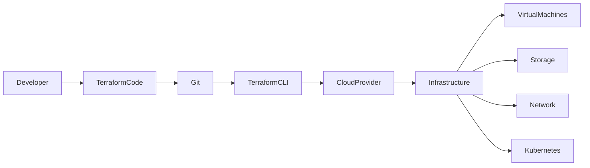
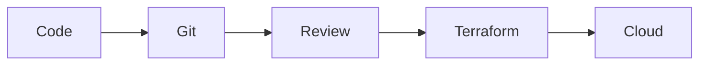
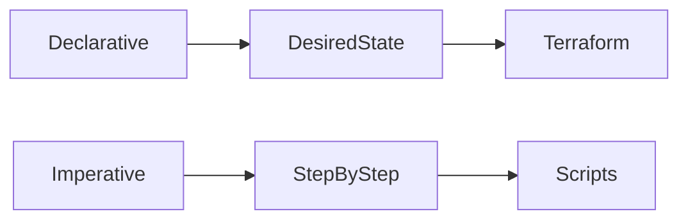
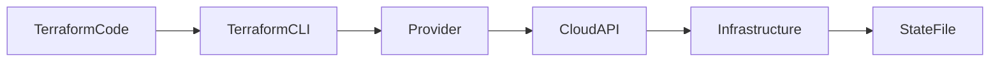

# Infrastructure as Code (IaC) Fundamentals

## Overview

**Infrastructure as Code (IaC)** is the practice of provisioning, configuring, and managing infrastructure using machine-readable configuration files instead of performing manual operations.

Instead of manually creating resources like Virtual Machines, Networks, Storage Accounts, or Kubernetes Clusters through cloud portals, IaC automates the entire infrastructure lifecycle.

Infrastructure definitions are stored as code, making them version-controlled, repeatable, and reusable.

> **Interview Tip**
>
> Terraform is the most commonly used IaC tool in cloud and DevOps environments. Almost every Terraform interview begins with Infrastructure as Code fundamentals.

---

## Why It Is Used

Infrastructure as Code helps organizations to:

- Automate infrastructure provisioning
- Eliminate manual configuration errors
- Maintain consistent environments
- Version control infrastructure
- Enable disaster recovery
- Support CI/CD pipelines
- Scale infrastructure efficiently
- Improve collaboration between teams

---

## Architecture / Working



---

## Key Components

| Component | Purpose |
|-----------|----------|
| IaC Configuration | Defines infrastructure |
| Version Control | Stores infrastructure code |
| Terraform CLI | Executes infrastructure changes |
| Cloud Provider | Creates infrastructure |
| State File | Tracks infrastructure state |

---

## Types (if applicable)

### Infrastructure Provisioning Approaches

| Type | Description |
|------|-------------|
| Manual Provisioning | Resources created manually using portal or CLI |
| Infrastructure as Code | Resources created using code |

### IaC Categories

| Category | Description |
|----------|-------------|
| Declarative | Describe desired infrastructure |
| Imperative | Specify exact steps to create infrastructure |

---

## Lifecycle / Workflow


---

## Configuration / Syntax (if applicable)

Example Terraform Resource

```hcl
resource "azurerm_resource_group" "rg" {

  name     = "demo-rg"

  location = "Central India"

}
```

---

## Important Commands (if applicable)

Terraform CLI

```bash
terraform init

terraform validate

terraform fmt

terraform plan

terraform apply

terraform destroy
```

---

## Important Files (if applicable)

| File | Purpose |
|------|----------|
| main.tf | Main infrastructure configuration |
| variables.tf | Input variables |
| outputs.tf | Output values |
| providers.tf | Provider configuration |
| terraform.tfvars | Variable values |
| terraform.tfstate | Current infrastructure state |
| .terraform.lock.hcl | Provider version lock |

---

## Real-World Use Cases

- Provision Azure Virtual Machines
- Deploy AWS EC2 instances
- Create Kubernetes clusters
- Provision Azure Resource Groups
- Build complete cloud environments
- Deploy networking resources
- Automate disaster recovery environments

---

## Advantages

- Automation
- Repeatability
- Version control
- Faster deployments
- Reduced human error
- Easy rollback using Git
- Consistent environments
- Supports CI/CD

---

## Limitations

- Initial learning curve
- State management complexity
- Incorrect code can impact production
- Requires secure handling of state files

---

## Common Interview Questions (Concept Only)

- What is Infrastructure as Code?
- Why is IaC important?
- What problems does IaC solve?
- What are the benefits of IaC?
- How is IaC different from manual provisioning?
- What are popular IaC tools?
- Why should infrastructure be version controlled?

---

## Common Mistakes

- Manually modifying infrastructure managed by Terraform
- Not storing code in Git
- Hardcoding values
- Ignoring state file security
- Not reviewing execution plans before applying changes

---

## Troubleshooting

| Problem | Solution |
|----------|----------|
| Infrastructure drift | Reconcile using Terraform plan/apply |
| Manual resource changes | Import or revert changes to maintain state consistency |
| Inconsistent environments | Reuse the same Terraform configuration |
| Deployment failures | Validate configuration and provider credentials |

---

## Summary

Infrastructure as Code enables infrastructure to be created, managed, and version-controlled using code. It improves consistency, automation, scalability, and collaboration while reducing manual effort and configuration errors.

---

# Infrastructure as Code Concepts

## Overview

Infrastructure as Code (IaC) is based on treating infrastructure the same way developers treat application code.

Infrastructure definitions are:

- Written as code
- Stored in Git
- Reviewed through Pull Requests
- Automatically deployed
- Easily replicated

This approach enables modern DevOps practices.

> **Interview Tip**
>
> Infrastructure should be **immutable**, meaning changes are made through code rather than manual modifications.

---

## Why It Is Used

IaC concepts enable:

- Infrastructure versioning
- Collaboration
- Code review
- Automated deployments
- Reproducibility

---

## Architecture / Working



---

## Key Components

| Component | Purpose |
|-----------|----------|
| Code | Infrastructure definition |
| Git | Version control |
| Review | Validate changes |
| Automation | Deploy infrastructure |

---

## Types (if applicable)

Core IaC Principles

- Version Control
- Automation
- Idempotency
- Reusability
- Consistency
- Collaboration

---

## Lifecycle / Workflow

Write Code

↓

Commit

↓

Review

↓

Deploy

↓

Manage

---

## Configuration / Syntax (if applicable)

Not Applicable

---

## Important Commands (if applicable)

```bash
git add
git commit
git push
terraform apply
```

---

## Important Files (if applicable)

Terraform configuration files

---

## Real-World Use Cases

- Multi-environment deployments
- Disaster recovery
- Infrastructure replication
- Team collaboration

---

## Advantages

- Predictable infrastructure
- Easy auditing
- Faster provisioning

---

## Limitations

- Requires disciplined workflows
- Infrastructure changes must follow code review

---

## Common Interview Questions (Concept Only)

- What are the principles of IaC?
- Why should infrastructure be stored in Git?
- What is immutable infrastructure?

---

## Common Mistakes

- Making manual portal changes
- Skipping code reviews

---

## Troubleshooting

Verify infrastructure changes originate from code rather than manual modifications.

---

## Summary

Infrastructure as Code applies software engineering practices such as version control, automation, and collaboration to infrastructure management.

---

# Declarative vs Imperative

## Overview

Infrastructure provisioning approaches are generally classified into:

- Declarative
- Imperative

Understanding the difference is one of the most frequently asked Terraform interview topics.

---

## Why It Is Used

Different provisioning models determine how infrastructure is managed.

---

## Architecture / Working



---

## Key Components

| Component | Purpose |
|-----------|----------|
| Desired State | Declarative model |
| Execution Steps | Imperative model |

---

## Types (if applicable)

### Declarative

You describe:

> **What infrastructure should exist.**

Terraform determines:

- Creation order
- Dependencies
- Required changes

Example

```hcl
resource "aws_instance" "web" {

  ami = "ami-xxxx"

  instance_type = "t2.micro"

}
```

---

### Imperative

You specify:

> **How to create the infrastructure step by step.**

Example

```bash
aws ec2 run-instances ...

aws ec2 create-tags ...

aws ec2 modify-instance-attribute ...
```

---

## Lifecycle / Workflow

Declarative

Desired State

↓

Terraform

↓

Infrastructure

Imperative

Step 1

↓

Step 2

↓

Step 3

↓

Infrastructure

---

## Configuration / Syntax (if applicable)

Not Applicable

---

## Important Commands (if applicable)

Terraform

```bash
terraform apply
```

Imperative CLI

```bash
aws ec2 run-instances
```

---

## Important Files (if applicable)

Terraform configuration files

---

## Real-World Use Cases

Declarative

- Terraform
- Kubernetes YAML
- ARM Templates
- CloudFormation

Imperative

- Bash scripts
- Azure CLI
- AWS CLI
- PowerShell

---

## Advantages

### Declarative

- Easier maintenance
- Automatic dependency handling
- Idempotent
- Cleaner code

### Imperative

- More control
- Suitable for procedural automation

---

## Limitations

### Declarative

- Less procedural flexibility

### Imperative

- Harder to maintain
- Error-prone
- Requires manual dependency handling

---

## Common Interview Questions (Concept Only)

- What is Declarative Infrastructure?
- What is Imperative Infrastructure?
- Why is Terraform Declarative?
- Which approach is preferred?

---

## Common Mistakes

- Confusing Terraform with scripting
- Treating Terraform like Bash automation

---

## Troubleshooting

Use declarative tools for infrastructure provisioning and imperative scripts only when procedural tasks are required.

---

## Summary

Terraform follows the declarative model, where you define the desired infrastructure state and Terraform determines how to achieve it.

---

# Terraform Architecture

## Overview

Terraform Architecture describes how Terraform communicates with cloud providers to provision and manage infrastructure.

Terraform itself does not create cloud resources directly. Instead, it uses **Providers** and **APIs**.

---

## Why It Is Used

Terraform Architecture provides:

- Cloud abstraction
- Multi-cloud support
- Dependency management
- Infrastructure state tracking

---

## Architecture / Working



---

## Key Components

| Component | Purpose |
|-----------|----------|
| Terraform CLI | Executes commands |
| Provider | Connects Terraform to cloud |
| Resources | Cloud infrastructure |
| State File | Tracks infrastructure |
| APIs | Cloud communication |

---

## Types (if applicable)

Architecture Components

- CLI
- Provider
- Resource
- State
- Backend

---

## Lifecycle / Workflow

Code

↓

Provider

↓

Cloud API

↓

Infrastructure

↓

State File

---

## Configuration / Syntax (if applicable)

Provider

```hcl
provider "azurerm" {

  features {}

}
```

---

## Important Commands (if applicable)

```bash
terraform init
terraform providers
```

---

## Important Files (if applicable)

- providers.tf
- terraform.tfstate

---

## Real-World Use Cases

- Azure deployments
- AWS deployments
- Multi-cloud provisioning

---

## Advantages

- Provider abstraction
- Multi-cloud
- Dependency graph

---

## Limitations

- State management required
- Provider version compatibility

---

## Common Interview Questions (Concept Only)

- Explain Terraform Architecture.
- What is a Provider?
- How does Terraform communicate with Azure or AWS?
- What is the State File?

---

## Common Mistakes

- Forgetting to initialize providers
- Ignoring provider version constraints

---

## Troubleshooting

Run `terraform init` after adding or updating providers.

---

## Summary

Terraform Architecture consists of the CLI, providers, resources, APIs, and state management working together to provision infrastructure.

---

# Terraform Workflow

## Overview

The **Terraform Workflow** is the standard sequence of steps followed to provision and manage infrastructure.

It ensures infrastructure is validated, reviewed, created, updated, and destroyed safely.

> **Interview Tip**
>
> The standard Terraform workflow is:
>
> **Write → Init → Validate → Plan → Apply → Destroy**

---

## Why It Is Used

Terraform Workflow helps:

- Validate infrastructure code
- Review planned changes
- Prevent accidental deployments
- Maintain consistent infrastructure

---

## Architecture / Working


---

## Key Components

| Step | Purpose |
|------|----------|
| Write | Create configuration files |
| Init | Download providers and initialize the working directory |
| Validate | Check configuration syntax |
| Plan | Preview changes |
| Apply | Provision or update infrastructure |
| Destroy | Remove infrastructure |

---

## Types (if applicable)

Not Applicable

---

## Lifecycle / Workflow

```text
Write Configuration
        ↓
terraform init
        ↓
terraform validate
        ↓
terraform plan
        ↓
terraform apply
        ↓
Infrastructure Created
        ↓
terraform destroy (when required)
```

---

## Configuration / Syntax (if applicable)

Initialize

```bash
terraform init
```

Validate

```bash
terraform validate
```

Format

```bash
terraform fmt
```

Preview Changes

```bash
terraform plan
```

Create Infrastructure

```bash
terraform apply
```

Destroy Infrastructure

```bash
terraform destroy
```

---

## Important Commands (if applicable)

```bash
terraform init

terraform fmt

terraform validate

terraform plan

terraform apply

terraform destroy
```

---

## Important Files (if applicable)

| File | Purpose |
|------|----------|
| main.tf | Infrastructure definition |
| terraform.tfstate | Infrastructure state |
| terraform.tfvars | Variable values |
| .terraform.lock.hcl | Provider version lock |

---

## Real-World Use Cases

- Provisioning Azure Resource Groups
- Creating AWS VPCs
- Deploying Kubernetes clusters
- Building complete cloud environments
- Updating existing infrastructure
- Removing test environments

---

## Advantages

- Safe infrastructure changes
- Preview before deployment
- Automated provisioning
- Repeatable workflows
- Version-controlled infrastructure

---

## Limitations

- Requires proper state management
- Misconfigured state can lead to inconsistencies
- Incorrect apply commands can impact production resources

---

## Common Interview Questions (Concept Only)

- Explain the Terraform workflow.
- What does `terraform init` do?
- What is the purpose of `terraform plan`?
- Why should `terraform validate` be run before `terraform apply`?
- When is `terraform destroy` used?

---

## Common Mistakes

- Skipping `terraform plan`
- Applying changes directly to production without review
- Ignoring validation errors
- Editing infrastructure manually after deployment
- Not committing Terraform code to version control

---

## Troubleshooting

| Problem | Solution |
|----------|----------|
| Provider initialization failed | Run `terraform init` and verify provider configuration |
| Validation errors | Correct syntax before planning or applying |
| Unexpected changes in plan | Review code and state file for drift |
| Apply failed | Verify cloud credentials, quotas, and resource dependencies |

---

## Summary

The Terraform Workflow provides a structured process for provisioning and managing infrastructure. By validating, reviewing, and applying changes systematically, it enables reliable, repeatable, and production-ready Infrastructure as Code deployments.
