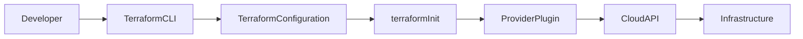
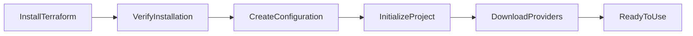
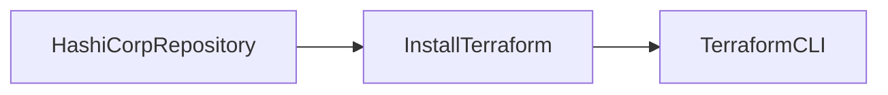
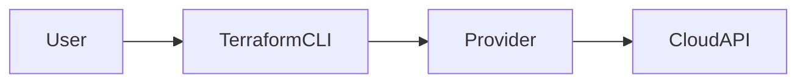
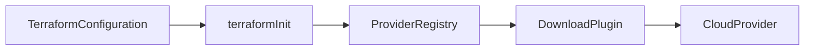

# Terraform Installation & Configuration

## Overview

**Terraform Installation & Configuration** is the first step in using Terraform to provision and manage infrastructure as code (IaC).

After installing Terraform, you configure cloud provider credentials (Azure, AWS, GCP, etc.) and initialize the working directory. Terraform then downloads the required provider plugins and becomes ready to provision infrastructure.

> **Interview Tip**
>
> Terraform itself does **not** communicate directly with cloud platforms. It uses **Provider plugins** to interact with cloud APIs.

---

## Why It Is Used

Terraform installation and configuration enables you to:

- Provision infrastructure using code
- Connect to cloud providers
- Download provider plugins
- Execute Terraform commands
- Manage infrastructure consistently
- Support multi-cloud deployments

---

## Architecture / Working



---

## Key Components

| Component | Purpose |
|----------|----------|
| Terraform CLI | Executes Terraform commands |
| Provider Plugin | Connects Terraform to cloud providers |
| Configuration Files | Define infrastructure |
| Working Directory | Stores Terraform project files |
| Cloud Credentials | Authenticate with cloud provider |

---

## Types (if applicable)

### Installation Methods

| Method | Description |
|---------|-------------|
| Package Manager | Install using apt, yum, dnf, brew, Chocolatey |
| Manual Installation | Download binary from HashiCorp |
| Docker Image | Run Terraform inside a container |

---

## Lifecycle / Workflow



---

## Configuration / Syntax (if applicable)

Example Provider Configuration (Azure)

```hcl
terraform {

  required_providers {

    azurerm = {

      source  = "hashicorp/azurerm"

      version = "~> 4.0"

    }

  }

}

provider "azurerm" {

  features {}

}
```

Example Provider Configuration (AWS)

```hcl
terraform {

  required_providers {

    aws = {

      source  = "hashicorp/aws"

      version = "~> 5.0"

    }

  }

}

provider "aws" {

  region = "ap-south-1"

}
```

---

## Important Commands (if applicable)

Install Verification

```bash
terraform version
```

Initialize Project

```bash
terraform init
```

View Help

```bash
terraform --help
```

Check Installed Providers

```bash
terraform providers
```

Format Configuration

```bash
terraform fmt
```

Validate Configuration

```bash
terraform validate
```

---

## Important Files (if applicable)

| File | Purpose |
|------|----------|
| main.tf | Main Terraform configuration |
| providers.tf | Provider configuration |
| versions.tf | Terraform and provider version constraints |
| variables.tf | Variable declarations |
| terraform.tfvars | Variable values |
| outputs.tf | Output values |
| .terraform.lock.hcl | Provider dependency lock file |
| .terraform/ | Downloaded provider plugins |

---

## Real-World Use Cases

- Configure Azure provider for Azure infrastructure
- Configure AWS provider for EC2 deployment
- Download required providers automatically
- Initialize new Terraform projects
- Standardize infrastructure provisioning across teams

---

## Advantages

- Easy installation
- Cross-platform support
- Automatic provider downloads
- Supports multiple cloud providers
- Version-controlled provider management

---

## Limitations

- Requires cloud credentials
- Provider compatibility must be managed
- Internet access is required during initial provider download
- Provider version mismatches can cause issues

---

## Common Interview Questions (Concept Only)

- How do you install Terraform?
- How do you verify Terraform installation?
- What is Terraform CLI?
- What does `terraform init` do?
- What is a Terraform Provider?
- Where are provider plugins stored?
- What happens if you skip `terraform init`?
- How does Terraform know which provider to download?

---

## Common Mistakes

- Forgetting to run `terraform init`
- Not verifying Terraform installation
- Hardcoding cloud credentials
- Ignoring provider version constraints
- Deleting the `.terraform.lock.hcl` file unintentionally
- Running Terraform commands outside the project directory

---

## Troubleshooting

| Problem | Solution |
|----------|----------|
| `terraform: command not found` | Verify installation and PATH configuration |
| Provider download failed | Check internet connectivity and provider configuration |
| Unsupported Terraform version | Upgrade Terraform or adjust version constraints |
| Authentication failed | Verify cloud credentials |
| `terraform init` failed | Check provider block and network connectivity |

---

## Summary

Terraform Installation & Configuration prepares your system to manage infrastructure using code. After installing Terraform, you configure providers, initialize the project, download provider plugins, and verify the installation before provisioning infrastructure.

---

# Install Terraform

## Overview

Installing Terraform makes the **Terraform CLI** available on your system.

Terraform supports:

- Linux
- Windows
- macOS

The installation method depends on the operating system.

> **Interview Tip**
>
> Production environments typically install Terraform using official package repositories or automation tools rather than manual downloads.

---

## Why It Is Used

Installation is required to:

- Execute Terraform commands
- Manage infrastructure
- Download providers
- Initialize projects

---

## Architecture / Working



---

## Key Components

| Component | Purpose |
|----------|----------|
| Binary | Terraform executable |
| PATH | Makes Terraform executable globally |
| Package Repository | Provides updates |

---

## Types (if applicable)

Installation Options

- Package Manager
- Manual Binary Download
- Docker Container

---

## Lifecycle / Workflow

Download → Install → Add to PATH → Verify

---

## Configuration / Syntax (if applicable)

Ubuntu (APT)

```bash
sudo apt update

sudo apt install terraform
```

RHEL/CentOS (DNF)

```bash
sudo dnf install terraform
```

macOS (Homebrew)

```bash
brew install terraform
```

Windows (Chocolatey)

```powershell
choco install terraform
```

---

## Important Commands (if applicable)

```bash
terraform version
```

---

## Important Files (if applicable)

Terraform executable

---

## Real-World Use Cases

- Developer workstation
- CI/CD server
- Jenkins agent
- Azure DevOps agent
- GitHub Actions runner

---

## Advantages

- Lightweight installation
- Cross-platform
- Easy updates

---

## Limitations

- Requires PATH configuration (manual installation)
- Version compatibility must be maintained

---

## Common Interview Questions (Concept Only)

- How do you install Terraform on Linux?
- Which package managers support Terraform?

---

## Common Mistakes

- Installing unsupported versions
- Forgetting to update PATH after manual installation

---

## Troubleshooting

Run:

```bash
terraform version
```

If not found, verify PATH configuration.

---

## Summary

Terraform can be installed using package managers, manual binaries, or containers, depending on the operating system and environment.

---

# Terraform CLI

## Overview

The **Terraform CLI (Command Line Interface)** is the primary tool used to interact with Terraform.

All Terraform operations—such as initialization, planning, applying changes, and destroying infrastructure—are performed through the CLI.

> **Interview Tip**
>
> Every Terraform workflow starts with the CLI.

---

## Why It Is Used

The CLI is used to:

- Initialize projects
- Validate configurations
- Plan infrastructure changes
- Provision infrastructure
- Destroy infrastructure
- Manage state

---

## Architecture / Working



---

## Key Components

| Component | Purpose |
|----------|----------|
| CLI | Executes Terraform commands |
| Configuration | Reads `.tf` files |
| Provider | Connects to cloud APIs |

---

## Types (if applicable)

Not Applicable

---

## Lifecycle / Workflow

CLI Command → Configuration → Provider → Cloud API

---

## Configuration / Syntax (if applicable)

General Syntax

```bash
terraform <command> [options]
```

Example

```bash
terraform plan
```

---

## Important Commands (if applicable)

```bash
terraform init

terraform validate

terraform fmt

terraform plan

terraform apply

terraform destroy

terraform version

terraform providers

terraform output
```

---

## Important Files (if applicable)

Terraform configuration files

---

## Real-World Use Cases

- Infrastructure provisioning
- Infrastructure updates
- CI/CD automation

---

## Advantages

- Simple command interface
- Supports automation
- Cross-platform

---

## Limitations

- Command syntax must be accurate
- Incorrect commands can modify infrastructure

---

## Common Interview Questions (Concept Only)

- What is Terraform CLI?
- Which Terraform commands are used daily?

---

## Common Mistakes

- Running `apply` before reviewing `plan`
- Skipping `validate`

---

## Troubleshooting

Use:

```bash
terraform --help
```

to verify available commands.

---

## Summary

The Terraform CLI is the primary interface for creating, modifying, and managing infrastructure.

---

# Verify Installation

## Overview

After installing Terraform, verify that:

- Terraform is installed correctly
- PATH is configured
- Correct version is installed
- CLI is functioning

---

## Why It Is Used

Verification ensures Terraform is ready before creating infrastructure.

---

## Architecture / Working


---

## Key Components

| Component | Purpose |
|----------|----------|
| Version Command | Verify installation |
| PATH | Locate executable |

---

## Types (if applicable)

Not Applicable

---

## Lifecycle / Workflow

Install → Verify → Configure → Use

---

## Configuration / Syntax (if applicable)

```bash
terraform version
```

Example Output

```text
Terraform v1.9.x
```

Check Help

```bash
terraform --help
```

---

## Important Commands (if applicable)

```bash
terraform version

terraform --help
```

---

## Important Files (if applicable)

Not Applicable

---

## Real-World Use Cases

- Validate developer environments
- Verify CI/CD agents
- Check production servers

---

## Advantages

- Quick validation
- Confirms installation success

---

## Limitations

- Does not verify cloud authentication

---

## Common Interview Questions (Concept Only)

- How do you verify Terraform installation?
- Which command displays the Terraform version?

---

## Common Mistakes

- Assuming installation succeeded without verification

---

## Troubleshooting

| Problem | Solution |
|----------|----------|
| Command not found | Verify PATH |
| Incorrect version | Upgrade or reinstall Terraform |

---

## Summary

Verifying the installation confirms Terraform is installed correctly and ready for use.

---

# Provider Installation

## Overview

A **Provider** is a plugin that allows Terraform to communicate with a specific platform or service.

Terraform automatically downloads required providers during project initialization using the `terraform init` command.

Examples include:

- AzureRM
- AWS
- Google Cloud
- Kubernetes
- Docker
- GitHub

> **Interview Tip**
>
> Providers are **not bundled** with Terraform. They are downloaded automatically based on the `required_providers` block.

---

## Why It Is Used

Providers enable Terraform to:

- Create cloud resources
- Update infrastructure
- Delete infrastructure
- Interact with external APIs

---

## Architecture / Working



---

## Key Components

| Component | Purpose |
|----------|----------|
| Provider Block | Configures provider |
| Registry | Downloads provider plugins |
| Plugin | Communicates with cloud APIs |

---

## Types (if applicable)

Common Providers

| Provider | Purpose |
|----------|----------|
| AzureRM | Microsoft Azure |
| AWS | Amazon Web Services |
| Google | Google Cloud Platform |
| Kubernetes | Kubernetes Cluster |
| Docker | Docker Engine |
| GitHub | GitHub Resources |

---

## Lifecycle / Workflow

Define Provider → Initialize → Download Plugin → Authenticate → Manage Infrastructure

---

## Configuration / Syntax (if applicable)

Provider Configuration

```hcl
terraform {

  required_providers {

    azurerm = {

      source  = "hashicorp/azurerm"

      version = "~> 4.0"

    }

  }

}

provider "azurerm" {

  features {}

}
```

Initialize

```bash
terraform init
```

View Installed Providers

```bash
terraform providers
```

---

## Important Commands (if applicable)

```bash
terraform init

terraform providers

terraform version
```

---

## Important Files (if applicable)

| File | Purpose |
|------|----------|
| providers.tf | Provider configuration |
| .terraform/ | Downloaded provider plugins |
| .terraform.lock.hcl | Provider version lock |

---

## Real-World Use Cases

- Azure infrastructure provisioning
- AWS resource creation
- Kubernetes cluster management
- Docker image management
- GitHub repository automation

---

## Advantages

- Automatic downloads
- Multi-cloud support
- Version-controlled providers
- Extensible architecture

---

## Limitations

- Internet required for initial download
- Provider versions must be managed carefully
- Authentication is provider-specific

---

## Common Interview Questions (Concept Only)

- What is a Terraform Provider?
- When are providers downloaded?
- What does `terraform init` download?
- Where are provider plugins stored?
- How do you specify a provider version?

---

## Common Mistakes

- Forgetting the `required_providers` block
- Not running `terraform init`
- Ignoring provider version compatibility
- Hardcoding provider credentials in configuration files

---

## Troubleshooting

| Problem | Solution |
|----------|----------|
| Provider download failed | Verify internet connectivity and registry access |
| Unsupported provider version | Update version constraints |
| Authentication error | Verify provider credentials |
| Provider initialization failed | Check provider block syntax and rerun `terraform init` |

---

## Summary

Providers are essential Terraform plugins that connect Terraform to cloud platforms and external services. During initialization, Terraform automatically downloads the required providers, enabling infrastructure management across Azure, AWS, GCP, Kubernetes, Docker, and many other platforms.
