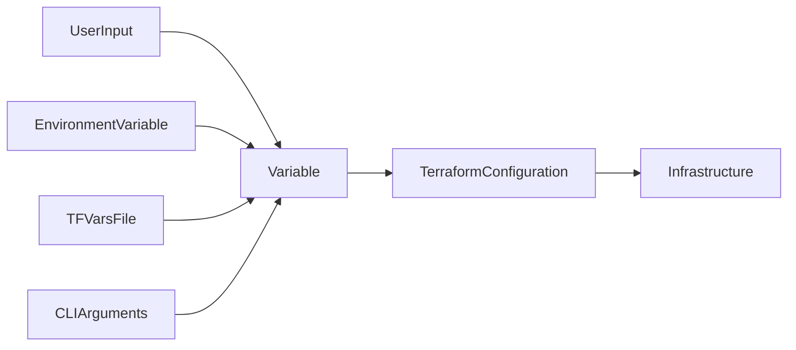
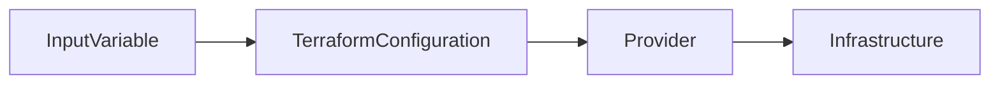
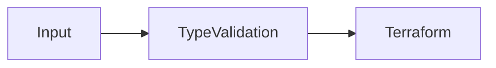
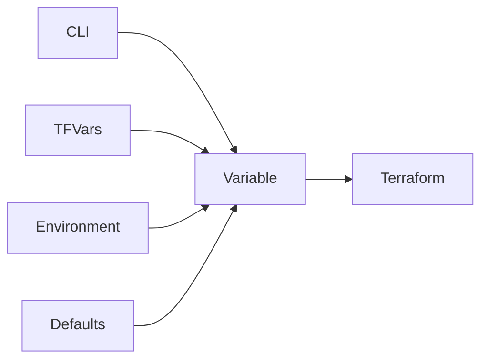
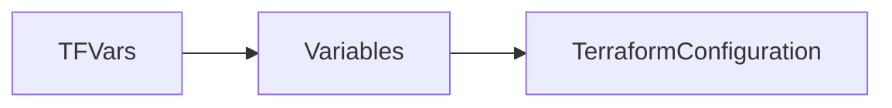

# Variables

## Overview

Variables allow you to make Terraform configurations **dynamic, reusable, and configurable** instead of hardcoding values.

Rather than specifying fixed values (such as VM names, regions, or instance sizes), you define variables and provide their values during deployment.

Variables enable the same Terraform code to be reused across:

- Development
- Testing
- Staging
- Production

without modifying the actual Terraform configuration.

> **Interview Tip**
>
> Variables are **inputs** to Terraform. They allow users to customize deployments without changing the infrastructure code.

---

## Why It Is Used

Variables are used to:

- Avoid hardcoding values
- Increase code reusability
- Support multiple environments
- Improve maintainability
- Parameterize infrastructure
- Enable automation in CI/CD pipelines

---

## Architecture / Working



---

## Key Components

| Component | Purpose |
|-----------|----------|
| Variable Block | Declares an input variable |
| Variable Type | Defines allowed data type |
| Default Value | Optional fallback value |
| Variable Value | Actual input provided |
| tfvars File | Stores variable values |
| Environment Variable | Supplies variables from OS |

---

## Types (if applicable)

Terraform supports several variable types.

| Type | Example |
|------|----------|
| string | `"East US"` |
| number | `2` |
| bool | `true` |
| list | `["web","app"]` |
| map | `{env="prod"}` |
| object | Structured data |
| tuple | Fixed collection |
| set | Unique values |

---

## Lifecycle / Workflow


---

## Configuration / Syntax (if applicable)

Declare Variable

```hcl
variable "location" {

  description = "Azure Region"

  type = string

}
```

Use Variable

```hcl
resource "azurerm_resource_group" "rg" {

  name = "demo-rg"

  location = var.location

}
```

Default Value

```hcl
variable "environment" {

  type = string

  default = "dev"

}
```

---

## Important Commands (if applicable)

Validate

```bash
terraform validate
```

Apply with Variable

```bash
terraform apply -var="location=Central India"
```

Apply with Variable File

```bash
terraform apply -var-file="terraform.tfvars"
```

Show Variables

```bash
terraform console
```

---

## Important Files (if applicable)

| File | Purpose |
|------|----------|
| variables.tf | Variable declarations |
| terraform.tfvars | Variable values |
| *.auto.tfvars | Automatically loaded variable files |
| main.tf | Uses variables |

---

## Real-World Use Cases

- Deploy infrastructure to multiple Azure regions
- Deploy different VM sizes for Dev and Production
- Use different storage account names
- Configure application ports
- Parameterize Kubernetes cluster size

---

## Advantages

- Reusable code
- Easier maintenance
- Supports automation
- Environment-specific deployments
- Reduces duplication

---

## Limitations

- Missing required variables stop execution
- Incorrect types cause validation errors
- Large numbers of variables can become difficult to manage

---

## Common Interview Questions (Concept Only)

- What are Terraform variables?
- Why should variables be used instead of hardcoded values?
- What is the purpose of `variables.tf`?
- How do you pass values to variables?
- What are Terraform variable types?
- Which variable value has the highest precedence?

---

## Common Mistakes

- Hardcoding infrastructure values
- Forgetting required variables
- Using incorrect variable types
- Storing secrets in variable files
- Not using defaults where appropriate

---

## Troubleshooting

| Problem | Solution |
|----------|----------|
| Variable not defined | Declare it in `variables.tf` |
| Missing required variable | Provide a value using CLI, tfvars, or environment variable |
| Type mismatch | Verify the declared variable type |
| Incorrect value loaded | Check variable precedence and tfvars files |

---

## Summary

Variables make Terraform configurations flexible and reusable by allowing infrastructure values to be supplied dynamically. They are essential for production-grade Infrastructure as Code.

---

# Input Variables

## Overview

An **Input Variable** is a variable declared by the Terraform configuration and supplied by the user during execution.

Input variables act like **function parameters** in programming languages.

Instead of hardcoding values, Terraform receives them as inputs.

> **Interview Tip**
>
> Input variables increase portability and enable the same code to be deployed across multiple environments.

---

## Why It Is Used

Input variables help:

- Parameterize deployments
- Support Dev/Test/Prod environments
- Reuse infrastructure code
- Improve automation

---

## Architecture / Working



---

## Key Components

| Component | Purpose |
|-----------|----------|
| Variable Name | Identifier |
| Description | Documentation |
| Type | Data type |
| Default | Optional fallback value |

---

## Types (if applicable)

Example

```hcl
variable "vm_size" {

  type = string

}
```

With Default

```hcl
variable "environment" {

  type = string

  default = "dev"

}
```

---

## Lifecycle / Workflow

Declare → Assign Value → Use in Configuration

---

## Configuration / Syntax (if applicable)

```hcl
variable "location" {

  description = "Deployment Region"

  type = string

}
```

Reference

```hcl
location = var.location
```

---

## Important Commands (if applicable)

```bash
terraform apply -var="location=East US"
```

---

## Important Files (if applicable)

variables.tf

---

## Real-World Use Cases

- VM sizes
- Resource names
- Regions
- Environment names

---

## Advantages

- Reusable
- Flexible
- Easy to automate

---

## Limitations

- Missing values prevent deployment

---

## Common Interview Questions (Concept Only)

- What are Input Variables?
- Why are Input Variables used?

---

## Common Mistakes

- Not providing required values
- Wrong variable types

---

## Troubleshooting

Verify variable declarations and provided values.

---

## Summary

Input variables allow users to customize Terraform deployments without changing infrastructure code.

---

# Variable Types

## Overview

Variable types define the **kind of data** Terraform accepts.

Type constraints improve validation and prevent invalid input.

> **Interview Tip**
>
> Always specify variable types in production Terraform code.

---

## Why It Is Used

Variable types:

- Validate input
- Prevent configuration errors
- Improve readability
- Simplify debugging

---

## Architecture / Working



---

## Key Components

| Type | Description |
|------|-------------|
| string | Text |
| number | Numeric values |
| bool | true/false |
| list | Ordered collection |
| map | Key-value pairs |
| object | Structured values |
| tuple | Fixed ordered values |
| set | Unique unordered values |

---

## Types (if applicable)

String

```hcl
type = string
```

Number

```hcl
type = number
```

Boolean

```hcl
type = bool
```

List

```hcl
type = list(string)
```

Map

```hcl
type = map(string)
```

---

## Lifecycle / Workflow

Declare Type → Validate Input → Execute

---

## Configuration / Syntax (if applicable)

```hcl
variable "ports" {

  type = list(number)

}
```

---

## Important Commands (if applicable)

```bash
terraform validate
```

---

## Important Files (if applicable)

variables.tf

---

## Real-World Use Cases

- Lists of subnets
- Maps of tags
- Boolean feature flags
- VM counts

---

## Advantages

- Input validation
- Cleaner configurations
- Better error messages

---

## Limitations

- Incorrect types stop execution

---

## Common Interview Questions (Concept Only)

- Which variable types does Terraform support?
- Why specify variable types?

---

## Common Mistakes

- Using incorrect types
- Mixing numbers and strings

---

## Troubleshooting

Run

```bash
terraform validate
```

---

## Summary

Variable types ensure only valid input values are accepted, making Terraform configurations more reliable.

---

# Variable Values

## Overview

Variable values are the actual inputs assigned to Terraform variables during execution.

Terraform supports multiple ways to assign values.

### Variable Precedence (Highest to Lowest)

1. CLI (`-var`)
2. CLI Variable File (`-var-file`)
3. `*.auto.tfvars`
4. `terraform.tfvars`
5. Environment Variables
6. Default Values

> **Interview Tip**
>
> If multiple sources define the same variable, Terraform uses the **highest-precedence value**.

---

## Why It Is Used

Allows flexibility in deployment without modifying code.

---

## Architecture / Working



---

## Key Components

| Source | Priority |
|---------|----------|
| CLI | Highest |
| tfvars | Medium |
| Environment Variable | Lower |
| Default | Lowest |

---

## Types (if applicable)

Assignment Methods

- CLI
- tfvars
- Environment Variable
- Default

---

## Lifecycle / Workflow

Assign Value → Validate → Apply

---

## Configuration / Syntax (if applicable)

CLI

```bash
terraform apply -var="location=Central India"
```

---

## Important Commands (if applicable)

```bash
terraform apply -var="vm_size=Standard_B2s"
```

---

## Important Files (if applicable)

terraform.tfvars

---

## Real-World Use Cases

- Environment deployments
- Dynamic VM sizes
- Different regions

---

## Advantages

- Flexible
- Automation friendly

---

## Limitations

- Multiple sources can cause confusion

---

## Common Interview Questions (Concept Only)

- What is Terraform variable precedence?
- Which source has the highest priority?

---

## Common Mistakes

- Conflicting values
- Forgetting precedence rules

---

## Troubleshooting

Check where variables are being loaded from.

---

## Summary

Terraform supports multiple sources for variable values, with CLI arguments taking precedence over all other sources.

---

# Variable Files (.tfvars)

## Overview

A **`.tfvars`** file stores values for Terraform variables separately from the infrastructure code.

This keeps configurations reusable and environment-specific.

> **Interview Tip**
>
> `terraform.tfvars` is automatically loaded by Terraform. Custom variable files require the `-var-file` option unless they use the `.auto.tfvars` naming convention.

---

## Why It Is Used

Variable files:

- Separate configuration from code
- Support multiple environments
- Simplify deployments
- Improve maintainability

---

## Architecture / Working



---

## Key Components

| File | Purpose |
|------|----------|
| terraform.tfvars | Default variable file |
| dev.tfvars | Development values |
| prod.tfvars | Production values |
| *.auto.tfvars | Automatically loaded |

---

## Types (if applicable)

Default File

```text
terraform.tfvars
```

Environment Files

```text
dev.tfvars

prod.tfvars

stage.tfvars
```

---

## Lifecycle / Workflow

Create File → Load Values → Apply

---

## Configuration / Syntax (if applicable)

terraform.tfvars

```hcl
location = "Central India"

environment = "production"

vm_size = "Standard_B2s"
```

Apply

```bash
terraform apply -var-file="prod.tfvars"
```

---

## Important Commands (if applicable)

```bash
terraform apply -var-file="dev.tfvars"
```

---

## Important Files (if applicable)

| File | Purpose |
|------|----------|
| terraform.tfvars | Default values |
| *.auto.tfvars | Automatically loaded values |

---

## Real-World Use Cases

- Development
- Production
- Testing
- Customer-specific deployments

---

## Advantages

- Cleaner code
- Easy environment management
- Supports automation

---

## Limitations

- Sensitive values should not be committed to Git
- Multiple tfvars files require proper management

---

## Common Interview Questions (Concept Only)

- What is `terraform.tfvars`?
- How is `terraform.tfvars` different from `variables.tf`?
- When should `-var-file` be used?

---

## Common Mistakes

- Committing secrets to Git
- Forgetting to load custom tfvars files

---

## Troubleshooting

Verify file names and execution commands.

---

## Summary

Variable files store deployment-specific values separately from Terraform code, making configurations reusable and easier to manage.

---

# Environment Variables

## Overview

Terraform can receive variable values directly from operating system environment variables.

Terraform recognizes variables prefixed with:

```text
TF_VAR_
```

For example:

```text
TF_VAR_location
```

maps to:

```hcl
variable "location" {

}
```

> **Interview Tip**
>
> Environment variables are widely used in **CI/CD pipelines** because they avoid storing sensitive values in code or variable files.

---

## Why It Is Used

Environment variables are used to:

- Supply variables securely
- Integrate with CI/CD systems
- Avoid hardcoding secrets
- Simplify automation

---

## Architecture / Working


---

## Key Components

| Component | Purpose |
|-----------|----------|
| TF_VAR_ Prefix | Maps environment variable to Terraform variable |
| Operating System | Stores variable |
| Terraform | Reads the value automatically |

---

## Types (if applicable)

Linux

```bash
export TF_VAR_location="Central India"
```

Windows PowerShell

```powershell
$env:TF_VAR_location="Central India"
```

---

## Lifecycle / Workflow

Set Environment Variable → Terraform Reads Variable → Apply

---

## Configuration / Syntax (if applicable)

Linux

```bash
export TF_VAR_vm_size="Standard_B2s"
```

Run

```bash
terraform apply
```

---

## Important Commands (if applicable)

Linux

```bash
export TF_VAR_location="East US"
```

View Variable

```bash
echo $TF_VAR_location
```

---

## Important Files (if applicable)

No Terraform file required.

---

## Real-World Use Cases

- GitHub Actions
- Azure DevOps Pipelines
- Jenkins Pipelines
- GitLab CI
- Secure credential injection

---

## Advantages

- Secure
- Automation friendly
- No hardcoded values
- Easy integration with CI/CD

---

## Limitations

- Temporary unless persisted
- Difficult to debug when many variables are set
- Lower precedence than CLI and tfvars files

---

## Common Interview Questions (Concept Only)

- How does Terraform read environment variables?
- What is the `TF_VAR_` prefix?
- Why are environment variables preferred in CI/CD?
- Are environment variables more secure than `.tfvars` files?

---

## Common Mistakes

- Forgetting the `TF_VAR_` prefix
- Assuming environment variables override CLI arguments
- Storing secrets in shell history instead of secure secret managers

---

## Troubleshooting

| Problem | Solution |
|----------|----------|
| Variable not detected | Verify the `TF_VAR_` prefix and variable name |
| Wrong value used | Check Terraform variable precedence |
| Value not available | Ensure the environment variable is exported in the current session |

---

## Summary

Environment variables provide a secure and automation-friendly way to pass values into Terraform, especially in CI/CD pipelines. They reduce hardcoding, support secret management, and are automatically recognized when prefixed with `TF_VAR_`.
